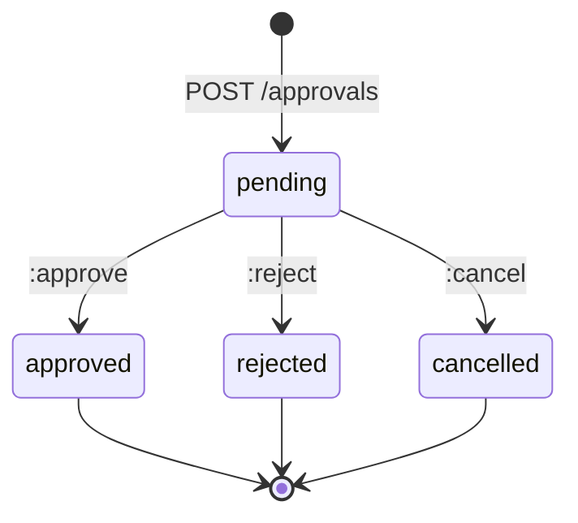
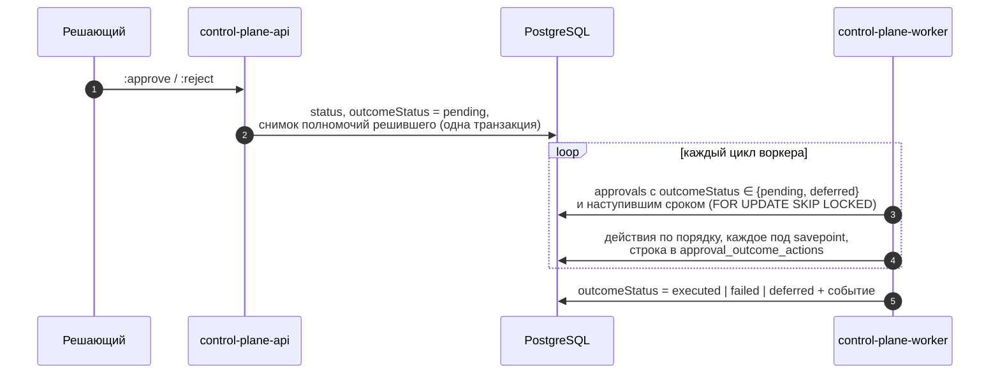
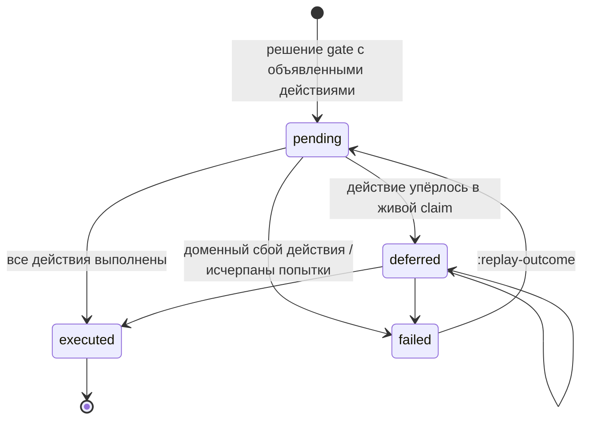

# Approvals

Approval — минимальный примитив управления «человек (или агент) в контуре»:
одна запись — одно решение. Статья описывает запрос и решение approval,
gate, который блокирует задачу до решения, и исходы, которые тип задачи
объявляет на случай одобрения или отклонения. Она нужна тем, кто строит
процессы с проверкой человеком, и разработчикам харнессов, которые умеют
ждать решения.

## Модель

| Поле | Описание |
|---|---|
| `taskId` | Задача, к которой относится решение (обязательна для gate) |
| `artifactId` | Артефакт, который оценивается (необязательно) |
| `workspaceId` | Workspace, в пределах которого ищется требуемая роль |
| `requiredRoleId` / `assignedPrincipalId` | **Ровно одно**: кто может решить — держатель роли или конкретный principal |
| `gate` | `true` — approval блокирует захват и завершение задачи до решения |
| `status` | `pending`, `approved`, `rejected`, `cancelled` |
| `requestedByPrincipalId` | Кто запросил |
| `decisionByPrincipalId`, `decisionAt` | Кто и когда решил |
| `comment` | Комментарий запроса; решение может его заменить |
| `outcomeStatus` | Состояние исхода решения: `null`, `pending`, `deferred`, `executed`, `failed` |
| `version` | Растёт при каждом изменении |

### Состояния approval



Решение атомарно: строка блокируется `FOR UPDATE`, и переход возможен
только из `pending`. Два одновременных решения дают ровно один исход;
второе получает `409 approval_already_decided`.

## Запрос

```bash
curl -s -X POST "$CP/approvals" \
  -H "Authorization: Bearer $TOKEN" -H "Content-Type: application/json" \
  -H "Idempotency-Key: $(uuidgen)" \
  -d '{
    "task": "TASK-000123",
    "artifactId": "<artifact-id>",
    "assignedPrincipalId": "<reviewer-principal-id>",
    "comment": "Проверьте изменения в схеме перед выкладкой",
    "gate": true
  }'
```

| Правило | Ответ при нарушении |
|---|---|
| Право `approvals.manage` | `403 permission_denied` |
| Ровно одно из `requiredRoleId` / `assignedPrincipalId` | `422 invalid_approval` |
| `gate: true` требует `task` | `422 invalid_approval` |
| Gate нельзя повесить на терминальную задачу | `422 invalid_approval` |
| Задача, артефакт, workspace, роль, principal существуют в tenant'е | `404 not_found` |

Запрос gate берёт блокировку строки задачи: параллельный `:complete` либо
завершится раньше, чем gate появится, либо дождётся его — gate не может
«прицепиться» к задаче, которая в этот момент становится терминальной.

## Решение

```bash
curl -s -X POST "$CP/approvals/<approval-id>:approve" \
  -H "Authorization: Bearer $TOKEN" -H "Content-Type: application/json" \
  -d '{"comment": "Схема согласована"}'

curl -s -X POST "$CP/approvals/<approval-id>:reject" \
  -H "Authorization: Bearer $TOKEN" -H "Content-Type: application/json" \
  -d '{"comment": "Нужна обратная совместимость для старых клиентов"}'
```

Решить approval можно только при выполнении **обоих** условий:

1. API-право `approvals.decide` (в режиме PDP — на ресурсе `approval:<id>`);
2. **eligibility**:
    - если задан `assignedPrincipalId` — решает только этот principal;
    - если задан `requiredRoleId` — решает держатель роли, назначенной на
      уровне tenant'а, либо на `workspaceId` approval'а или любом из его
      предков.

Иначе — `403 not_eligible`.

!!! note "Роль ищется по workspace approval'а, а не задачи"
    Scope роли определяется полем `workspaceId` самого approval. Если его не
    передать, подойдёт только роль, назначенная на уровне tenant'а.
    Указывайте `workspaceId`, когда решать должны держатели роли в конкретной
    ветке дерева.

## Отмена

`POST /approvals/{id}:cancel` (`approvals.manage`) переводит `pending` в
`cancelled`; повторная отмена идемпотентна, отмена решённого —
`409 approval_already_decided`.

Отмена **gate** открывает задачу так же, как решение. Поэтому отменить
чужой gate можно только с полными полномочиями решающего —
`approvals.decide` и eligibility; автор запроса может отменить свой gate
всегда. Иначе — `403 not_eligible`.

## Gate

Gate-approval (`gate: true`) — механизм принуждения. Пока хотя бы один gate
задачи в `pending`:

| Операция | Результат |
|---|---|
| `POST /tasks/{ref}:claim`, `:reclaim` | `409 approval_required` |
| `POST /tasks/{ref}:complete` | `409 approval_required` |
| `POST /runs/{id}:succeed` с `completeTask: true` | `409 approval_required` |
| `GET /work/available` | Задача не выдаётся |
| `GET /tasks/{ref}/claimability` | Причина `approval_required` со списком `pendingApprovals` |

Проверка выполняется внутри транзакции захвата или завершения под
блокировкой задачи: незакоммиченное решение не видно, поэтому gate
открывается только после commit решения.

`details` ошибки перечисляет, что держит задачу:

```json
{
  "error": {
    "code": "approval_required",
    "message": "Task is waiting for a pending gate approval",
    "details": {"taskId": "…", "pendingApprovals": [{"approvalId": "…", "requestedBy": "…"}]}
  }
}
```

### Ожидание решения исполнителем

Gate не останавливает уже идущий run, но не даст его успешно завершить
задачу. Правильный порядок для исполнителя — записать checkpoint, запросить
gate и приостановить run, освободив claim:

```mermaid
sequenceDiagram
    autonumber
    participant R as Исполнитель
    participant CP as Control Plane
    participant D as Решающий
    R->>CP: POST /runs/{r}/checkpoints
    R->>CP: POST /approvals {task, gate: true, assignedPrincipalId: D}
    R->>CP: POST /runs/{r}:suspend {waitingForApprovalId}
    Note over CP: claim освобождён, задача ждёт
    D->>CP: POST /approvals/{id}:approve
    Note over CP: gate открыт; если тип объявил исход —<br/>воркер исполняет его
    R->>CP: :claim → :start-run → GET /runs/{new}/context
```

Подробнее о приостановке — в [Исполнении](execution.md).

## Исходы, объявленные типом задачи

Без дополнительной настройки решение только открывает gate: дальнейшие шаги
(завести задачу на правки, закрыть проверку) делает кто-то вручную. Тип
задачи может объявить, **что ядро сделает после решения**, в поле
`approvalSchema` (обоснование — CP-ADR-0061).

!!! note "Ядро не знает доменных действий"
    Исходы — закрытый словарь обобщённых действий над сущностями ядра:
    создать работу, завершить задачу, прокомментировать, сменить статус.
    Всё предметное («слить ветку», «опубликовать релиз») остаётся данными
    типа и интеграциями, а не кодом ядра.

### Когда исходы исполняются

Только для **gate**-approval'а на задаче, версия типа которой объявляет
непустой список действий для принятого решения. Обычный (не gate) approval
совещательный: тип не может знать, о чём был произвольный approval, лишь
упоминающий задачу. Задача помнит версию типа, с которой создана, поэтому
исполняются исходы, объявленные на момент её создания.

### Формат approvalSchema

```json
{
  "gates": {
    "default": {
      "outcomes": {
        "approved": [
          {"completeTask": {}}
        ],
        "rejected": [
          {"ensureWork": {
            "type": "task",
            "key": "rework:$.approval.id",
            "title": "Доработка по замечаниям: $.task.publicId! $.task.title",
            "description": "Замечания: $.approval.comment",
            "assignee": "$.task.assigneeId!",
            "priority": "$.task.priority",
            "workspace": "$.task.workspaceId",
            "relation": {"spawned_by": "$.task.id!"}
          }},
          {"comment": {"body": "Заведена задача на доработку"}},
          {"transition": {"status": "blocked"}}
        ]
      }
    }
  }
}
```

- Исполняется только гейт `default`; другие имена гейтов отклоняются при
  публикации типа — исходы, которые молча не исполняются, хуже отказа.
- Исходы — `approved` и `rejected`; каждый — список до 20 действий,
  исполняемых **по порядку**.
- Действие — объект с одним ключом (имя действия) и объектом входов.

### Словарь действий

| Действие | Входы | Что делает |
|---|---|---|
| `ensureWork` | `type`, `key`, `title` (обязательные); `description`, `assignee`, `priority`, `workspace`, `relation {<тип связи>: ref}` | Создаёт задачу типа `type`, если задачи с этим `key` ещё нет в tenant'е, и связывает её `relation`. `workspace` по умолчанию — workspace задачи approval'а. Созданная задача получает `origin.kind = "process"`, `ref = approval:<id>` |
| `completeTask` | `task?` (по умолчанию задача approval'а) | Обычный `:complete`: ребро в `completionStatus` должно быть объявлено, gate не должен держать задачу. Уже завершённая — не ошибка (`alreadyCompleted`) |
| `comment` | `body`, `task?` | Комментарий в тред задачи от имени решившего |
| `transition` | `status`, `task?` | Обычный `PATCH status` — только по объявленному ребру; уже в статусе — не ошибка |
| `invokeSkill` | `skill` (`имя@версия`); `inputs?`, `expect?`, `onSuccess?`, `onFailure?` | Ставит в очередь вызов скилла и считается исполненным, когда вызов поставлен. `onSuccess`/`onFailure` — действия того же словаря (без `invokeSkill`), которые исполняются после собственных действий исхода, когда все вызовы исхода завершились: `onSuccess`, если вызов успешен так, как требует `expect`, иначе `onFailure`. В них доступно выражение `$.invocation.…` |

!!! tip "Закрывать задачу — в реакциях на вызов"
    Одобрение — основание для внешней записи, только пока его задача открыта.
    Поэтому `completeTask` и переход в итоговый статус по результату скилла
    объявляйте в `onSuccess`/`onFailure`, а не рядом с `invokeSkill`. Пример
    с уведомлением роли скиллом `notify.send@1` — в статье
    [Уведомления](../notifications/index.md#notify-send).

### Выражения

Строковые входы могут ссылаться на контекст решения ограниченным JSON-path
— без вызовов, индексов и фильтров:

| Выражение | Значение |
|---|---|
| `$.task.<f>` | Поле задачи approval'а |
| `$.spawnedBy.<f>` | Поле задачи, от которой задача approval'а порождена связью `spawned_by` (самое раннее ребро) |
| `$.approval.<f>` | `id`, `comment`, `decidedBy`, `decidedAt`, `outcome` |
| `$.invocation.<f>` | Только в `onSuccess`/`onFailure`: `id`, `skill`, `status`, `output.<ключ>`, `error.code`, `error.message` |
| `$.task.artifact[<type>].metadata.<field>` | Поле `metadata` самого свежего артефакта этого типа на задаче (так же для `$.spawnedBy`) |

Поля задачи `<f>`: `id`, `publicId`, `title`, `description`, `assigneeId`,
`workspaceId`, `status`, `priority`.

- Строка, целиком состоящая из одного выражения, даёт значение как есть
  (в том числе `null`); любая другая строка — шаблон, где каждое выражение
  заменяется текстом, `null` — пустой строкой.
- Суффикс `!` делает выражение **обязательным**: если оно разрешилось в
  `null` или пустую строку, действие не исполняется, исход падает с кодом
  `unresolved_expression`. Так незаполненный контекст не превращается,
  например, в задачу без исполнителя.
- Суффикс `|truncate:N` ограничивает текстовое значение N символами
  (`$.task.title|truncate:150`).
- Контекст снимается один раз перед первым действием исхода.
- Решивший должен иметь право читать то, на что ссылаются выражения:
  `tasks.read` на задачи и `artifacts.read`, если есть ссылки на артефакты.

Вся схема проверяется **при публикации версии типа** (`POST /task-types`):
закрытый словарь действий и входов, корректные выражения, известные типы
связей, `transition` своей задачи в литеральный статус — по lifecycle этой
же версии. Нарушение — `422 invalid_approval_schema` с путём до ошибки.

### Исполнение исхода



Ключевые свойства:

- **Полномочия решившего.** Каждое действие идёт через обычную команду ядра
  с контекстом, восстановленным из снимка полномочий решившего на момент
  решения, и проверяется тем же авторизатором, что и API (включая режим
  PDP). Действие, на которое у решившего нет права, не исполняется — код
  `forbidden`. Автор созданной задачи, комментария, перехода — решивший.
- **Credential должен быть жив.** При каждом исполнении проверяется, что
  credential снимка не отозван и не истёк, а principal активен; иначе
  `forbidden` с `cause: credential_inactive`.
- **Идемпотентность.** Ключ — `(approval, индекс действия)`: выполненное
  действие не повторяется никогда, повторная попытка — no-op.
- **Живой claim на цели — не сбой.** Если `completeTask` или `transition`
  упирается в чужой или собственный живой claim решившего, исход переходит в
  `deferred` и повторяется через `CP_APPROVAL_OUTCOME_DEFER_SECONDS`
  (15 с по умолчанию); попытка не засчитывается. Уже выполненные действия
  не ждут.
- **Неожиданная ошибка** (не доменная) откатывает попытку и засчитывается:
  повтор с backoff `CP_OUTBOX_BACKOFF_*`; после `CP_OUTBOX_MAX_ATTEMPTS`
  попыток исход становится `failed` с кодом `outcome_attempts_exhausted`.

### Состояния исхода



`outcomeStatus = null` — у решения нет исхода (обычный approval или тип без
действий для этого решения).

### Сбой исхода

При сбое действия:

- его частичные записи откатываются, **оставшиеся действия не выполняются**;
- решение **не откатывается**: approval остаётся `approved` / `rejected`,
  gate открыт;
- `outcomeStatus = failed`, событие `approval.outcome_failed` с
  `failedAction {index, action, code, cause, message, details}`;
- решившему заводится задача на разбор (системный тип, исполнитель —
  решивший, связь `related_to` с задачей approval'а); при повторном сбое —
  комментарий в ту же задачу. Её автор — системный service-principal ядра
  tenant'а, который не может войти в систему и только атрибутирует записи ядра.

Типичные коды в `failedAction.code`:

| Код | Причина | Лечение |
|---|---|---|
| `forbidden` | У решившего нет права на действие; `cause` — исходный код отказа | Выдать право и сделать replay решившим |
| `unresolved_expression` | Обязательное выражение `…!` пустое | Дополнить данные (исполнителя, связь, артефакт) и сделать replay |
| `invalid_transition` | Ребро lifecycle не объявлено | Выпустить версию типа с ребром — для новых задач; для текущей — довести вручную |
| `outcome_attempts_exhausted` | Неожиданные ошибки исчерпали попытки | Разобрать `lastError`, сделать replay |

### Просмотр и повтор

```bash
curl -s "$CP/approvals/<approval-id>/outcome" -H "Authorization: Bearer $TOKEN"
```

```json
{
  "approvalId": "…",
  "outcome": "rejected",
  "outcomeStatus": "failed",
  "attempts": 0,
  "lastError": null,
  "nextAttemptAt": null,
  "actions": [
    {"index": 0, "action": "ensureWork", "status": "executed", "attempts": 1,
     "result": {"taskId": "…", "publicId": "TASK-000130"}, "error": null},
    {"index": 1, "action": "comment", "status": "failed", "attempts": 1,
     "result": {}, "error": {"code": "forbidden", "cause": "permission_denied", "…": "…"}},
    {"index": 2, "action": "transition", "status": "not_executed", "attempts": 0,
     "result": {}, "error": null}
  ]
}
```

`POST /approvals/{id}:replay-outcome` (`approvals.decide`) продолжает с
первого невыполненного действия синхронно и возвращает то же представление.
Допустим для `failed` и для **зависшего** `pending` (были неудачные попытки
или воркер не трогал исход не меньше 10 минут); иначе
`409 outcome_not_replayable`. Replay может:

- **решивший** — полномочием становится его **текущий** credential (обычное
  лечение `forbidden`: выдать право и повторить);
- **admin** — остаётся снимок решения, и его живость проверяется.

Прочим — `403 not_eligible`.

## API

| Метод | Путь | Права |
|---|---|---|
| `POST` | `/approvals` | `approvals.manage` |
| `GET` | `/approvals?status=&taskId=` | `approvals.read` |
| `GET` | `/approvals/{id}` | `approvals.read` |
| `POST` | `/approvals/{id}:approve`, `:reject` | `approvals.decide` + eligibility |
| `POST` | `/approvals/{id}:cancel` | `approvals.manage`; для чужого gate — ещё `approvals.decide` + eligibility |
| `GET` | `/approvals/{id}/outcome` | `approvals.read` |
| `POST` | `/approvals/{id}:replay-outcome` | `approvals.decide`; решивший или admin |

MCP-инструменты: `cp_request_approval`, `cp_list_approvals`, `cp_approve`,
`cp_reject` (см. [CLI и MCP-сервер](cli-and-mcp.md)).

## События

| Событие | Payload |
|---|---|
| `approval.requested` | `taskId`, `artifactId`, `requiredRoleId`, `assignedPrincipalId`, `gate`, `workspaceId`, `taskPublicId`, `taskTitle`, `requestedBy`, `comment` |
| `approval.approved`, `approval.rejected` | `taskId`, `artifactId`, `outcomeStatus`, `decisionBy`, `comment`, `channel` (канал решения, например `telegram`; `null` для прямого вызова API) |
| `approval.cancelled` | `taskId`, `cancelledBy` |
| `approval.outcome_executed` | Исход и evidence по каждому действию |
| `approval.outcome_failed` | То же плюс `failedAction` и id задачи на разбор |
| `approval.outcome_deferred` | Действие, которое ждёт, и claim, который его держит; пишется один раз при переходе |

Актор событий исхода — решивший; `causationId` указывает на событие
решения.

## Пример: проверка человеком

Типовой процесс «исполнитель сделал — человек проверил»:

1. Тип задачи проверки объявляет исходы: `approved` → `completeTask`;
   `rejected` → `ensureWork` задачи на доработку с исполнителем исходной
   задачи и связью `spawned_by`, затем `completeTask`.
2. Исполнитель завершает свою задачу и заводит задачу проверки со связью
   `spawned_by` на исходную.
3. На задаче проверки создаётся gate-approval, назначенный человеку.
4. Человек решает approval и пишет причину в `comment`.
5. Воркер исполняет исход: проверка закрывается, при отклонении появляется
   задача на доработку с текстом замечаний.

Если проверка нужна для **каждой** задачи какого-то вида, проще объявить её
критерием приёмки самого типа (`human` в `acceptance` типа): тогда задача ждёт
решения на себе, отказ возвращает её тому же исполнителю, а отдельные задачи
проверки и доработки не нужны. См. [Приёмка типа](task-types.md#type-acceptance).

## См. также

- [Типы задач и статусы](task-types.md) — где объявляется `approvalSchema`.
- [Исполнение — claims и runs](execution.md) — приостановка и возобновление.
- [Авторизация и права](authorization.md) — роли и eligibility.
- [События](events.md)
