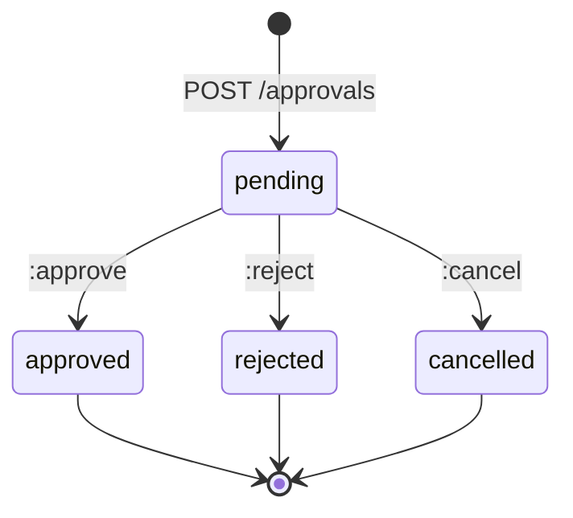
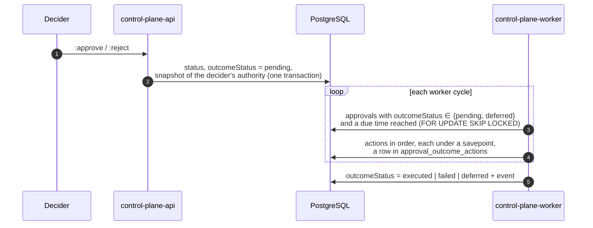
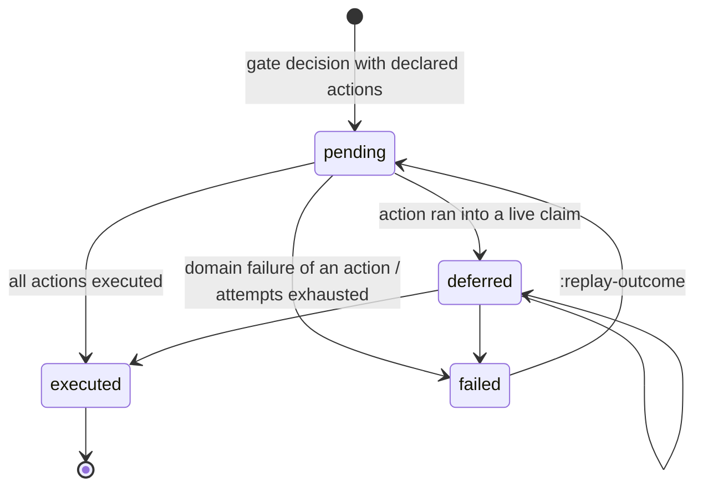

# Approvals

An approval is the minimal "human (or agent) in the loop" governance primitive:
one record is one decision. This article describes requesting and deciding an approval,
the gate that blocks a task until the decision, and the outcomes that a task type
declares for the case of approval or rejection. It is for those who build
processes with human review, and for harness developers whose harnesses can
wait for a decision.

## Model

| Field | Description |
|---|---|
| `taskId` | The task the decision relates to (required for a gate) |
| `artifactId` | The artifact being evaluated (optional) |
| `workspaceId` | The workspace within which the required role is looked up |
| `requiredRoleId` / `assignedPrincipalId` | **Exactly one**: who can decide — a role holder or a specific principal |
| `gate` | `true` — the approval blocks claiming and completing the task until the decision |
| `status` | `pending`, `approved`, `rejected`, `cancelled` |
| `requestedByPrincipalId` | Who requested it |
| `decisionByPrincipalId`, `decisionAt` | Who decided and when |
| `comment` | The request comment; the decision can replace it |
| `outcomeStatus` | State of the decision's outcome: `null`, `pending`, `deferred`, `executed`, `failed` |
| `version` | Increments on every change |

### Approval states



The decision is atomic: the row is locked with `FOR UPDATE`, and a transition is possible
only from `pending`. Two simultaneous decisions produce exactly one outcome;
the second gets `409 approval_already_decided`.

## Request

```bash
curl -s -X POST "$CP/approvals" \
  -H "Authorization: Bearer $TOKEN" -H "Content-Type: application/json" \
  -H "Idempotency-Key: $(uuidgen)" \
  -d '{
    "task": "TASK-000123",
    "artifactId": "<artifact-id>",
    "assignedPrincipalId": "<reviewer-principal-id>",
    "comment": "Review the schema changes before rollout",
    "gate": true
  }'
```

| Rule | Response on violation |
|---|---|
| Permission `approvals.manage` | `403 permission_denied` |
| Exactly one of `requiredRoleId` / `assignedPrincipalId` | `422 invalid_approval` |
| `gate: true` requires `task` | `422 invalid_approval` |
| A gate cannot be put on a terminal task | `422 invalid_approval` |
| The task, artifact, workspace, role, principal exist in the tenant | `404 not_found` |

A gate request takes the task row lock: a concurrent `:complete` either
finishes before the gate appears or waits for it — a gate cannot
"attach" to a task that is becoming terminal at that moment.

## Decision

```bash
curl -s -X POST "$CP/approvals/<approval-id>:approve" \
  -H "Authorization: Bearer $TOKEN" -H "Content-Type: application/json" \
  -d '{"comment": "Schema approved"}'

curl -s -X POST "$CP/approvals/<approval-id>:reject" \
  -H "Authorization: Bearer $TOKEN" -H "Content-Type: application/json" \
  -d '{"comment": "Backward compatibility for old clients is required"}'
```

You can decide an approval only when **both** conditions hold:

1. The API permission `approvals.decide` (in PDP mode, on the `approval:<id>` resource);
2. **eligibility**:
    - if `assignedPrincipalId` is set, only that principal decides;
    - if `requiredRoleId` is set, a holder of the role assigned at the
      tenant level, or on the approval's `workspaceId` or any of its
      ancestors, decides.

Otherwise — `403 not_eligible`.

!!! note "The role is looked up by the approval's workspace, not the task's"
    The role scope is defined by the `workspaceId` field of the approval itself. If you do not
    pass it, only a role assigned at the tenant level qualifies.
    Specify `workspaceId` when holders of the role in a specific
    branch of the tree must decide.

## Cancellation

`POST /approvals/{id}:cancel` (`approvals.manage`) moves `pending` to
`cancelled`; a repeated cancellation is idempotent, cancelling a decided one is
`409 approval_already_decided`.

Cancelling a **gate** opens the task just like a decision. That is why you can cancel
someone else's gate only with the full authority of a decider —
`approvals.decide` and eligibility; the author of the request can always cancel their own gate.
Otherwise — `403 not_eligible`.

## Gate

A gate approval (`gate: true`) is an enforcement mechanism. While at least one gate
of the task is `pending`:

| Operation | Result |
|---|---|
| `POST /tasks/{ref}:claim`, `:reclaim` | `409 approval_required` |
| `POST /tasks/{ref}:complete` | `409 approval_required` |
| `POST /runs/{id}:succeed` with `completeTask: true` | `409 approval_required` |
| `GET /work/available` | The task is not returned |
| `GET /tasks/{ref}/claimability` | Reason `approval_required` with a `pendingApprovals` list |

The check runs inside the claim or completion transaction under the
task lock: an uncommitted decision is not visible, so the gate
opens only after the decision is committed.

The error's `details` lists what is holding the task:

```json
{
  "error": {
    "code": "approval_required",
    "message": "Task is waiting for a pending gate approval",
    "details": {"taskId": "…", "pendingApprovals": [{"approvalId": "…", "requestedBy": "…"}]}
  }
}
```

### Waiting for a decision as an executor

A gate does not stop a run that is already in progress, but it will not let the run successfully complete
the task. The correct order for an executor is to write a checkpoint, request
a gate, and suspend the run, releasing the claim:

```mermaid
sequenceDiagram
    autonumber
    participant R as Executor
    participant CP as Control Plane
    participant D as Decider
    R->>CP: POST /runs/{r}/checkpoints
    R->>CP: POST /approvals {task, gate: true, assignedPrincipalId: D}
    R->>CP: POST /runs/{r}:suspend {waitingForApprovalId}
    Note over CP: claim released, task is waiting
    D->>CP: POST /approvals/{id}:approve
    Note over CP: gate open; if the type declared an outcome,<br/>the worker executes it
    R->>CP: :claim → :start-run → GET /runs/{new}/context
```

For more on suspension, see [Execution](execution.md).

## Outcomes declared by the task type

Without additional configuration, a decision only opens the gate: further steps
(creating a rework task, closing the review) are done manually by someone. A task
type can declare **what the core does after the decision** in the
`approvalSchema` field (rationale: CP-ADR-0061).

!!! note "The core does not know domain actions"
    Outcomes are a closed vocabulary of generic actions on core entities:
    create work, complete a task, comment, change status.
    Everything domain-specific ("merge a branch", "publish a release") remains type data
    and integrations, not core code.

### When outcomes are executed

Only for a **gate** approval on a task whose type version declares
a non-empty list of actions for the decision made. A regular (non-gate) approval
is advisory: the type cannot know what an arbitrary approval that merely
mentions the task was about. A task remembers the type version it was created with, so
the outcomes declared at the time of its creation are executed.

### approvalSchema format

```json
{
  "gates": {
    "default": {
      "outcomes": {
        "approved": [
          {"completeTask": {}}
        ],
        "rejected": [
          {"ensureWork": {
            "type": "task",
            "key": "rework:$.approval.id",
            "title": "Rework per review comments: $.task.publicId! $.task.title",
            "description": "Comments: $.approval.comment",
            "assignee": "$.task.assigneeId!",
            "priority": "$.task.priority",
            "workspace": "$.task.workspaceId",
            "relation": {"spawned_by": "$.task.id!"}
          }},
          {"comment": {"body": "A rework task has been created"}},
          {"transition": {"status": "blocked"}}
        ]
      }
    }
  }
}
```

- Only the `default` gate is executed; other gate names are rejected when
  the type is published — outcomes that silently do not execute are worse than a refusal.
- The outcomes are `approved` and `rejected`; each is a list of up to 20 actions,
  executed **in order**.
- An action is an object with one key (the action name) and an object of inputs.

### Action vocabulary

| Action | Inputs | What it does |
|---|---|---|
| `ensureWork` | `type`, `key`, `title` (required); `description`, `assignee`, `priority`, `workspace`, `relation {<relation type>: ref}` | Creates a task of type `type` if there is no task with this `key` in the tenant yet, and links it with `relation`. `workspace` defaults to the workspace of the approval's task. The created task gets `origin.kind = "process"`, `ref = approval:<id>` |
| `completeTask` | `task?` (defaults to the approval's task) | A regular `:complete`: the edge to `completionStatus` must be declared, and no gate may be holding the task. An already completed task is not an error (`alreadyCompleted`) |
| `comment` | `body`, `task?` | A comment in the task thread on behalf of the decider |
| `transition` | `status`, `task?` | A regular `PATCH status` — only along a declared edge; already in the status is not an error |
| `invokeSkill` | `skill` (`name@version`); `inputs?`, `expect?`, `onSuccess?`, `onFailure?` | Enqueues a skill invocation and counts as executed once the invocation is enqueued. `onSuccess`/`onFailure` are actions from the same vocabulary (without `invokeSkill`) that run after the outcome's own actions, once all invocations of the outcome have finished: `onSuccess` if the invocation succeeded as required by `expect`, otherwise `onFailure`. The `$.invocation.…` expression is available in them |

!!! tip "Close the task in the invocation reactions"
    An approval is grounds for an external write only while its task is open.
    That is why you should declare `completeTask` and the transition to the final status based on the skill result
    in `onSuccess`/`onFailure`, not next to `invokeSkill`. An example
    of notifying a role with the `notify.send@1` skill is in
    [Notifications](../notifications/index.md#notify-send).

### Expressions

String inputs can reference the decision context with a restricted JSON-path
— without calls, indexes, or filters:

| Expression | Value |
|---|---|
| `$.task.<f>` | A field of the approval's task |
| `$.spawnedBy.<f>` | A field of the task from which the approval's task was spawned via a `spawned_by` relation (the earliest edge) |
| `$.approval.<f>` | `id`, `comment`, `decidedBy`, `decidedAt`, `outcome` |
| `$.invocation.<f>` | Only in `onSuccess`/`onFailure`: `id`, `skill`, `status`, `output.<key>`, `error.code`, `error.message` |
| `$.task.artifact[<type>].metadata.<field>` | A `metadata` field of the most recent artifact of this type on the task (same for `$.spawnedBy`) |

Task fields `<f>`: `id`, `publicId`, `title`, `description`, `assigneeId`,
`workspaceId`, `status`, `priority`.

- A string consisting entirely of one expression yields the value as is
  (including `null`); any other string is a template where each expression
  is replaced with text, and `null` with an empty string.
- The `!` suffix makes an expression **required**: if it resolves to
  `null` or an empty string, the action is not executed and the outcome fails with the code
  `unresolved_expression`. This way an unfilled context does not turn,
  for example, into a task without an assignee.
- The `|truncate:N` suffix limits a text value to N characters
  (`$.task.title|truncate:150`).
- The context is captured once before the outcome's first action.
- The decider must have permission to read what the expressions reference:
  `tasks.read` on tasks and `artifacts.read` if there are references to artifacts.

The entire schema is validated **when the type version is published** (`POST /task-types`):
a closed vocabulary of actions and inputs, valid expressions, known relation
types, a `transition` of its own task to a literal status — against the lifecycle of that
same version. A violation — `422 invalid_approval_schema` with the path to the error.

### Outcome execution



Key properties:

- **The decider's authority.** Each action goes through a regular core command
  with a context restored from the snapshot of the decider's authority at the time of the
  decision, and is checked by the same authorizer as the API (including PDP
  mode). An action the decider has no permission for is not executed — code
  `forbidden`. The author of the created task, comment, or transition is the decider.
- **The credential must be alive.** On each execution the core checks that the
  snapshot's credential is not revoked or expired and that the principal is active; otherwise
  `forbidden` with `cause: credential_inactive`.
- **Idempotency.** The key is `(approval, action index)`: an executed
  action is never repeated, a retry is a no-op.
- **A live claim on the target is not a failure.** If `completeTask` or `transition`
  runs into someone else's live claim or the decider's own, the outcome moves to
  `deferred` and is retried after `CP_APPROVAL_OUTCOME_DEFER_SECONDS`
  (15 s by default); the attempt is not counted. Already executed actions
  do not wait.
- **An unexpected error** (not a domain one) rolls back the attempt and is counted:
  retry with backoff `CP_OUTBOX_BACKOFF_*`; after `CP_OUTBOX_MAX_ATTEMPTS`
  attempts the outcome becomes `failed` with the code `outcome_attempts_exhausted`.

### Outcome states



`outcomeStatus = null` — the decision has no outcome (a regular approval or a type without
actions for this decision).

### Outcome failure

When an action fails:

- its partial writes are rolled back, **the remaining actions are not executed**;
- the decision is **not rolled back**: the approval stays `approved` / `rejected`,
  the gate is open;
- `outcomeStatus = failed`, the event `approval.outcome_failed` with
  `failedAction {index, action, code, cause, message, details}`;
- a triage task is created for the decider (system type, assignee is the
  decider, a `related_to` relation to the approval's task); on a repeated failure,
  a comment is added to the same task. Its author is the tenant's core system
  service principal, which cannot sign in and only attributes core records.

Typical codes in `failedAction.code`:

| Code | Reason | Fix |
|---|---|---|
| `forbidden` | The decider has no permission for the action; `cause` is the original denial code | Grant the permission and replay as the decider |
| `unresolved_expression` | A required `…!` expression is empty | Fill in the data (assignee, relation, artifact) and replay |
| `invalid_transition` | The lifecycle edge is not declared | Publish a type version with the edge — for new tasks; finish the current one manually |
| `outcome_attempts_exhausted` | Unexpected errors exhausted the attempts | Investigate `lastError`, replay |

### Viewing and replaying

```bash
curl -s "$CP/approvals/<approval-id>/outcome" -H "Authorization: Bearer $TOKEN"
```

```json
{
  "approvalId": "…",
  "outcome": "rejected",
  "outcomeStatus": "failed",
  "attempts": 0,
  "lastError": null,
  "nextAttemptAt": null,
  "actions": [
    {"index": 0, "action": "ensureWork", "status": "executed", "attempts": 1,
     "result": {"taskId": "…", "publicId": "TASK-000130"}, "error": null},
    {"index": 1, "action": "comment", "status": "failed", "attempts": 1,
     "result": {}, "error": {"code": "forbidden", "cause": "permission_denied", "…": "…"}},
    {"index": 2, "action": "transition", "status": "not_executed", "attempts": 0,
     "result": {}, "error": null}
  ]
}
```

`POST /approvals/{id}:replay-outcome` (`approvals.decide`) continues synchronously from
the first unexecuted action and returns the same representation.
It is allowed for `failed` and for a **stuck** `pending` (there were failed attempts
or the worker has not touched the outcome for at least 10 minutes); otherwise
`409 outcome_not_replayable`. A replay can be performed by:

- **the decider** — the authority becomes their **current** credential (the usual
  fix for `forbidden`: grant the permission and retry);
- **an admin** — the decision snapshot stays, and its liveness is checked.

Anyone else gets `403 not_eligible`.

## API

| Method | Path | Permissions |
|---|---|---|
| `POST` | `/approvals` | `approvals.manage` |
| `GET` | `/approvals?status=&taskId=` | `approvals.read` |
| `GET` | `/approvals/{id}` | `approvals.read` |
| `POST` | `/approvals/{id}:approve`, `:reject` | `approvals.decide` + eligibility |
| `POST` | `/approvals/{id}:cancel` | `approvals.manage`; for someone else's gate, also `approvals.decide` + eligibility |
| `GET` | `/approvals/{id}/outcome` | `approvals.read` |
| `POST` | `/approvals/{id}:replay-outcome` | `approvals.decide`; the decider or an admin |

MCP tools: `cp_request_approval`, `cp_list_approvals`, `cp_approve`,
`cp_reject` (see [CLI and MCP server](cli-and-mcp.md)).

## Events

| Event | Payload |
|---|---|
| `approval.requested` | `taskId`, `artifactId`, `requiredRoleId`, `assignedPrincipalId`, `gate`, `workspaceId`, `taskPublicId`, `taskTitle`, `requestedBy`, `comment` |
| `approval.approved`, `approval.rejected` | `taskId`, `artifactId`, `outcomeStatus`, `decisionBy`, `comment`, `channel` (decision channel, for example `telegram`; `null` for a direct API call) |
| `approval.cancelled` | `taskId`, `cancelledBy` |
| `approval.outcome_executed` | The outcome and evidence for each action |
| `approval.outcome_failed` | The same plus `failedAction` and the id of the triage task |
| `approval.outcome_deferred` | The action that is waiting and the claim that holds it; written once on the transition |

The actor of outcome events is the decider; `causationId` points to the decision
event.

## Example: human review

A typical "the executor did it, a human reviewed it" process:

1. The review task type declares outcomes: `approved` → `completeTask`;
   `rejected` → `ensureWork` of a rework task with the assignee of the original
   task and a `spawned_by` relation, then `completeTask`.
2. The executor completes their task and creates a review task with a
   `spawned_by` relation to the original.
3. A gate approval assigned to a human is created on the review task.
4. The human decides the approval and writes the reason in `comment`.
5. The worker executes the outcome: the review is closed, and on rejection a
   rework task with the review comments appears.

If a review is needed for **every** task of some kind, it is simpler to declare it
as an acceptance criterion of the type itself (`human` in the type's `acceptance`): then the task waits
for the decision on itself, a rejection returns it to the same executor, and separate review and
rework tasks are not needed. See [Type acceptance](task-types.md#type-acceptance).

## See also

- [Task types and statuses](task-types.md) — where `approvalSchema` is declared.
- [Execution — claims and runs](execution.md) — suspension and resumption.
- [Authorization and permissions](authorization.md) — roles and eligibility.
- [Events](events.md)
