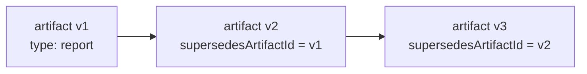
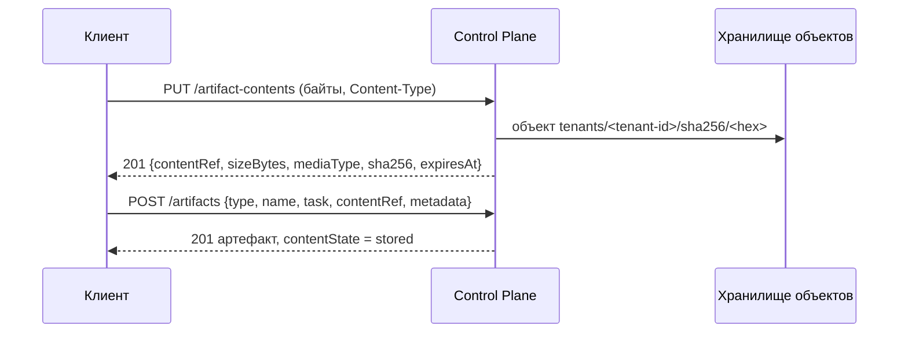

# Артефакты и комментарии

Артефакт — неизменяемая запись о результате работы: отчёт, коммит,
документ, транскрипт прогона. Комментарий — реплика в треде задачи для
координации, с сохранением истории правок. Статья описывает обе сущности,
их правила и API, хранение файлов артефактов в хранилище объектов и реестр
типов артефактов, и объясняет, что куда класть. Она нужна разработчикам
харнессов и интеграций и операторам, читающим результаты агентов.

## Что куда класть

| Что | Куда | Почему |
|---|---|---|
| Результат работы (отчёт, коммит, файл, сводка run'а) | **Artifact** | Неизменяем, привязан к run и задаче, доступен как evidence и в контексте следующих runs |
| Обсуждение, вопрос, пояснение к передаче | **Comment** | Координация между людьми и агентами; автор — из credential |
| Состояние для продолжения работы | **Checkpoint** run'а | Явное операционное состояние для рестарта (см. [Исполнение](execution.md)) |
| Запись о вызове инструмента | **Run action** | Лёгкий аудит, вне журнала событий |
| Файл результата (документ, PDF, архив) | Содержимое артефакта: `PUT /artifact-contents`, затем артефакт с `contentRef` | Байты лежат в хранилище объектов ядра; база хранит ссылку, размер и контрольную сумму, не blob'ы |
| Файл, который уже живёт в другой системе | Внешнее хранилище + `uri` артефакта | Ядро хранит только ссылку |

!!! warning "Ни в комментарии, ни в артефакты — секреты"
    Ни prompts, ни сырые транскрипты, ни credentials не место в комментариях.
    Для транскрипта есть отдельный вид артефакта с ограничением размера и
    редакцией — `transcript`.

## Артефакты

### Модель

| Поле | Описание |
|---|---|
| `id` | Идентификатор |
| `type` | Вид артефакта, строка 1–200 символов; словарь открытый, зарегистрированные виды проверяются (см. [Типы артефактов](#artifact-types)) |
| `name` | Имя, 1–500 символов; для файла — имя, под которым он отдаётся |
| `taskId`, `runId`, `workspaceId` | Привязки (все необязательны) |
| `uri` | Ссылка на содержимое во внешнем хранилище (до 2000 символов) |
| `content` | Небольшой JSON-документ с содержимым |
| `metadata` | JSON-метаданные: то, что читатель хочет знать до открытия |
| `supersedesArtifactId` | Предыдущая ревизия, которую заменяет эта |
| `contentState` | Содержимое в хранилище: `none` (его нет — ссылка или JSON), `stored` (лежит), `purged` (удалено администратором) |
| `sizeBytes`, `mediaType`, `sha256` | Размер, media type и SHA-256 содержимого; `null` у артефакта без содержимого, после удаления сохраняются как след |
| `typeVersion` | Версия зарегистрированного типа, по которой артефакт проверен; `null` у незарегистрированного вида |
| `createdByPrincipalId`, `createdAt` | Автор и время |

Артефакт сдаётся в одной из трёх форм: ссылка (`uri`), небольшой JSON
(`content`) или файл в хранилище ядра (`contentRef`). `contentRef`
исключает `uri` и `content`.

Артефакты **только создаются и читаются**: изменения и удаления записи в API
нет. Новая версия результата — новый артефакт со ссылкой на предыдущий.
Удалить можно только байты содержимого, и только администратору (см.
[Удаление содержимого](#purge-content)).

### Создание

```bash
curl -s -X POST "$CP/artifacts" \
  -H "Authorization: Bearer $TOKEN" -H "Content-Type: application/json" \
  -H "Idempotency-Key: $(uuidgen)" \
  -d '{
    "type": "report",
    "name": "Отчёт о нагрузке за неделю",
    "runId": "<run-id>",
    "uri": "https://files.example.com/reports/load-week-38.pdf",
    "content": {"summary": "p95 вырос на 12% в пиковые часы"},
    "metadata": {"format": "pdf", "pages": 14}
  }'
```

Правила:

- право `artifacts.write` — решается **на задаче артефакта**; артефакт без
  задачи — на его workspace, без обоих — на уровне tenant'а;
- если передан `runId` без `task`, задача берётся из run; если переданы оба и
  run принадлежит другой задаче — `422 artifact_mismatch`;
- для дочернего run проверяется, что `artifacts.write` входит в его потолок
  прав (см. дочерние runs в [Исполнении](execution.md));
- `supersedesArtifactId` должен существовать в tenant'е (`404`);
- пустые `type` или `name` — `422 invalid_type` / `422 invalid_name`;
- `contentRef` вместе с `uri` или `content` — `422 invalid_artifact_content`;
- если `type` зарегистрирован в tenant'е, артефакт проверяется по последней
  версии типа (см. [Типы артефактов](#artifact-types));
- общий лимит тела запроса — `CP_MAX_BODY_BYTES` (1 МиБ по умолчанию):
  файлы загружайте отдельно (см. [Содержимое в хранилище](#content)).

### Ревизии



Ревизия — отдельный артефакт с `supersedesArtifactId`. Исходный артефакт
остаётся нетронутым: аудит видит, что было опубликовано и когда.

### Чтение

```bash
curl -s "$CP/artifacts?taskId=<task-id>&type=commit" -H "Authorization: Bearer $TOKEN"
curl -s "$CP/artifacts/<artifact-id>" -H "Authorization: Bearer $TOKEN"
```

`GET /artifacts` (`artifacts.read`) принимает фильтры `taskId`, `runId`,
`workspaceId`, `type` и пагинацию `limit` / `cursor`; новые — первыми.

`GET /artifacts/{id}` проверяет `artifacts.read` на задаче артефакта.
Параметр `?forTask=<ref>` читает артефакт как **вход** задачи-получателя:
достаточно `tasks.read` на задаче-получателе, если артефакт сейчас — один из
её разрешённых входов (см. [Входы и выходы](task-types.md#artifact-schema)).
Иначе действует обычная проверка на задаче артефакта; чужой tenant — `404`.

Артефакты прошлых runs задачи также приходят в Run Context
(`GET /runs/{id}/context`) — так следующий исполнитель видит, что уже
сделано (см. [Контекст задачи и память](context.md)).

### Виды артефактов

Словарь `type` открытый: ядро не интерпретирует содержимое. Вид, который
tenant зарегистрировал в реестре [типов артефактов](#artifact-types),
проверяется при записи; любой другой принимается без проверки. Компоненты
платформы используют такие виды (все — незарегистрированные):

| `type` | Кто публикует | Содержимое |
|---|---|---|
| `commit` | Runner, работающий в репозитории | `uri` коммита, `metadata`: `branch`, `commit`, `workspaceKey`, `published` (попала ли ветка во внешний git) |
| `transcript` | Адаптеры кодовых агентов | Ограниченная лента прогона, схема `agent-transcript/1` |
| `skill_result` | Ядро, при успешном вызове Skill с задачей | `content.output` — выход Skill; автор — инициатор вызова |
| `report` | Пример-исполнитель runner'а и интеграции | Произвольный отчёт |
| `verification` | Ядро, когда пройдена стадия проверки задачи | Итог проверок (см. [Цели, приёмка и evidence](goals-and-evidence.md#verification-stage)) |

Собственные интеграции могут вводить свои виды — выберите стабильные имена
и документируйте их `metadata`, чтобы на них можно было ссылаться, например,
в выражениях исходов approval (`$.task.artifact[<type>].metadata.<field>`,
см. [Approvals](approvals.md)).

### Транскрипт прогона

Артефакт `transcript` — один JSON-документ `agent-transcript/1`, который
адаптер кодового агента публикует в конце run'а:

- размер ограничен 512 КиБ, тексты отдельных записей и результаты
  инструментов обрезаются;
- каждая строка проходит редакцию локальных путей и credential-подобных
  значений;
- скрытые рассуждения модели считаются, но не сохраняются;
- если документ всё равно не проходит проверку переносимости, он
  публикуется без текста (`"withheld": true`), только со счётчиками.

`metadata` транскрипта содержит `schema`, `harnessType`, число записей,
вызовов инструментов и ошибок, модель и расход токенов, если известны. Вызовы
инструментов параллельно пишутся run actions вида `tool.<имя>`. Подробности
и настройки — в [Трассе прогонов](../runner/trace.md).

### Артефакт как evidence

Артефакт можно указать фактом в `evidence` задачи:
`{"kind": "artifact", "artifactId": "…", "check": "tests"}`. Ядро проверит,
что артефакт существует в tenant'е. См.
[Цели, приёмка и evidence](goals-and-evidence.md).

## Содержимое в хранилище { #content }

Файл результата — спецификацию, PDF-заключение, архив — ядро хранит само: в
S3-совместимом хранилище объектов (в поставке — MinIO контура, см.
[Хранилище объектов](../operations/object-storage.md)). База держит только
запись артефакта со ссылкой, размером, media type и SHA-256; байты в
PostgreSQL и в памяти процесса не лежат. Хранилище наружу не публикуется:
байты входят и выходят только через API ядра.

Сдача файла — два шага:



Если хранилище не настроено (`CP_S3_ENDPOINT_URL` пуст) или недоступно,
маршруты содержимого отвечают `503 content_store_unavailable`. Остальное
продолжает работать: артефакты-ссылки и JSON-артефакты создаются и
читаются как обычно.

### Загрузка: `PUT /artifact-contents`

Тело запроса — **сырые байты файла**, не JSON и не multipart. Заголовок
`Content-Type` обязателен и задаёт media type содержимого.

```bash
curl -s -X PUT "$CP/artifact-contents" \
  -H "Authorization: Bearer $TOKEN" \
  -H "Content-Type: application/pdf" \
  --data-binary @review.pdf
```

```json
{
  "contentRef": "cref_<upload-id>",
  "sizeBytes": 184320,
  "mediaType": "application/pdf",
  "sha256": "9f86d081884c7d659a2feaa0c55ad015a3bf4f1b2b0b822cd15d6c15b0f00a08",
  "expiresAt": "2026-01-16T10:00:00Z"
}
```

Правила:

- право `artifacts.write` (без привязки к задаче: задача проверяется, когда
  на загрузку сошлётся артефакт);
- `Content-Type` отсутствует или не похож на `type/subtype` —
  `400 invalid_request`; базовый тип приводится к нижнему регистру,
  параметры (`; charset=utf-8`) сохраняются;
- предел размера — `CP_ARTIFACT_MAX_BYTES` (100 МиБ по умолчанию); для этого
  маршрута он заменяет общий `CP_MAX_BODY_BYTES`. Больше — `413
  request_too_large`. Тело пишется во временный файл на диске с подсчётом
  SHA-256 и в память целиком не попадает;
- объекты адресуются содержимым внутри tenant'а: одинаковые байты,
  загруженные дважды, хранятся одним объектом, но каждая загрузка получает
  свой `contentRef`.

**Кому принадлежит `contentRef`.** Ссылка действует только для principal'а,
который загружал, и только в его tenant'е. Чужая, несуществующая, искажённая
или истёкшая ссылка даёт одинаковый ответ `422 content_ref_not_found`:
знание контрольной суммы или чужой ссылки не позволяет сослаться на чужие
байты.

**Сколько живёт.** Загрузка ждёт артефакта `CP_ARTIFACT_UPLOAD_TTL_SECONDS`
(24 часа по умолчанию), срок — в `expiresAt`. Пока срок не вышел, на одну
загрузку могут сослаться несколько артефактов. Worker удаляет загрузки, на
которые до истечения срока не сослался ни один артефакт, и объекты, которые
больше никому не нужны.

### Запись артефакта с содержимым

```bash
curl -s -X POST "$CP/artifacts" \
  -H "Authorization: Bearer $TOKEN" -H "Content-Type: application/json" \
  -H "Idempotency-Key: $(uuidgen)" \
  -d '{
    "type": "review-report",
    "name": "review.pdf",
    "task": "<task-id>",
    "contentRef": "cref_<upload-id>",
    "metadata": {"reviewer": "alice@example.com"}
  }'
```

В ответе — `contentState: "stored"` и `sizeBytes`, `mediaType`, `sha256`
загрузки. `name` — имя, под которым файл будет отдаваться при скачивании.

### Чтение содержимого: `GET /artifacts/{id}/content`

```bash
curl -s "$CP/artifacts/<artifact-id>/content" \
  -H "Authorization: Bearer $TOKEN" -o review.pdf

# как вход задачи-получателя
curl -s "$CP/artifacts/<artifact-id>/content?forTask=<task-ref>" \
  -H "Authorization: Bearer $TOKEN" -o review.pdf
```

Авторизация та же, что у `GET /artifacts/{id}`: `artifacts.read` на задаче
артефакта (на workspace, если задачи нет; на tenant'е, если нет и его) или,
с `?forTask=`, `tasks.read` на задаче-получателе, если артефакт — её
разрешённый вход. Исполнитель следующего шага получает вход, даже не имея
права на задачу предыдущего: вход ему выдан потому, что его объявил тип его
задачи.

Байты отдаются потоком с заголовками:

| Заголовок | Значение |
|---|---|
| `Content-Type` | `mediaType` артефакта |
| `Content-Length` | размер |
| `Content-Disposition` | `attachment; filename*=UTF-8''<name>` для активного содержимого (`text/html`, `application/xhtml+xml`, `image/svg+xml`, `text/xml`, `application/xml`, `text/javascript`, `application/javascript` и любой `+xml`), иначе `inline` с тем же `filename*` |
| `ETag` | `"sha256:<hex>"` |
| `X-Content-Type-Options` | `nosniff` |
| `Cache-Control` | `private, no-store` |

| Ответ | Когда |
|---|---|
| `200` | Байты |
| `403 permission_denied` | Нет права ни на задаче артефакта, ни как на вход |
| `404` | Артефакта нет в tenant'е или задача `forTask` не найдена |
| `404 content_not_found` | У артефакта нет содержимого (`contentState = none`) |
| `410 content_purged` | Содержимое удалено администратором |
| `503 content_store_unavailable` | Хранилище не настроено, недоступно или объекта в нём нет |

Каждая выдача пишет событие `artifact.content_read`: кто, какой артефакт,
для какой задачи (`forTaskId`, если выдано как вход) и в каком run
читающего. Событие фиксируется до отправки первого байта; выдача, которую
хранилище не смогло обслужить, события не оставляет.

### Удаление содержимого { #purge-content }

Содержимое хранится бессрочно: закрытие или отмена задачи его не трогает.
Удалить байты может только администратор tenant'а (право `admin`); запись
артефакта остаётся:

```bash
curl -s -X POST "$CP/artifacts/<artifact-id>:purge-content" \
  -H "Authorization: Bearer $TOKEN" -H "Content-Type: application/json" \
  -H "Idempotency-Key: $(uuidgen)" \
  -d '{"reason": "Персональные данные попали в отчёт по ошибке"}'
```

- `reason` обязателен, 1–2000 символов; в событие попадает очищенным от
  секретов и обрезанным до 1000 символов;
- артефакт получает `contentState = purged`; `sizeBytes`, `mediaType` и
  `sha256` сохраняются как след;
- объект удаляется из хранилища, только если на те же байты не ссылаются
  другие артефакты с содержимым и неистёкшие загрузки tenant'а;
- повтор на уже удалённом — `200` с той же записью, без нового события;
  артефакт без содержимого — `409 content_not_stored`;
- объект удаляется до фиксации транзакции: если хранилище недоступно,
  ответ — `503 content_store_unavailable`, запись остаётся `stored`.

Событие — `artifact.content_purged` с полем `objectDeleted`: удалён ли
объект или он ещё нужен другим артефактам.

### MCP-инструменты

- `cp_create_artifact` принимает `file` — путь к локальному файлу. Инструмент
  сам загружает его (`PUT /artifact-contents`) и создаёт артефакт текущей
  задачи и run с полученным `contentRef`. `name` по умолчанию — имя файла,
  `media_type` по умолчанию угадывается по расширению (иначе
  `application/octet-stream`). `file` исключает `uri` и `content`.
- `cp_get_artifact_content` скачивает содержимое артефакта в локальный файл и
  возвращает путь. `path` — куда писать (по умолчанию временный каталог вне
  рабочей копии), `for_task` — задача-получатель (по умолчанию текущая).
  Текстовое содержимое до 64 КиБ дополнительно возвращается строкой `text`.

## Типы артефактов { #artifact-types }

Тип артефакта — объект каталога tenant'а, как тип задачи: ключ, JSON Schema
для `metadata`, допустимые media types содержимого и потолок размера. Ядро не
знает, что тип означает, — кода под тип нет. Типы нужны, чтобы артефакты
одного вида были однородны и чтобы на них могли ссылаться входы и выходы
типов задач (см. [Входы и выходы](task-types.md#artifact-schema)).

### Модель

| Поле | Описание |
|---|---|
| `key` | `^[a-z0-9][a-z0-9_-]*$`, 1–63 символа; совпадает с `type` артефакта |
| `version` | Выдаёт сервер: следующая после максимальной для ключа |
| `displayName` | 1–200 символов |
| `description` | До 2000 символов |
| `metadataSchema` | JSON Schema для `metadata` артефакта, до 16 КиБ; по умолчанию `{}` — любой объект |
| `mediaTypes` | 1–50 элементов: `type/subtype`, `type/*` или `*/*`; приводятся к нижнему регистру, повторы убираются |
| `maxBytes` | Потолок размера содержимого, от 1 до `CP_ARTIFACT_MAX_BYTES`; не указан — `CP_ARTIFACT_MAX_BYTES` на момент создания версии |
| `status` | `active` |

### Версии

Версия **неизменяема**. `POST /artifact-types` с существующим ключом
создаёт следующую версию, а не правит текущую. Маршрута депрецирования у
типов артефактов нет. Артефакт всегда проверяется по **последней** версии
ключа (наибольшей по номеру) и запоминает её в `typeVersion`.

Адресация по ключу, как в поле `type` артефакта:

- `GET /artifact-types/{key}` — последняя версия;
- `GET /artifact-types/{key}@{version}` — точная версия.

```bash
curl -s -X POST "$CP/artifact-types" \
  -H "Authorization: Bearer $TOKEN" -H "Content-Type: application/json" \
  -H "Idempotency-Key: $(uuidgen)" \
  -d '{
    "key": "review-report",
    "displayName": "Заключение проверки",
    "mediaTypes": ["application/pdf"],
    "maxBytes": 10485760,
    "metadataSchema": {
      "type": "object",
      "required": ["reviewer"],
      "properties": {"reviewer": {"type": "string"}}
    }
  }'

curl -s "$CP/artifact-types/review-report@1" -H "Authorization: Bearer $TOKEN"
```

Ошибки публикации — `422 invalid_artifact_type` с `details.field`
(`metadataSchema`, `mediaTypes`, `mediaTypes[<i>]`, `maxBytes`); причина отказа
схемы — в `details.reason` и `details.cause`.

### Проверка артефакта

Если `type` артефакта зарегистрирован в tenant'е, `POST /artifacts`
проверяет его по последней версии типа:

| Что | Ошибка |
|---|---|
| `metadata` по `metadataSchema` | `422 invalid_artifact_metadata`, нарушения — в `details.errors` |
| `mediaType` содержимого по `mediaTypes` (без параметров и без учёта регистра: `text/markdown; charset=utf-8` — это `text/markdown`) | `422 media_type_not_allowed`, в `details` — `mediaType` и `allowed` |
| `sizeBytes` содержимого по `maxBytes` | `422 artifact_too_large`, в `details` — `sizeBytes` и `maxBytes` |

Media type и размер есть только у содержимого из `contentRef`: ссылка и
JSON-артефакт зарегистрированного типа проверяются только по `metadata`.
**Незарегистрированные виды** (`commit`, `report`, `transcript`,
`skill_result`, `verification` и любые другие) принимаются без проверки,
`typeVersion = null`. Артефакты, которые пишет само ядро, не проверяются.

### API реестра

| Метод | Путь | Право |
|---|---|---|
| `POST` | `/artifact-types` | `artifact_types.manage` |
| `GET` | `/artifact-types?key=&status=` | `artifact_types.read` |
| `GET` | `/artifact-types/{key}` | `artifact_types.read` |
| `GET` | `/artifact-types/{key}@{version}` | `artifact_types.read` |

Список — новые первыми, пагинация `limit` / `cursor`. В пакетах каталога тип
артефакта объявляется видом `ArtifactType` (см.
[Пакеты каталога](catalog-packages.md)).

## API артефактов

| Метод | Путь | Право |
|---|---|---|
| `PUT` | `/artifact-contents` | `artifacts.write` |
| `POST` | `/artifacts` | `artifacts.write` на задаче артефакта |
| `GET` | `/artifacts/{id}` | `artifacts.read` на задаче артефакта или `tasks.read` на задаче `forTask` |
| `GET` | `/artifacts/{id}/content` | как `GET /artifacts/{id}` |
| `POST` | `/artifacts/{id}:purge-content` | `admin` |

### Коды ошибок артефактов

| Код | HTTP | Когда |
|---|---|---|
| `invalid_request` | 400 | `PUT /artifact-contents` без корректного `Content-Type` |
| `request_too_large` | 413 | Файл больше `CP_ARTIFACT_MAX_BYTES` |
| `content_store_unavailable` | 503 | Хранилище не настроено, недоступно или потеряло объект |
| `invalid_artifact_content` | 422 | `contentRef` вместе с `uri` или `content` |
| `content_ref_not_found` | 422 | `contentRef` не является живой загрузкой этого principal'а |
| `invalid_artifact_metadata` | 422 | `metadata` не проходит `metadataSchema` типа |
| `media_type_not_allowed` | 422 | Media type содержимого не входит в `mediaTypes` типа |
| `artifact_too_large` | 422 | Содержимое больше `maxBytes` типа |
| `invalid_artifact_type` | 422 | Ошибка в определении типа артефакта |
| `content_not_found` | 404 | У артефакта нет содержимого |
| `content_purged` | 410 | Содержимое удалено администратором |
| `content_not_stored` | 409 | `:purge-content` у артефакта без содержимого |

## Комментарии к задаче

Комментарий — координация: он не несёт полномочий и не заменяет артефакт.
Два правила делают тред надёжным:

- **автор берётся из credential**, а не из тела запроса — реплику агента
  отличает от реплики человека сама система, без соглашений в тексте;
- **правка сохраняет прежний текст**: предыдущая версия записывается в
  append-only историю до того, как новый текст ляжет в комментарий.

### Модель

| Поле | Описание |
|---|---|
| `id`, `taskId` | Комментарий и задача |
| `authorPrincipalId` | Автор — principal вызывающего |
| `body` | Текст до 10 000 символов |
| `runId`, `artifactId` | Необязательная привязка к run или артефакту **той же задачи** |
| `version` | Растёт при каждой правке; `ETag: "comment-<version>"` |
| `createdAt`, `updatedAt`, `editedAt` | `editedAt` задан, если комментарий правили |

### Добавление

```bash
curl -s -X POST "$CP/tasks/TASK-000123/comments" \
  -H "Authorization: Bearer $TOKEN" -H "Content-Type: application/json" \
  -d '{"body": "Миграция проверена на копии базы, можно выкладывать", "runId": "<run-id>"}'
```

- право `tasks.write`;
- текст обрезается по краям; пустой — `422 invalid_comment_body`,
  длиннее 10 000 символов — `422 payload_too_large`;
- текст проверяется на секреты — `422 secret_material_rejected`;
- `runId` / `artifactId` чужой задачи — `422 comment_mismatch`, чужого
  tenant'а — `404`;
- терминальная задача комментарии **принимает**: ретроспектива, причина
  отмены или ссылка на продолжение появляются уже после закрытия работы.

### Правка

```bash
curl -s -X PATCH "$CP/tasks/TASK-000123/comments/<comment-id>" \
  -H "Authorization: Bearer $TOKEN" -H "Content-Type: application/json" \
  -H 'If-Match: "comment-1"' \
  -d '{"body": "Миграция проверена на копии базы; выкладывать после 18:00"}'
```

- Править может **только автор** (`403 not_comment_author`). Исключений для
  администратора нет: переписать чужие слова от чужого имени — подмена
  авторства.
- `If-Match` обязателен; несовпадение версии — `409 version_conflict`.
- Правка, не меняющая текст, ничего не записывает: ни ревизии, ни новой
  версии, ни события — повтор запроса не порождает историю.
- Удаления комментариев нет.

### История правок

```bash
curl -s "$CP/tasks/TASK-000123/comments/<comment-id>/revisions" \
  -H "Authorization: Bearer $TOKEN"
```

```json
{
  "items": [
    {
      "id": "…", "commentId": "…", "taskId": "…",
      "version": 1,
      "body": "Миграция проверена на копии базы, можно выкладывать",
      "authorPrincipalId": "…",
      "createdAt": "…",
      "supersededAt": "…",
      "supersededBy": "…"
    }
  ],
  "nextCursor": null
}
```

Ревизии хранятся в append-only таблице: `UPDATE` и `DELETE` запрещены
триггером базы.

### Лента

`GET /tasks/{ref}/comments` — единственная выборка, идущая **от старых к
новым**: тред читают вперёд, и реплика, написанная во время листания,
приезжает на следующей странице. Курсор ленты имеет собственный формат:
курсор другой выборки здесь даёт `422 invalid_cursor`.

### API комментариев

| Метод | Путь | Право |
|---|---|---|
| `POST` | `/tasks/{ref}/comments` | `tasks.write` |
| `GET` | `/tasks/{ref}/comments` | `tasks.read` |
| `GET` | `/tasks/{ref}/comments/{id}` | `tasks.read` (`ETag`) |
| `PATCH` | `/tasks/{ref}/comments/{id}` | `tasks.write`, только автор, `If-Match` |
| `GET` | `/tasks/{ref}/comments/{id}/revisions` | `tasks.read` |

Комментарий адресуется через свою задачу: обращение к нему через чужую
задачу — `404`.

MCP-инструменты: `cp_list_comments` (чтение), `cp_comment`,
`cp_edit_comment` (изменяющие).

## События

| Событие | Поток | Payload |
|---|---|---|
| `artifact.created` | артефакта | `type`, `name`, `taskId`, `runId`, `uri`, `supersedesArtifactId`, `sizeBytes`, `mediaType`, `sha256`, `contentState`, `typeVersion` — **без** `content` и без байтов |
| `artifact.content_read` | артефакта | `artifactId`, `taskId`, `forTaskId`, `runId` (run читающего, если есть), `sha256`, `sizeBytes` |
| `artifact.content_purged` | артефакта | `artifactId`, `taskId`, `sha256`, `sizeBytes`, `reason`, `objectDeleted` |
| `artifact_type.created` | типа артефакта | `key`, `version`, `mediaTypes`, `maxBytes`, `declaresMetadataSchema` |
| `task.comment_added` | **задачи** | `commentId`, `authorPrincipalId`, `version`, `bodyLength`, `runId`, `artifactId` |
| `task.comment_edited` | задачи | То же |

События комментариев пишутся в поток задачи, чтобы подписчик видел
обсуждение там же, где смены статуса. Текст комментария в журнал не
попадает никогда — только длина.

## См. также

- [Исполнение — claims и runs](execution.md) — checkpoints и run actions.
- [Типы задач и статусы](task-types.md#artifact-schema) — входы и выходы типа задачи.
- [Пакеты каталога](catalog-packages.md) — вид `ArtifactType`.
- [Хранилище объектов (MinIO)](../operations/object-storage.md)
- [Трасса прогонов](../runner/trace.md) — транскрипт и actions инструментов.
- [Цели, приёмка и evidence](goals-and-evidence.md)
- [События](events.md)
