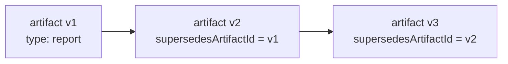
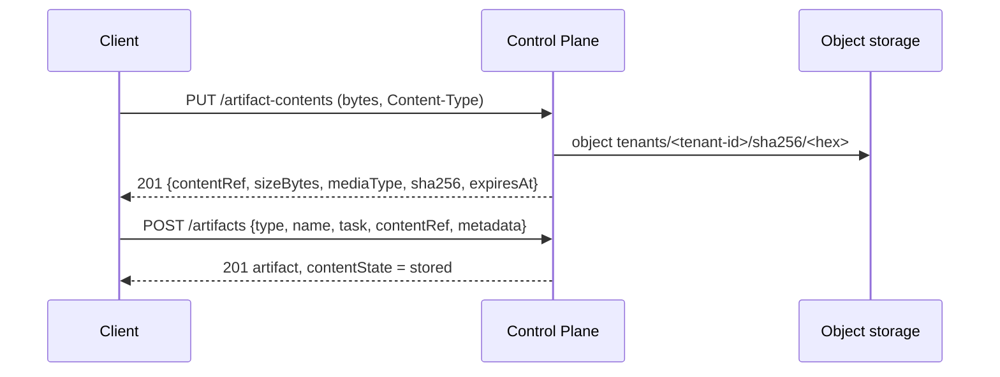

# Artifacts and comments

An artifact is an immutable record of a work result: a report, a commit, a
document, a run transcript. A comment is a message in a task thread for
coordination, with its edit history preserved. This page describes both
entities, their rules and API, the storage of artifact files in object storage,
and the artifact type registry, and explains what goes where. It is for
developers of harnesses and integrations and for operators reading agent
results.

## What goes where

| What | Where | Why |
|---|---|---|
| A work result (report, commit, file, run summary) | **Artifact** | Immutable, bound to a run and a task, available as evidence and in the context of subsequent runs |
| A discussion, a question, a note for a handoff | **Comment** | Coordination between humans and agents; the author comes from the credential |
| State for continuing the work | Run **checkpoint** | Explicit operational state for a restart (see [Execution](execution.md)) |
| A record of a tool call | **Run action** | Lightweight audit, outside the event log |
| A result file (document, PDF, archive) | Artifact content: `PUT /artifact-contents`, then an artifact with `contentRef` | The bytes live in the core's object storage; the database stores the reference, size, and checksum, not blobs |
| A file that already lives in another system | External storage + the artifact's `uri` | The core stores only the reference |

!!! warning "No secrets in comments or artifacts"
    Prompts, raw transcripts, and credentials do not belong in comments.
    Transcripts have a dedicated artifact kind with a size limit and
    redaction — `transcript`.

## Artifacts

### Model

| Field | Description |
|---|---|
| `id` | Identifier |
| `type` | Artifact kind, a string of 1–200 characters; the vocabulary is open, registered kinds are validated (see [Artifact types](#artifact-types)) |
| `name` | Name, 1–500 characters; for a file, the name it is served under |
| `taskId`, `runId`, `workspaceId` | Bindings (all optional) |
| `uri` | Reference to the content in external storage (up to 2000 characters) |
| `content` | A small JSON document with the content |
| `metadata` | JSON metadata: what a reader wants to know before opening |
| `supersedesArtifactId` | The previous revision this one replaces |
| `contentState` | Content in storage: `none` (there is none — a reference or JSON), `stored` (present), `purged` (deleted by an administrator) |
| `sizeBytes`, `mediaType`, `sha256` | Size, media type, and SHA-256 of the content; `null` for an artifact without content; kept as a trace after deletion |
| `typeVersion` | The version of the registered type the artifact was validated against; `null` for an unregistered kind |
| `createdByPrincipalId`, `createdAt` | Author and time |

An artifact is submitted in one of three forms: a reference (`uri`), a small
JSON (`content`), or a file in the core's storage (`contentRef`). `contentRef`
excludes `uri` and `content`.

Artifacts are **only created and read**: the API has no update or delete of
the record. A new version of a result is a new artifact referencing the
previous one. Only the content bytes can be deleted, and only by an
administrator (see [Deleting content](#purge-content)).

### Creating

```bash
curl -s -X POST "$CP/artifacts" \
  -H "Authorization: Bearer $TOKEN" -H "Content-Type: application/json" \
  -H "Idempotency-Key: $(uuidgen)" \
  -d '{
    "type": "report",
    "name": "Weekly load report",
    "runId": "<run-id>",
    "uri": "https://files.example.com/reports/load-week-38.pdf",
    "content": {"summary": "p95 grew by 12% during peak hours"},
    "metadata": {"format": "pdf", "pages": 14}
  }'
```

Rules:

- the `artifacts.write` permission is decided **on the artifact's task**; an
  artifact without a task — on its workspace; without both — at the tenant
  level;
- if `runId` is passed without `task`, the task is taken from the run; if both
  are passed and the run belongs to another task — `422 artifact_mismatch`;
- for a child run, the server checks that `artifacts.write` is within its
  permission ceiling (see child runs in [Execution](execution.md));
- `supersedesArtifactId` must exist in the tenant (`404`);
- empty `type` or `name` — `422 invalid_type` / `422 invalid_name`;
- `contentRef` together with `uri` or `content` — `422 invalid_artifact_content`;
- if `type` is registered in the tenant, the artifact is validated against the
  latest version of the type (see [Artifact types](#artifact-types));
- the general request body limit is `CP_MAX_BODY_BYTES` (1 MiB by default):
  upload files separately (see [Content in storage](#content)).

### Revisions



A revision is a separate artifact with `supersedesArtifactId`. The original
artifact stays untouched: the audit sees what was published and when.

### Reading

```bash
curl -s "$CP/artifacts?taskId=<task-id>&type=commit" -H "Authorization: Bearer $TOKEN"
curl -s "$CP/artifacts/<artifact-id>" -H "Authorization: Bearer $TOKEN"
```

`GET /artifacts` (`artifacts.read`) accepts the filters `taskId`, `runId`,
`workspaceId`, `type` and `limit` / `cursor` pagination; newest first.

`GET /artifacts/{id}` checks `artifacts.read` on the artifact's task. The
`?forTask=<ref>` parameter reads the artifact as an **input** of the receiving
task: `tasks.read` on the receiving task is enough if the artifact is currently
one of its allowed inputs (see [Inputs and outputs](task-types.md#artifact-schema)).
Otherwise the regular check on the artifact's task applies; another tenant —
`404`.

Artifacts of past runs of the task also arrive in the Run Context
(`GET /runs/{id}/context`) — this is how the next executor sees what has
already been done (see [Task context and memory](context.md)).

### Artifact kinds

The `type` vocabulary is open: the core does not interpret the content. A kind
that the tenant registered in the [artifact type](#artifact-types) registry is
validated on write; any other kind is accepted without validation. Platform
components use the following kinds (all unregistered):

| `type` | Who publishes it | Content |
|---|---|---|
| `commit` | A runner working in a repository | The commit `uri`, `metadata`: `branch`, `commit`, `workspaceKey`, `published` (whether the branch reached the external git) |
| `transcript` | Coding agent adapters | A bounded run feed, schema `agent-transcript/1` |
| `skill_result` | The core, on a successful Skill invocation with a task | `content.output` — the Skill output; the author is the invocation initiator |
| `report` | The runner's example executor and integrations | An arbitrary report |
| `verification` | The core, when the task's verification stage has passed | The outcome of the checks (see [Goals, acceptance, and evidence](goals-and-evidence.md#verification-stage)) |

Your own integrations can introduce their own kinds — choose stable names and
document their `metadata` so they can be referenced, for example, in approval
outcome expressions (`$.task.artifact[<type>].metadata.<field>`, see
[Approvals](approvals.md)).

### Run transcript

The `transcript` artifact is a single `agent-transcript/1` JSON document that a
coding agent adapter publishes at the end of a run:

- the size is limited to 512 KiB; the texts of individual entries and tool
  results are truncated;
- every line goes through redaction of local paths and credential-like
  values;
- hidden model reasoning is counted but not stored;
- if the document still fails the portability check, it is published without
  text (`"withheld": true`), with counters only.

The transcript `metadata` contains `schema`, `harnessType`, the number of
entries, tool calls, and errors, the model, and token usage if known. Tool
calls are written in parallel as run actions of the form `tool.<name>`.
Details and settings are in [Run trace](../runner/trace.md).

### Artifact as evidence

You can reference an artifact as a fact in the task's `evidence`:
`{"kind": "artifact", "artifactId": "…", "check": "tests"}`. The core checks
that the artifact exists in the tenant. See
[Goals, acceptance, and evidence](goals-and-evidence.md).

## Content in storage { #content }

The core stores a result file — a specification, a PDF report, an archive —
itself: in S3-compatible object storage (in the delivery, the deployment's
MinIO, see [Object storage](../operations/object-storage.md)). The database
holds only the artifact record with the reference, size, media type, and
SHA-256; the bytes are kept neither in PostgreSQL nor in process memory. The
storage is not exposed externally: bytes go in and out only through the core
API.

Submitting a file takes two steps:



If the storage is not configured (`CP_S3_ENDPOINT_URL` is empty) or is
unavailable, the content routes respond `503 content_store_unavailable`.
Everything else keeps working: reference artifacts and JSON artifacts are
created and read as usual.

### Upload: `PUT /artifact-contents`

The request body is the **raw file bytes**, not JSON and not multipart. The
`Content-Type` header is required and sets the media type of the content.

```bash
curl -s -X PUT "$CP/artifact-contents" \
  -H "Authorization: Bearer $TOKEN" \
  -H "Content-Type: application/pdf" \
  --data-binary @review.pdf
```

```json
{
  "contentRef": "cref_<upload-id>",
  "sizeBytes": 184320,
  "mediaType": "application/pdf",
  "sha256": "9f86d081884c7d659a2feaa0c55ad015a3bf4f1b2b0b822cd15d6c15b0f00a08",
  "expiresAt": "2026-01-16T10:00:00Z"
}
```

Rules:

- the `artifacts.write` permission (not bound to a task: the task is checked
  when an artifact references the upload);
- `Content-Type` missing or not shaped like `type/subtype` —
  `400 invalid_request`; the base type is lowercased, parameters
  (`; charset=utf-8`) are preserved;
- the size limit is `CP_ARTIFACT_MAX_BYTES` (100 MiB by default); for this
  route it replaces the general `CP_MAX_BODY_BYTES`. Larger — `413
  request_too_large`. The body is written to a temporary file on disk while
  SHA-256 is computed and never lands in memory as a whole;
- objects are content-addressed within a tenant: identical bytes uploaded
  twice are stored as one object, but each upload gets its own `contentRef`.

**Who owns a `contentRef`.** The reference is valid only for the principal who
uploaded it, and only in their tenant. A foreign, nonexistent, malformed, or
expired reference returns the same `422 content_ref_not_found`: knowing the
checksum or someone else's reference does not let you reference someone
else's bytes.

**How long it lives.** An upload waits for an artifact for
`CP_ARTIFACT_UPLOAD_TTL_SECONDS` (24 hours by default); the deadline is in
`expiresAt`. Until the deadline passes, several artifacts can reference the
same upload. The worker deletes uploads that no artifact referenced before
expiry, and objects that nobody needs anymore.

### Writing an artifact with content

```bash
curl -s -X POST "$CP/artifacts" \
  -H "Authorization: Bearer $TOKEN" -H "Content-Type: application/json" \
  -H "Idempotency-Key: $(uuidgen)" \
  -d '{
    "type": "review-report",
    "name": "review.pdf",
    "task": "<task-id>",
    "contentRef": "cref_<upload-id>",
    "metadata": {"reviewer": "alice@example.com"}
  }'
```

The response contains `contentState: "stored"` and the upload's `sizeBytes`,
`mediaType`, and `sha256`. `name` is the name the file is served under on
download.

### Reading content: `GET /artifacts/{id}/content`

```bash
curl -s "$CP/artifacts/<artifact-id>/content" \
  -H "Authorization: Bearer $TOKEN" -o review.pdf

# as an input of the receiving task
curl -s "$CP/artifacts/<artifact-id>/content?forTask=<task-ref>" \
  -H "Authorization: Bearer $TOKEN" -o review.pdf
```

Authorization is the same as for `GET /artifacts/{id}`: `artifacts.read` on
the artifact's task (on the workspace if there is no task; on the tenant if
there is no workspace either) or, with `?forTask=`, `tasks.read` on the
receiving task if the artifact is its allowed input. The executor of the next
step gets the input even without permission on the previous step's task: the
input is granted because the type of its own task declared it.

The bytes are streamed with these headers:

| Header | Value |
|---|---|
| `Content-Type` | the artifact's `mediaType` |
| `Content-Length` | size |
| `Content-Disposition` | `attachment; filename*=UTF-8''<name>` for active content (`text/html`, `application/xhtml+xml`, `image/svg+xml`, `text/xml`, `application/xml`, `text/javascript`, `application/javascript`, and any `+xml`), otherwise `inline` with the same `filename*` |
| `ETag` | `"sha256:<hex>"` |
| `X-Content-Type-Options` | `nosniff` |
| `Cache-Control` | `private, no-store` |

| Response | When |
|---|---|
| `200` | Bytes |
| `403 permission_denied` | No permission either on the artifact's task or as an input |
| `404` | The artifact is not in the tenant, or the `forTask` task is not found |
| `404 content_not_found` | The artifact has no content (`contentState = none`) |
| `410 content_purged` | The content was deleted by an administrator |
| `503 content_store_unavailable` | The storage is not configured, unavailable, or does not have the object |

Every download writes an `artifact.content_read` event: who, which artifact,
for which task (`forTaskId`, if served as an input), and in which run of the
reader. The event is recorded before the first byte is sent; a download the
storage could not serve leaves no event.

### Deleting content { #purge-content }

Content is stored indefinitely: closing or cancelling the task does not touch
it. Only a tenant administrator (the `admin` permission) can delete the bytes;
the artifact record remains:

```bash
curl -s -X POST "$CP/artifacts/<artifact-id>:purge-content" \
  -H "Authorization: Bearer $TOKEN" -H "Content-Type: application/json" \
  -H "Idempotency-Key: $(uuidgen)" \
  -d '{"reason": "Personal data got into the report by mistake"}'
```

- `reason` is required, 1–2000 characters; it goes into the event with
  secrets removed and truncated to 1000 characters;
- the artifact gets `contentState = purged`; `sizeBytes`, `mediaType`, and
  `sha256` are kept as a trace;
- the object is deleted from storage only if no other artifacts with content
  and no unexpired uploads of the tenant reference the same bytes;
- a repeat on an already purged artifact — `200` with the same record, no new
  event; an artifact without content — `409 content_not_stored`;
- the object is deleted before the transaction commits: if the storage is
  unavailable, the response is `503 content_store_unavailable`, and the record
  stays `stored`.

The event is `artifact.content_purged` with the `objectDeleted` field: whether
the object was deleted or is still needed by other artifacts.

### MCP tools

- `cp_create_artifact` accepts `file` — a path to a local file. The tool
  uploads it (`PUT /artifact-contents`) and creates an artifact of the current
  task and run with the obtained `contentRef`. `name` defaults to the file
  name, and `media_type` is guessed from the extension by default (otherwise
  `application/octet-stream`). `file` excludes `uri` and `content`.
- `cp_get_artifact_content` downloads an artifact's content to a local file and
  returns the path. `path` is where to write (by default a temporary directory
  outside the working copy), `for_task` is the receiving task (the current one
  by default). Text content up to 64 KiB is also returned as the `text` string.

## Artifact types { #artifact-types }

An artifact type is an object in the tenant's catalog, like a task type: a key,
a JSON Schema for `metadata`, the allowed content media types, and a size
ceiling. The core does not know what a type means — there is no type-specific
code. Types exist so that artifacts of one kind are uniform and so that task
type inputs and outputs can reference them (see
[Inputs and outputs](task-types.md#artifact-schema)).

### Model

| Field | Description |
|---|---|
| `key` | `^[a-z0-9][a-z0-9_-]*$`, 1–63 characters; matches the artifact's `type` |
| `version` | Assigned by the server: the next after the maximum for the key |
| `displayName` | 1–200 characters |
| `description` | Up to 2000 characters |
| `metadataSchema` | JSON Schema for the artifact's `metadata`, up to 16 KiB; `{}` by default — any object |
| `mediaTypes` | 1–50 items: `type/subtype`, `type/*`, or `*/*`; lowercased, duplicates removed |
| `maxBytes` | Content size ceiling, from 1 to `CP_ARTIFACT_MAX_BYTES`; if not set — `CP_ARTIFACT_MAX_BYTES` at the time the version is created |
| `status` | `active` |

### Versions

A version is **immutable**. `POST /artifact-types` with an existing key
creates the next version rather than editing the current one. Artifact types
have no deprecation route. An artifact is always validated against the
**latest** version of the key (the highest number) and records it in
`typeVersion`.

Addressing is by key, as in the artifact's `type` field:

- `GET /artifact-types/{key}` — the latest version;
- `GET /artifact-types/{key}@{version}` — an exact version.

```bash
curl -s -X POST "$CP/artifact-types" \
  -H "Authorization: Bearer $TOKEN" -H "Content-Type: application/json" \
  -H "Idempotency-Key: $(uuidgen)" \
  -d '{
    "key": "review-report",
    "displayName": "Review report",
    "mediaTypes": ["application/pdf"],
    "maxBytes": 10485760,
    "metadataSchema": {
      "type": "object",
      "required": ["reviewer"],
      "properties": {"reviewer": {"type": "string"}}
    }
  }'

curl -s "$CP/artifact-types/review-report@1" -H "Authorization: Bearer $TOKEN"
```

Publication errors — `422 invalid_artifact_type` with `details.field`
(`metadataSchema`, `mediaTypes`, `mediaTypes[<i>]`, `maxBytes`); the reason a
schema was rejected is in `details.reason` and `details.cause`.

### Artifact validation

If the artifact's `type` is registered in the tenant, `POST /artifacts`
validates it against the latest version of the type:

| What | Error |
|---|---|
| `metadata` against `metadataSchema` | `422 invalid_artifact_metadata`, violations in `details.errors` |
| Content `mediaType` against `mediaTypes` (without parameters and case-insensitive: `text/markdown; charset=utf-8` is `text/markdown`) | `422 media_type_not_allowed`, `details` holds `mediaType` and `allowed` |
| Content `sizeBytes` against `maxBytes` | `422 artifact_too_large`, `details` holds `sizeBytes` and `maxBytes` |

Only content from `contentRef` has a media type and size: a reference or JSON
artifact of a registered type is validated only against `metadata`.
**Unregistered kinds** (`commit`, `report`, `transcript`, `skill_result`,
`verification`, and any others) are accepted without validation,
`typeVersion = null`. Artifacts written by the core itself are not validated.

### Registry API

| Method | Path | Permission |
|---|---|---|
| `POST` | `/artifact-types` | `artifact_types.manage` |
| `GET` | `/artifact-types?key=&status=` | `artifact_types.read` |
| `GET` | `/artifact-types/{key}` | `artifact_types.read` |
| `GET` | `/artifact-types/{key}@{version}` | `artifact_types.read` |

The list is newest first, with `limit` / `cursor` pagination. In catalog
packages an artifact type is declared with the `ArtifactType` kind (see
[Catalog packages](catalog-packages.md)).

## Artifacts API

| Method | Path | Permission |
|---|---|---|
| `PUT` | `/artifact-contents` | `artifacts.write` |
| `POST` | `/artifacts` | `artifacts.write` on the artifact's task |
| `GET` | `/artifacts/{id}` | `artifacts.read` on the artifact's task or `tasks.read` on the `forTask` task |
| `GET` | `/artifacts/{id}/content` | same as `GET /artifacts/{id}` |
| `POST` | `/artifacts/{id}:purge-content` | `admin` |

### Artifact error codes

| Code | HTTP | When |
|---|---|---|
| `invalid_request` | 400 | `PUT /artifact-contents` without a valid `Content-Type` |
| `request_too_large` | 413 | The file is larger than `CP_ARTIFACT_MAX_BYTES` |
| `content_store_unavailable` | 503 | The storage is not configured, unavailable, or lost the object |
| `invalid_artifact_content` | 422 | `contentRef` together with `uri` or `content` |
| `content_ref_not_found` | 422 | `contentRef` is not a live upload of this principal |
| `invalid_artifact_metadata` | 422 | `metadata` does not pass the type's `metadataSchema` |
| `media_type_not_allowed` | 422 | The content media type is not in the type's `mediaTypes` |
| `artifact_too_large` | 422 | The content is larger than the type's `maxBytes` |
| `invalid_artifact_type` | 422 | An error in the artifact type definition |
| `content_not_found` | 404 | The artifact has no content |
| `content_purged` | 410 | The content was deleted by an administrator |
| `content_not_stored` | 409 | `:purge-content` on an artifact without content |

## Task comments

A comment is coordination: it carries no authority and does not replace an
artifact. Two rules make the thread reliable:

- **the author comes from the credential**, not from the request body — the
  system itself tells an agent's message from a human's, with no conventions in
  the text;
- **an edit preserves the previous text**: the previous version is written to
  an append-only history before the new text goes into the comment.

### Model

| Field | Description |
|---|---|
| `id`, `taskId` | Comment and task |
| `authorPrincipalId` | Author — the caller's principal |
| `body` | Text up to 10,000 characters |
| `runId`, `artifactId` | Optional binding to a run or artifact of **the same task** |
| `version` | Grows with every edit; `ETag: "comment-<version>"` |
| `createdAt`, `updatedAt`, `editedAt` | `editedAt` is set if the comment was edited |

### Adding

```bash
curl -s -X POST "$CP/tasks/TASK-000123/comments" \
  -H "Authorization: Bearer $TOKEN" -H "Content-Type: application/json" \
  -d '{"body": "Migration verified on a database copy, ready to deploy", "runId": "<run-id>"}'
```

- the `tasks.write` permission;
- the text is trimmed; empty — `422 invalid_comment_body`, longer than 10,000
  characters — `422 payload_too_large`;
- the text is checked for secrets — `422 secret_material_rejected`;
- `runId` / `artifactId` of another task — `422 comment_mismatch`, of another
  tenant — `404`;
- a terminal task **accepts** comments: a retrospective, a cancellation reason,
  or a link to the follow-up appear after the work is closed.

### Editing

```bash
curl -s -X PATCH "$CP/tasks/TASK-000123/comments/<comment-id>" \
  -H "Authorization: Bearer $TOKEN" -H "Content-Type: application/json" \
  -H 'If-Match: "comment-1"' \
  -d '{"body": "Migration verified on a database copy; deploy after 18:00"}'
```

- **Only the author** can edit (`403 not_comment_author`). There is no
  exception for an administrator: rewriting someone else's words under their
  name is a forgery of authorship.
- `If-Match` is required; a version mismatch — `409 version_conflict`.
- An edit that does not change the text writes nothing: no revision, no new
  version, no event — a repeated request produces no history.
- Comments cannot be deleted.

### Edit history

```bash
curl -s "$CP/tasks/TASK-000123/comments/<comment-id>/revisions" \
  -H "Authorization: Bearer $TOKEN"
```

```json
{
  "items": [
    {
      "id": "…", "commentId": "…", "taskId": "…",
      "version": 1,
      "body": "Migration verified on a database copy, ready to deploy",
      "authorPrincipalId": "…",
      "createdAt": "…",
      "supersededAt": "…",
      "supersededBy": "…"
    }
  ],
  "nextCursor": null
}
```

Revisions are stored in an append-only table: `UPDATE` and `DELETE` are
forbidden by a database trigger.

### Feed

`GET /tasks/{ref}/comments` is the only listing that goes **from oldest to
newest**: a thread is read forward, and a message written while you page
arrives on the next page. The feed cursor has its own format: a cursor from
another listing returns `422 invalid_cursor` here.

### Comments API

| Method | Path | Permission |
|---|---|---|
| `POST` | `/tasks/{ref}/comments` | `tasks.write` |
| `GET` | `/tasks/{ref}/comments` | `tasks.read` |
| `GET` | `/tasks/{ref}/comments/{id}` | `tasks.read` (`ETag`) |
| `PATCH` | `/tasks/{ref}/comments/{id}` | `tasks.write`, author only, `If-Match` |
| `GET` | `/tasks/{ref}/comments/{id}/revisions` | `tasks.read` |

A comment is addressed through its task: accessing it through another task
returns `404`.

MCP tools: `cp_list_comments` (read), `cp_comment`, `cp_edit_comment`
(mutating).

## Events

| Event | Stream | Payload |
|---|---|---|
| `artifact.created` | artifact | `type`, `name`, `taskId`, `runId`, `uri`, `supersedesArtifactId`, `sizeBytes`, `mediaType`, `sha256`, `contentState`, `typeVersion` — **without** `content` and without bytes |
| `artifact.content_read` | artifact | `artifactId`, `taskId`, `forTaskId`, `runId` (the reader's run, if any), `sha256`, `sizeBytes` |
| `artifact.content_purged` | artifact | `artifactId`, `taskId`, `sha256`, `sizeBytes`, `reason`, `objectDeleted` |
| `artifact_type.created` | artifact type | `key`, `version`, `mediaTypes`, `maxBytes`, `declaresMetadataSchema` |
| `task.comment_added` | **task** | `commentId`, `authorPrincipalId`, `version`, `bodyLength`, `runId`, `artifactId` |
| `task.comment_edited` | task | The same |

Comment events are written to the task stream so that a subscriber sees the
discussion in the same place as status changes. The comment text never goes
into the event log — only its length.

## See also

- [Execution — claims and runs](execution.md) — checkpoints and run actions.
- [Task types and statuses](task-types.md#artifact-schema) — inputs and outputs of a task type.
- [Catalog packages](catalog-packages.md) — the `ArtifactType` kind.
- [Object storage (MinIO)](../operations/object-storage.md)
- [Run trace](../runner/trace.md) — transcript and tool actions.
- [Goals, acceptance, and evidence](goals-and-evidence.md)
- [Events](events.md)
