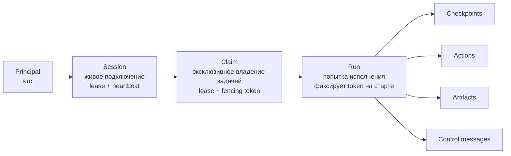
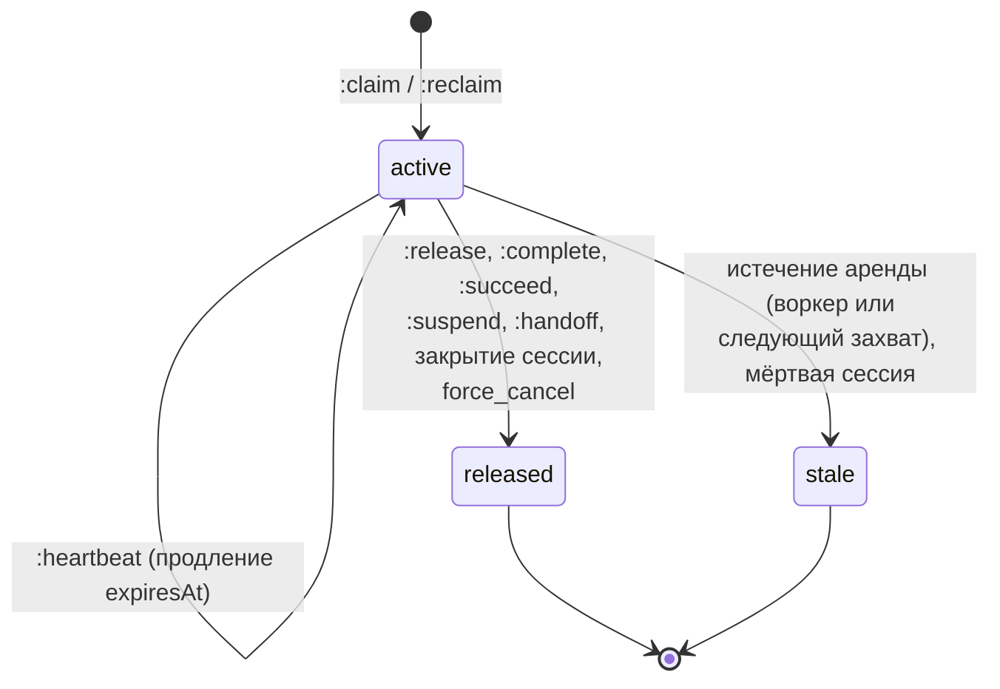
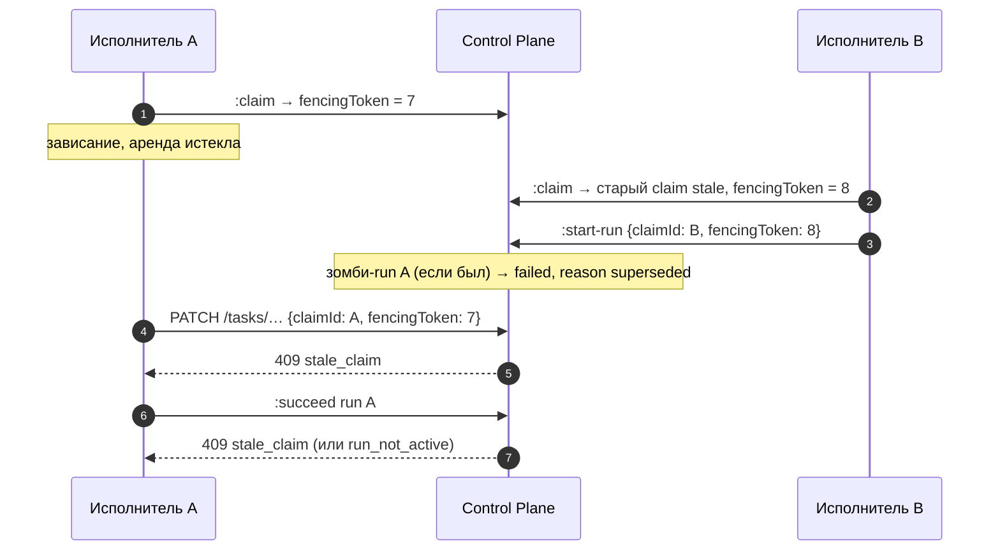
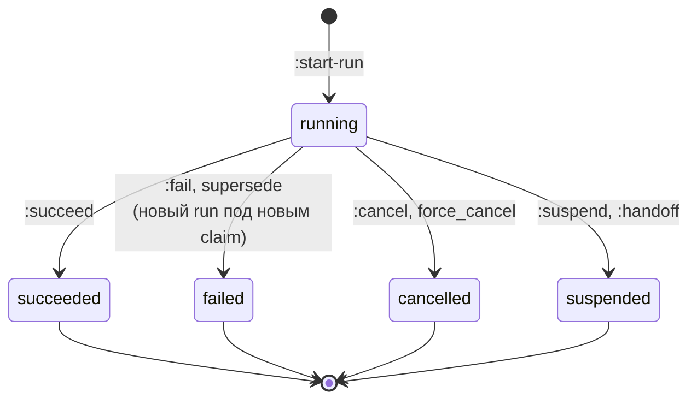
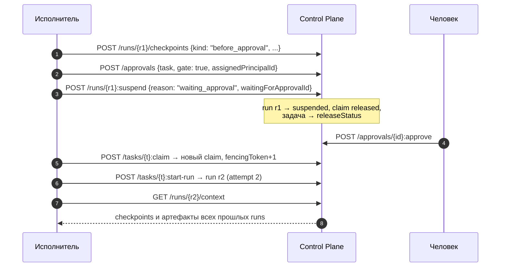
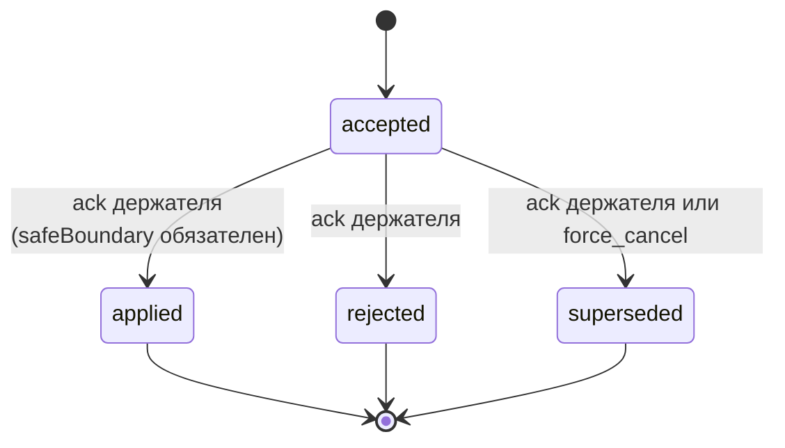

# Исполнение — claims и runs

Статья описывает протокол исполнения задач: сессии, claims с арендой и
fencing token, runs как попытки исполнения, checkpoints и журнал действий,
приостановку и возобновление, передачу работы человеку, дочерние runs и
управляющие сообщения. Она адресована разработчикам харнессов и runner'ов и
операторам, разбирающим, почему задача «застряла».

## Три уровня владения



- **Session** — аренда живого подключения клиента. Claims держатся на
  сессии: закрытие или истечение сессии лишает её claims силы.
- **Claim** — эксклюзивное право писать в задачу. На задаче одновременно не
  больше одного активного claim (частичный уникальный индекс в базе).
- **Run** — одна попытка исполнения под claim. На задаче одновременно не
  больше одного `running` run. Задача может иметь много runs (номер попытки —
  `attempt`).

## Сессия

```bash
curl -s -X POST "$CP/sessions" \
  -H "Authorization: Bearer $TOKEN" -H "Content-Type: application/json" \
  -d '{
    "clientName": "my-runner",
    "clientVersion": "1.4.0",
    "ttlSeconds": 300,
    "harness": {"type": "autonomous-agent", "protocolVersion": "2",
                "capabilities": ["checkpoints", "resume"]}
  }'
```

| Операция | Путь | Кто |
|---|---|---|
| Открыть | `POST /sessions` | `sessions.open` |
| Продлить | `POST /sessions/{id}:heartbeat` `{ttlSeconds?}` | Владелец или `sessions.manage` |
| Закрыть | `POST /sessions/{id}:close` | Владелец или `sessions.manage`; освобождает все claims сессии (`reason: session_closed`) |

Регистрация харнесса в блоке `harness` и её семантика описаны в
[Харнесс-протоколе](harness-protocol.md).

## Claim

### Захват

```bash
curl -s -X POST "$CP/tasks/TASK-000123:claim" \
  -H "Authorization: Bearer $TOKEN" -H "Content-Type: application/json" \
  -H "Idempotency-Key: $(uuidgen)" \
  -d '{"sessionId": "<session-id>", "ttlSeconds": 600, "intent": "implement"}'
```

```json
{
  "id": "<claim-id>",
  "taskId": "…",
  "sessionId": "<session-id>",
  "holderId": "<principal-id>",
  "status": "active",
  "fencingToken": 7,
  "intent": "implement",
  "acquiredAt": "…", "heartbeatAt": "…", "expiresAt": "…",
  "releasedAt": null, "releaseReason": null
}
```

Захват разрешён, только если одновременно выполнены четыре условия:

| Условие | Проверка | Отказ |
|---|---|---|
| API-право | `tasks.claim` (в режиме PDP — на ресурсе `task:<id>`) | `403 permission_denied` |
| Eligibility | Principal сессии удовлетворяет всем требованиям задачи (роли, capabilities, skills) | `403 not_eligible` |
| Readiness | Все пререквизиты `blocks` / `depends_on` в `terminal_success` | `409 task_not_ready` (`details.blockedBy`) |
| Gate | Нет ожидающего gate-approval | `409 approval_required` (`details.pendingApprovals`) |
| Конкурентность | Нет живого claim другого держателя | `409 task_already_claimed` |

Кроме того, задача не должна быть терминальной (`422 task_not_claimable`),
а сессия — принадлежать вызывающему (`403 session_owner_mismatch`), быть
активной (`409 session_not_active`) и не истёкшей (`409 session_expired`).

### Алгоритм захвата

Захват выполняется в одной транзакции под блокировкой строки задачи:

1. share-блокировка сессии (до блокировки задачи — порядок session → task);
2. `SELECT … FOR UPDATE` задачи;
3. проверка терминальности, eligibility, readiness и gate;
4. если есть активный claim: живой — `409 task_already_claimed`; истёкший или
   с мёртвой сессией — переводится в `stale`, событие `claim.expired`
   (`reason: expired` или `session_inactive`);
5. `claim_epoch += 1`; новый claim с `fencingToken = claim_epoch`;
6. `activeClaimId` указывает на новый claim;
7. задача переводится в `claimStatus` типа, если ребро объявлено
   (см. [Типы задач](task-types.md));
8. `version += 1`, событие `task.claimed`, commit.

Реквизиция истёкшего claim не зависит от воркера: её выполняет сама команда
захвата.

### Состояния claim



| Статус | Значение |
|---|---|
| `active` | Действует; живой, только если `expiresAt` в будущем **и** сессия активна и не истекла |
| `released` | Освобождён штатно; `releaseReason` — `released`, `completed`, `session_closed`, `waiting_approval`, `human_harness_handoff`, `force_cancel` и т. п. |
| `stale` | Потерян по аренде; `releaseReason` — `expired` или `session_inactive` |

### Аренда и heartbeat

| Параметр | Переменная | По умолчанию |
|---|---|---|
| TTL claim | `CP_CLAIM_TTL_SECONDS` | 300 с |
| Допустимый `ttlSeconds` claim | `CP_CLAIM_TTL_MIN_SECONDS` … `CP_CLAIM_TTL_MAX_SECONDS` | 10 … 3600 с |
| TTL сессии | `CP_SESSION_TTL_SECONDS` | 300 с |
| Допустимый `ttlSeconds` сессии | `CP_SESSION_TTL_MIN_SECONDS` … `CP_SESSION_TTL_MAX_SECONDS` | 10 … 3600 с |

`ttlSeconds` вне границ — `422 invalid_ttl` (значение не обрезается).

```bash
curl -s -X POST "$CP/claims/<claim-id>:heartbeat" \
  -H "Authorization: Bearer $TOKEN" -H "Content-Type: application/json" \
  -d '{"ttlSeconds": 600}'
```

Heartbeat claim продлевает аренду на `ttlSeconds` от текущего момента и
отклоняется, если claim уже не активен (`409 claim_not_active`), истёк
(`409 claim_expired`) или сессия держателя мертва (`409 session_not_active`).

!!! tip "Продлевайте обе аренды"
    Claim жив, только пока жива его сессия. Исполнитель должен регулярно
    продлевать **и** сессию, **и** claim — с запасом, например каждые
    TTL/3.

Истечение обрабатывается тремя независимыми путями, корректность не зависит
ни от одного из них в отдельности:

1. **лениво** — команда, встретившая истёкшую аренду, отклоняет операцию;
2. **при захвате** — новый claim реквизирует истёкший атомарно;
3. **фоном** — воркер переводит истёкшие sessions и claims в `stale` с
   событиями `session.expired` / `claim.expired` и возвращает задачу в
   `releaseStatus`.

### Освобождение и перезахват

```bash
# Освободить свой claim (идемпотентно)
curl -s -X POST "$CP/claims/<claim-id>:release" \
  -H "Authorization: Bearer $TOKEN" -H "Content-Type: application/json" \
  -d '{"reason": "released"}'

# Перехватить истёкший claim (новый fencing token)
curl -s -X POST "$CP/claims/<claim-id>:reclaim" \
  -H "Authorization: Bearer $TOKEN" -H "Content-Type: application/json" \
  -d '{"sessionId": "<session-id>"}'
```

`:release` доступен держателю или обладателю `claims.manage`; задача
переходит в `releaseStatus` типа, если ребро объявлено. `:reclaim` требует
`tasks.claim` и работает только для истёкшего claim или claim с мёртвой
сессией — живой даёт `409 claim_not_expired`.

Список и карточка: `GET /claims?taskId=&sessionId=&status=`,
`GET /claims/{id}` (`tasks.read`).

## Fencing token

Fencing token защищает задачу от «зомби» — исполнителя, который потерял
аренду (завис, потерял сеть), а потом очнулся и продолжает писать.



`claim_epoch` задачи растёт при каждом захвате, и токен claim равен эпохе
на момент захвата. Пока у задачи есть **живой** claim, любая мутация задачи
(`PATCH`, `:complete`) обязана предъявить `claimId` и `fencingToken`:

| Ситуация | Ответ |
|---|---|
| Живой claim есть, `claimId` не передан | `409 task_claimed` (в `details` — id и срок действующего claim) |
| Передан `claimId`, но живого claim нет | `409 stale_claim` |
| `claimId` не совпадает с `activeClaimId` или токен не передан | `409 stale_claim` |
| Токен не равен токену claim или текущей эпохе | `409 stale_claim` (`presentedFencingToken`, `currentClaimEpoch`) |
| Claim принадлежит другому principal | `403 claim_holder_mismatch` |

Claim с мёртвой сессией задачу не защищает: запись без `claimId` проходит,
а сам claim пожнёт следующий захват или воркер.

!!! danger "Получили `stale_claim` — остановитесь"
    `409 stale_claim` означает, что владение потеряно и задачей уже может
    владеть другой исполнитель. Не повторяйте запись: перечитайте контекст
    (`GET /harness/context`, `GET /tasks/{ref}`) и начните заново с захвата.
    Честно зафиксировать провал своего run (`:fail`) при этом можно.

## Run

### Состояния run



Все статусы, кроме `running`, **терминальны для этого run**. В том числе
`suspended`: продолжение — это новый claim и новый run, который читает
checkpoints предыдущих.

### Старт

```bash
curl -s -X POST "$CP/tasks/TASK-000123:start-run" \
  -H "Authorization: Bearer $TOKEN" -H "Content-Type: application/json" \
  -H "Idempotency-Key: $(uuidgen)" \
  -d '{
    "claimId": "<claim-id>",
    "fencingToken": 7,
    "input": {"goal": "…"},
    "maxDurationSeconds": 3600,
    "maxActions": 200
  }'
```

- Требует `tasks.claim` и живой claim вызывающего с верным токеном.
- Терминальная задача — `422 task_not_runnable`.
- Уже есть `running` run под этим же claim — `409 run_already_active`.
- `running` run от **прежней** эпохи (зомби) переводится в `failed` с
  `failureReason: superseded` в той же транзакции.
- `attempt` = число runs задачи + 1; run фиксирует `fencingToken` claim.
- В той же транзакции компилируется Effective Harness Manifest run'а
  (см. [Харнесс-протокол](harness-protocol.md)) и, если задача запущена
  родительским run, привязывается дочерний handle.

Бюджет: `maxDurationSeconds` и `maxActions` (положительные, иначе
`422 invalid_budget`). Превышение отклоняет новые checkpoints и actions
с `409 budget_exceeded`.

### Завершение run

| Действие | Путь | Кто | Что делает |
|---|---|---|---|
| Успех | `POST /runs/{id}:succeed` `{output?, completeTask=true}` | Владелец run, `tasks.claim`, живой claim | Run → `succeeded`; при `completeTask: true` атомарно завершает задачу (claim освобождается, задача → `completionStatus`); при `false` claim остаётся |
| Провал | `POST /runs/{id}:fail` `{failureReason, output?}` | Владелец run или `claims.manage` | Run → `failed`; задачу и claim **не трогает** |
| Отмена | `POST /runs/{id}:cancel` `{reason}` | Владелец run или `claims.manage` | Run → `cancelled`; задачу и claim не трогает |
| Приостановка | `POST /runs/{id}:suspend` `{reason, waitingForApprovalId?}` | Владелец с живым claim | Run → `suspended`, claim освобождён |
| Передача человеку | `POST /runs/{id}:handoff` | Владелец с живым claim | См. ниже |

`:fail` и `:cancel` не требуют fencing: исполнитель, потерявший аренду,
всё равно может честно зафиксировать исход своей попытки. `:succeed`,
наоборот, перепроверяет fencing под блокировкой задачи: зомби получит
`409 stale_claim` и ничего не запишет. Чужой run — `403 run_holder_mismatch`,
run не в `running` — `409 run_not_active`.

`:succeed` с `completeTask: true` дополнительно проверяет то же, что
`:complete`: задача не завершена (`409 task_already_completed`), не отменена
(`422 task_cancelled`), нет gate (`409 approval_required`), ребро в
`completionStatus` объявлено (`422 invalid_transition`).

!!! note "`:complete` при активном run"
    `POST /tasks/{ref}:complete` с живым claim, под которым идёт run, даёт
    `409 run_in_progress`: завершайте через `:succeed`, `:fail` или `:cancel`.
    Зомби-run прежней эпохи при `:complete` переводится в `failed`
    (`superseded`).

### Checkpoints

Checkpoint — явное операционное состояние для рестарта и возобновления:
что сделано, что дальше, где результат. Не скрытые рассуждения модели и не
история чата.

```bash
curl -s -X POST "$CP/runs/<run-id>/checkpoints" \
  -H "Authorization: Bearer $TOKEN" -H "Content-Type: application/json" \
  -d '{"kind": "progress", "data": {"step": 3, "done": ["schema", "api"], "next": ["tests"]}}'
```

- Пишет только владелец run с живым claim (`tasks.claim`).
- `seq` выделяется под блокировкой run — последовательность без пропусков.
- `GET /runs/{id}/checkpoints` — по `seq`, старые первыми; без `limit` и
  `cursor` — весь журнал одной страницей.
- Событие `run.checkpointed` несёт только ссылки (`checkpointId`, `seq`,
  `kind`), данные checkpoint в журнал не попадают.

### Actions — журнал действий

Run actions — лёгкий аудит исполнения (вызов инструмента начат / завершён /
провален), хранящийся **вне** журнала событий.

```bash
# Однофазная запись
curl -s -X POST "$CP/runs/<run-id>/actions" \
  -H "Authorization: Bearer $TOKEN" -H "Content-Type: application/json" \
  -d '{"action": "tool.Bash", "status": "completed", "metadata": {"summary": "make test"}}'

# Двухфазная: started → :finish
curl -s -X POST "$CP/runs/<run-id>/actions/<action-id>:finish" \
  -H "Authorization: Bearer $TOKEN" -H "Content-Type: application/json" \
  -d '{"status": "failed"}'
```

- Статусы: `started`, `completed`, `failed`; повторное завершение —
  `409 action_already_finished`.
- `skill` (UUID, `name` или `name@version`) проверяется по effective tool
  policy run'а: вне политики — `403 tool_not_authorized`.
- Бюджет `maxActions` и `maxDurationSeconds` → `409 budget_exceeded`.
- После применённого кооперативного cancel новые действия отклоняются:
  `409 run_cancel_requested`.
- Входы и выходы инструментов в actions не хранятся — только ссылки и
  небольшие метаданные. Полная лента — в артефакте `transcript`
  (см. [Трассу прогонов](../runner/trace.md)).

## Приостановка и возобновление

Долгое ожидание (решение approval, внешний ввод) не должно держать
эксклюзивную аренду. Поэтому ожидание — это **завершение run** в статусе
`suspended` с освобождением claim, а продолжение — новый claim и новый run.



`waitingForApprovalId` сохраняется в `metadata` run'а и в событии
`run.suspended`. Пока gate не решён, повторный захват отклоняется
`409 approval_required`. Полный протокол восстановления после рестарта —
в [Харнесс-протоколе](harness-protocol.md).

## Передача работы человеку (handoff)

`POST /runs/{id}:handoff` одной транзакцией:

1. пишет checkpoint `kind: "handoff"`;
2. переводит run в `suspended` (`metadata.suspendReason`,
   `metadata.handoffCheckpointId`);
3. освобождает claim, задача → `releaseStatus`;
4. пишет события `run.checkpointed`, `run.suspended`, `claim.released`,
   `run.handoff_prepared`.

```bash
curl -s -X POST "$CP/runs/<run-id>:handoff" \
  -H "Authorization: Bearer $TOKEN" -H "Content-Type: application/json" \
  -H "Idempotency-Key: $(uuidgen)" \
  -d '{
    "reason": "human_harness_handoff",
    "checkpoint": {
      "kind": "handoff",
      "data": {
        "summary": "Схема и API готовы, осталось покрыть тестами граничные случаи",
        "nextSteps": ["Добавить тесты на пустой ввод", "Проверить миграцию на копии БД"],
        "evidenceRefs": ["artifact:<artifact-id>"]
      }
    }
  }'
```

Ответ содержит `run`, `task`, `checkpoint`, `eventCursor` и подсказку:

```json
{"resume": {"taskId": "…", "previousRunId": "…", "nextAction": "claim_and_start_new_run"}}
```

`reason` допускается только `human_harness_handoff`, `kind` — только
`handoff`; `summary` до 10 000 символов, `nextSteps` и `evidenceRefs` — до
100 элементов. Данные проверяются на секреты, транскрипты и локальные пути
машины (`422 unsafe_handoff_payload`). Используйте `Idempotency-Key`:
повтор после неоднозначного ответа вернёт тот же checkpoint и курсор.

## Управляющие сообщения run

Active Turn Control — надёжная очередь управляющих намерений для живого run,
хранимая в PostgreSQL, а не в памяти харнесса: команда «остановись» или
«поменяй курс» переживает рестарт исполнителя.

| `operation` | `directive` | Право | Назначение |
|---|---|---|---|
| `queue` | обязателен | `tasks.write` | Добавить указание в очередь |
| `steer` | обязателен | `tasks.write` | Скорректировать текущий курс |
| `redirect` | обязателен | `tasks.write` | Сменить цель хода |
| `request_cancel` | запрещён | `tasks.write` | Кооперативная остановка |
| `force_cancel` | запрещён, `reason` обязателен | `claims.manage` | Немедленная остановка сервером |

```bash
curl -s -X POST "$CP/runs/<run-id>/control-messages" \
  -H "Authorization: Bearer $TOKEN" -H "Content-Type: application/json" \
  -H "Idempotency-Key: $(uuidgen)" \
  -d '{"operation": "steer", "causalPosition": "turn:12",
       "directive": "Сначала исправь падающий тест, потом рефакторинг",
       "expectedRunVersion": 5}'
```

- `Idempotency-Key` (1–200 символов) и `expectedRunVersion` обязательны;
  несовпадение версии — `409 run_version_conflict`.
- `directive` и `reason` проверяются на credential-подобные строки и
  абсолютные локальные пути (`422 unsafe_control_payload`).
- `GET /runs/{id}/control-messages` — лента с курсором (по умолчанию 50,
  максимум 200).



Подтверждение — `POST /runs/{id}/control-messages/{mid}:acknowledge`
держателем живого claim с `claimId`, `fencingToken`, `expectedRunVersion` и
`expectedMessageVersion`. Сообщения подтверждаются строго по порядку
(`409 control_message_out_of_order`); повторное — `409 control_message_terminal`.

- Применённый `request_cancel` запрещает новые actions run'а
  (`409 run_cancel_requested`) и каскадирует кооперативную отмену в дочерние
  runs с политикой `cascade_cooperative`. Окончательную остановку
  исполнитель фиксирует `:cancel` или `:fail`.
- `force_cancel` одной транзакцией переводит run в `cancelled`, освобождает
  claim, помечает прежние `accepted` сообщения `superseded` и каскадно
  отменяет активные runs потомков по связям `spawned_by` — независимо от
  их политики отмены. Остановка самого процесса — ответственность среды
  исполнения.
- Упрощённый вариант кооперативной отмены — `POST /runs/{id}:request-cancel`
  (`tasks.write` или `claims.manage`, идемпотентен): ставит
  `cancelRequestedAt` и пишет `run.cancel_requested`.

Тексты `directive` и `reason` в журнал событий не копируются — события
`run.control_message.*` несут только идентификаторы, `seq`, операцию,
статус, `causalPosition` и `safeBoundary`.

## Дочерние runs

Run может запустить дочернюю работу через durable handle: дочерняя задача,
связь `spawned_by` и handle создаются в одной транзакции.

```bash
curl -s -X POST "$CP/runs/<parent-run-id>/child-handles" \
  -H "Authorization: Bearer $TOKEN" -H "Content-Type: application/json" \
  -H "Idempotency-Key: $(uuidgen)" \
  -d '{
    "correlationId": "split-tests-1",
    "title": "Прогнать интеграционные тесты модуля",
    "grant": {"permissions": ["tasks.read", "tasks.claim", "artifacts.write"]},
    "cancellationPolicy": "cascade_cooperative",
    "expiresInSeconds": 86400
  }'
```

| Свойство | Правило |
|---|---|
| Кто запускает | Владелец живого claim родительского run; `tasks.claim` + `tasks.write`; `Idempotency-Key` обязателен |
| Идемпотентность | Уникальность `(parentRunId, correlationId)`: повтор даёт `200` с тем же handle, новый — `201` |
| `handleToken` | Непрозрачный локатор, отдаётся **один раз**; не credential — доступ всё равно проверяется |
| Потолок прав (`grant`) | Пересечение запрошенного с тем, что может родитель; вниз по дереву потолок только сужается. Пропущенное поле наследуется, `[]` не даёт ничего |
| Глубина | Не больше 8 уровней |
| Срок жизни | По умолчанию 7 суток, максимум 90 |
| Политика отмены | `cascade_cooperative` (по умолчанию) или `detach` |
| Результат | Ограниченный: summary до 2 000 символов, до 50 ссылок на артефакты, данные до 16 КиБ; хэшируется |

Дочернюю задачу захватывает любой подходящий исполнитель; handle узнаёт свой
run при `:start-run`. Статус handle **не хранится**, а выводится из дочерних
задачи и run при каждом чтении: `pending`, `running`, `suspended`,
`succeeded`, `failed`, `cancelled`, `revoked`, `expired`.

- `GET /runs/{id}/child-handles?active=true` — handles родителя;
- `GET /child-handles/{idOrToken}` — статус и ограниченный результат;
- `POST /child-handles/{id}:revoke` `{reason, cancelChild}` — отзыв
  (держатель родительского run или `claims.manage`).

События `run.child.launched|started|resolved|revoked|cancel_requested`
несут идентификаторы, `correlationId`, исход и хэш результата — без
заголовков, summary и данных дочерней работы.

## Discovery и диагностика

### Какую работу можно взять

```bash
curl -s "$CP/work/available?assignedToMe=true&limit=20" -H "Authorization: Bearer $TOKEN"
```

`GET /work/available` (`tasks.read`) отдаёт задачи, которые вызывающий может
взять прямо сейчас: нетерминальные, eligible, готовые, без живого claim и
без gate. Параметры: `workspaceId`, `includeDescendants`, `projectId`,
`includeSubprojects`, `assigneeId`, `assignedToMe` (перекрывает
`assigneeId`), `limit`, `cursor`. Страница может быть короче `limit` при
непустом `nextCursor`. Выдача рекомендательная — авторитетен только claim.

### Почему задачу нельзя взять

```bash
curl -s "$CP/tasks/TASK-000123/claimability" -H "Authorization: Bearer $TOKEN"
```

```json
{
  "taskId": "…",
  "publicId": "TASK-000123",
  "claimable": false,
  "reasons": [
    {"code": "task_not_ready", "blockedBy": [
      {"taskId": "…", "publicId": "TASK-000120", "status": "in_progress", "systemStatusCategory": "active"}
    ]},
    {"code": "approval_required", "pendingApprovals": [{"approvalId": "…", "requestedBy": "…"}]}
  ]
}
```

Возможные коды: `task_not_claimable`, `task_already_claimed`,
`task_not_ready`, `approval_required`, `not_eligible`. Диагностика без
блокировок — только подсказка.

### Контекст исполнителя

- `GET /harness/context` — self-контекст: identity, активные sessions,
  claims и runs, роли, skills, ожидающие approvals, курсор журнала.
- `GET /runs/{id}/context` — Run Context: задача, claim, требования,
  артефакты и checkpoints **всех прошлых runs** задачи, skills, курсор.

Оба описаны в [Контексте задачи и памяти](context.md).

## Коды ошибок исполнения

| Код | HTTP | Когда |
|---|---|---|
| `task_already_claimed` | 409 | У задачи живой claim другого держателя |
| `task_not_ready` | 409 | Незавершённые пререквизиты |
| `approval_required` | 409 | Ожидающий gate-approval блокирует claim / complete |
| `task_not_claimable` | 422 | Задача терминальна |
| `not_eligible` | 403 | Не выполнены требования задачи |
| `task_claimed` | 409 | Мутация без `claimId` при живом claim |
| `stale_claim` | 409 | Предъявленный claim или токен устарел |
| `claim_holder_mismatch` | 403 | Claim принадлежит другому principal |
| `claim_not_active`, `claim_expired`, `claim_not_expired` | 409 | Операции с арендой claim |
| `session_not_active`, `session_expired`, `session_owner_mismatch` | 409 / 403 | Проблемы с сессией |
| `invalid_ttl` | 422 | `ttlSeconds` вне границ |
| `run_already_active` | 409 | Под этим claim уже идёт run |
| `run_not_active` | 409 | Run уже не `running` |
| `run_holder_mismatch` | 403 | Run принадлежит другому principal |
| `run_in_progress` | 409 | `:complete` при активном run |
| `task_not_runnable` | 422 | `:start-run` на терминальной задаче |
| `budget_exceeded` | 409 | Исчерпан бюджет run |
| `run_cancel_requested` | 409 | Новые actions после применённой отмены |
| `invalid_handoff`, `unsafe_handoff_payload` | 422 | Неверный handoff |

Полный справочник — [Коды ошибок](../reference/errors.md).

## Типичные проблемы

| Симптом | Причина | Что делать |
|---|---|---|
| Задача «висит» в `in_progress`, никто не работает | Claim истёк, но воркер не запущен, и никто не пытался взять задачу | Проверить `control-plane-worker`; следующий `:claim` реквизирует claim сам |
| `409 task_already_claimed` у того же исполнителя после рестарта | Прежний claim ещё жив (аренда не истекла, сессия активна) | Закрыть старую сессию (`:close`) или дождаться истечения; затем захватить заново |
| Run остаётся `running` после истечения claim | Воркер освобождает claim, но run не трогает | Новый `:start-run` под новым claim переведёт его в `failed` (`superseded`); владелец может вызвать `:fail` |
| `409 stale_claim` на `:succeed` | Аренда потеряна, задачей владеет другой | Остановить запись, зафиксировать `:fail`, перечитать контекст |
| `409 approval_required` на `:succeed` | На задаче ждёт gate | `:suspend` с `waitingForApprovalId`, продолжить после решения новым run |

## См. также

- [Харнесс-протокол](harness-protocol.md) — регистрация, recovery, manifest.
- [Approvals](approvals.md) — gate и исходы решения.
- [Типы задач и статусы](task-types.md) — `claimStatus`, `releaseStatus`, `completionStatus`.
- [Артефакты и комментарии](artifacts.md)
- [Диагностика исполнения](../troubleshooting/runner.md)
