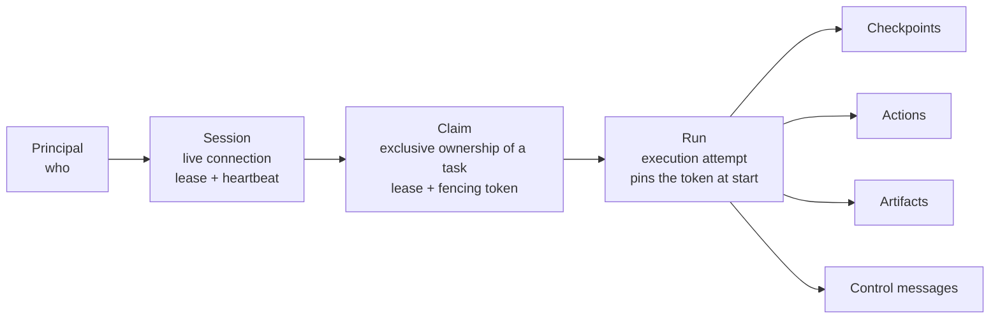
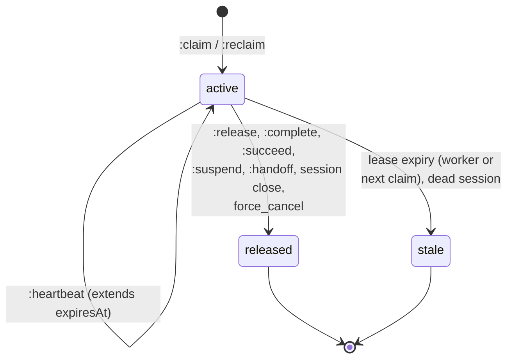
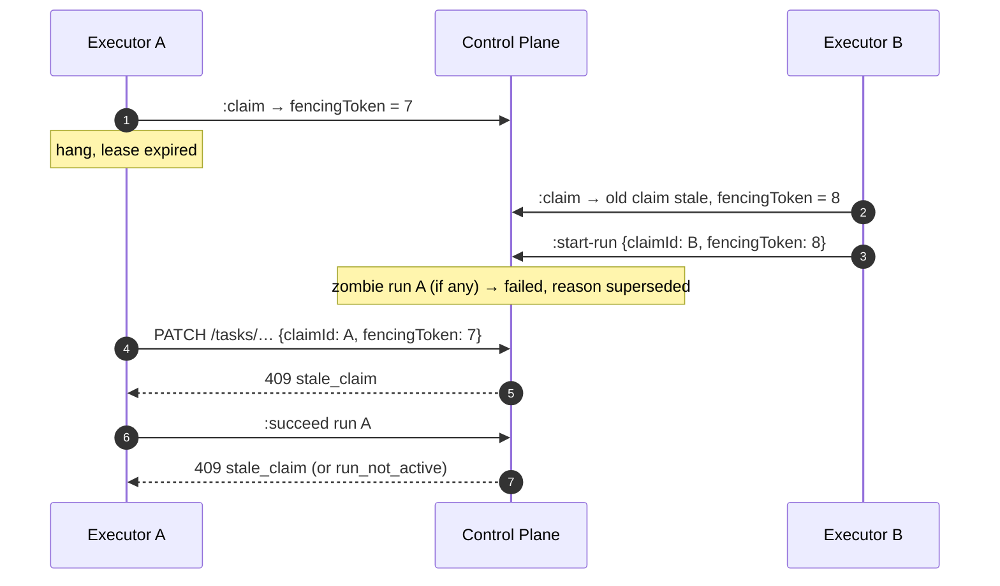
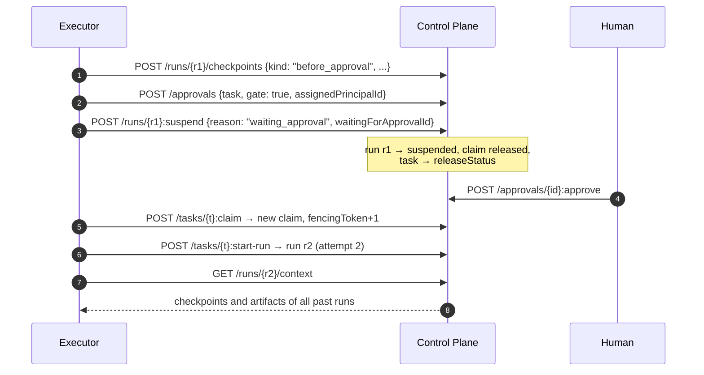
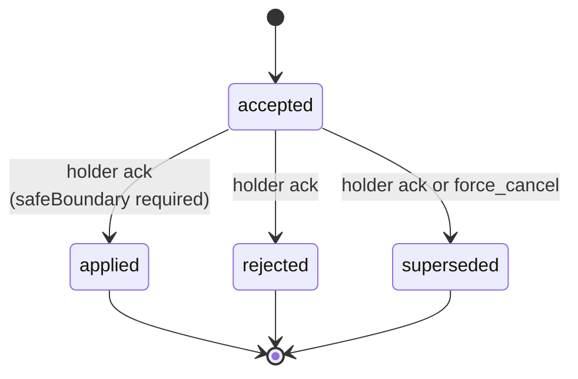

# Execution — claims and runs

This page describes the task execution protocol: sessions, claims with a lease
and a fencing token, runs as execution attempts, checkpoints and the action
log, suspension and resumption, handing work off to a human, child runs, and
control messages. It is for developers of harnesses and runners and for
operators investigating why a task is "stuck".

## Three levels of ownership



- **Session** — a lease on a live client connection. Claims are held by a
  session: when the session closes or expires, its claims lose force.
- **Claim** — the exclusive right to write to a task. A task has at most one
  active claim at a time (a partial unique index in the database).
- **Run** — one execution attempt under a claim. A task has at most one
  `running` run at a time. A task can have many runs (the attempt number is
  `attempt`).

## Session

```bash
curl -s -X POST "$CP/sessions" \
  -H "Authorization: Bearer $TOKEN" -H "Content-Type: application/json" \
  -d '{
    "clientName": "my-runner",
    "clientVersion": "1.4.0",
    "ttlSeconds": 300,
    "harness": {"type": "autonomous-agent", "protocolVersion": "2",
                "capabilities": ["checkpoints", "resume"]}
  }'
```

| Operation | Path | Who |
|---|---|---|
| Open | `POST /sessions` | `sessions.open` |
| Extend | `POST /sessions/{id}:heartbeat` `{ttlSeconds?}` | Owner or `sessions.manage` |
| Close | `POST /sessions/{id}:close` | Owner or `sessions.manage`; releases all claims of the session (`reason: session_closed`) |

Registering a harness in the `harness` block and its semantics are described in
the [Harness protocol](harness-protocol.md).

## Claim

### Claiming

```bash
curl -s -X POST "$CP/tasks/TASK-000123:claim" \
  -H "Authorization: Bearer $TOKEN" -H "Content-Type: application/json" \
  -H "Idempotency-Key: $(uuidgen)" \
  -d '{"sessionId": "<session-id>", "ttlSeconds": 600, "intent": "implement"}'
```

```json
{
  "id": "<claim-id>",
  "taskId": "…",
  "sessionId": "<session-id>",
  "holderId": "<principal-id>",
  "status": "active",
  "fencingToken": 7,
  "intent": "implement",
  "acquiredAt": "…", "heartbeatAt": "…", "expiresAt": "…",
  "releasedAt": null, "releaseReason": null
}
```

A claim is allowed only if all of the following conditions hold at once:

| Condition | Check | Rejection |
|---|---|---|
| API permission | `tasks.claim` (in PDP mode — on the `task:<id>` resource) | `403 permission_denied` |
| Eligibility | The session's principal meets all task requirements (roles, capabilities, skills) | `403 not_eligible` |
| Readiness | All `blocks` / `depends_on` prerequisites are in `terminal_success` | `409 task_not_ready` (`details.blockedBy`) |
| Gate | No pending gate approval | `409 approval_required` (`details.pendingApprovals`) |
| Concurrency | No live claim of another holder | `409 task_already_claimed` |

In addition, the task must not be terminal (`422 task_not_claimable`), and the
session must belong to the caller (`403 session_owner_mismatch`), be active
(`409 session_not_active`), and not be expired (`409 session_expired`).

### Claim algorithm

A claim runs in a single transaction under a lock on the task row:

1. a share lock on the session (before the task lock — the order is session → task);
2. `SELECT … FOR UPDATE` on the task;
3. check terminality, eligibility, readiness, and the gate;
4. if there is an active claim: live — `409 task_already_claimed`; expired or
   with a dead session — it is moved to `stale`, event `claim.expired`
   (`reason: expired` or `session_inactive`);
5. `claim_epoch += 1`; a new claim with `fencingToken = claim_epoch`;
6. `activeClaimId` points to the new claim;
7. the task moves to the type's `claimStatus` if the edge is declared
   (see [Task types](task-types.md));
8. `version += 1`, event `task.claimed`, commit.

Requisitioning an expired claim does not depend on the worker: the claim
command itself does it.

### Claim states



| Status | Meaning |
|---|---|
| `active` | In effect; live only if `expiresAt` is in the future **and** the session is active and not expired |
| `released` | Released normally; `releaseReason` — `released`, `completed`, `session_closed`, `waiting_approval`, `human_harness_handoff`, `force_cancel`, and so on |
| `stale` | Lost by lease; `releaseReason` — `expired` or `session_inactive` |

### Lease and heartbeat

| Parameter | Variable | Default |
|---|---|---|
| Claim TTL | `CP_CLAIM_TTL_SECONDS` | 300 s |
| Allowed claim `ttlSeconds` | `CP_CLAIM_TTL_MIN_SECONDS` … `CP_CLAIM_TTL_MAX_SECONDS` | 10 … 3600 s |
| Session TTL | `CP_SESSION_TTL_SECONDS` | 300 s |
| Allowed session `ttlSeconds` | `CP_SESSION_TTL_MIN_SECONDS` … `CP_SESSION_TTL_MAX_SECONDS` | 10 … 3600 s |

`ttlSeconds` out of bounds — `422 invalid_ttl` (the value is not clamped).

```bash
curl -s -X POST "$CP/claims/<claim-id>:heartbeat" \
  -H "Authorization: Bearer $TOKEN" -H "Content-Type: application/json" \
  -d '{"ttlSeconds": 600}'
```

A claim heartbeat extends the lease by `ttlSeconds` from now and is rejected if
the claim is no longer active (`409 claim_not_active`), has expired
(`409 claim_expired`), or the holder's session is dead (`409 session_not_active`).

!!! tip "Extend both leases"
    A claim is alive only while its session is alive. The executor must
    regularly extend **both** the session **and** the claim, with a margin,
    for example every TTL/3.

Expiry is handled by three independent paths; correctness does not depend on
any one of them alone:

1. **lazily** — a command that encounters an expired lease rejects the operation;
2. **on claim** — a new claim requisitions the expired one atomically;
3. **in the background** — a worker moves expired sessions and claims to
   `stale` with the events `session.expired` / `claim.expired` and returns the
   task to `releaseStatus`.

### Release and reclaim

```bash
# Release your own claim (idempotent)
curl -s -X POST "$CP/claims/<claim-id>:release" \
  -H "Authorization: Bearer $TOKEN" -H "Content-Type: application/json" \
  -d '{"reason": "released"}'

# Take over an expired claim (new fencing token)
curl -s -X POST "$CP/claims/<claim-id>:reclaim" \
  -H "Authorization: Bearer $TOKEN" -H "Content-Type: application/json" \
  -d '{"sessionId": "<session-id>"}'
```

`:release` is available to the holder or to a principal with `claims.manage`;
the task moves to the type's `releaseStatus` if the edge is declared.
`:reclaim` requires `tasks.claim` and works only for an expired claim or a
claim with a dead session — a live one returns `409 claim_not_expired`.

List and details: `GET /claims?taskId=&sessionId=&status=`,
`GET /claims/{id}` (`tasks.read`).

## Fencing token

The fencing token protects a task from a "zombie" — an executor that lost its
lease (hung, lost the network) and then woke up and keeps writing.



The task's `claim_epoch` grows with every claim, and the claim token equals the
epoch at the moment of the claim. While the task has a **live** claim, any task
mutation (`PATCH`, `:complete`) must present `claimId` and `fencingToken`:

| Situation | Response |
|---|---|
| A live claim exists, `claimId` not passed | `409 task_claimed` (`details` holds the id and expiry of the current claim) |
| `claimId` passed, but there is no live claim | `409 stale_claim` |
| `claimId` does not match `activeClaimId`, or the token is not passed | `409 stale_claim` |
| The token does not equal the claim token or the current epoch | `409 stale_claim` (`presentedFencingToken`, `currentClaimEpoch`) |
| The claim belongs to another principal | `403 claim_holder_mismatch` |

A claim with a dead session does not protect the task: a write without
`claimId` goes through, and the claim itself is reaped by the next claim or
the worker.

!!! danger "Got `stale_claim` — stop"
    `409 stale_claim` means ownership is lost and another executor may
    already own the task. Do not retry the write: re-read the context
    (`GET /harness/context`, `GET /tasks/{ref}`) and start over with a claim.
    You can still honestly record the failure of your run (`:fail`).

## Run

### Run states


All statuses except `running` are **terminal for this run**. This includes
`suspended`: continuation is a new claim and a new run that reads the
checkpoints of the previous ones.

### Start

```bash
curl -s -X POST "$CP/tasks/TASK-000123:start-run" \
  -H "Authorization: Bearer $TOKEN" -H "Content-Type: application/json" \
  -H "Idempotency-Key: $(uuidgen)" \
  -d '{
    "claimId": "<claim-id>",
    "fencingToken": 7,
    "input": {"goal": "…"},
    "maxDurationSeconds": 3600,
    "maxActions": 200
  }'
```

- Requires `tasks.claim` and a live claim of the caller with the correct token.
- A terminal task — `422 task_not_runnable`.
- There is already a `running` run under the same claim — `409 run_already_active`.
- A `running` run from a **previous** epoch (a zombie) is moved to `failed`
  with `failureReason: superseded` in the same transaction.
- `attempt` = number of runs of the task + 1; the run pins the claim's
  `fencingToken`.
- An executor whose principal is linked to an agent passes `agentRevisionId`,
  the revision of its agent it works by (CP-ADR-0073). Without the field —
  `422 agent_revision_required`; a revision of another agent, or the field from
  a principal without an agent — `422 agent_revision_mismatch`. The revision is
  checked before the task is locked and before the claim is checked. The server
  records it on the run (`agentRevisionId` in the response and in the
  `run.started` event); the executor reads its current revision through
  `GET /agents/me` (see [Agent revision on a run](harness-protocol.md#agent-revision)).
- If the task was launched by a parent run, the child handle is bound in the
  same transaction.

Budget: `maxDurationSeconds` and `maxActions` (positive, otherwise
`422 invalid_budget`). Exceeding it rejects new checkpoints and actions with
`409 budget_exceeded`.

### Finishing a run

| Action | Path | Who | What it does |
|---|---|---|---|
| Success | `POST /runs/{id}:succeed` `{output?, completeTask=true}` | Run owner, `tasks.claim`, live claim | Run → `succeeded`; with `completeTask: true` atomically completes the task (the claim is released, the task → `completionStatus`); with `false` the claim remains |
| Failure | `POST /runs/{id}:fail` `{failureReason, output?}` | Run owner or `claims.manage` | Run → `failed`; does **not touch** the task or the claim |
| Cancellation | `POST /runs/{id}:cancel` `{reason}` | Run owner or `claims.manage` | Run → `cancelled`; does not touch the task or the claim |
| Suspension | `POST /runs/{id}:suspend` `{reason, waitingForApprovalId?}` | Owner with a live claim | Run → `suspended`, the claim is released |
| Handoff to a human | `POST /runs/{id}:handoff` | Owner with a live claim | See below |

`:fail` and `:cancel` do not require fencing: an executor that lost its lease
can still honestly record the outcome of its attempt. `:succeed`, in contrast,
re-checks fencing under the task lock: a zombie gets `409 stale_claim` and
writes nothing. Someone else's run — `403 run_holder_mismatch`; a run not in
`running` — `409 run_not_active`.

`:succeed` with `completeTask: true` additionally checks the same things as
`:complete`: the task is not completed (`409 task_already_completed`), not
cancelled (`422 task_cancelled`), there is no gate (`409 approval_required`),
and the edge to `completionStatus` is declared (`422 invalid_transition`).

!!! note "`:complete` with an active run"
    `POST /tasks/{ref}:complete` with a live claim under which a run is going
    returns `409 run_in_progress`: finish through `:succeed`, `:fail`, or
    `:cancel`. A zombie run of a previous epoch is moved to `failed`
    (`superseded`) on `:complete`.

### Checkpoints

A checkpoint is explicit operational state for restart and resumption: what is
done, what is next, where the result is. It is not hidden model reasoning and
not chat history.

```bash
curl -s -X POST "$CP/runs/<run-id>/checkpoints" \
  -H "Authorization: Bearer $TOKEN" -H "Content-Type: application/json" \
  -d '{"kind": "progress", "data": {"step": 3, "done": ["schema", "api"], "next": ["tests"]}}'
```

- Only the run owner with a live claim can write (`tasks.claim`).
- `seq` is allocated under the run lock — a gapless sequence.
- `GET /runs/{id}/checkpoints` — by `seq`, oldest first; without `limit` and
  `cursor` — the whole log as a single page.
- The `run.checkpointed` event carries only references (`checkpointId`, `seq`,
  `kind`); checkpoint data does not go into the event log.

### Actions — the action log

Run actions are a lightweight execution audit (a tool call started / finished /
failed), stored **outside** the event log.

```bash
# Single-phase record
curl -s -X POST "$CP/runs/<run-id>/actions" \
  -H "Authorization: Bearer $TOKEN" -H "Content-Type: application/json" \
  -d '{"action": "tool.Bash", "status": "completed", "metadata": {"summary": "make test"}}'

# Two-phase: started → :finish
curl -s -X POST "$CP/runs/<run-id>/actions/<action-id>:finish" \
  -H "Authorization: Bearer $TOKEN" -H "Content-Type: application/json" \
  -d '{"status": "failed"}'
```

- Statuses: `started`, `completed`, `failed`; finishing again —
  `409 action_already_finished`.
- `skill` (UUID, `name`, or `name@version`) is checked against the run's
  effective tool policy: outside the policy — `403 tool_not_authorized`.
- The `maxActions` and `maxDurationSeconds` budget → `409 budget_exceeded`.
- After an applied cooperative cancel, new actions are rejected:
  `409 run_cancel_requested`.
- Tool inputs and outputs are not stored in actions — only references and
  small metadata. The full feed is in the `transcript` artifact
  (see [Run trace](../runner/trace.md)).

## Suspension and resumption

A long wait (an approval decision, external input) must not hold an exclusive
lease. So waiting is a **run finish** with the `suspended` status and the claim
released, and continuation is a new claim and a new run.



`waitingForApprovalId` is stored in the run's `metadata` and in the
`run.suspended` event. While the gate is undecided, a new claim is rejected
with `409 approval_required`. The full protocol for recovery after a restart is
in the [Harness protocol](harness-protocol.md).

## Handing work off to a human (handoff)

`POST /runs/{id}:handoff` in a single transaction:

1. writes a checkpoint `kind: "handoff"`;
2. moves the run to `suspended` (`metadata.suspendReason`,
   `metadata.handoffCheckpointId`);
3. releases the claim, the task → `releaseStatus`;
4. writes the events `run.checkpointed`, `run.suspended`, `claim.released`,
   `run.handoff_prepared`.

```bash
curl -s -X POST "$CP/runs/<run-id>:handoff" \
  -H "Authorization: Bearer $TOKEN" -H "Content-Type: application/json" \
  -H "Idempotency-Key: $(uuidgen)" \
  -d '{
    "reason": "human_harness_handoff",
    "checkpoint": {
      "kind": "handoff",
      "data": {
        "summary": "Schema and API are done; edge cases still need test coverage",
        "nextSteps": ["Add tests for empty input", "Check the migration on a database copy"],
        "evidenceRefs": ["artifact:<artifact-id>"]
      }
    }
  }'
```

The response contains `run`, `task`, `checkpoint`, `eventCursor`, and a hint:

```json
{"resume": {"taskId": "…", "previousRunId": "…", "nextAction": "claim_and_start_new_run"}}
```

Only `human_harness_handoff` is allowed as `reason`, and only `handoff` as
`kind`; `summary` is up to 10,000 characters, `nextSteps` and `evidenceRefs` up
to 100 items. The data is checked for secrets, transcripts, and local machine
paths (`422 unsafe_handoff_payload`). Use an `Idempotency-Key`: a repeat after
an ambiguous response returns the same checkpoint and cursor.

## Run control messages

Active Turn Control is a durable queue of control intents for a live run,
stored in PostgreSQL rather than in harness memory: a "stop" or "change
course" command survives an executor restart.

| `operation` | `directive` | Permission | Purpose |
|---|---|---|---|
| `queue` | required | `tasks.write` | Add an instruction to the queue |
| `steer` | required | `tasks.write` | Correct the current course |
| `redirect` | required | `tasks.write` | Change the goal of the turn |
| `request_cancel` | forbidden | `tasks.write` | Cooperative stop |
| `force_cancel` | forbidden, `reason` required | `claims.manage` | Immediate stop by the server |

```bash
curl -s -X POST "$CP/runs/<run-id>/control-messages" \
  -H "Authorization: Bearer $TOKEN" -H "Content-Type: application/json" \
  -H "Idempotency-Key: $(uuidgen)" \
  -d '{"operation": "steer", "causalPosition": "turn:12",
       "directive": "Fix the failing test first, then refactor",
       "expectedRunVersion": 5}'
```

- `Idempotency-Key` (1–200 characters) and `expectedRunVersion` are required;
  a version mismatch — `409 run_version_conflict`.
- `directive` and `reason` are checked for credential-like strings and
  absolute local paths (`422 unsafe_control_payload`).
- `GET /runs/{id}/control-messages` — a feed with a cursor (50 by default,
  200 maximum).



Acknowledgement is `POST /runs/{id}/control-messages/{mid}:acknowledge` by the
holder of the live claim with `claimId`, `fencingToken`, `expectedRunVersion`,
and `expectedMessageVersion`. Messages are acknowledged strictly in order
(`409 control_message_out_of_order`); a repeat — `409 control_message_terminal`.

- An applied `request_cancel` forbids new actions of the run
  (`409 run_cancel_requested`) and cascades cooperative cancellation to child
  runs with the `cascade_cooperative` policy. The executor records the final
  stop with `:cancel` or `:fail`.
- `force_cancel` in a single transaction moves the run to `cancelled`, releases
  the claim, marks earlier `accepted` messages `superseded`, and cascades
  cancellation to the active runs of descendants by `spawned_by` relations —
  regardless of their cancellation policy. Stopping the process itself is the
  responsibility of the execution environment.
- A simplified form of cooperative cancellation is `POST /runs/{id}:request-cancel`
  (`tasks.write` or `claims.manage`, idempotent): it sets `cancelRequestedAt`
  and writes `run.cancel_requested`.

The `directive` and `reason` texts are not copied into the event log — the
`run.control_message.*` events carry only identifiers, `seq`, the operation,
the status, `causalPosition`, and `safeBoundary`.

## Child runs

A run can launch child work through a durable handle: the child task, the
`spawned_by` relation, and the handle are created in a single transaction.

```bash
curl -s -X POST "$CP/runs/<parent-run-id>/child-handles" \
  -H "Authorization: Bearer $TOKEN" -H "Content-Type: application/json" \
  -H "Idempotency-Key: $(uuidgen)" \
  -d '{
    "correlationId": "split-tests-1",
    "title": "Run the module integration tests",
    "grant": {"permissions": ["tasks.read", "tasks.claim", "artifacts.write"]},
    "cancellationPolicy": "cascade_cooperative",
    "expiresInSeconds": 86400
  }'
```

| Property | Rule |
|---|---|
| Who launches | The owner of the live claim of the parent run; `tasks.claim` + `tasks.write`; `Idempotency-Key` is required |
| Idempotency | Uniqueness of `(parentRunId, correlationId)`: a repeat returns `200` with the same handle, a new one — `201` |
| `handleToken` | An opaque locator, returned **once**; not a credential — access is still checked |
| Permission ceiling (`grant`) | The intersection of what is requested with what the parent can do; down the tree the ceiling only narrows. A missing field is inherited, `[]` grants nothing |
| Depth | At most 8 levels |
| Lifetime | 7 days by default, 90 maximum |
| Cancellation policy | `cascade_cooperative` (the default) or `detach` |
| Result | Bounded: summary up to 2,000 characters, up to 50 artifact references, data up to 16 KiB; hashed |

Any suitable executor claims the child task; the handle learns its run at
`:start-run`. The handle status is **not stored**; it is derived from the child
task and run on every read: `pending`, `running`, `suspended`, `succeeded`,
`failed`, `cancelled`, `revoked`, `expired`.

- `GET /runs/{id}/child-handles?active=true` — the parent's handles;
- `GET /child-handles/{idOrToken}` — status and bounded result;
- `POST /child-handles/{id}:revoke` `{reason, cancelChild}` — revocation
  (the holder of the parent run or `claims.manage`).

The events `run.child.launched|started|resolved|revoked|cancel_requested`
carry identifiers, `correlationId`, the outcome, and the result hash — without
the titles, summary, or data of the child work.

## Discovery and diagnostics

### What work can be claimed

```bash
curl -s "$CP/work/available?assignedToMe=true&limit=20" -H "Authorization: Bearer $TOKEN"
```

`GET /work/available` (`tasks.read`) returns the tasks the caller can claim
right now: non-terminal, eligible, ready, without a live claim, and without a
gate. Parameters: `workspaceId`, `includeDescendants`, `projectId`,
`includeSubprojects`, `assigneeId`, `assignedToMe` (overrides `assigneeId`),
`limit`, `cursor`. A page can be shorter than `limit` with a non-empty
`nextCursor`. The listing is advisory — only the claim is authoritative.

### Why a task cannot be claimed

```bash
curl -s "$CP/tasks/TASK-000123/claimability" -H "Authorization: Bearer $TOKEN"
```

```json
{
  "taskId": "…",
  "publicId": "TASK-000123",
  "claimable": false,
  "reasons": [
    {"code": "task_not_ready", "blockedBy": [
      {"taskId": "…", "publicId": "TASK-000120", "status": "in_progress", "systemStatusCategory": "active"}
    ]},
    {"code": "approval_required", "pendingApprovals": [{"approvalId": "…", "requestedBy": "…"}]}
  ]
}
```

Possible codes: `task_not_claimable`, `task_already_claimed`,
`task_not_ready`, `approval_required`, `not_eligible`. The diagnostics take no
locks — it is only a hint.

### Executor context

- `GET /harness/context` — self-context: identity, active sessions, claims and
  runs, roles, skills, pending approvals, the event log cursor.
- `GET /runs/{id}/context` — Run Context: the task, claim, requirements,
  artifacts and checkpoints of **all past runs** of the task, skills, cursor.

Both are described in [Task context and memory](context.md).

## Execution error codes

| Code | HTTP | When |
|---|---|---|
| `task_already_claimed` | 409 | The task has a live claim of another holder |
| `task_not_ready` | 409 | Unfinished prerequisites |
| `approval_required` | 409 | A pending gate approval blocks claim / complete |
| `task_not_claimable` | 422 | The task is terminal |
| `not_eligible` | 403 | Task requirements are not met |
| `task_claimed` | 409 | A mutation without `claimId` while a live claim exists |
| `stale_claim` | 409 | The presented claim or token is stale |
| `claim_holder_mismatch` | 403 | The claim belongs to another principal |
| `claim_not_active`, `claim_expired`, `claim_not_expired` | 409 | Operations on the claim lease |
| `session_not_active`, `session_expired`, `session_owner_mismatch` | 409 / 403 | Session problems |
| `invalid_ttl` | 422 | `ttlSeconds` out of bounds |
| `run_already_active` | 409 | A run is already going under this claim |
| `run_not_active` | 409 | The run is no longer `running` |
| `run_holder_mismatch` | 403 | The run belongs to another principal |
| `run_in_progress` | 409 | `:complete` with an active run |
| `task_not_runnable` | 422 | `:start-run` on a terminal task |
| `agent_revision_required`, `agent_revision_mismatch` | 422 | `:start-run` without a revision of its own agent or with another agent's revision |
| `budget_exceeded` | 409 | The run budget is exhausted |
| `run_cancel_requested` | 409 | New actions after an applied cancellation |
| `invalid_handoff`, `unsafe_handoff_payload` | 422 | Invalid handoff |

The full reference is [Error codes](../reference/errors.md).

## Common problems

| Symptom | Cause | What to do |
|---|---|---|
| The task "hangs" in `in_progress`, nobody is working | The claim expired, but the worker is not running, and nobody tried to claim the task | Check `control-plane-worker`; the next `:claim` requisitions the claim itself |
| `409 task_already_claimed` for the same executor after a restart | The previous claim is still alive (the lease has not expired, the session is active) | Close the old session (`:close`) or wait for expiry; then claim again |
| The run stays `running` after the claim expires | The worker releases the claim but does not touch the run | A new `:start-run` under a new claim moves it to `failed` (`superseded`); the owner can call `:fail` |
| `409 stale_claim` on `:succeed` | The lease is lost; someone else owns the task | Stop writing, record `:fail`, re-read the context |
| `409 approval_required` on `:succeed` | A gate is pending on the task | `:suspend` with `waitingForApprovalId`, continue after the decision with a new run |

## See also

- [Harness protocol](harness-protocol.md) — registration, recovery, manifest.
- [Approvals](approvals.md) — gate and decision outcomes.
- [Task types and statuses](task-types.md) — `claimStatus`, `releaseStatus`, `completionStatus`.
- [Artifacts and comments](artifacts.md)
- [Execution diagnostics](../troubleshooting/runner.md)
