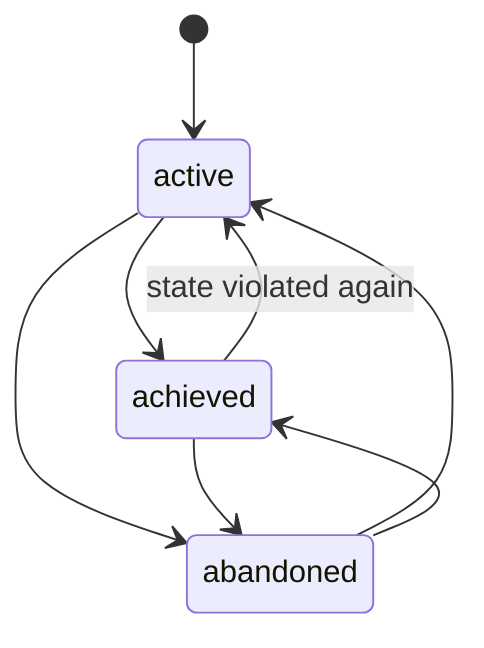
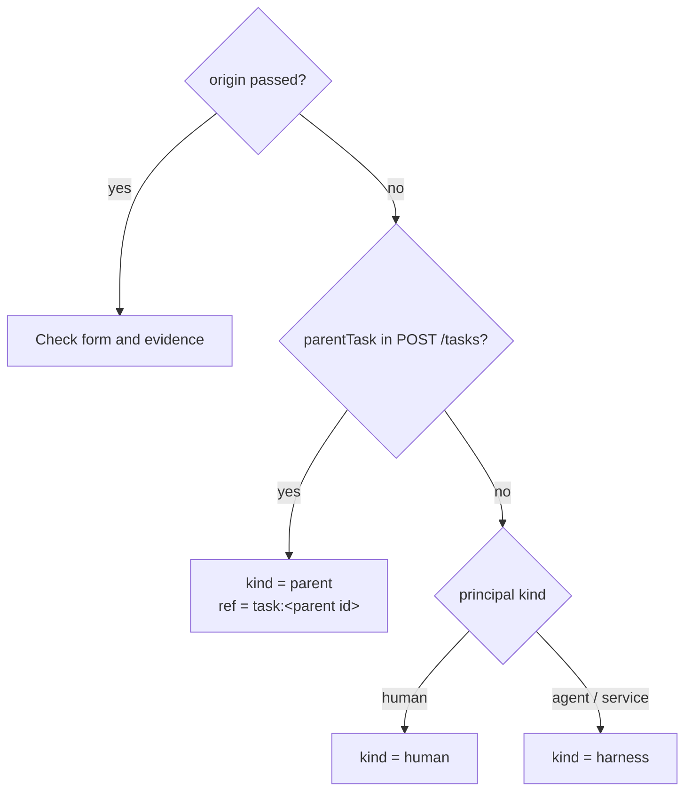
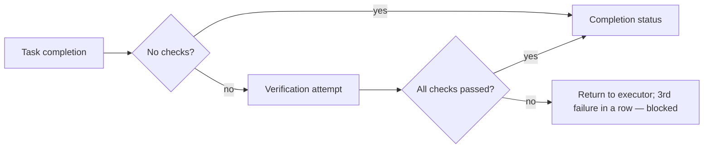

# Goals, acceptance, and evidence

The work graph answers three questions that a regular task does not:
**why** the work is done (Goal), **where** it came from (origin), and **how
to tell that it is done** (acceptance and evidence). This article describes these
entities, their rules, and the API. Rationale: CP-ADR-0062.

!!! warning "Goal is being retired from the core"
    The desired state is now described by a process (TAI-ADR-0055): the goal of
    a case is a process instance with an outcome, a standing goal is a reconciliation process
    (see [Goals as processes](../processes/index.md#goals)). Do not reference `goalId`
    in new descriptions; origin, acceptance, and evidence
    remain.

## Overview

```mermaid
flowchart TB
    G0["Tenant-level Goal<br/>(workspaceId = null)"]
    G1["Goal of workspace A<br/>desiredState, criteria[]"]
    G2["Subgoal of workspace A"]
    T1["Task<br/>origin, acceptance[], evidence[]"]
    T2["Task (subtask)<br/>origin.kind = parent"]
    O["Observation<br/>(log)"]
    AR["Artifact"]
    EX["External system object"]

    G0 --> G1 --> G2
    T1 -- goalId --> G1
    T2 -- goalId --> G2
    T2 -. origin.ref = task:… .-> T1
    T1 -- evidence --> O
    T1 -- evidence --> AR
    T1 -- evidence --> EX
```

| Concept | Where it is stored | Mutability |
|---|---|---|
| Goal | A separate `goals` entity | Title, desired state, criteria, owner, status, parent |
| `origin` | A task field | **Immutable** after creation |
| `createdFrom` | A goal field (same form as origin) | Immutable |
| `acceptance` | A task field: a list of checks | Replaced entirely |
| `criteria` | A goal field: a list of checks of the same form | Replaced entirely |
| `evidence` | A task field: a list of pointers to facts | Replaced entirely |

!!! note "Task checks are executed, goal criteria are not"
    The core **executes** a task's acceptance at the verification stage: a task with
    checks becomes done only after all of them pass
    (see [Verification stage](#verification-stage)). The default criteria of its type
    are added to the task's checks (see [Type
    acceptance](task-types.md#type-acceptance)). The core only stores goal criteria:
    a human or a process moves a goal to `achieved`.

## Goal

A Goal is a product-neutral desired state of something: what exactly
a goal describes is defined by the tenant's data.

| Field | Description |
|---|---|
| `title` | 1–500 characters |
| `desiredState` | Prose up to 10,000 characters; can be empty if the criteria say everything |
| `criteria` | Up to 50 checks in acceptance form (see below) |
| `ownerId` | Owner principal or `null` |
| `workspaceId` | The goal's workspace or `null` — a tenant-level goal. Does not change after creation |
| `parentGoalId` | Parent goal |
| `status` | `active`, `achieved`, `abandoned` |
| `createdFrom` | The goal's origin (origin form); defaults to `human` or `harness` depending on the principal kind |
| `version` | For `If-Match: "goal-<version>"` |
| `closedAt` | Set exactly when the status is not `active` (enforced by a CHECK in the database) |

### Goal statuses

A goal is not a work item: it has no claim, run, or type lifecycle. The statuses are
a fixed vocabulary, and transitions are allowed in any direction.



`achieved → active` is a normal scenario: a state can stop being
true, and the work that restores it belongs to the same goal.

### Goal hierarchy

- The parent is a goal of the same workspace or a tenant-level goal. A tenant-level
  goal can be the parent of any goal, a workspace goal only of goals of
  the same workspace; a tenant-level goal cannot sit under a workspace
  goal. A violation — `422 goal_workspace_mismatch`.
- A cycle — `422 goal_cycle`; the hierarchy depth is at most 32
  (`422 goal_too_deep`).
- A parent the writer cannot read (`goals.read`) returns
  `404 not_found`, like a nonexistent one: you cannot learn about
  goals of another workspace from differences in responses.

### Goals API

```bash
# Create a goal
curl -s -X POST "$CP/goals" \
  -H "Authorization: Bearer $TOKEN" -H "Content-Type: application/json" \
  -d '{
    "title": "API response time within SLO",
    "desiredState": "p95 latency of the public API below 300 ms over the last 7 days",
    "workspaceId": "<workspace-id>",
    "ownerId": "<principal-id>",
    "criteria": [
      {"key": "p95", "kind": "external_state",
       "description": "p95 < 300 ms according to monitoring data",
       "spec": {"metric": "http_request_duration_p95", "threshold_ms": 300}}
    ]
  }'

# Close a goal
curl -s -X PATCH "$CP/goals/<goal-id>" \
  -H "Authorization: Bearer $TOKEN" -H "Content-Type: application/json" \
  -H 'If-Match: "goal-1"' \
  -d '{"status": "achieved"}'

# Work of the goal together with subgoals, unfinished only
curl -s "$CP/goals/<goal-id>/work?includeSubgoals=true&systemStatusCategory=active" \
  -H "Authorization: Bearer $TOKEN"
```

| Method | Path | Permissions | Notes |
|---|---|---|---|
| `POST` | `/goals` | `goals.write` | `201` |
| `GET` | `/goals?status=&workspaceId=&ownerId=&parentGoalId=` | `goals.read` | Pagination |
| `GET` | `/goals/{id}` | `goals.read` | `ETag: "goal-<v>"` |
| `PATCH` | `/goals/{id}` | `goals.write` | `If-Match`; `ownerId: null` / `parentGoalId: null` remove the value |
| `GET` | `/goals/{id}/work` | `goals.read` + `tasks.read` | Tasks of the goal, newest first; `?includeSubgoals=&systemStatusCategory=&limit=&cursor=` |

A PATCH that repeats the current values is not considered a change: the goal
is returned as is, without a new version and without an event. An empty PATCH is
`422 empty_update`.

!!! note "Permissions are resolved on the goal's workspace"
    `goals.read` and `goals.write` are separate from `tasks.*`: a goal is what the tenant
    wants to consider true, and the permission to create work does not grant the permission to
    redefine it. Both permissions are checked on the goal's workspace (a tenant-level goal —
    on the tenant). `GET /goals/{id}/work` requires both `goals.read`
    and `tasks.read`: a goal does not widen task visibility. Granting permissions
    to agents and the operator is done by bootstrap — see
    [Permissions and scopes](../reference/permissions.md).

## Linking a task to a goal

A task references a goal with the `goalId` field on creation or through `PATCH`.

- The goal must be readable by the writer (`goals.read`) and serve the task's
  workspace — the same workspace or a tenant-level goal. Otherwise `404 not_found`,
  indistinguishable from a nonexistent goal.
- You cannot link to a goal in the `abandoned` status (`422 goal_abandoned`), but
  you can link to an `achieved` one.
- `goalId: null` in PATCH unlinks the task.
- Moving a task to another workspace while leaving it with a goal of the former
  workspace — `422 goal_workspace_mismatch`: you must relink or unlink it
  in the same PATCH.
- Querying a goal's tasks: `GET /tasks?goalId=…` or `GET /goals/{id}/work`.

## Origin — where the work came from

`origin` is a record of the task's origin. It is written once on creation
and **never changes**: there is no `origin` field in `PATCH /tasks`.

```json
{"kind": "rule", "ruleId": "latency-slo-breach", "evidence": [
  {"kind": "observation", "observationId": "<observation-id>"}
]}
```

| `kind` | Meaning | Required |
|---|---|---|
| `human` | Created by a human | — |
| `harness` | Created by an agent or harness in the course of its work | — |
| `rule` | A rule fired on observed facts | `ruleId` and ≥ 1 evidence |
| `parent` | Decomposition of another task | `ref` |
| `process` | A step of a declared process, for example an approval outcome | `ref` |
| `external` | Import from an external system | `ref` |

Rules:

- `ruleId` only for `kind: "rule"` (pattern
  `^[A-Za-z0-9][A-Za-z0-9._:/@-]{0,199}$`); for any other kind it is
  rejected, not ignored;
- `ref` — up to 512 characters; internal references are conventionally written as
  `<entity>:<uuid>` (`task:…`, `approval:…`);
- `origin.evidence` — up to 50 facts; the `check` field is forbidden in them: a fact
  that caused the work to appear cannot confirm a check of work
  that did not exist yet;
- a form violation — `422 invalid_origin`.

### How the core derives origin

If the client did not pass `origin`, the core derives it from **who writes**, not
from the content:



An approval outcome (`ensureWork`) writes `kind: "process"` with
`ref = approval:<id>`.

!!! warning "An explicit ref is a client claim"
    For an explicitly passed origin, the core checks the form and the existence of the evidence
    facts, but **does not check** that the `task:<id>` in `ref` exists and
    actually spawned the work. A trusted `ref` comes only from core derivations:
    `parentTask` and `ensureWork`.

## Acceptance — declared checks { #acceptance }

A task's `acceptance` (and a goal's `criteria`) is a list of checks that distinguish
"done" from "not done". A task type version's `acceptance` has the same form —
criteria that apply to all tasks of the type (see [Type
acceptance](task-types.md#type-acceptance)).

```json
[
  {"key": "amount-matches", "kind": "deterministic",
   "description": "The payment order amount matches the invoice",
   "spec": {"skill": "invoice.amount_match@1",
            "inputs": {"invoice": "$.task.customFields.invoiceId"},
            "expect": {"status": "ok"}}},
  {"key": "payment-settled", "kind": "external_state",
   "description": "The bank confirmed the payment was settled",
   "spec": {"event": "invoice.payment_settled"}},
  {"key": "director-approved", "kind": "human",
   "description": "The finance director approved the payment",
   "spec": {"approverRole": "<role-id>"}}
]
```

| Field | Rule |
|---|---|
| `key` | `^[a-z0-9][a-z0-9._-]{0,62}$`, unique in the list (`422 duplicate_check_key`) |
| `kind` | `deterministic` (a reproducible check), `external_state` (state in another system), `human` (a human judges), `llm_judge` (a model judges by a rubric) |
| `description` | 1–2000 characters |
| `spec` | An object up to 16 KiB following the kind's grammar (table below), scanned for secrets; an invalid one — `422 invalid_acceptance_spec`. For goal criteria, `spec` is not interpreted |
| `when` | Optional: 1–8 paths rooted at `$.task`; the criterion runs only if every path yields a value, otherwise the result is `skipped` (see [below](#when-and-skipped)). Not accepted for goal criteria |

No more than 50 checks. Other violations — `422 invalid_acceptance`. A key
that already exists among the criteria of the task type version is also `422
invalid_acceptance` (`details.field = acceptance[i].key`): a task adds
criteria to the type's criteria but does not replace them.
`PATCH` replaces the list entirely; you cannot delete a check that evidence
still references (`422 unknown_acceptance_check`).

### `spec` grammar by kind

| `kind` | `spec` | When the check passes |
|---|---|---|
| `deterministic` | `{skill: "name@version", inputs?, expect?}` — `inputs` read only `$.task.…`, `expect` contains literals | The skill invocation returned the values from `expect` |
| `deterministic` | `{artifact: {type, mediaTypes?, content?}}` — mutually exclusive with `skill`; `content`: `required` (default) or `optional` | The task has a head revision of an artifact of this type that matches the media type and, if required, has content in storage (see [Inputs and outputs](task-types.md#artifact-schema)) |
| `external_state` | `{}` or `{event: "<observation or event type>"}` | The task's evidence contains a fact with `check` = the check key |
| `human` | `{}`, `{approver: <principal-id>}`, or `{approverRole: <role-id>}` | The task's gate approval is approved |
| `llm_judge` | like `human`, plus `rubric` | Like `human`: a human decides, the rubric is a hint for them |

A deterministic check's skill writes to an external system (`sideEffects:
external_write`) only **after a human decision in the same attempt**: a `human` or `llm_judge`
with the same `when` must come before it in the final list,
otherwise the criterion write is rejected (`422 invalid_acceptance_spec`, `cause:
external_write_without_decision`), and when executed without a passed decision the
criterion fails with `no_decision`. The grounds for the invocation is a counted
gate approval, and the authority is the decider's (details in [External write after
a decision](task-types.md#type-acceptance)). Checks run in the declared
order; the recommended order is `deterministic` → `external_state` → `human`,
with the external write immediately after the decision that authorizes it.

## Verification stage { #verification-stage }

A task with checks does not become done immediately on completion —
`POST /tasks/{ref}:complete`, a successful executor run, or the approval outcome `completeTask`.
The claim is released, the task stays in its status, and
a **verification attempt** opens; while it is in progress, the task cannot be claimed
(claimability reason `verification_pending`), and its dependents are not handed out
(`task_not_ready`): the predecessor is not done yet.

The checks of an attempt are gathered from three sources, in this order:

| Order | Source (`source`) | What it is |
|---|---|---|
| 1 | `output` | Implicit `output.<key>` checks of the type's required outputs (see [Inputs and outputs](task-types.md#artifact-schema)) |
| 2 | `type` | Default criteria of the type version (see [Type acceptance](task-types.md#type-acceptance)) |
| 3 | `task` | The task's own acceptance |
| — | `rule` | The implicit `rule-evidence` check, if a rule closes the task and the type and task criteria are empty |

A task whose three lists are all empty is completed immediately.



The core worker runs the checks in order. Before each one it evaluates its
`when` condition (if any): an unmet condition yields `skipped`, and the attempt
moves on to the next check.

- **`deterministic`** — a skill invocation on behalf of the check; no result within
  `CP_VERIFICATION_SKILL_TIMEOUT_SECONDS` (900 by default) — failure
  `no_result`. An external-write skill is invoked with the authority of whoever decided
  the gate of the nearest passed `human` / `llm_judge` check of this attempt;
  without such a decision — failure `no_decision`;
- **`external_state`** — waits for a fact in the task's evidence (written, for example, by
  a `complete_work` rule), no longer than `CP_VERIFICATION_EXTERNAL_TIMEOUT_SECONDS`
  (86400 by default);
- **`human` / `llm_judge`** — the decision of the task's gate approval. If there is no open
  approval, the core requests one from `approver` / `approverRole`, otherwise from the
  task's owner or assignee — **only if that is a human**; an agent never
  accepts its own work, and if there is no human the check fails
  with `no_approver`. An approval by which an approval outcome closed the task counts
  immediately.

Attempt result:

| Result | What happens |
|---|---|
| All passed or skipped | Completion status, `task.verified` and `task.completed` events, a `verification` artifact; dependent tasks become available; then the post-completion work declared by the type |
| A check failed | A `task.verification_failed` event, a comment with the reasons, the task returns to the release status for the same executor; the third failure in a row — to a status of the `blocked` category |
| Task cancelled | The attempt is `cancelled`, an approval requested by the core is withdrawn |

A repeated completion while an attempt is open does not create a new attempt.

### The `when` condition and the `skipped` result { #when-and-skipped }

```json
{"key": "merge", "kind": "deterministic",
 "description": "The approved commit is merged into the target branch",
 "spec": {"skill": "git.merge@1", "inputs": {"commit": "$.task.artifact[commit].metadata.commit!"},
          "expect": {"merged": true}},
 "when": ["$.task.artifact[commit].metadata.published"]}
```

- An expression is satisfied if its value is not `null`, not `""`, and not `false`;
  the condition is satisfied if all expressions are satisfied.
- The condition is evaluated when the attempt reaches the check,
  with the authority of whoever completed the task; anything they cannot read fails
  the check with an error code.
- An unmet condition gives the result `skipped`, `reason: condition_unmet`,
  `details: {when: <first unmet expression>}`. `skipped` is not counted as a
  failure: an attempt in which checks were skipped passes.
- The value `skipped` appears in the attempt's `results` and in `task.verified.results[].status`.

### Return to the executor and resubmission { #return-to-executor }

An attempt failure — a rejected gate (`approval_rejected`), a skill failure, including
a failed merge, an expired wait — does not create separate rework
tasks. The task returns to its type's `releaseStatus`, the assignment does not
change, and **the same executor** picks it up again. The failure comment
explains the reason.

The platform's executor daemon passes the reason into the next run itself: if
the task's last attempt is `failed`, it reads it (`GET
/tasks/{ref}/verifications?limit=1`) and, after the task description, adds a
**"Last verification findings"** block to the prompt — the attempt number and the result of
each executed criterion, and for a failed one, `reason` and `message`
(the reviewer's decision comment, the reason for the skill failure). Unexecuted
criteria are not listed: they will run on the next submission. The working copy
continues the task branch `task/<publicId>`, so the review sees a new commit on
the same branch (see [Working copies](../runner/execution-workspace.md)).

A resubmission opens a new attempt and requests a **new** human
decision: a gate counts toward a check only if it was decided after the attempt
started. The third failure in a row puts the task in a status of the `blocked` category, and the executor
daemon does not pick it up until a human returns it to work.

### Attempts via the API

```bash
curl -s -H "Authorization: Bearer $TOKEN" \
  https://platform.example.com/api/v1/tasks/<task-ref>/verifications
```

Each attempt: `attempt`, `status` (`running`, `waiting_human`,
`waiting_external`, `passed`, `failed`, `cancelled`), `trigger`, `checks`
(the attempt's checks at the time it opened), `results` (`{key, kind, status,
evidence, reason}` for each executed check; `status` includes
`skipped`), `startedAt`, `finishedAt`. Elements of `checks` and `results` have
a `source` field — `output`, `type`, `task`, or `rule`; attempts opened before
the field appeared do not have it. In the task
response, the `verification` field is a summary of the last attempt: `id`, `status`,
`attempt`, `updatedAt`.

### Closing work with rules

A work rule can close its work **as done** with the
`complete_work` action — when an observation shows that the precondition disappeared because
the work was done. The observation's evidence is written to the task, and the task
goes through the same verification stage; without acceptance — as a single implicit
`external_state` check. `cancel_work` remains for work that is no longer needed.
If an executor is working on the task, the rule asks to stop its run and
applies the decision once, when the claim is released.

## Evidence — pointers to facts

Evidence items are **references**, not copies of facts. Each element names exactly one
fact by its identifier where the fact lives.

| `kind` | Field | Fact |
|---|---|---|
| `observation` | `observationId` | A log observation (`observation.recorded`, including from the log archive) |
| `artifact` | `artifactId` | An artifact |
| `external` | `externalRef: {system, id, url?}` | An object in an external system |

Optional fields: `check` — the key of the acceptance check the fact relates to;
`note` — up to 1000 characters on why the fact matters.

```bash
curl -s -X PATCH "$CP/tasks/TASK-000123" \
  -H "Authorization: Bearer $TOKEN" -H "Content-Type: application/json" \
  -H 'If-Match: "task-7"' \
  -d '{
    "evidence": [
      {"kind": "artifact", "artifactId": "<artifact-id>", "check": "tests",
       "note": "Test run report"},
      {"kind": "external",
       "externalRef": {"system": "git", "id": "<commit-sha>", "url": "https://git.example.com/…"},
       "check": "review"}
    ]
  }'
```

Rules:

- an observation and an artifact must exist **in this tenant**; an unknown
  id and another tenant's id both give the same `404` before any write;
- `check` must be declared in the task's acceptance — both when evidence is written and
  when acceptance is replaced (`422 unknown_acceptance_check`);
- the same fact for the same check twice —
  `422 duplicate_evidence`;
- up to 200 elements per task; other violations — `422 invalid_evidence`.

!!! tip "Evidence and a live claim"
    Evidence is changed with a regular `PATCH /tasks/{ref}`, so with a live claim
    the request must carry `claimId` and `fencingToken`. An executor usually
    appends evidence before `:succeed`.

## What goes into the log and memory

The event log is read more widely than the task itself, so only
references and counters go into it:

| Event | What it contains |
|---|---|
| `goal.created` | `title`, `status`, `workspaceId`, `ownerId`, `parentGoalId`, `criteriaCount`, a `createdFrom` summary |
| `goal.updated` | `changes` (`desired_state` → `true`, `criteria` → a number), `fromStatus`/`status` on a status change, `version` |
| `task.created` | `goalId`, an `origin` summary (kind, ref, ruleId, and fact ids — without `note` and `url`), `acceptanceChecks` |
| `task.updated` | `acceptance` and `evidence` in `changes` — element counts |

The goal's desired state and the checks' `spec` do not go into the log or memory.
Context Adapter moves `goalId` and `origin` from `task.created` and
both goal events into memory (see [Task context and memory](context.md)).

## SDK and MCP

- SDK client: `create_goal`, `list_goals`, `get_goal`, `update_goal`,
  `list_goal_work`; `create_task` / `update_task` / `list_tasks` accept
  `goal_id`, `origin` (only on creation), `acceptance`, `evidence`.
- MCP: `cp_create_goal`, `cp_update_goal` (mutating; including closing
  a goal with the status `achieved` / `abandoned`, `clear_owner` / `clear_parent`),
  `cp_list_goals`, `cp_get_goal` (read-only; together with the first page of
  the goal's work), fields on `cp_create_task` / `cp_update_task` (`clear_goal`
  unlinks).

For details, see [CLI and MCP server](cli-and-mcp.md).

## Common problems

| Symptom | Cause |
|---|---|
| `404` when linking a task to an existing goal | The writer lacks `goals.read` on the goal's workspace, or the goal belongs to a different workspace |
| `403` on any goal operation | The credential lacks `goals.read` / `goals.write` — grant the permissions |
| `422 goal_workspace_mismatch` when moving a task | The task stays with a goal of the former workspace; specify `goalId` or `goalId: null` in the same PATCH |
| `422 unknown_acceptance_check` when replacing acceptance | The task's evidence references the check being removed; replace evidence in the same request |
| `400 invalid_request` with `origin` in PATCH | Origin is immutable |
| `422 invalid_acceptance` on a task criterion key | This key already exists among the task type's criteria — choose another |
| A check failed with `no_decision` | An external write without a passed human decision in this attempt |
| The task returned to the executor after approval | The approval passed, but the next check (for example, the merge) failed — the reason is in the comment and in the "Last verification findings" block |

## See also

- [Work model](work-model.md)
- [Task types and statuses](task-types.md#type-acceptance) — type acceptance criteria.
- [Work rules](work-rules.md) — `complete_work` and rule evidence.
- [Approvals](approvals.md) — `ensureWork` and `origin.kind = process`.
- [Artifacts and comments](artifacts.md) — facts for evidence.
- [Events](events.md)
