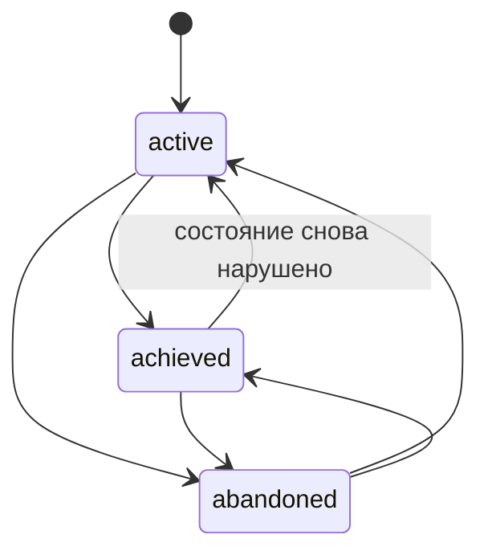
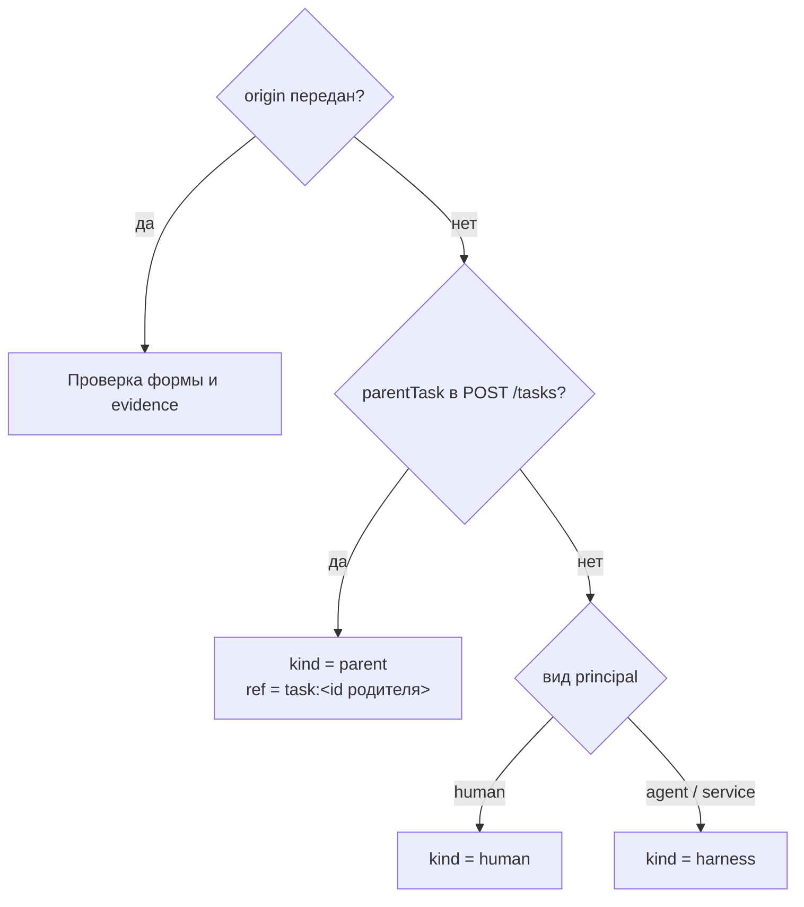
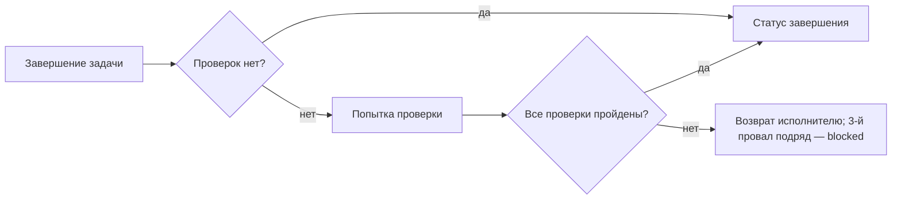

# Цели, приёмка и evidence

Граф работы отвечает на три вопроса, на которые обычная задача не отвечает:
**зачем** работа делается (Goal), **откуда** она взялась (origin) и **как
понять, что сделано** (acceptance и evidence). Статья описывает эти
сущности, их правила и API. Обоснование — CP-ADR-0062.

!!! warning "Goal выводится из ядра"
    Желаемое состояние теперь описывается процессом (TAI-ADR-0055): цель
    дела — экземпляр процесса с исходом, постоянная цель — процесс-сверка
    (см. [Цели как процессы](../processes/index.md#goals)). В новых
    описаниях не ссылайтесь на `goalId`; происхождение, приёмка и evidence
    остаются.

## Обзор

```mermaid
flowchart TB
    G0["Goal уровня tenant'а<br/>(workspaceId = null)"]
    G1["Goal воркспейса A<br/>desiredState, criteria[]"]
    G2["Подцель воркспейса A"]
    T1["Task<br/>origin, acceptance[], evidence[]"]
    T2["Task (подзадача)<br/>origin.kind = parent"]
    O["Observation<br/>(журнал)"]
    AR["Artifact"]
    EX["Объект внешней системы"]

    G0 --> G1 --> G2
    T1 -- goalId --> G1
    T2 -- goalId --> G2
    T2 -. origin.ref = task:… .-> T1
    T1 -- evidence --> O
    T1 -- evidence --> AR
    T1 -- evidence --> EX
```

| Понятие | Где хранится | Изменяемость |
|---|---|---|
| Goal | Отдельная сущность `goals` | Заголовок, желаемое состояние, критерии, владелец, статус, родитель |
| `origin` | Поле задачи | **Неизменяемо** после создания |
| `createdFrom` | Поле цели (та же форма, что origin) | Неизменяемо |
| `acceptance` | Поле задачи: список проверок | Заменяется целиком |
| `criteria` | Поле цели: список проверок той же формы | Заменяется целиком |
| `evidence` | Поле задачи: список указателей на факты | Заменяется целиком |

!!! note "Проверки задачи исполняются, критерии цели — нет"
    Acceptance задачи ядро **исполняет** на стадии проверки: задача с
    проверками становится выполненной только после того, как все они пройдены
    (см. [Стадия проверки](#verification-stage)). К проверкам задачи
    добавляются критерии по умолчанию её типа (см. [Приёмка
    типа](task-types.md#type-acceptance)). Критерии цели ядро только
    хранит: цель переводит в `achieved` человек или процесс.

## Goal

Goal — желаемое состояние чего-либо, продуктово-нейтральное: что именно
описывает цель, определяют данные tenant'а.

| Поле | Описание |
|---|---|
| `title` | 1–500 символов |
| `desiredState` | Проза до 10 000 символов; может быть пустой, если всё сказано критериями |
| `criteria` | До 50 проверок в форме acceptance (см. ниже) |
| `ownerId` | Principal-владелец или `null` |
| `workspaceId` | Workspace цели или `null` — цель уровня tenant'а. После создания не меняется |
| `parentGoalId` | Родительская цель |
| `status` | `active`, `achieved`, `abandoned` |
| `createdFrom` | Происхождение цели (форма origin); по умолчанию — `human` или `harness` по виду principal |
| `version` | Для `If-Match: "goal-<version>"` |
| `closedAt` | Задан ровно тогда, когда статус не `active` (закреплено CHECK в базе) |

### Статусы цели

Цель — не work item: у неё нет claim, run и lifecycle типа. Статусы —
фиксированный словарь, переход разрешён в любую сторону.



`achieved → active` — нормальный сценарий: состояние может перестать быть
истинным, и работа, которая его восстанавливает, принадлежит той же цели.

### Иерархия целей

- Родитель — цель того же workspace или цель уровня tenant'а. Цель уровня
  tenant'а может быть родителем любой цели, цель workspace — только целей
  того же workspace; цель уровня tenant'а не может висеть под целью
  workspace. Нарушение — `422 goal_workspace_mismatch`.
- Цикл — `422 goal_cycle`; глубина иерархии не больше 32
  (`422 goal_too_deep`).
- Родитель, которого пишущий не может читать (`goals.read`), отвечает
  `404 not_found`, как несуществующий: по разнице ответов нельзя узнать о
  целях чужого workspace.

### API целей

```bash
# Создать цель
curl -s -X POST "$CP/goals" \
  -H "Authorization: Bearer $TOKEN" -H "Content-Type: application/json" \
  -d '{
    "title": "Время ответа API в пределах SLO",
    "desiredState": "p95 задержки публичного API ниже 300 мс за последние 7 дней",
    "workspaceId": "<workspace-id>",
    "ownerId": "<principal-id>",
    "criteria": [
      {"key": "p95", "kind": "external_state",
       "description": "p95 < 300 мс по данным мониторинга",
       "spec": {"metric": "http_request_duration_p95", "threshold_ms": 300}}
    ]
  }'

# Закрыть цель
curl -s -X PATCH "$CP/goals/<goal-id>" \
  -H "Authorization: Bearer $TOKEN" -H "Content-Type: application/json" \
  -H 'If-Match: "goal-1"' \
  -d '{"status": "achieved"}'

# Работа цели вместе с подцелями, только незавершённая
curl -s "$CP/goals/<goal-id>/work?includeSubgoals=true&systemStatusCategory=active" \
  -H "Authorization: Bearer $TOKEN"
```

| Метод | Путь | Права | Примечания |
|---|---|---|---|
| `POST` | `/goals` | `goals.write` | `201` |
| `GET` | `/goals?status=&workspaceId=&ownerId=&parentGoalId=` | `goals.read` | Пагинация |
| `GET` | `/goals/{id}` | `goals.read` | `ETag: "goal-<v>"` |
| `PATCH` | `/goals/{id}` | `goals.write` | `If-Match`; `ownerId: null` / `parentGoalId: null` снимают значение |
| `GET` | `/goals/{id}/work` | `goals.read` + `tasks.read` | Задачи цели, новые сверху; `?includeSubgoals=&systemStatusCategory=&limit=&cursor=` |

PATCH, повторяющий текущие значения, не считается изменением: цель
возвращается как есть, без новой версии и без события. Пустой PATCH —
`422 empty_update`.

!!! note "Права решаются на workspace цели"
    `goals.read` и `goals.write` отделены от `tasks.*`: цель — то, что tenant
    хочет считать истинным, и право заводить работу не даёт права это
    переопределять. Оба права проверяются на workspace цели (цель уровня
    tenant'а — на tenant'е). `GET /goals/{id}/work` требует и `goals.read`,
    и `tasks.read`: цель не расширяет видимость задач. Выдачу прав
    агентам и оператору выполняет bootstrap — см.
    [Права и scopes](../reference/permissions.md).

## Привязка задачи к цели

Задача ссылается на цель полем `goalId` при создании или через `PATCH`.

- Цель должна быть читаемой пишущему (`goals.read`) и обслуживать workspace
  задачи — тот же workspace или цель уровня tenant'а. Иначе `404 not_found`,
  неотличимый от несуществующей цели.
- К цели в статусе `abandoned` привязать нельзя (`422 goal_abandoned`), к
  `achieved` — можно.
- `goalId: null` в PATCH отвязывает задачу.
- Перенос задачи в другой workspace, оставляющий её при цели прежнего
  workspace, — `422 goal_workspace_mismatch`: перепривязать или отвязать
  нужно в том же PATCH.
- Выборка задач цели: `GET /tasks?goalId=…` или `GET /goals/{id}/work`.

## Origin — откуда взялась работа

`origin` — запись о происхождении задачи. Она пишется один раз при создании
и **не меняется никогда**: поля `origin` в `PATCH /tasks` нет.

```json
{"kind": "rule", "ruleId": "latency-slo-breach", "evidence": [
  {"kind": "observation", "observationId": "<observation-id>"}
]}
```

| `kind` | Смысл | Обязательно |
|---|---|---|
| `human` | Завёл человек | — |
| `harness` | Завёл агент или харнесс по ходу своей работы | — |
| `rule` | Сработало правило на наблюдённых фактах | `ruleId` и ≥ 1 evidence |
| `parent` | Декомпозиция другой задачи | `ref` |
| `process` | Шаг объявленного процесса, например исход approval | `ref` |
| `external` | Импорт из внешней системы | `ref` |

Правила:

- `ruleId` — только у `kind: "rule"` (шаблон
  `^[A-Za-z0-9][A-Za-z0-9._:/@-]{0,199}$`); у любого другого вида он
  отклоняется, а не игнорируется;
- `ref` — до 512 символов; внутренние ссылки принято писать как
  `<entity>:<uuid>` (`task:…`, `approval:…`);
- `origin.evidence` — до 50 фактов; поле `check` в них запрещено: факт,
  из-за которого работа появилась, не может подтверждать проверку работы,
  которой ещё не было;
- нарушение формы — `422 invalid_origin`.

### Как ядро выводит origin

Если клиент не передал `origin`, ядро выводит его из того, **кто пишет**, а
не из содержимого:



Исход approval (`ensureWork`) пишет `kind: "process"` с
`ref = approval:<id>`.

!!! warning "Явный ref — утверждение клиента"
    Для явно переданного origin ядро проверяет форму и существование фактов
    evidence, но **не проверяет**, что `task:<id>` в `ref` существует и
    действительно породил работу. Доверенный `ref` дают только выводы ядра:
    `parentTask` и `ensureWork`.

## Acceptance — объявленные проверки { #acceptance }

`acceptance` задачи (и `criteria` цели) — список проверок, которые отличают
«сделано» от «не сделано». Ту же форму имеет `acceptance` версии типа задачи —
критерии, которые действуют для всех задач типа (см. [Приёмка
типа](task-types.md#type-acceptance)).

```json
[
  {"key": "amount-matches", "kind": "deterministic",
   "description": "Сумма платёжного поручения совпадает со счётом",
   "spec": {"skill": "invoice.amount_match@1",
            "inputs": {"invoice": "$.task.customFields.invoiceId"},
            "expect": {"status": "ok"}}},
  {"key": "payment-settled", "kind": "external_state",
   "description": "Банк подтвердил проведение платежа",
   "spec": {"event": "invoice.payment_settled"}},
  {"key": "director-approved", "kind": "human",
   "description": "Оплату согласовал финансовый директор",
   "spec": {"approverRole": "<role-id>"}}
]
```

| Поле | Правило |
|---|---|
| `key` | `^[a-z0-9][a-z0-9._-]{0,62}$`, уникален в списке (`422 duplicate_check_key`) |
| `kind` | `deterministic` (воспроизводимая проверка), `external_state` (состояние в другой системе), `human` (судит человек), `llm_judge` (судит модель по рубрике) |
| `description` | 1–2000 символов |
| `spec` | Объект до 16 КиБ по грамматике вида (таблица ниже), сканируется на секреты; неверный — `422 invalid_acceptance_spec`. У критериев цели `spec` не интерпретируется |
| `when` | Необязательно: 1–8 путей с корнем `$.task`; критерий исполняется, только если каждый путь даёт значение, иначе результат `skipped` (см. [ниже](#when-and-skipped)). У критериев цели не принимается |

Не больше 50 проверок. Прочие нарушения — `422 invalid_acceptance`. Ключ,
который уже есть у критериев версии типа задачи, — тоже `422
invalid_acceptance` (`details.field = acceptance[i].key`): задача добавляет
критерии к критериям типа, но не заменяет их.
`PATCH` заменяет список целиком; удалить проверку, на которую ещё ссылается
evidence, нельзя (`422 unknown_acceptance_check`).

### Грамматика `spec` по видам

| `kind` | `spec` | Когда проверка пройдена |
|---|---|---|
| `deterministic` | `{skill: "name@version", inputs?, expect?}` — `inputs` читают только `$.task.…`, в `expect` литералы | Вызов скилла вернул значения из `expect` |
| `deterministic` | `{artifact: {type, mediaTypes?, content?}}` — взаимоисключает `skill`; `content`: `required` (по умолчанию) или `optional` | У задачи есть head-ревизия артефакта этого типа, подходящая по media type и, если нужно, с содержимым в хранилище (см. [Входы и выходы](task-types.md#artifact-schema)) |
| `external_state` | `{}` или `{event: "<тип наблюдения или события>"}` | В evidence задачи есть факт с `check` = ключ проверки |
| `human` | `{}`, `{approver: <principal-id>}` или `{approverRole: <role-id>}` | Gate-approval задачи одобрен |
| `llm_judge` | как `human`, плюс `rubric` | Как `human`: решает человек, рубрика — подсказка ему |

Скилл детерминированной проверки пишет во внешнюю систему (`sideEffects:
external_write`) только **после решения человека в той же попытке**: раньше
него в итоговом списке должен стоять `human` или `llm_judge` с тем же `when`,
иначе запись критерия отвергается (`422 invalid_acceptance_spec`, `cause:
external_write_without_decision`), а при исполнении без пройденного решения
критерий проваливается с `no_decision`. Основание вызова — засчитанный
gate-approval, полномочия — решившего (подробно — [Внешняя запись после
решения](task-types.md#type-acceptance)). Проверки исполняются в объявленном
порядке; рекомендуемый порядок — `deterministic` → `external_state` → `human`,
а внешняя запись — сразу после решения, которое её разрешает.

## Стадия проверки { #verification-stage }

Задача с проверками при завершении — `POST /tasks/{ref}:complete`,
успешный run исполнителя или исход approval `completeTask` — не становится
выполненной сразу. Claim снимается, задача остаётся в своём статусе и
открывается **попытка проверки**; пока она идёт, задачу нельзя взять в работу
(причина claimability `verification_pending`), а её зависимые не выдаются
(`task_not_ready`): предшественник ещё не выполнен.

Проверки попытки собираются из трёх источников, в таком порядке:

| Порядок | Источник (`source`) | Что это |
|---|---|---|
| 1 | `output` | Неявные проверки `output.<key>` обязательных выходов типа (см. [Входы и выходы](task-types.md#artifact-schema)) |
| 2 | `type` | Критерии по умолчанию версии типа (см. [Приёмка типа](task-types.md#type-acceptance)) |
| 3 | `task` | Собственный acceptance задачи |
| — | `rule` | Неявная проверка `rule-evidence`, если задачу закрывает правило, а критерии типа и задачи пусты |

Задача, у которой все три списка пусты, завершается сразу.



Воркер ядра исполняет проверки по порядку. Перед каждой он вычисляет её
условие `when` (если есть): невыполненное условие даёт `skipped`, и попытка
идёт к следующей проверке.

- **`deterministic`** — вызов скилла от имени проверки; нет результата за
  `CP_VERIFICATION_SKILL_TIMEOUT_SECONDS` (по умолчанию 900) — провал
  `no_result`. Скилл внешней записи вызывается полномочиями того, кто решил
  gate ближайшей пройденной проверки `human` / `llm_judge` этой попытки;
  без такого решения — провал `no_decision`;
- **`external_state`** — ждёт факт в evidence задачи (его записывает, например,
  правило `complete_work`), не дольше `CP_VERIFICATION_EXTERNAL_TIMEOUT_SECONDS`
  (по умолчанию 86400);
- **`human` / `llm_judge`** — решение gate-approval задачи. Если открытого
  approval нет, ядро запрашивает его у `approver` / `approverRole`, иначе у
  владельца или исполнителя задачи — **только если это человек**; агент никогда
  не принимает собственную работу, при отсутствии человека проверка проваливается
  с `no_approver`. Одобрение, которым исход approval закрыл задачу, засчитывается
  сразу.

Итог попытки:

| Итог | Что происходит |
|---|---|
| Все пройдены или пропущены | Статус завершения, события `task.verified` и `task.completed`, артефакт `verification`; зависимые задачи становятся доступны; затем работа, объявленная типом после завершения |
| Проверка провалена | Событие `task.verification_failed`, комментарий с причинами, задача возвращается в статус освобождения тому же исполнителю; третий провал подряд — в статус категории `blocked` |
| Задача отменена | Попытка `cancelled`, запрошенный ядром approval отзывается |

Повторное завершение, пока попытка открыта, новой попытки не создаёт.

### Условие `when` и результат `skipped` { #when-and-skipped }

```json
{"key": "merge", "kind": "deterministic",
 "description": "Одобренный коммит влит в целевую ветку",
 "spec": {"skill": "git.merge@1", "inputs": {"commit": "$.task.artifact[commit].metadata.commit!"},
          "expect": {"merged": true}},
 "when": ["$.task.artifact[commit].metadata.published"]}
```

- Выражение выполнено, если его значение не `null`, не `""` и не `false`;
  условие — если выполнены все выражения.
- Условие вычисляется в момент, когда попытка подходит к проверке,
  полномочиями завершившего задачу; то, что он прочитать не может, проваливает
  проверку с кодом ошибки.
- Невыполненное условие — результат `skipped`, `reason: condition_unmet`,
  `details: {when: <первое невыполненное выражение>}`. `skipped` не считается
  провалом: попытка, в которой проверки пропущены, пройдена.
- В `results` попытки и в `task.verified.results[].status` встречается значение
  `skipped`.

### Возврат исполнителю и повторная сдача { #return-to-executor }

Провал попытки — отклонённый gate (`approval_rejected`), провал скилла, в том
числе неудачное вливание, истёкшее ожидание — не заводит отдельных задач
правок. Задача возвращается в `releaseStatus` своего типа, назначение не
меняется, и её снова берёт **тот же исполнитель**. Комментарий провала
объясняет причину.

Демон исполнителя платформы передаёт причину в следующий прогон сам: если
последняя попытка задачи `failed`, он читает её (`GET
/tasks/{ref}/verifications?limit=1`) и после описания задачи добавляет в
prompt блок **«Замечания последней проверки»** — номер попытки и результат
каждого исполненного критерия, у проваленного — `reason` и `message`
(комментарий решения ревьюера, причина провала скилла). Неисполненные
критерии не перечисляются: они пойдут при следующей сдаче. Рабочая копия
продолжает ветку задачи `task/<publicId>`, поэтому ревью видит новый коммит
той же ветки (см. [Рабочие копии](../runner/execution-workspace.md)).

Повторная сдача открывает новую попытку и запрашивает **новое** решение
человека: gate засчитывается проверке, только если решён после начала
попытки. Третий провал подряд — задача в статусе категории `blocked`, демон
исполнителя её не берёт, пока человек не вернёт её в работу.

### Попытки через API

```bash
curl -s -H "Authorization: Bearer $TOKEN" \
  https://platform.example.com/api/v1/tasks/<task-ref>/verifications
```

Каждая попытка: `attempt`, `status` (`running`, `waiting_human`,
`waiting_external`, `passed`, `failed`, `cancelled`), `trigger`, `checks`
(проверки попытки на момент открытия), `results` (`{key, kind, status,
evidence, reason}` по каждой исполненной проверке; `status` — в том числе
`skipped`), `startedAt`, `finishedAt`. У элементов `checks` и `results` есть
поле `source` — `output`, `type`, `task` или `rule`; у попыток, открытых до
появления поля, его нет. В ответе
задачи поле `verification` — сводка последней попытки: `id`, `status`,
`attempt`, `updatedAt`.

### Закрытие работы правилами

Правило вывода работы может закрыть свою работу **как выполненную** действием
`complete_work` — когда наблюдение показывает, что предпосылка исчезла потому,
что работа сделана. Evidence наблюдения записывается в задачу, и задача
проходит ту же стадию проверки; без acceptance — как одна неявная проверка
`external_state`. `cancel_work` остаётся для работы, которая больше не нужна.
Если над задачей работает исполнитель, правило просит остановить его run и
применяет решение один раз, когда claim освобождён.

## Evidence — указатели на факты

Evidence — **ссылки**, а не копии фактов. Каждый элемент называет ровно один
факт по его идентификатору там, где факт живёт.

| `kind` | Поле | Факт |
|---|---|---|
| `observation` | `observationId` | Наблюдение журнала (`observation.recorded`, в том числе из архива журнала) |
| `artifact` | `artifactId` | Артефакт |
| `external` | `externalRef: {system, id, url?}` | Объект во внешней системе |

Необязательные поля: `check` — ключ проверки acceptance, к которой относится
факт; `note` — до 1000 символов о том, почему факт важен.

```bash
curl -s -X PATCH "$CP/tasks/TASK-000123" \
  -H "Authorization: Bearer $TOKEN" -H "Content-Type: application/json" \
  -H 'If-Match: "task-7"' \
  -d '{
    "evidence": [
      {"kind": "artifact", "artifactId": "<artifact-id>", "check": "tests",
       "note": "Отчёт прогона тестов"},
      {"kind": "external",
       "externalRef": {"system": "git", "id": "<commit-sha>", "url": "https://git.example.com/…"},
       "check": "review"}
    ]
  }'
```

Правила:

- observation и artifact обязаны существовать **в этом tenant'е**; неизвестный
  и чужой id дают одинаковый `404` до какой-либо записи;
- `check` обязан быть объявлен в acceptance задачи — и при записи evidence, и
  при замене acceptance (`422 unknown_acceptance_check`);
- один и тот же факт для одной и той же проверки дважды —
  `422 duplicate_evidence`;
- до 200 элементов у задачи; прочие нарушения — `422 invalid_evidence`.

!!! tip "Evidence и живой claim"
    Evidence меняется обычным `PATCH /tasks/{ref}`, поэтому при живом claim
    запрос должен нести `claimId` и `fencingToken`. Исполнитель обычно
    дописывает evidence перед `:succeed`.

## Что попадает в журнал и память

Журнал событий читают шире, чем саму задачу, поэтому в него уходят только
ссылки и счётчики:

| Событие | Что содержит |
|---|---|
| `goal.created` | `title`, `status`, `workspaceId`, `ownerId`, `parentGoalId`, `criteriaCount`, сводка `createdFrom` |
| `goal.updated` | `changes` (`desired_state` → `true`, `criteria` → число), `fromStatus`/`status` при смене статуса, `version` |
| `task.created` | `goalId`, сводка `origin` (kind, ref, ruleId и id фактов — без `note` и `url`), `acceptanceChecks` |
| `task.updated` | `acceptance` и `evidence` в `changes` — числа элементов |

Желаемое состояние цели и `spec` проверок в журнал и память не попадают.
Context Adapter переносит в память `goalId` и `origin` из `task.created` и
оба события целей (см. [Контекст задачи и память](context.md)).

## SDK и MCP

- SDK-клиент: `create_goal`, `list_goals`, `get_goal`, `update_goal`,
  `list_goal_work`; `create_task` / `update_task` / `list_tasks` принимают
  `goal_id`, `origin` (только при создании), `acceptance`, `evidence`.
- MCP: `cp_create_goal`, `cp_update_goal` (изменяющие; в том числе закрытие
  цели статусом `achieved` / `abandoned`, `clear_owner` / `clear_parent`),
  `cp_list_goals`, `cp_get_goal` (только чтение; вместе с первой страницей
  работы цели), поля у `cp_create_task` / `cp_update_task` (`clear_goal`
  отвязывает).

Подробнее — в [CLI и MCP-сервере](cli-and-mcp.md).

## Типичные проблемы

| Симптом | Причина |
|---|---|
| `404` при привязке задачи к существующей цели | У пишущего нет `goals.read` на workspace цели, или цель принадлежит другому workspace |
| `403` на любые операции с целями | Credential не имеет `goals.read` / `goals.write` — выдайте права |
| `422 goal_workspace_mismatch` при переносе задачи | Задача остаётся при цели прежнего workspace; укажите `goalId` или `goalId: null` в том же PATCH |
| `422 unknown_acceptance_check` при замене acceptance | Evidence задачи ссылается на удаляемую проверку; замените evidence в том же запросе |
| `400 invalid_request` с `origin` в PATCH | Origin неизменяем |
| `422 invalid_acceptance` на ключе критерия задачи | Такой ключ уже есть у критериев типа задачи — выберите другой |
| Проверка провалена с `no_decision` | Внешняя запись без пройденного решения человека в этой попытке |
| Задача вернулась исполнителю после одобрения | Одобрение прошло, но следующая проверка (например, вливание) провалена — причина в комментарии и в блоке «Замечания последней проверки» |

## См. также

- [Модель работы](work-model.md)
- [Типы задач и статусы](task-types.md#type-acceptance) — критерии приёмки типа.
- [Правила вывода работы](work-rules.md) — `complete_work` и evidence правил.
- [Approvals](approvals.md) — `ensureWork` и `origin.kind = process`.
- [Артефакты и комментарии](artifacts.md) — факты для evidence.
- [События](events.md)
