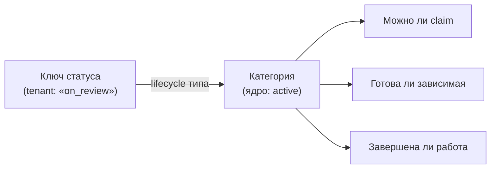
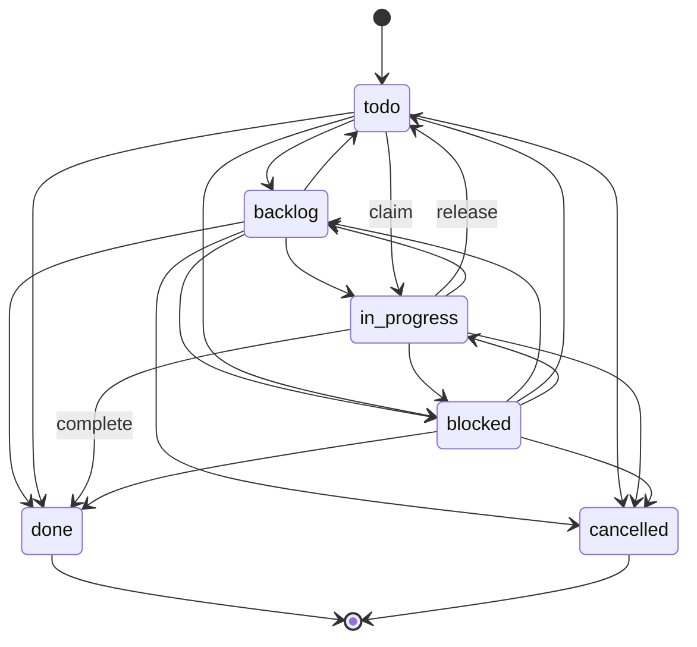
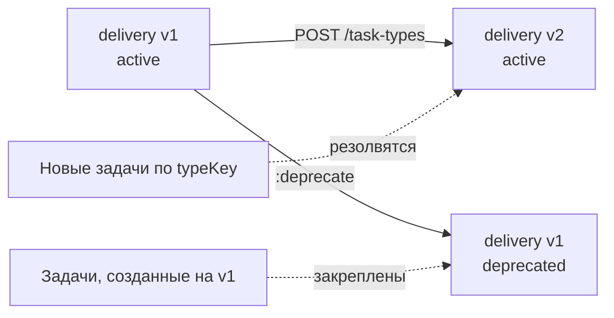
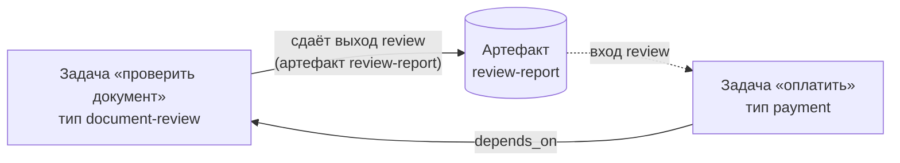
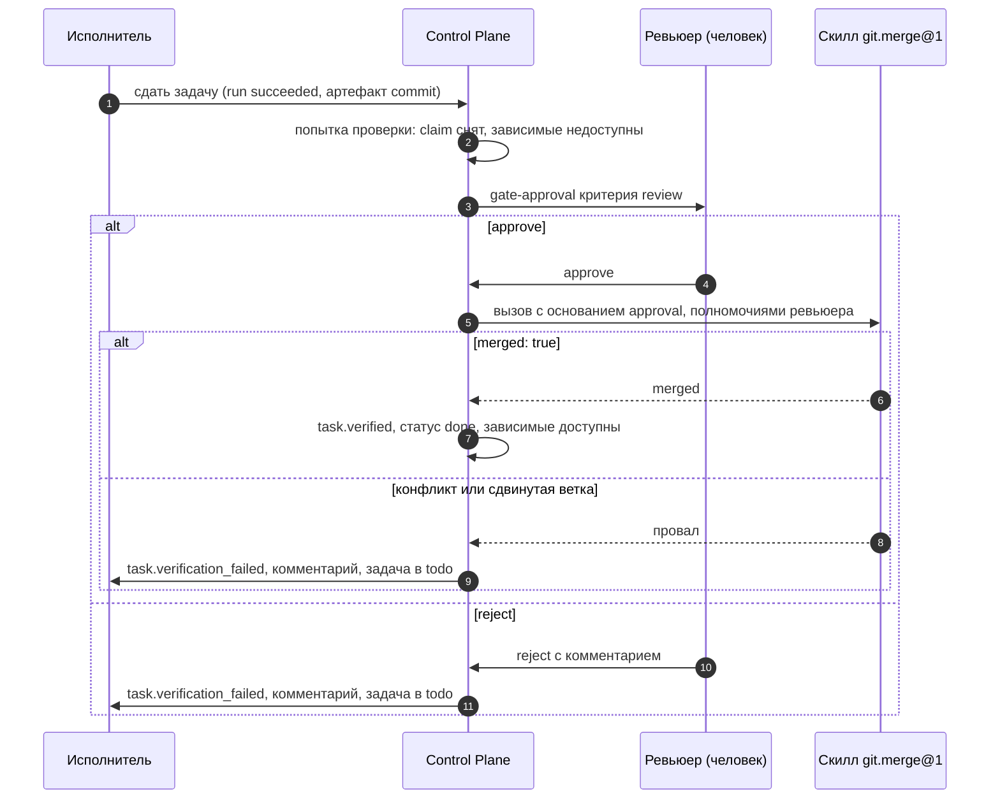

# Типы задач и статусы

Статья описывает реестр типов задач (task types): как tenant объявляет
собственный словарь статусов, переходы, поля и исходы approval, почему
статус — это пара «ключ + системная категория» и как работают версии типов.
Она нужна администраторам tenant'а, проектирующим процессы, и
разработчикам харнессов, которые меняют статусы задач.

## Зачем нужны типы

Каждая команда называет этапы работы по-своему: «на ревью», «ждёт
заказчика», «отгружено». Ядру же нужно принимать решения — можно ли взять
задачу, готова ли зависимая, завершена ли работа — не зная этих названий.
Поэтому:

- **словарь статусов** принадлежит типу задачи tenant'а;
- **решения ядра** принимаются только по системной категории статуса.



!!! note "Категория важнее подписи"
    Tenant может назвать статус `done` и дать ему категорию `active` — ядро
    будет считать задачу активной, и это правильное поведение. Фильтруйте по
    `systemStatusCategory`, когда важен смысл, а не надпись.

## Системные категории

| Категория | Смысл | Claim | Пререквизит выполнен | Можно завершить |
|---|---|---|---|---|
| `backlog` | Работа заведена, но не запланирована | Да | Нет | Да (если объявлено ребро) |
| `active` | Работа запланирована или идёт | Да | Нет | Да |
| `blocked` | Работа стоит | Да | Нет | Да |
| `terminal_success` | Сделано | Нет (`422 task_not_claimable`) | **Да** | Уже (`409 task_already_completed`) |
| `terminal_cancelled` | Отменено | Нет | Нет | Нет (`422 task_cancelled`) |

`blocked` и `backlog` остаются захватываемыми и видны в `GET /work/available`
— статус здесь описание, а не запрет. Авторитетный запрет на захват дают
зависимости, gate-approval и чужой claim (см. [Исполнение](execution.md)).

## Системный тип `task`

У каждого tenant'а есть системный тип с ключом `task`. К нему относится
задача, созданная без `typeKey` / `typeId`, поэтому клиенты, не знающие о
типах, продолжают работать.

| Ключ | Отображение | Категория |
|---|---|---|
| `backlog` | Backlog | `backlog` |
| `todo` | To do | `active` |
| `in_progress` | In progress | `active` |
| `blocked` | Blocked | `blocked` |
| `done` | Done | `terminal_success` |
| `cancelled` | Cancelled | `terminal_cancelled` |

`initialStatus = todo`, `claimStatus = in_progress`, `releaseStatus = todo`,
`completionStatus = done`. Переходы: из каждого из четырёх нетерминальных
статусов — в любой другой, включая оба терминальных. Из терминальных
переходов нет.



Последнюю активную версию системного типа нельзя депрецировать:
`422 system_task_type_required`.

## Структура типа

| Поле | Описание |
|---|---|
| `key` | `^[a-z0-9][a-z0-9_-]*$`, 1–63 символа |
| `version` | Выдаёт сервер: следующая после максимальной для ключа |
| `displayName`, `description` | Отображение |
| `fieldSchema` | JSON Schema 2020-12 для `customFields` задач этого типа (см. [Модель работы](work-model.md)) |
| `lifecycleSchema` | Статусы, переходы и три служебных статуса; не указан — lifecycle системного типа |
| `approvalSchema` | Исходы gate-approval (см. [Approvals](approvals.md)); по умолчанию `{}` |
| `execution` | `{skill, version, inputs}` — задачи типа исполняются вызовом Skill |
| `artifactSchema` | Какие артефакты задача типа получает на вход и какие обязана сдать (см. [Входы и выходы](#artifact-schema)); по умолчанию `{}` |
| `acceptance` | Критерии приёмки по умолчанию у всех задач типа (см. [Приёмка типа](#type-acceptance)); по умолчанию `[]` |
| `status` | `active` или `deprecated` |

### lifecycleSchema

```json
{
  "initialStatus": "new",
  "statuses": [
    {"key": "new",       "displayName": "Новая",       "category": "backlog"},
    {"key": "ready",     "displayName": "Готова",      "category": "active"},
    {"key": "working",   "displayName": "В работе",    "category": "active"},
    {"key": "on_review", "displayName": "На проверке", "category": "active"},
    {"key": "waiting",   "displayName": "Ждёт",        "category": "blocked"},
    {"key": "shipped",   "displayName": "Отгружено",   "category": "terminal_success"},
    {"key": "dropped",   "displayName": "Отменено",    "category": "terminal_cancelled"}
  ],
  "transitions": [
    {"from": "new",       "to": ["ready", "dropped"]},
    {"from": "ready",     "to": ["working", "waiting", "dropped"]},
    {"from": "working",   "to": ["ready", "on_review", "waiting", "dropped"]},
    {"from": "on_review", "to": ["working", "shipped"]},
    {"from": "waiting",   "to": ["ready", "working", "dropped"]}
  ],
  "claimStatus": "working",
  "releaseStatus": "ready",
  "completionStatus": "shipped"
}
```

Правила валидации (нарушение — `422 invalid_lifecycle_schema` с
`details.path`):

- `statuses` — непустой массив, не больше 100 статусов; ключ — непустая
  строка до 64 символов, без повторов; `category` — одна из пяти категорий;
  `displayName` по умолчанию равен ключу;
- `initialStatus` обязан быть объявлен;
- `transitions` — массив `{from, to[]}`; все ключи объявлены; один `from` не
  может встречаться дважды. Источник без записи в `transitions` —
  статус без исходящих переходов;
- `claimStatus` и `releaseStatus` необязательны, но если заданы — объявлены
  и **не терминальны**: захват не может завершить работу, а освобождение —
  отменить её;
- `completionStatus` обязан иметь категорию `terminal_success`. Если такой
  статус один, его можно не указывать; если их несколько — указать обязательно;
  если нет ни одного — тип отклоняется: работа без успешного окончания не
  описывает работу.

Все проверки выполняются **при публикации типа**, а не когда задача
попытается сменить статус: иначе ошибка в типе «застряла» бы на уже
созданных задачах.

## Как ядро двигает статус

### Автоматические переходы claim и release

| Событие | Что делает ядро |
|---|---|
| Claim | Переводит задачу в `claimStatus`, если он объявлен **и** ребро из текущего статуса объявлено. Необъявленное ребро — не ошибка: статус не меняется, claim проходит |
| Release (явный, по `:suspend`, `:handoff`, закрытию сессии, истечению) | Переводит в `releaseStatus`, только если задача всё ещё в `claimStatus` и ребро `claimStatus → releaseStatus` объявлено. Статус, выставленный человеком вручную, не трогается |

Смысл мягкости: пробел в настройке lifecycle не должен превращаться в
отказ захвата. Авторитетный механизм координации — claim, а не надпись.

### Ручная смена статуса

`PATCH /tasks/{ref}` с `{"status": "<ключ>"}` проверяет:

1. ключ объявлен (`422 status_not_in_lifecycle`, в `details.known` —
   допустимые ключи);
2. целевая категория не `terminal_success` — иначе `422 invalid_status`
   «Use the :complete action»;
3. задача ещё не в этом статусе (`422 invalid_transition`);
4. ребро объявлено (`422 invalid_transition`, в `details.allowed` —
   допустимые цели).

Отказ ничего не меняет — ни статус, ни версию задачи.

### Завершение

`POST /tasks/{ref}:complete` (или `POST /runs/{id}:succeed` с
`completeTask: true`) переводит задачу в `completionStatus`. В отличие от
claim/release, здесь **необъявленное ребро — ошибка** (`422
invalid_transition`): завершение — явное действие, и завершать по пути,
которого tenant не объявлял, нельзя. Завершение также освобождает claim и
проставляет `completedAt`.

## Проекция переходов

Чтобы не узнавать словарь статусов из ошибок `422`, клиент читает проекцию
тех же правил, которыми ядро проверяет запись:

```bash
curl -s "$CP/tasks/TASK-000123/transitions" -H "Authorization: Bearer $TOKEN"
```

```json
{
  "taskId": "…",
  "publicId": "TASK-000123",
  "typeId": "…",
  "typeKey": "delivery",
  "typeVersion": 2,
  "status": "on_review",
  "systemStatusCategory": "active",
  "targets": [
    {"status": "shipped", "displayName": "Отгружено",
     "systemStatusCategory": "terminal_success", "route": "complete"},
    {"status": "working", "displayName": "В работе",
     "systemStatusCategory": "active", "route": "update"}
  ]
}
```

- `route: "update"` — переход выполняется `PATCH`;
- `route: "complete"` — ребро в `terminal_success`, выполняется `:complete`;
- петля (переход в текущий статус) в проекцию не попадает.

Эндпоинт требует только `tasks.read`, права на реестр типов не нужны.
MCP-инструмент `cp_get_task` возвращает эту проекцию вместе с задачей.

## Версии типов

Версия типа **неизменяема** с момента записи. Триггер базы разрешает
единственную мутацию — `active → deprecated`. Изменить тип — значит
выпустить следующую версию:

```bash
curl -s -X POST "$CP/task-types" \
  -H "Authorization: Bearer $TOKEN" -H "Content-Type: application/json" \
  -d @delivery-v2.json      # тот же key, новая схема → version = 2
```



- Задача закрепляет **точную версию** (`typeId`) при создании и живёт по её
  правилам до конца: поля, lifecycle, исходы approval.
- `typeKey` без `typeVersion` резолвится в новейшую **active** версию, поэтому
  новые задачи автоматически получают свежую версию.
- `POST /task-types/{id}:deprecate` идемпотентен: версия исчезает из
  резолюции по ключу, но задачи на ней продолжают работать.
- Создание версии сериализуется advisory lock'ом по `(tenant, key)`, поэтому
  параллельные публикации не получат одинаковый номер.

!!! warning "Миграции задач между версиями нет"
    Задача не переходит на новую версию типа автоматически и не может быть
    перепривязана через API. Если процесс меняется радикально, заведите новые
    задачи под новой версией, а старые доведите по старым правилам.

## Тип, исполняемый Skill

Поле `execution` объявляет, что задачи типа исполняет один вызов Skill:

```json
{
  "key": "nightly-report",
  "displayName": "Nightly report",
  "execution": {"skill": "reports.build", "version": "1.0.0", "inputs": "$.customFields"}
}
```

- версия Skill закрепляется и при публикации должна существовать, иметь
  contract и не быть `disabled` — иначе `422 invalid_task_execution`
  (`details.reason`: `not_found`, `no_contract`, `disabled`);
- `inputs` — JSON-path по задаче в представлении API: строка (весь вход,
  по умолчанию `$.customFields`) или объект `{имяВхода: путь}`.

Исполнение таких задач описано в [Пакетах каталога](catalog-packages.md) и
[Адаптерах исполнителей](../runner/adapters.md).

## Входы и выходы (artifactSchema) { #artifact-schema }

Цепочка работы часто передаёт результат дальше: проверка документа сдаёт
заключение, оплата его читает; дизайн сдаёт спецификацию, разбиение на
задачи её получает. Секция `artifactSchema` версии типа объявляет эту
передачу **данными каталога**, без кода под конкретный процесс:

- **входы** (`inputs`) — какие артефакты задача получает от связанных задач;
- **выходы** (`outputs`) — какие артефакты задача обязана сдать, чтобы
  считаться выполненной.

Ядро знает только ключи, типы артефактов, связи и media types — не то, что
артефакт означает. Сами типы артефактов регистрируются отдельно (см.
[Типы артефактов](artifacts.md#artifact-types)).



### Грамматика

```json
{
  "inputs": [
    {"key": "review", "type": "review-report", "from": "depends_on", "required": true}
  ],
  "outputs": [
    {"key": "receipt", "type": "payment-receipt", "required": true,
     "mediaTypes": ["application/pdf"], "content": "required"}
  ]
}
```

Поля входа (других ключей ядро не принимает):

| Поле | Обязательно | Описание |
|---|---|---|
| `key` | да | Имя входа: `^[a-z0-9][a-z0-9_-]{0,55}$`, уникально внутри `inputs` |
| `type` | да | Ключ типа артефакта, зарегистрированного в tenant'е |
| `from` | да | Связь задачи-получателя с источником: `depends_on`, `spawned_by` или `parent` |
| `required` | нет | `true` — без входа задачу нельзя взять; по умолчанию `false` |

Поля выхода (других ключей ядро не принимает):

| Поле | Обязательно | Описание |
|---|---|---|
| `key` | да | Имя выхода: та же грамматика, уникально внутри `outputs` |
| `type` | да | Ключ зарегистрированного типа артефакта |
| `required` | нет | `true` — выход становится критерием стадии проверки; по умолчанию `false` |
| `mediaTypes` | нет | Сужение media types типа артефакта: 1–50 элементов, каждый должен укладываться в `mediaTypes` типа (`text/markdown` сужает `text/*`, обратное — нет) |
| `content` | нет | `required` (по умолчанию) — нужно содержимое в хранилище; `optional` — достаточно записи артефакта (ссылки или JSON) |

Правила публикации версии типа:

- `inputs` и `outputs` — списки не длиннее 32 элементов; других ключей у
  секции нет;
- каждый `type` должен быть зарегистрирован в tenant'е **на момент
  публикации** — иначе `422 unknown_artifact_type` (`details.field`,
  `details.artifactType`). Версия типа артефакта не закрепляется: артефакт
  проверяется по последней;
- любой другой дефект — `422 invalid_artifact_schema` с `details.field`,
  например `artifactSchema.outputs[0].mediaTypes[1]`;
- секция неизменяема вместе с версией: изменить входы или выходы — значит
  выпустить новую версию типа.

### Откуда берётся вход

`from` задаёт прямую связь задачи-получателя (без транзитивности); источник —
задача на другом конце связи, выходящей из получателя:

| `from` | Источник |
|---|---|
| `depends_on` | Задачи, от которых получатель зависит |
| `spawned_by` | Задача, породившая получателя |
| `parent` | Родитель получателя |

Вход разрешается в **head-ревизии** артефактов нужного типа у каждого
источника — артефакты, которые не вытеснены новой ревизией через
`supersedesArtifactId`. Статус источника не важен: вход виден, как только
артефакт сдан, даже если задача-источник ещё не завершена. Если источников
или head-ревизий несколько — в списке все подходящие артефакты, по элементу
на каждый; порядок — по объявлению входов, внутри входа — по времени
создания. Содержимое для наличия входа не нужно: вход с удалённым
содержимым выдаётся с `contentState: "purged"`.

### Входы у исполнителя

Разрешённые входы приходят в поле `inputs` — одинаково для агента и
человека:

- в `GET /runs/{id}/context`;
- в рабочем контексте `POST /api/v1/context` с фокусом на задаче —
  `operational.focus.inputs` (см. [Контекст задачи и память](context.md)).

```json
{
  "inputs": [
    {
      "key": "review",
      "type": "review-report",
      "artifactId": "<artifact-id>",
      "name": "review.pdf",
      "mediaType": "application/pdf",
      "sizeBytes": 184320,
      "sha256": "…",
      "contentState": "stored",
      "uri": null,
      "sourceTask": {"id": "<task-id>", "publicId": "TASK-000122", "relation": "depends_on"}
    }
  ]
}
```

Тип без `artifactSchema` даёт `inputs: []`. Содержимое скачивается
отдельным запросом `GET /artifacts/{id}/content?forTask=<ref>`: исполнителю
достаточно `tasks.read` на своей задаче, права на задачу-источник не нужны
(см. [Содержимое в хранилище](artifacts.md#content)). Runner скачивает входы
сам до старта агента — см. [Адаптеры исполнителей](../runner/adapters.md#task-inputs).

### Обязательный вход и claim

Задачу, у которой нет хотя бы одного **обязательного** входа, взять нельзя:

```json
{
  "error": {
    "code": "input_missing",
    "message": "Task is missing required inputs declared by its type",
    "details": {
      "taskId": "<task-id>",
      "missing": [{"key": "review", "type": "review-report", "from": "depends_on"}]
    }
  }
}
```

- claim отвечает `409 input_missing`; проверка идёт сразу после проверки
  готовности зависимостей, в той же транзакции;
- `GET /tasks/{ref}/claimability` называет ту же причину:
  `{"code": "input_missing", "missing": [...]}`;
- `GET /work/available` такую задачу не предлагает: runner не должен
  крутиться на задаче, которую нельзя взять. Страница поэтому может быть
  короче `limit` при непустом `nextCursor`.

Необязательный вход, которого нет, claim не мешает. Как только источник
сдаст артефакт нужного типа, задача становится доступной без каких-либо
действий.

### Обязательный выход — критерий проверки { #required-output }

Каждый выход с `required: true` становится **неявным критерием** стадии
проверки с ключом `output.<key>`. Такие критерии добавляются при каждом
завершении задачи — `:complete`, успешный run, исход approval — и
выполняются **первыми**, до собственного acceptance задачи. Задача, тип
которой ждёт выход, не становится выполненной без него, что бы ни говорил её
acceptance. Префикс `output.` зарезервирован: объявить собственную проверку
с таким ключом нельзя (`422 invalid_acceptance`).

Критерий смотрит на head-ревизии артефактов этого типа **у самой задачи** и
проходит сразу, без ожидания. Причины провала — по первому шагу, на котором
не осталось подходящего артефакта:

| Причина | Что не так |
|---|---|
| `artifact_missing` | У задачи нет артефакта этого типа |
| `artifact_media_type` | Ни один не подходит под `mediaTypes` выхода (у артефакта-ссылки media type нет — он не подходит) |
| `artifact_content_missing` | При `content: required` ни у одного нет содержимого в хранилище |

Проверка читает только записи, не хранилище: его недоступность критерий не
проваливает. Провал возвращает задачу исполнителю по общим правилам стадии
проверки (см. [Стадия проверки](goals-and-evidence.md#verification-stage)).
Та же форма доступна и в собственном acceptance задачи: критерий
`deterministic` со `spec: {"artifact": {"type": …, "mediaTypes"?: […],
"content"?: "required" | "optional"}}`.

### Пример

Условный пакет каталога `example` объявляет типы артефактов `spec-document`,
`plan-document` и `tasks-document` (`text/markdown`). Тип задачи
`feature-design` обязан сдать `spec` и `plan`, а порождённая им задача
`feature-tasks` получает их входами:

```yaml
artifactSchema:
  inputs:
    - {key: spec, type: spec-document, from: spawned_by, required: true}
    - {key: plan, type: plan-document, from: spawned_by, required: true}
  outputs:
    - {key: tasks, type: tasks-document, required: true}
    - {key: spec, type: spec-document, required: true}
```

Задача `feature-tasks` связана с задачей дизайна связью `spawned_by` и не
может быть взята в работу, пока у задачи дизайна нет обоих документов; а сама
задача дизайна не завершится, пока их не сдаст.

## Приёмка типа (acceptance) { #type-acceptance }

Тип задачи может объявить **критерии приёмки по умолчанию** — список
`acceptance` версии типа. Это та же форма и та же грамматика, что у
acceptance самой задачи (см. [Acceptance](goals-and-evidence.md#acceptance)),
но действует она для **каждой** задачи типа: задача с критериями типа
проходит стадию проверки, даже если её собственный acceptance пуст.
Обоснование — CP-ADR-0067 (амендмент В5–В9) и TAI-ADR-0053.

Так тип выражает гарантию «сделано — значит принято»: задача на код
становится выполненной не тогда, когда исполнитель её сдал, а когда ревью
одобрено и ветка влита. Пока идёт проверка, задача не выдаётся исполнителям,
а её зависимые остаются недоступными (причина claimability
`task_not_ready` у зависимой, `verification_pending` у самой задачи).

### Порядок критериев попытки

При каждом завершении задачи попытка проверки исполняет критерии в таком
порядке:

1. неявные критерии обязательных выходов типа — `output.<key>` (см.
   [Обязательный выход](#required-output));
2. критерии версии типа;
3. собственные критерии задачи.

Неявный критерий правила `rule-evidence` (задачу закрывает правило действием
`complete_work`) добавляется, только если критерии типа и задачи пусты.

В ответе `GET /tasks/{ref}/verifications` каждый элемент `checks` и `results`
несёт поле **`source`** — откуда критерий: `output`, `type`, `task` или
`rule`. `TaskOut.acceptance` при этом остаётся собственным документом задачи:
критерии типа в него не копируются и видны в версии типа
(`GET /task-types/{id}`).

### Задача не заменяет критерий типа

Критерий задачи с ключом, который уже есть у критериев её версии типа,
отвергается при записи: `422 invalid_acceptance`,
`details.field = acceptance[i].key` — так же, как занятый префикс `output.`.
Задача может **добавлять** свои критерии, но не подменять критерии типа:
иначе исполнитель, у которого есть `tasks.write` на своей задаче, заменил бы
`review` критерием, который проходит по его же evidence. Другой решающий для
отдельной задачи задаётся новой версией типа или отдельным типом.

### Проверка при публикации

Критерии типа проверяются при `POST /task-types` так же, как acceptance
задачи: грамматика `spec` по видам, существование скиллов и типов
артефактов, правило внешней записи (ниже). Ошибки — `422
invalid_acceptance_spec` или `422 invalid_acceptance`, `details.field` —
путь (`acceptance[i]…`). Версия неизменяема, поэтому критерии закреплены
версией, которую несёт задача: новая версия типа не меняет задачи, уже
заведённые на старой. Опубликованные без `acceptance` версии получают
пустой список, и их задачи ведут себя как прежде.

### Условие `when`

У критерия (типа или задачи) есть необязательное поле `when` — список от 1
до 8 путей с корнем `$.task` (грамматика выражений исходов approval, без
`|truncate`). Условие выполнено, если каждое выражение даёт значение — не
`null`, не `""` и не `false`.

- Условие вычисляется, **когда попытка подходит к критерию**, а не при её
  открытии: предыдущий критерий может ждать решения человека долго, а за это
  время у задачи может появиться то, что читает условие.
- Невыполненное условие — результат **`skipped`** с причиной
  `condition_unmet` и `details.when` — первым невыполненным выражением.
  Попытка идёт дальше. `skipped` — не провал: попытка, в которой все
  критерии пропущены, пройдена, и задача выполнена.
- Неверное выражение или корень кроме `$.task` — `422
  invalid_acceptance_spec`, `details.field = acceptance[i].when[j]`. У
  критериев цели `when` не принимается.

Так задача без результата (например, без опубликованного коммита) не ждёт
вливания, которого не будет.

### Внешняя запись — только после решения человека

Критерий `deterministic` со скиллом, у которого `sideEffects:
external_write`, допустим только при двух условиях:

- **при записи** — в итоговом списке (выходы, тип, задача) раньше него стоит
  критерий `human` или `llm_judge`, у которого `when` нет или совпадает с
  `when` этого критерия. Иначе — `422 invalid_acceptance_spec`, `details:
  {field: acceptance[i].spec.skill, cause: external_write_without_decision}`.
  Для версии типа итоговый список — её собственные критерии; для задачи —
  критерии её версии типа, затем её собственные;
- **при исполнении** — в **этой же** попытке раньше него критерий `human` /
  `llm_judge` прошёл (а не пропущен). Иначе — провал критерия с причиной
  `no_decision`. Если решение человека пропущено по тому же `when`, по нему
  пропускается и внешняя запись.

Вызов скилла идёт с основанием `authorizationBasis = {kind: approval,
approvalId, decidedBy}` — gate, засчитанный ближайшему пройденному решению,
и **полномочиями решившего** этот gate, а не исполнителя, сдавшего работу:
запись разрешил человек. Решившему нужны `skills.invoke`, `tasks.write` на
задаче и `requiredPermissions` скилла. Входы критерия читаются полномочиями
завершившего задачу. Следующая попытка запрашивает новое решение, поэтому
повтор записи после провала идёт по новому одобрению.

### Пример: задача на код (review → merge)

Тип `coding-task` условного пакета `example` объявляет два критерия: ревью
человеком и вливание ветки скиллом `git.merge@1`. Оба пропускаются, если у
задачи нет опубликованного коммита.

```yaml
acceptance:
  - key: review
    kind: human
    description: >-
      Ревью кода человеком. approve — ветка вливается, reject — задача
      возвращается исполнителю с комментарием решения.
    spec:
      approver: ${REVIEWER_PRINCIPAL}
    when:
      - "$.task.artifact[commit].metadata.published"
  - key: merge
    kind: deterministic
    description: Одобренный коммит влит в целевую ветку скиллом git.merge@1.
    spec:
      skill: git.merge@1
      inputs:
        repository: "$.task.artifact[commit].metadata.repository!"
        branch: "$.task.artifact[commit].metadata.branch!"
        commit: "$.task.artifact[commit].metadata.commit!"
        target: "$.task.artifact[commit].metadata.targetBranch!"
        message: "Merge $.task.publicId!: $.task.title"
      expect: {merged: true}
    when:
      - "$.task.artifact[commit].metadata.published"
```



Отказ ревью и неудачное вливание — провал попытки: ядро пишет комментарий с
причиной, задача возвращается в `releaseStatus` **тому же исполнителю**
(назначение не меняется), и он продолжает ту же ветку. Отдельных задач
ревью и правок нет. Третий провал подряд переводит задачу в статус категории
`blocked` — дальше решает человек. Как исполнитель получает причину — в
разделе [Возврат исполнителю](goals-and-evidence.md#return-to-executor).

!!! note "Ревью — критерий типа, а не отдельная задача"
    Отдельный тип задачи ревью и исход approval, заводящий задачу правок,
    для такой приёмки не нужны: достаточно критериев типа, как в примере
    выше.

## API реестра

| Метод | Путь | Право |
|---|---|---|
| `POST` | `/task-types` | `task_types.manage` |
| `GET` | `/task-types?key=&status=` | `task_types.read` |
| `GET` | `/task-types/{id}` | `task_types.read` |
| `POST` | `/task-types/{id}:deprecate` | `task_types.manage` |
| `GET` | `/tasks/{ref}/transitions` | `tasks.read` |

Права `task_types.*` отделены от `tasks.*`: право заводить работу не даёт
права менять словарь процесса tenant'а. По той же причине MCP-сервер
публикует только чтение реестра (`cp_list_task_types`, `cp_get_task_type`),
а создание и депрецирование типов идёт через HTTP или SDK.

События: `task_type.created` (ключ, версия, `initialStatus`,
`completionStatus`, `execution`, флаги `declaresApprovalOutcomes` и
`declaresArtifactSchema`, числа входов и выходов `inputs` и `outputs`) и
`task_type.deprecated`. `task.created` несёт `typeKey`, `typeVersion` и
`systemStatusCategory`. Критерии `acceptance` в событие типа не попадают:
их читают из версии типа.

## Пошагово: завести собственный процесс

1. Опишите статусы и категории. Решите, какой статус ставит claim
   (`claimStatus`), куда возвращает release (`releaseStatus`) и какой статус
   означает «сделано» (`completionStatus`).
2. Объявите переходы, включая ребро из статуса «в работе» в
   `completionStatus` — иначе `:complete` из него будет отклонён.
3. При необходимости добавьте `fieldSchema`, `approvalSchema` и критерии
   приёмки по умолчанию `acceptance`.
4. Опубликуйте тип: `POST /task-types`. Исправьте ошибки по `details.path`.
5. Создайте пробную задачу с `typeKey`, проверьте
   `GET /tasks/{ref}/transitions`, выполните claim → run → succeed.
6. Для изменений выпускайте новую версию; старую депрецируйте, когда
   новые задачи должны перестать её получать.

## Типичные проблемы

| Симптом | Причина | Что делать |
|---|---|---|
| `:complete` → `422 invalid_transition` | Нет ребра из текущего статуса в `completionStatus` | Выпустить версию с ребром или перевести задачу в статус, из которого оно есть |
| После claim статус не изменился | Нет ребра из текущего статуса в `claimStatus` | Это не ошибка; объявите ребро, если нужен автоматический переход |
| После release статус остался «в работе» | Задача не в `claimStatus` или нет ребра `claimStatus → releaseStatus` | Проверить lifecycle; статус, выставленный вручную, release не меняет |
| `PATCH status` → `422 invalid_status` | Цель — статус категории `terminal_success` | Использовать `:complete` |
| Новые задачи получают старую версию | Новая версия не опубликована или клиент передаёт `typeVersion`/`typeId` | Проверить `GET /task-types?key=…` и параметры клиента |
| Публикация типа → `422 unknown_artifact_type` | Тип артефакта из `artifactSchema` не зарегистрирован | Сначала `POST /artifact-types` (в пакете — `ArtifactType` того же пакета или его `requires`) |
| Claim → `409 input_missing`, задачи нет в `/work/available` | У источника нет head-ревизии артефакта обязательного входа или нет самой связи | Проверить связь (`from`) и артефакты источника; `GET /tasks/{ref}/claimability` покажет `missing` |
| `PATCH /tasks/{ref}` с acceptance → `422 invalid_acceptance`, `details.field = acceptance[i].key` | Ключ критерия задачи совпадает с ключом критерия её типа | Дать критерию задачи другой ключ; критерий типа задача не заменяет |
| Публикация типа → `422 invalid_acceptance_spec`, `cause: external_write_without_decision` | Скилл внешней записи в критерии без предшествующего `human` / `llm_judge` с тем же `when` | Поставить критерий решения человека раньше и с тем же `when` |
| Критерий провален с причиной `no_decision` | Решение человека в этой попытке не прошло (пропущено или не дошло до `passed`) | Проверить `when` обоих критериев и итог решения |
| В попытке все критерии `skipped`, задача выполнена | Условия `when` не выполнены (например, у задачи нет результата) | Ожидаемо; проверить артефакты задачи, если результат должен был быть |
| Задача не завершается, проверка `output.<key>` провалена | Обязательный выход не сдан, не того media type или без содержимого | Сдать артефакт нужного типа с содержимым (`contentRef`) и завершить снова |

## См. также

- [Модель работы](work-model.md) — поля задач, custom fields, фильтры.
- [Approvals](approvals.md) — исходы, объявленные типом.
- [Артефакты и комментарии](artifacts.md) — содержимое артефактов и реестр типов артефактов.
- [Цели, приёмка и evidence](goals-and-evidence.md#verification-stage) — стадия проверки.
- [Правила вывода работы](work-rules.md) — `complete_work` и неявный критерий `rule-evidence`.
- [Пакеты каталога](catalog-packages.md) — `ArtifactType` и `artifactSchema` в пакетах.
- [Исполнение — claims и runs](execution.md)
- [События](events.md)
