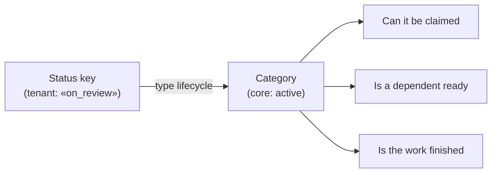
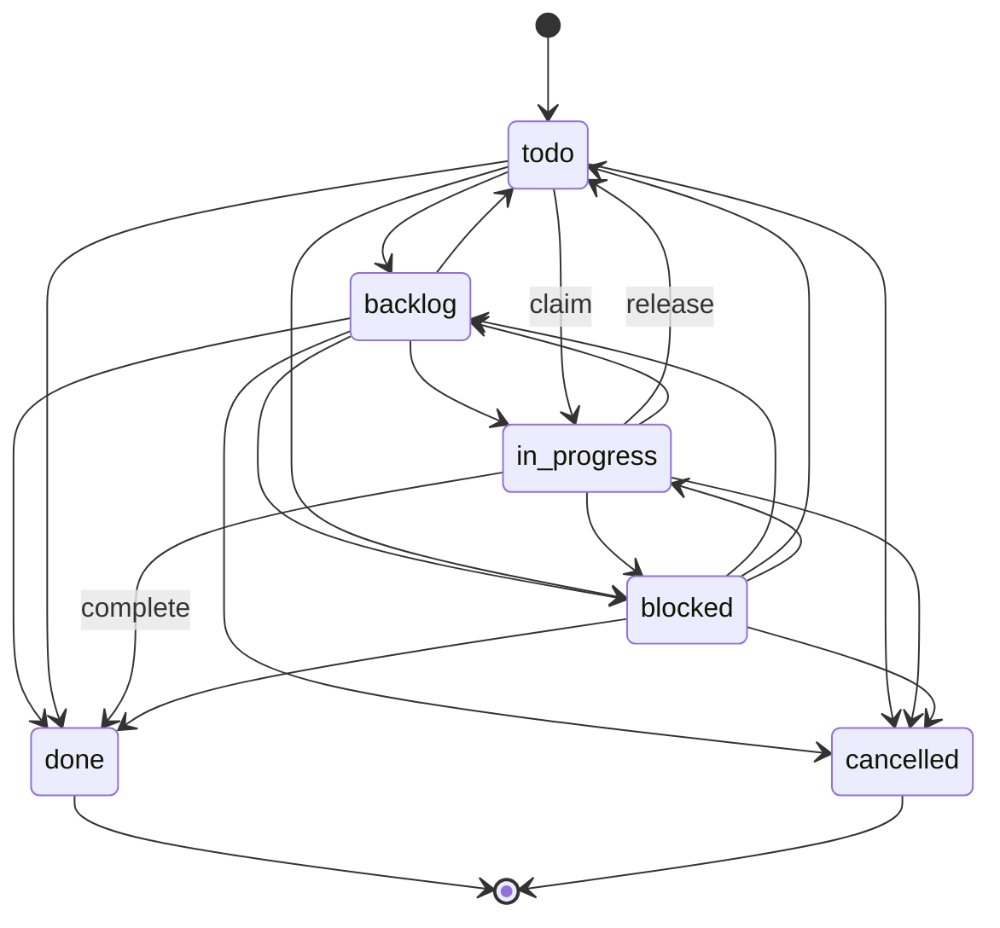
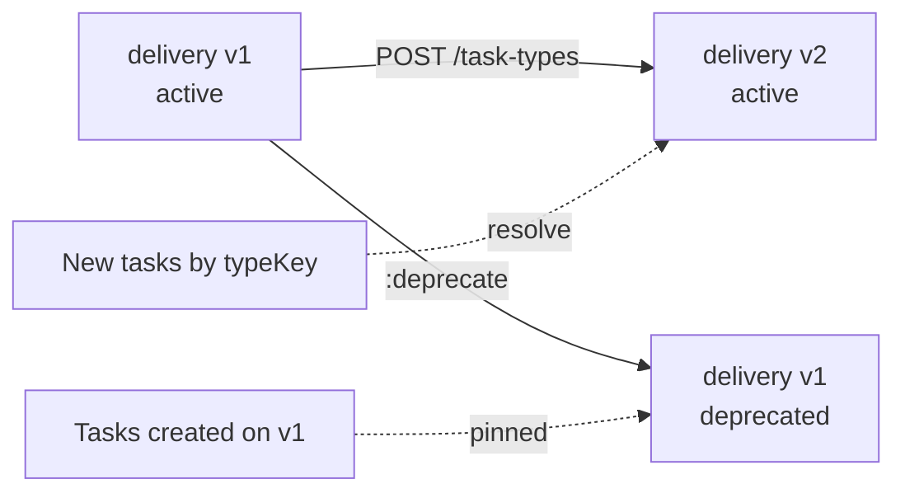
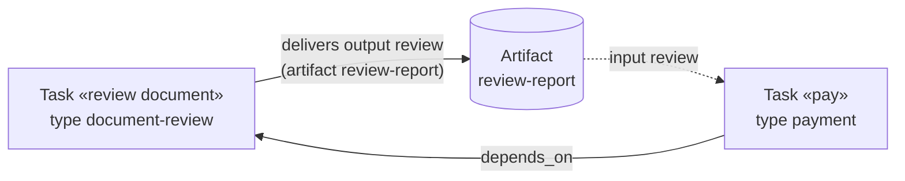
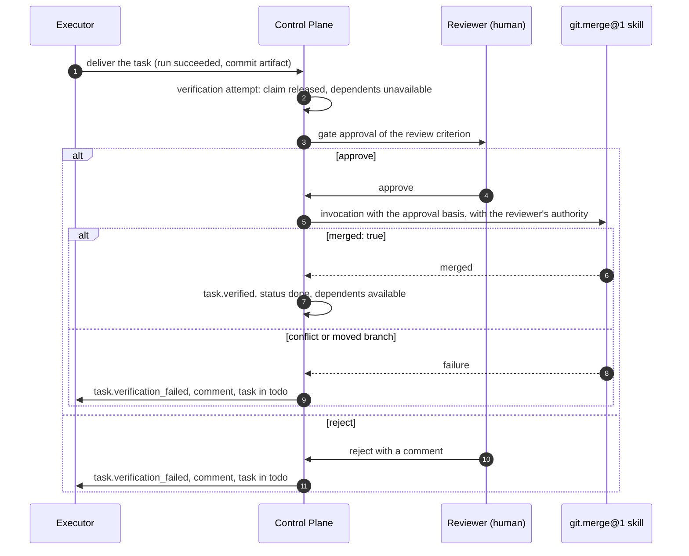

# Task types and statuses

This article describes the task type registry: how a tenant declares
its own vocabulary of statuses, transitions, fields, and approval outcomes, why
a status is a "key + system category" pair, and how type versions work.
It is for tenant administrators who design processes and for
harness developers who change task statuses.

## Why types exist

Every team names work stages its own way: "in review", "waiting for the
customer", "shipped". The core, however, needs to make decisions — can a task be
claimed, is a dependent ready, is the work finished — without knowing these names.
Therefore:

- the **status vocabulary** belongs to the tenant's task type;
- **core decisions** are made only by the status's system category.



!!! note "The category matters more than the label"
    A tenant can name a status `done` and give it the `active` category — the core
    will consider the task active, and this is correct behavior. Filter by
    `systemStatusCategory` when the meaning matters, not the label.

## System categories

| Category | Meaning | Claim | Prerequisite satisfied | Can be completed |
|---|---|---|---|---|
| `backlog` | Work is created but not scheduled | Yes | No | Yes (if the edge is declared) |
| `active` | Work is scheduled or in progress | Yes | No | Yes |
| `blocked` | Work is stalled | Yes | No | Yes |
| `terminal_success` | Done | No (`422 task_not_claimable`) | **Yes** | Already (`409 task_already_completed`) |
| `terminal_cancelled` | Cancelled | No | No | No (`422 task_cancelled`) |

`blocked` and `backlog` remain claimable and are visible in `GET /work/available`
— the status here is a description, not a prohibition. Authoritative claim prohibitions come from
dependencies, gate approvals, and someone else's claim (see [Execution](execution.md)).

## The system type `task`

Every tenant has a system type with the key `task`. A task created
without `typeKey` / `typeId` belongs to it, so clients that do not know about
types keep working.

| Key | Display | Category |
|---|---|---|
| `backlog` | Backlog | `backlog` |
| `todo` | To do | `active` |
| `in_progress` | In progress | `active` |
| `blocked` | Blocked | `blocked` |
| `done` | Done | `terminal_success` |
| `cancelled` | Cancelled | `terminal_cancelled` |

`initialStatus = todo`, `claimStatus = in_progress`, `releaseStatus = todo`,
`completionStatus = done`. Transitions: from each of the four non-terminal
statuses to any other, including both terminal ones. There are no transitions out of
terminal statuses.



The last active version of the system type cannot be deprecated:
`422 system_task_type_required`.

## Type structure

| Field | Description |
|---|---|
| `key` | `^[a-z0-9][a-z0-9_-]*$`, 1–63 characters |
| `version` | Issued by the server: the next one after the maximum for the key |
| `displayName`, `description` | Display |
| `fieldSchema` | JSON Schema 2020-12 for `customFields` of tasks of this type (see [Work model](work-model.md)) |
| `lifecycleSchema` | Statuses, transitions, and three service statuses; if omitted, the lifecycle of the system type |
| `approvalSchema` | Gate approval outcomes (see [Approvals](approvals.md)); `{}` by default |
| `execution` | `{skill, version, inputs}` — tasks of the type are executed by a Skill invocation |
| `artifactSchema` | Which artifacts a task of the type receives as input and which it must deliver (see [Inputs and outputs](#artifact-schema)); `{}` by default |
| `acceptance` | Default acceptance criteria for all tasks of the type (see [Type acceptance](#type-acceptance)); `[]` by default |
| `status` | `active` or `deprecated` |

### lifecycleSchema

```json
{
  "initialStatus": "new",
  "statuses": [
    {"key": "new",       "displayName": "New",          "category": "backlog"},
    {"key": "ready",     "displayName": "Ready",        "category": "active"},
    {"key": "working",   "displayName": "In progress",  "category": "active"},
    {"key": "on_review", "displayName": "Under review", "category": "active"},
    {"key": "waiting",   "displayName": "Waiting",      "category": "blocked"},
    {"key": "shipped",   "displayName": "Shipped",      "category": "terminal_success"},
    {"key": "dropped",   "displayName": "Cancelled",    "category": "terminal_cancelled"}
  ],
  "transitions": [
    {"from": "new",       "to": ["ready", "dropped"]},
    {"from": "ready",     "to": ["working", "waiting", "dropped"]},
    {"from": "working",   "to": ["ready", "on_review", "waiting", "dropped"]},
    {"from": "on_review", "to": ["working", "shipped"]},
    {"from": "waiting",   "to": ["ready", "working", "dropped"]}
  ],
  "claimStatus": "working",
  "releaseStatus": "ready",
  "completionStatus": "shipped"
}
```

Validation rules (a violation — `422 invalid_lifecycle_schema` with
`details.path`):

- `statuses` is a non-empty array of no more than 100 statuses; a key is a non-empty
  string up to 64 characters, without duplicates; `category` is one of the five categories;
  `displayName` defaults to the key;
- `initialStatus` must be declared;
- `transitions` is an array of `{from, to[]}`; all keys are declared; the same `from` cannot
  appear twice. A source without an entry in `transitions` is
  a status without outgoing transitions;
- `claimStatus` and `releaseStatus` are optional, but if set, they must be declared
  and **non-terminal**: a claim cannot finish the work, and a release cannot
  cancel it;
- `completionStatus` must have the `terminal_success` category. If there is only one such
  status, you can omit it; if there are several, you must specify it;
  if there are none, the type is rejected: work without a successful ending does not
  describe work.

All checks are performed **when the type is published**, not when a task
tries to change status: otherwise an error in the type would get "stuck" on already
created tasks.

## How the core moves the status

### Automatic claim and release transitions

| Event | What the core does |
|---|---|
| Claim | Moves the task to `claimStatus` if it is declared **and** the edge from the current status is declared. An undeclared edge is not an error: the status does not change, the claim goes through |
| Release (explicit, via `:suspend`, `:handoff`, session close, expiry) | Moves to `releaseStatus` only if the task is still in `claimStatus` and the edge `claimStatus → releaseStatus` is declared. A status set manually by a human is not touched |

The point of this leniency: a gap in the lifecycle configuration must not turn into
a claim refusal. The authoritative coordination mechanism is the claim, not the label.

### Manual status change

`PATCH /tasks/{ref}` with `{"status": "<key>"}` checks that:

1. the key is declared (`422 status_not_in_lifecycle`, `details.known` lists
   the allowed keys);
2. the target category is not `terminal_success` — otherwise `422 invalid_status`
   "Use the :complete action";
3. the task is not already in this status (`422 invalid_transition`);
4. the edge is declared (`422 invalid_transition`, `details.allowed` lists
   the allowed targets).

A refusal changes nothing — neither the status nor the task version.

### Completion

`POST /tasks/{ref}:complete` (or `POST /runs/{id}:succeed` with
`completeTask: true`) moves the task to `completionStatus`. Unlike
claim/release, here **an undeclared edge is an error** (`422
invalid_transition`): completion is an explicit action, and you cannot complete along a path
the tenant did not declare. Completion also releases the claim and
sets `completedAt`.

## Transitions projection

To avoid learning the status vocabulary from `422` errors, a client reads a projection
of the same rules the core uses to validate writes:

```bash
curl -s "$CP/tasks/TASK-000123/transitions" -H "Authorization: Bearer $TOKEN"
```

```json
{
  "taskId": "…",
  "publicId": "TASK-000123",
  "typeId": "…",
  "typeKey": "delivery",
  "typeVersion": 2,
  "status": "on_review",
  "systemStatusCategory": "active",
  "targets": [
    {"status": "shipped", "displayName": "Shipped",
     "systemStatusCategory": "terminal_success", "route": "complete"},
    {"status": "working", "displayName": "In progress",
     "systemStatusCategory": "active", "route": "update"}
  ]
}
```

- `route: "update"` — the transition is performed with `PATCH`;
- `route: "complete"` — an edge to `terminal_success`, performed with `:complete`;
- a loop (a transition to the current status) is not included in the projection.

The endpoint requires only `tasks.read`; permissions on the type registry are not needed.
The MCP tool `cp_get_task` returns this projection together with the task.

## Type versions

A type version is **immutable** from the moment it is written. A database trigger allows
a single mutation — `active → deprecated`. Changing a type means
publishing the next version:

```bash
curl -s -X POST "$CP/task-types" \
  -H "Authorization: Bearer $TOKEN" -H "Content-Type: application/json" \
  -d @delivery-v2.json      # same key, new schema → version = 2
```



- A task pins the **exact version** (`typeId`) on creation and lives by its
  rules to the end: fields, lifecycle, approval outcomes.
- `typeKey` without `typeVersion` resolves to the newest **active** version, so
  new tasks automatically get the latest version.
- `POST /task-types/{id}:deprecate` is idempotent: the version disappears from
  resolution by key, but tasks on it keep working.
- Version creation is serialized by an advisory lock on `(tenant, key)`, so
  concurrent publications do not get the same number.

!!! warning "There is no task migration between versions"
    A task does not move to a new type version automatically and cannot be
    rebound through the API. If the process changes radically, create new
    tasks under the new version and finish the old ones under the old rules.

## A type executed by a Skill

The `execution` field declares that tasks of the type are executed by a single Skill invocation:

```json
{
  "key": "nightly-report",
  "displayName": "Nightly report",
  "execution": {"skill": "reports.build", "version": "1.0.0", "inputs": "$.customFields"}
}
```

- the Skill version is pinned and at publication must exist, have a
  contract, and not be `disabled` — otherwise `422 invalid_task_execution`
  (`details.reason`: `not_found`, `no_contract`, `disabled`);
- `inputs` is a JSON-path over the task in its API representation: a string (the whole input,
  `$.customFields` by default) or an object `{inputName: path}`.

Execution of such tasks is described in [Catalog packages](catalog-packages.md) and
[Executor adapters](../runner/adapters.md).

## Inputs and outputs (artifactSchema) { #artifact-schema }

A chain of work often passes a result along: a document review delivers
a conclusion, and payment reads it; a design delivers a specification, and the breakdown into
tasks receives it. The `artifactSchema` section of a type version declares this
handoff **as catalog data**, without code for a specific process:

- **inputs** (`inputs`) — which artifacts the task receives from related tasks;
- **outputs** (`outputs`) — which artifacts the task must deliver to
  be considered done.

The core knows only keys, artifact types, relations, and media types — not what
an artifact means. Artifact types themselves are registered separately (see
[Artifact types](artifacts.md#artifact-types)).



### Grammar

```json
{
  "inputs": [
    {"key": "review", "type": "review-report", "from": "depends_on", "required": true}
  ],
  "outputs": [
    {"key": "receipt", "type": "payment-receipt", "required": true,
     "mediaTypes": ["application/pdf"], "content": "required"}
  ]
}
```

Input fields (the core accepts no other keys):

| Field | Required | Description |
|---|---|---|
| `key` | yes | Input name: `^[a-z0-9][a-z0-9_-]{0,55}$`, unique within `inputs` |
| `type` | yes | The key of an artifact type registered in the tenant |
| `from` | yes | The relation of the receiving task to the source: `depends_on`, `spawned_by`, or `parent` |
| `required` | no | `true` — the task cannot be claimed without the input; `false` by default |

Output fields (the core accepts no other keys):

| Field | Required | Description |
|---|---|---|
| `key` | yes | Output name: the same grammar, unique within `outputs` |
| `type` | yes | The key of a registered artifact type |
| `required` | no | `true` — the output becomes a criterion of the verification stage; `false` by default |
| `mediaTypes` | no | Narrowing of the artifact type's media types: 1–50 elements, each must fit within the type's `mediaTypes` (`text/markdown` narrows `text/*`, but not the other way around) |
| `content` | no | `required` (default) — content in storage is required; `optional` — an artifact record (a reference or JSON) is enough |

Rules for publishing a type version:

- `inputs` and `outputs` are lists of no more than 32 elements; the section
  has no other keys;
- each `type` must be registered in the tenant **at the time of
  publication** — otherwise `422 unknown_artifact_type` (`details.field`,
  `details.artifactType`). The artifact type version is not pinned: an artifact
  is validated against the latest one;
- any other defect — `422 invalid_artifact_schema` with `details.field`,
  for example `artifactSchema.outputs[0].mediaTypes[1]`;
- the section is immutable together with the version: changing inputs or outputs means
  publishing a new type version.

### Where an input comes from

`from` specifies a direct relation of the receiving task (no transitivity); the source is
the task at the other end of a relation going out from the receiver:

| `from` | Source |
|---|---|
| `depends_on` | Tasks the receiver depends on |
| `spawned_by` | The task that spawned the receiver |
| `parent` | The receiver's parent |

An input resolves to the **head revisions** of artifacts of the required type on each
source — artifacts not superseded by a newer revision through
`supersedesArtifactId`. The source's status does not matter: the input is visible as soon as
the artifact is delivered, even if the source task is not finished yet. If there are several sources
or head revisions, the list contains all matching artifacts, one element
each; the order follows the declaration of inputs, and within an input, creation
time. Content is not required for an input to be present: an input with purged
content is returned with `contentState: "purged"`.

### Inputs for the executor

Resolved inputs arrive in the `inputs` field — the same for an agent and a
human:

- in `GET /runs/{id}/context`;
- in the working context `POST /api/v1/context` focused on the task —
  `operational.focus.inputs` (see [Task context and memory](context.md)).

```json
{
  "inputs": [
    {
      "key": "review",
      "type": "review-report",
      "artifactId": "<artifact-id>",
      "name": "review.pdf",
      "mediaType": "application/pdf",
      "sizeBytes": 184320,
      "sha256": "…",
      "contentState": "stored",
      "uri": null,
      "sourceTask": {"id": "<task-id>", "publicId": "TASK-000122", "relation": "depends_on"}
    }
  ]
}
```

A type without `artifactSchema` yields `inputs: []`. Content is downloaded
with a separate request `GET /artifacts/{id}/content?forTask=<ref>`: the executor
needs only `tasks.read` on its own task, permissions on the source task are not needed
(see [Content in storage](artifacts.md#content)). The runner downloads inputs
itself before the agent starts — see [Executor adapters](../runner/adapters.md#task-inputs).

### Required input and claim

A task that is missing at least one **required** input cannot be claimed:

```json
{
  "error": {
    "code": "input_missing",
    "message": "Task is missing required inputs declared by its type",
    "details": {
      "taskId": "<task-id>",
      "missing": [{"key": "review", "type": "review-report", "from": "depends_on"}]
    }
  }
}
```

- the claim returns `409 input_missing`; the check runs right after the dependency
  readiness check, in the same transaction;
- `GET /tasks/{ref}/claimability` names the same reason:
  `{"code": "input_missing", "missing": [...]}`;
- `GET /work/available` does not offer such a task: a runner should not
  spin on a task that cannot be claimed. A page can therefore be
  shorter than `limit` with a non-empty `nextCursor`.

A missing optional input does not prevent a claim. As soon as the source
delivers an artifact of the required type, the task becomes available without any
action.

### Required output — a verification criterion { #required-output }

Each output with `required: true` becomes an **implicit criterion** of the verification
stage with the key `output.<key>`. Such criteria are added on every
completion of the task — `:complete`, a successful run, an approval outcome — and
run **first**, before the task's own acceptance. A task whose type
expects an output does not become done without it, whatever its
acceptance says. The `output.` prefix is reserved: you cannot declare your own check
with such a key (`422 invalid_acceptance`).

The criterion looks at the head revisions of artifacts of this type **on the task itself** and
passes immediately, without waiting. Failure reasons correspond to the first step at which
no matching artifact remained:

| Reason | What is wrong |
|---|---|
| `artifact_missing` | The task has no artifact of this type |
| `artifact_media_type` | None matches the output's `mediaTypes` (a reference artifact has no media type, so it does not match) |
| `artifact_content_missing` | With `content: required`, none has content in storage |

The check reads only records, not storage: storage unavailability does not fail the
criterion. A failure returns the task to the executor under the general rules of the verification
stage (see [Verification stage](goals-and-evidence.md#verification-stage)).
The same form is available in the task's own acceptance: a
`deterministic` criterion with `spec: {"artifact": {"type": …, "mediaTypes"?: […],
"content"?: "required" | "optional"}}`.

### Example

A hypothetical catalog package `example` declares the artifact types `spec-document`,
`plan-document`, and `tasks-document` (`text/markdown`). The task type
`feature-design` must deliver `spec` and `plan`, and the `feature-tasks` task it spawns
receives them as inputs:

```yaml
artifactSchema:
  inputs:
    - {key: spec, type: spec-document, from: spawned_by, required: true}
    - {key: plan, type: plan-document, from: spawned_by, required: true}
  outputs:
    - {key: tasks, type: tasks-document, required: true}
    - {key: spec, type: spec-document, required: true}
```

The `feature-tasks` task is linked to the design task by a `spawned_by` relation and
cannot be claimed until the design task has both documents; and the
design task itself will not complete until it delivers them.

## Type acceptance { #type-acceptance }

A task type can declare **default acceptance criteria** — the
`acceptance` list of the type version. This is the same form and the same grammar as the
acceptance of a task itself (see [Acceptance](goals-and-evidence.md#acceptance)),
but it applies to **every** task of the type: a task with type criteria
goes through the verification stage even if its own acceptance is empty.
Rationale: CP-ADR-0067 (amendment items V5–V9) and TAI-ADR-0053.

This is how a type expresses the guarantee "done means accepted": a coding task
becomes done not when the executor delivers it, but when the review is
approved and the branch is merged. While verification is in progress, the task is not handed out to executors,
and its dependents remain unavailable (claimability reason
`task_not_ready` for the dependent, `verification_pending` for the task itself).

### Order of criteria in an attempt

On each completion of a task, the verification attempt runs criteria in this
order:

1. implicit criteria of the type's required outputs — `output.<key>` (see
   [Required output](#required-output));
2. criteria of the type version;
3. the task's own criteria.

The implicit rule criterion `rule-evidence` (a rule closes the task with the
`complete_work` action) is added only if the type and task criteria are empty.

In the `GET /tasks/{ref}/verifications` response, each element of `checks` and `results`
carries a **`source`** field — where the criterion comes from: `output`, `type`, `task`, or
`rule`. `TaskOut.acceptance` remains the task's own document:
type criteria are not copied into it and are visible in the type version
(`GET /task-types/{id}`).

### A task does not replace a type criterion

A task criterion with a key that already exists among the criteria of its type version
is rejected on write: `422 invalid_acceptance`,
`details.field = acceptance[i].key` — the same as the taken `output.` prefix.
A task can **add** its own criteria but not substitute the type's criteria:
otherwise an executor with `tasks.write` on its own task could replace
`review` with a criterion that passes on its own evidence. A different decider for
an individual task is set with a new type version or a separate type.

### Validation on publication

Type criteria are validated on `POST /task-types` in the same way as task
acceptance: the `spec` grammar by kind, the existence of skills and artifact
types, the external write rule (below). Errors — `422
invalid_acceptance_spec` or `422 invalid_acceptance`, `details.field` is
the path (`acceptance[i]…`). A version is immutable, so the criteria are pinned by
the version the task carries: a new type version does not change tasks already
created on the old one. Versions published without `acceptance` get
an empty list, and their tasks behave as before.

### The `when` condition

A criterion (of a type or a task) has an optional `when` field — a list of 1
to 8 paths rooted at `$.task` (the grammar of approval outcome expressions, without
`|truncate`). The condition is satisfied if each expression yields a value — not
`null`, not `""`, and not `false`.

- The condition is evaluated **when the attempt reaches the criterion**, not when
  it opens: a previous criterion can wait for a human decision for a long time, and during that
  time the task may acquire what the condition reads.
- An unmet condition gives the result **`skipped`** with the reason
  `condition_unmet` and `details.when` — the first unmet expression.
  The attempt moves on. `skipped` is not a failure: an attempt in which all
  criteria are skipped passes, and the task is done.
- An invalid expression or a root other than `$.task` — `422
  invalid_acceptance_spec`, `details.field = acceptance[i].when[j]`. `when` is not accepted
  for goal criteria.

This way a task without a result (for example, without a published commit) does not wait for
a merge that will not happen.

### External write — only after a human decision

A `deterministic` criterion with a skill that has `sideEffects:
external_write` is allowed only under two conditions:

- **on write** — in the final list (outputs, type, task) it is preceded by
  a `human` or `llm_judge` criterion whose `when` is absent or matches
  the `when` of this criterion. Otherwise — `422 invalid_acceptance_spec`, `details:
  {field: acceptance[i].spec.skill, cause: external_write_without_decision}`.
  For a type version, the final list is its own criteria; for a task —
  the criteria of its type version, then its own;
- **on execution** — in **this same** attempt, a `human` /
  `llm_judge` criterion before it has passed (not been skipped). Otherwise the criterion fails with the reason
  `no_decision`. If the human decision is skipped by the same `when`, the external write
  is skipped by it too.

The skill is invoked with the basis `authorizationBasis = {kind: approval,
approvalId, decidedBy}` — the gate counted toward the nearest passed decision —
and with **the authority of whoever decided** that gate, not of the executor who delivered the work:
a human authorized the write. The decider needs `skills.invoke`, `tasks.write` on
the task, and the skill's `requiredPermissions`. The criterion's inputs are read with the authority of
whoever completed the task. The next attempt requests a new decision, so
a retry of the write after a failure goes through a new approval.

### Example: a coding task (review → merge)

The `coding-task` type of a hypothetical `example` package declares two criteria: human
review and merging the branch with the `git.merge@1` skill. Both are skipped if the
task has no published commit.

```yaml
acceptance:
  - key: review
    kind: human
    description: >-
      Human code review. approve — the branch is merged, reject — the task
      returns to the executor with the decision comment.
    spec:
      approver: ${REVIEWER_PRINCIPAL}
    when:
      - "$.task.artifact[commit].metadata.published"
  - key: merge
    kind: deterministic
    description: The approved commit is merged into the target branch by the git.merge@1 skill.
    spec:
      skill: git.merge@1
      inputs:
        repository: "$.task.artifact[commit].metadata.repository!"
        branch: "$.task.artifact[commit].metadata.branch!"
        commit: "$.task.artifact[commit].metadata.commit!"
        target: "$.task.artifact[commit].metadata.targetBranch!"
        message: "Merge $.task.publicId!: $.task.title"
      expect: {merged: true}
    when:
      - "$.task.artifact[commit].metadata.published"
```



A review rejection and a failed merge are attempt failures: the core writes a comment with
the reason, the task returns to `releaseStatus` **for the same executor**
(the assignment does not change), and they continue the same branch. There are no separate review
and rework tasks. The third failure in a row moves the task to a status of the
`blocked` category — from there a human decides. How the executor receives the reason is described in
[Return to the executor](goals-and-evidence.md#return-to-executor).

!!! note "Review is a type criterion, not a separate task"
    A separate review task type and an approval outcome that creates a rework task
    are not needed for such acceptance: type criteria are enough, as in the example
    above.

## Registry API

| Method | Path | Permission |
|---|---|---|
| `POST` | `/task-types` | `task_types.manage` |
| `GET` | `/task-types?key=&status=` | `task_types.read` |
| `GET` | `/task-types/{id}` | `task_types.read` |
| `POST` | `/task-types/{id}:deprecate` | `task_types.manage` |
| `GET` | `/tasks/{ref}/transitions` | `tasks.read` |

The `task_types.*` permissions are separate from `tasks.*`: the permission to create work does not grant
the permission to change the tenant's process vocabulary. For the same reason, the MCP server
exposes only registry reads (`cp_list_task_types`, `cp_get_task_type`),
and types are created and deprecated through HTTP or the SDK.

Events: `task_type.created` (key, version, `initialStatus`,
`completionStatus`, `execution`, the flags `declaresApprovalOutcomes` and
`declaresArtifactSchema`, the input and output counts `inputs` and `outputs`) and
`task_type.deprecated`. `task.created` carries `typeKey`, `typeVersion`, and
`systemStatusCategory`. `acceptance` criteria do not go into the type event:
they are read from the type version.

## Step by step: set up your own process

1. Describe the statuses and categories. Decide which status a claim sets
   (`claimStatus`), where a release returns to (`releaseStatus`), and which status
   means "done" (`completionStatus`).
2. Declare the transitions, including the edge from the "in progress" status to
   `completionStatus` — otherwise `:complete` from it will be rejected.
3. If needed, add `fieldSchema`, `approvalSchema`, and default acceptance
   criteria `acceptance`.
4. Publish the type: `POST /task-types`. Fix errors using `details.path`.
5. Create a trial task with `typeKey`, check
   `GET /tasks/{ref}/transitions`, and perform claim → run → succeed.
6. For changes, publish a new version; deprecate the old one when
   new tasks should stop getting it.

## Common problems

| Symptom | Cause | What to do |
|---|---|---|
| `:complete` → `422 invalid_transition` | There is no edge from the current status to `completionStatus` | Publish a version with the edge or move the task to a status that has it |
| The status did not change after a claim | There is no edge from the current status to `claimStatus` | This is not an error; declare the edge if you need an automatic transition |
| After a release the status stayed "in progress" | The task is not in `claimStatus` or there is no `claimStatus → releaseStatus` edge | Check the lifecycle; a release does not change a manually set status |
| `PATCH status` → `422 invalid_status` | The target is a status of the `terminal_success` category | Use `:complete` |
| New tasks get the old version | The new version is not published or the client passes `typeVersion`/`typeId` | Check `GET /task-types?key=…` and the client parameters |
| Type publication → `422 unknown_artifact_type` | An artifact type from `artifactSchema` is not registered | First `POST /artifact-types` (in a package — an `ArtifactType` of the same package or its `requires`) |
| Claim → `409 input_missing`, the task is not in `/work/available` | The source has no head revision of the required input's artifact, or the relation itself is missing | Check the relation (`from`) and the source's artifacts; `GET /tasks/{ref}/claimability` shows `missing` |
| `PATCH /tasks/{ref}` with acceptance → `422 invalid_acceptance`, `details.field = acceptance[i].key` | The task criterion key matches a criterion key of its type | Give the task criterion a different key; a task does not replace a type criterion |
| Type publication → `422 invalid_acceptance_spec`, `cause: external_write_without_decision` | An external-write skill in a criterion without a preceding `human` / `llm_judge` with the same `when` | Put the human decision criterion earlier and with the same `when` |
| A criterion failed with the reason `no_decision` | The human decision in this attempt did not pass (skipped or did not reach `passed`) | Check the `when` of both criteria and the decision result |
| All criteria in the attempt are `skipped`, the task is done | The `when` conditions are not met (for example, the task has no result) | Expected; check the task's artifacts if there should have been a result |
| The task does not complete, the `output.<key>` check failed | The required output was not delivered, has the wrong media type, or has no content | Deliver an artifact of the required type with content (`contentRef`) and complete again |

## See also

- [Work model](work-model.md) — task fields, custom fields, filters.
- [Approvals](approvals.md) — outcomes declared by the type.
- [Artifacts and comments](artifacts.md) — artifact content and the artifact type registry.
- [Goals, acceptance, and evidence](goals-and-evidence.md#verification-stage) — the verification stage.
- [Work rules](work-rules.md) — `complete_work` and the implicit `rule-evidence` criterion.
- [Catalog packages](catalog-packages.md) — `ArtifactType` and `artifactSchema` in packages.
- [Execution — claims and runs](execution.md)
- [Events](events.md)
