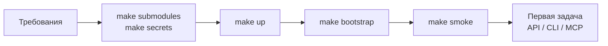

# Быстрый старт

Раздел проводит от чистой машины до первой задачи, прошедшей полный цикл
«создана → взята → исполнена → завершена» в Control Plane. Он рассчитан на
инженера, который поднимает платформу локально или на тестовом сервере; для
промышленного стенда после него переходите в
[Эксплуатацию](../operations/deployment.md).

## Маршрут



| Шаг | Статья | Результат |
|---|---|---|
| 1 | [Требования](requirements.md) | подходящие железо и ПО, свободные порты |
| 2 | [Установка и первый запуск](quickstart.md) | сабмодули, `.env` и ключи, запущенный профиль `core edge` |
| 3 | [Конфигурация .env](configuration.md) | понимание каждой группы переменных и того, что менять для своего стенда |
| 4 | [Bootstrap](bootstrap.md) | tenant, оператор, PAT, workspace, каталог типов задач, service accounts |
| 5 | [Первая задача](first-task.md) | задача, claim, run и завершение через `curl`, CLI и MCP-плагин |

## Самый короткий путь

Для тех, кто хочет сначала увидеть работающий стек, а потом читать:

```bash
git clone --recurse-submodules <url-суперпроекта> taimen && cd taimen
make secrets                       # .env из .env.example + ключи подписи
make up                            # профили core edge
make bootstrap                     # tenant, оператор, PAT, workspace, каталог
make smoke
```

Каждая строка разобрана в [Установке и первом запуске](quickstart.md). Правка
`.env` перед `make up` не нужна: переменные опциональных профилей по умолчанию
пусты.

!!! tip "Что должно получиться"
    `make smoke` показывает `OK` для `iam-service`, `control-plane-api` и
    `memory-service`; в `secrets/` лежит `harness-pat` — PAT оператора; в
    `deploy/state/<имя>.json` — идентификаторы tenant, оператора, проекта и
    workspace. Этого достаточно, чтобы создать первую задачу.

## См. также

- [Состав поставки](../overview/components.md) — какие профили бывают
- [Цели make](../reference/make.md)
- [Установка и запуск — диагностика](../troubleshooting/startup.md)
