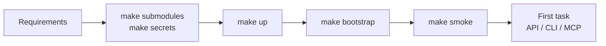

# Getting started

This section takes you from a clean machine to a first task that completes the
full cycle "created → claimed → executed → completed" in Control Plane. It is
written for an engineer who brings up the platform locally or on a test server;
for a production deployment, continue with
[Operations](../operations/deployment.md) afterwards.

## Route



| Step | Page | Result |
|---|---|---|
| 1 | [Requirements](requirements.md) | suitable hardware and software, free ports |
| 2 | [Installation and first launch](quickstart.md) | submodules, `.env` and keys, the `core edge` profile running |
| 3 | [.env configuration](configuration.md) | what each group of variables means and what to change for your deployment |
| 4 | [Bootstrap](bootstrap.md) | tenant, operator, PAT, workspace, task type catalog, service accounts |
| 5 | [First task](first-task.md) | a task, claim, run, and completion via `curl`, the CLI, and the MCP plugin |

## Shortest path

If you want to see a working stack first and read later:

```bash
git clone --recurse-submodules <superproject-url> taimen && cd taimen
make secrets                       # .env from .env.example + signing keys
make up                            # profiles core edge
make bootstrap                     # tenant, operator, PAT, workspace, catalog
make smoke
```

Each line is explained in [Installation and first launch](quickstart.md). You
do not need to edit `.env` before `make up`: variables of the optional profiles
are empty by default.

!!! tip "Expected result"
    `make smoke` shows `OK` for `iam-service`, `control-plane-api`, and
    `memory-service`; `secrets/` contains `harness-pat`, the operator's PAT;
    `deploy/state/<name>.json` holds the IDs of the tenant, operator, project,
    and workspace. This is enough to create your first task.

## See also

- [Delivery contents](../overview/components.md): which profiles exist
- [Make targets](../reference/make.md)
- [Installation and startup (troubleshooting)](../troubleshooting/startup.md)
