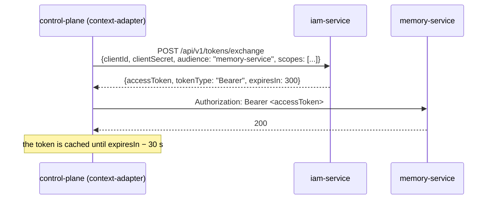

# Service accounts

A service account is a platform service's own machine identity. This article
describes when you need one, how to create it, how a service gets a token
with client credentials, and how to change or revoke the secret. It is for
engineers who connect a service and for installation administrators.

## Why a service needs its own identity


An IAM token is issued for exactly one audience. When Control Plane needs to
call memory or another service, it cannot "forward" the user's token: that
token is issued for the `control-plane` audience and is rejected by any other
service. So the service presents **its own** credential and gets a token for
the audience it needs.



| | Service account | PAT |
|---|---|---|
| Kind of principal | `service_account` | `human` or `agent` |
| Credential | `clientId` + `clientSecret` | `iam_pat_…` |
| How the server stores the secret | Argon2 hash | SHA-256 of the full token |
| Credential lifetime | unlimited, until revoked | limited (`expiresAt`) |
| Multiple audiences | yes | yes |
| Empty `scopes` on exchange | token **without** scopes | the whole ceiling |
| `principal_type` in the token | `service_account` | `human`/`agent` |
| `scope_ceiling`, `session_id` in the token | no | yes |

## Creating a service account

```bash
curl -s -X POST "$IAM_URL/api/v1/tenants/$TENANT/service-accounts" \
  -H "X-IAM-Bootstrap-Token: $IAM_BOOTSTRAP_TOKEN" \
  -H 'Content-Type: application/json' \
  -d '{
        "displayName": "Reports Service",
        "audiences": ["control-plane", "memory-service"],
        "scopeCeiling": ["control-plane:read", "memory:read"]
      }'
```

```json
{
  "principalId": "<principal-id>",
  "clientId": "iam_sa_<random string>",
  "clientSecret": "<secret>"
}
```

A single call creates a principal of kind `service_account`, its membership in
the tenant, and the service account record.

| Request field | Required | Rules |
|---|---|---|
| `displayName` | yes | 1–200 characters |
| `audiences` | yes | at least one; all must be active audiences of the tenant, otherwise `422 unknown_audience` |
| `scopeCeiling` | no | scope ceiling; on creation it is **not** checked against `allowedScopes`; anything extra is simply not issued on exchange |

!!! danger "The secret is shown once"
    `clientSecret` is returned only in the creation response. The server
    stores an Argon2 hash. Write the pair to a file with `0600` permissions
    right away (in a typical installation, `secrets/<service>-iam.env`) and
    do not print it to logs.

## Exchanging client credentials for a token

```bash
curl -s -X POST "$IAM_URL/api/v1/tokens/exchange" \
  -H 'Content-Type: application/json' \
  -d '{"clientId":"iam_sa_…","clientSecret":"…","audience":"memory-service","scopes":["memory:read"]}'
```

```json
{"accessToken": "eyJ…", "tokenType": "Bearer", "expiresIn": 300}
```

Checks:

1. `clientId` exists and is not revoked, and the secret matches; otherwise `401 invalid_client`.
2. The principal and its membership in the tenant are active; otherwise `401 invalid_client`.
3. `audience` is in the service account's `audiences` and is active in the
   tenant; otherwise `403 audience_not_allowed`.
4. Each requested scope is in **both** `scopeCeiling` **and** the audience's
   `allowedScopes`; otherwise `403 scope_not_allowed`.

On success, `last_used_at` is updated and `tokens.exchange` is written to audit.

!!! warning "Request scopes explicitly"
    An empty `scopes` yields a token with `"scope": []`. A recipient that
    requires a scope responds with `403`. Pass the full list of scopes you need.

### Ready-made client in the SDK

Services do not need to write the exchange by hand:
[platform-auth-sdk](../sdk/platform-auth-sdk.md) has `ServiceTokenProvider`,
which exchanges client credentials, caches the token until 30 s before it
expires, and drops the cache on `forget()` (for example, after a `401` from
the recipient):

```python
from platform_auth.service_identity import ServiceCredentials, ServiceTokenProvider

tokens = ServiceTokenProvider(
    "http://iam-service:8010",
    ServiceCredentials(
        client_id=settings.iam_client_id,
        client_secret=settings.iam_client_secret,
        audience="memory-service",
        scopes=("memory:read",),
    ),
)
access_token = await tokens()   # exchange or a cached value
```

The SDK does not pass exchange errors through (the response body might echo
the secret): the provider raises `VerificationUnavailable("service_token_exchange_failed")`.

## Service accounts of a typical installation

`make bootstrap` (`deploy/bootstrap.py`) creates the following service
accounts and writes their credentials to `secrets/` (0600). Services pick up
the files through `env_file` in `compose.yml`.


| Service account | Audiences | Ceiling | File | Used by |
|---|---|---|---|---|
| Control Plane | `memory-service` | `memory:read`, `memory:write`, `memory:tenants`, `memory:on-behalf`, `memory:service` | `control-plane-iam.env` (`CP_IAM_CLIENT_ID`, `CP_IAM_CLIENT_SECRET`) | control-plane-api, worker, context-adapter |

!!! note "A service account is also a principal in Control Plane"
    If a service account calls Control Plane (as a connector or the
    notification service does), it needs, like any principal, a local core
    principal and a binding with permissions. Bootstrap creates them
    automatically. See [Authorization and permissions](../control-plane/authorization.md).

After an env file appears or changes, recreate the services so they read it,
for example:
`docker compose up -d control-plane-api control-plane-worker context-adapter`.

## Changing the secret or the ceiling

A service account has **no** endpoints for secret rotation or for changing
`audiences`/`scopeCeiling`. The replacement procedure is "issue a new one,
switch over, revoke the old one":

1. Create a new service account with the audiences and ceiling you need
   (`POST …/service-accounts`).
2. Write the new pair to the service's env file (0600).
3. Recreate the service containers and make sure the exchange works.
4. Revoke the old `clientId`:

    ```bash
    curl -s -X POST \
      "$IAM_URL/api/v1/tenants/$TENANT/service-accounts/$OLD_CLIENT_ID:revoke" \
      -H "X-IAM-Bootstrap-Token: $IAM_BOOTSTRAP_TOKEN"
    # 204
    ```

!!! warning "A new service account is a new principal"
    Each creation makes a **new** principal with a new `principal_id` (`sub`
    in the token). If the recipient ties permissions to the principal (for
    example, a binding in Control Plane), you must create the binding for the
    new principal as well. `deploy/bootstrap.py` reissues the core service
    account itself when its ceiling in the code changes, and revokes the old one.

## Revocation

`POST …/service-accounts/{clientId}:revoke`:

- sets `revoked_at`; a repeated call is idempotent (`204`);
- publishes a `credential.revoked` event (aggregate `service_account`) and
  writes the audit record `service_accounts.revoke`;
- all subsequent exchanges for this `clientId` get `401 invalid_client`.

Tokens already issued live until `exp` (up to 300 s by default); see
[revocation window](tokens.md#revocation-window).

Disabling the service account's principal (`:disable`) also closes exchange
(`invalid_client`), but the service account record is not marked as revoked.

## Errors

| HTTP | `detail` | Operation | Cause |
|---|---|---|---|
| 401 | `unauthorized` | creation, revocation | missing or wrong `X-IAM-Bootstrap-Token` |
| 401 | `invalid_client` | exchange | unknown/revoked `clientId`, wrong secret, inactive principal or membership |
| 403 | `audience_not_allowed` | exchange | the audience is not in the service account's list or is not active |
| 403 | `scope_not_allowed` | exchange | scope outside the ceiling or outside `allowedScopes` (a common cause is a missing prefix) |
| 404 | `service_account_not_found` | revocation | `clientId` not found in the tenant |
| 422 | `unknown_audience` | creation | the audience is not registered or is disabled |

## See also

- [Tokens, audiences, scopes](tokens.md)
- [platform-auth-sdk](../sdk/platform-auth-sdk.md)
- [Service clients](../sdk/clients.md)
- [Secrets and rotation](../operations/secrets.md)
- [IAM API](api.md#service-accounts)
