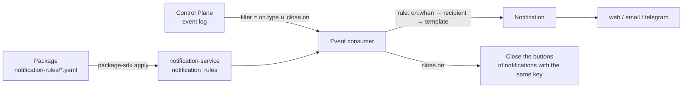

# Notification rules

Which Control Plane events become notifications to people — to whom, with what text, links,
and decision buttons — is described by **notification rules**: the `NotificationRule`
catalog kind. `notification-service` stores, validates, and executes them, while in git they
live in a package, like task types and work rules. The article is for package authors and
installation administrators. Rationale: TAI-ADR-0053 (item 4) and ADR-0005 of the
notification service.

## Why rules

A new kind of notification about a core event is a package edit, not a service release.
Channels, recipient preferences, organization mandatory rules, and groups are already service
data (see [Notifications](index.md)); a rule adds what is missing — **what** turns into a
notification.



!!! warning "Without rules the service does not read events"
    The service has no built-in "event → notification" table. As long as the tenant has no
    enabled rule, the event consumer does not start. The previous behavior is the three rules
    of the `notify` package (below): apply the package right after installing the service.

## Example

```yaml
# yaml-language-server: $schema=https://github.com/taimen-ai/package-sdk/raw/<tag>/schema/v1/object.schema.json
apiVersion: taimen.ai/v1
kind: NotificationRule
key: approval-requested
spec:
  description: >-
    A decision request with buttons to the assigned decider; the decision outcome
    closes the buttons.
  "on": {type: approval.requested}
  recipient: {kind: assigned}
  notification:
    type: approval.requested
    title: "Decision needed: {{task.publicId}} {{task.title}}"
    body: |-
      Work: {{task.publicId}} {{task.title}}
      Requested by: {{payload.requestedBy.displayName}}
      Comment: {{payload.comment}}
    links:
      - {label: Open task, url: "${TASK_URL_BASE}/{{task.publicId}}"}
    actions: [approvalDecide]
  dedupKeyTemplate: "control-plane:approval:{{event.entityId}}"
  close:
    "on": [approval.approved, approval.rejected, approval.cancelled]
```

`package-sdk init` writes the `$schema` line: the address of the schema of the SDK release whose tag it was installed from (in a working copy without a tag, a relative path to the installed SDK's schema).

!!! warning "The `on` key must be quoted"
    YAML 1.1 loaders (including the one the installer uses to read packages) read a bare `on`
    as `true`, and the specification loses a required field. Write `"on":`.

## Specification

| Field | Required | Meaning |
|---|---|---|
| `on.type` | yes | A core catalog event type (`approval.requested`) or a prefix (`approval.*`) |
| `on.when` | no | A condition in the core rule grammar over the roots `payload`, `event`, `task`; default `true` |
| `recipient` | yes | To whom (see [Recipient](#recipient)) |
| `notification.type` | yes | Notification type (`^[a-z][a-z0-9_]*(\.[a-z][a-z0-9_]*)+$`): recipient preferences and organization mandatory rules work by it |
| `notification.title` | yes | Title template, up to 300 characters |
| `notification.body` | no | Text template, up to 4000 characters |
| `notification.links` | no | Up to 5 links `{label, url}`, both are templates |
| `notification.actions` | no | `[approvalDecide]` — the decision's "Approve" / "Reject" buttons |
| `dedupKeyTemplate` | no | Deduplication key template; default `rule:<key>:event:{{event.id}}` |
| `close.on` | no | Event types that close the buttons of the notification with the same key |
| `close.outcome` | no | Outcome template shown instead of the buttons; defaults to the last segment of the closing event type (`approved`, `rejected`, `cancelled`) |
| `status` | no | `enabled` (default) or `disabled` — the rule is stored but not executed |
| `description` | no | Text for people, up to 2000 characters |

An unknown field at any level fails validation. The rule key is `^[a-z0-9][a-z0-9._-]*$`, up
to 128 characters.

### Recipient { #recipient }

| `recipient.kind` | Who receives it |
|---|---|
| `assigned` | The assigned decider: the principal at the `ref` path (default `payload.assignedPrincipalId`); if the path is empty — holders of the `payload.requiredRoleId` role in the workspace (`workspace`, default `payload.workspaceId`, otherwise `event.workspaceId`) |
| `role` | Holders of the role whose id is at the `ref` path, in the workspace at the `workspace` path (default `event.workspaceId`) |
| `taskOwner` | The owner of the event's task (`task.ownerId`) |
| `taskAssignee` | The assignee of the event's task (`task.assigneeId`) |
| `principal` | A specific principal: `ref` is a UUID. The package installer substitutes an installation `${VARIABLE}`; the service stores and accepts only a UUID |

`fallback` — `taskOwner`, `taskAssignee`, or `none` (default): a second recipient if the
first is empty. If there is still no recipient after `fallback`, no notification is created,
and the rule key and event id are written to the service log. A role without holders gives a
delivery log entry without recipients. If the principal or role is unknown to the core, the
event is skipped for this rule.

### Addressee from a process event { #process-recipients }

Process deadline events (`process.sla_warning`, `process.sla_breached`,
`process.sla_failed`) carry their addressees themselves: `payload.owner` is
the process owner, `payload.assignee` is the step's assignee. Both have the
form `{principalId, roleId, workspaceId}`, with one of `principalId` and
`roleId` filled in (see [Deadlines and SLA](../processes/index.md#sla-recipients)).
The rule needs no person's id in an installation variable: the process
`owner` decides whom to notify.

```yaml
# yaml-language-server: $schema=https://github.com/taimen-ai/package-sdk/raw/<tag>/schema/v1/object.schema.json
apiVersion: taimen.ai/v1
kind: NotificationRule
key: process-sla-breached
spec:
  description: Срок шага процесса нарушен — уведомление владельцу процесса.
  "on":
    type: process.sla_breached
    when: {eq: [{var: payload.scope}, step]}
  recipient: {kind: role, ref: payload.owner.roleId, workspace: payload.owner.workspaceId}
  notification:
    type: process.sla_breached
    title: "Нарушен срок: {{payload.definitionKey}} {{payload.instanceKey}}"
    body: |-
      Шаг «{{payload.element}}» (попытка {{payload.attempt}}) не закрыт в срок {{payload.dueAt}}.
      Просрочка, с: {{payload.overdueSeconds}}.
  dedupKeyTemplate: "process-sla:{{payload.instanceId}}:{{payload.scope}}:{{payload.element}}:{{payload.attempt}}"
```

- **Owner as a role**: `kind: role` with `ref: payload.owner.roleId` and
  `workspace: payload.owner.workspaceId`; the holders of the role in the
  process workspace receive the notification.
- **Owner as a principal**: a separate rule with `kind: assigned` and
  `ref: payload.owner.principalId`. Each event has one of the fields filled
  in, and a rule whose addressee is empty creates no notification, so two
  rules side by side do not duplicate each other.
- **Step assignee**: the same forms on `payload.assignee`.
- **Deadline of the whole process** (`scope: process`): a rule of its own.
  Its `element` and `attempt` are empty, and a deduplication key built from
  them would be empty, so the rule skips such an event. The key of the
  process deadline is `process-sla:{{payload.instanceId}}:process`.
- The owner did not resolve (the role is not set up): `owner` is empty, there
  is no addressee, and no notification is created; the event stays in the
  core log.

For one step attempt the core writes at most one `process.sla_warning` and
one `process.sla_breached`, so the key "instance + scope + step + attempt"
gives one notification per breach, and re-entering the step gives a new one.

An escalation level with `action: notify` (the `process.escalated` event)
carries its own addressees in `payload.addressees`: one per element of the
level's `to`, in its order, in the same `{principalId, roleId, workspaceId}`
form. The core looks a role up first in the instance workspace, then at the
tenant level. An unresolved element is `null` in `addressees` plus an entry
with the reason in `payload.unresolved`. One rule addresses one index; a
level with several addressees needs a rule per index:

```yaml
# yaml-language-server: $schema=https://github.com/taimen-ai/package-sdk/raw/<tag>/schema/v1/object.schema.json
apiVersion: taimen.ai/v1
kind: NotificationRule
key: process-escalation-notify
spec:
  description: Уровень эскалации notify — уведомление первому адресату уровня.
  "on":
    type: process.escalated
    when: {eq: [{var: payload.action}, notify]}
  recipient: {kind: role, ref: payload.addressees.0.roleId, workspace: payload.addressees.0.workspaceId}
  notification:
    type: process.escalated
    title: "Эскалация: {{payload.definitionKey}} {{payload.instanceKey}}"
    body: "Шаг «{{payload.element}}» не сделан в срок, уровень {{payload.level}}."
  dedupKeyTemplate: "process-escalated:{{payload.instanceId}}:{{payload.element}}:{{payload.level}}:0:{{event.id}}"
```

- **Addressee as a role**: `kind: role` with `ref: payload.addressees.0.roleId`
  and `workspace: payload.addressees.0.workspaceId`, as above. If the role
  exists neither in the instance workspace nor at the tenant level,
  `addressees[0]` is empty and the rule creates no notification.
- **Addressee as a principal**: for `to: [{agent: …}]` or a principal id the
  core fills in `addressees.<i>.principalId`, and `roleId` is empty. Such an
  addressee needs a separate rule with `kind: assigned` and
  `ref: payload.addressees.0.principalId`, as for an owner principal: the
  addressee has one of the fields filled in, and two rules side by side do
  not duplicate each other.
- **Key**: instance, step, level, addressee index, and `event.id`. The level
  number counts within a step, and a step can be entered again (a `retry`
  block repeat, a return for rework): the core writes one `process.escalated`
  per step entry and level, and each such event is a new notification.
  Redelivery of the same event does not change `event.id`, so there is one
  notification.

### Templates and roots

A template is a string with `{{ path }}` placeholders, where the path is
`root(.segment)*`. Templates have no conditions, loops, calls, or filters: different texts
are different rules with different `on.when`.

| Root | What it is |
|---|---|
| `payload` | The event body per the core event catalog schema |
| `event` | The event envelope: `id`, `type`, `entityType`, `entityId`, `workspaceId`, `actorId`, `occurredAt`, … |
| `task` | The core task projection (`id`, `publicId`, `title`, `status`, `ownerId`, `assigneeId`, `typeKey`, `customFields`, …): the task of the event's entity or `payload.taskId`. It is read only if the rule refers to the `task` root |

A path that ends with `displayName` after a principal identifier
(`{{payload.requestedBy.displayName}}`, `{{event.actorId.displayName}}`,
`{{task.ownerId.displayName}}`) substitutes the principal's name from the core catalog.

Substitution rules:

- a missing value is an empty string; a scalar is its text; objects and lists are not
  substituted;
- in `title`, line breaks collapse into a space; a title that is empty after substitution is
  replaced with `notification.type`;
- a `body` line in which all placeholders produced nothing is dropped entirely — so optional
  lines ("Comment: …") disappear on their own;
- a link is dropped if any placeholder of its `url` produced nothing or the result is not an
  absolute `http(s)` URL. Write the interface address base as an installation variable
  (`${TASK_URL_BASE}`); the package installer substitutes it;
- if a placeholder in the deduplication key produced nothing, or the key is longer than 200
  characters, the rule is skipped for this event with a log entry: a key missing a part would
  merge notifications of different events;
- a template sees no secrets: the roots are only event fields and the task projection.

`approvalDecide` builds the `approve` and `reject` actions with `data = {kind:
approval.decide, approvalId, decision}`, where `approvalId` is the `event.entityId` of the
`approval.*` event. They are executed by a channel with buttons (see
[Telegram](telegram.md#decisions)).

## Execution

- **The consumer filter** is the union of `on.type` and `close.on` of enabled rules; a prefix
  `x.*` is passed to the core as `x.`. When the rule set changes, the consumer restarts with
  the same cursor on the new filter within one polling cycle (`NS_EVENTS_POLL_SECONDS`, 30 s
  by default); applying a rule through the API wakes up the consumer of its own process
  immediately.
- **On an event** — all matching rules in key order (`on.type` matches, `on.when` is true);
  each produces at most one notification. An error in one rule is logged with the rule key
  and does not affect the others. Core unavailability fails processing of the whole event,
  and the consumer retries it.
- **Closing** — an event from `close.on`: the service renders `dedupKeyTemplate` over the
  closing event and closes the actions of the notification with that key:
  `actionsOutcome = {status, by, channel, at}`. The first closing wins. That is why the key
  must be derived from what the opening and closing events have in common (for decisions —
  `event.entityId`, the approval id).
- **Version** — an event is processed by the versions in effect at processing time. Already
  created notifications do not change either with a new version or when the rule is retired.

The service creates the notification itself with its service account, like any other — with
channels, recipient preferences, and a delivery log (see [Notifications](index.md)).

## Versions

Rules are stored in the `notification_rules` table per tenant: key, version (1, 2, …),
normalized specification, `specHash` (sha256 of the canonical JSON), state `active` |
`superseded` | `retired`, author, and time.

- Versions are immutable. A `POST` of a specification with the same hash as the current
  version creates nothing (`200`) — reapplying a package is idempotent. A different hash
  creates a new `active` version, and the previous one becomes `superseded` (`201`).
- `:retire` moves the current version to `retired`; a `POST` to a retired key creates the next
  version and makes it current again.
- `status: disabled` is part of the specification and the hash: the version is current but
  not executed.

## Specification validation

One validation for `POST` and `:validate`, in order:

1. **Shape** — the specification's JSON Schema (a copy of `$defs.notificationRuleSpec` of the
   package schema); error code `invalid_spec`. If there are shape errors, the remaining steps
   are not run.
2. **Event types** — against the service's snapshot of the core event catalog: `on.type`
   exists (a prefix matches at least one type), every `close.on` type exists; otherwise
   `unknown_event_type`.
3. **Paths** of conditions and templates: the root is allowed, `payload.<field>` is in the
   schema of every type the rule fires on, `event.<field>` is in the envelope, `task.<field>`
   is in the task projection, and the `task` root is allowed only if the event has a task;
   otherwise `unknown_field`.
4. **Condition** — the core rule grammar (depth ≤ 16, nodes ≤ 256, document ≤ 16 KiB);
   otherwise `invalid_condition`.
5. **Consistency** — `approvalDecide` only for events of the `approval` entity; `principal` —
   `ref` is set and is a UUID; `role` — `ref` is set; otherwise `invalid_rule`.

A refusal is `422 invalid_notification_rule`; `details.errors` contains all found errors
`{path, code, message}`, where `path` is a JSON Pointer into the specification.

```json
{
  "error": {
    "code": "invalid_notification_rule",
    "message": "…",
    "details": {"errors": [
      {"path": "/on/type", "code": "unknown_event_type", "message": "…"}
    ]}
  }
}
```

## Service API

All routes are `https://platform.example.com/notify/api/v1/…` behind the edge (see
[Edge and TLS](../operations/edge-and-tls.md)), scope **`notifications:admin`** only; senders
with `notifications:send` do not see them.

| Method and path | What it does |
|---|---|
| `GET /notification-rules?key=&includeRetired=&limit=&cursor=` | Current rule versions of the tenant: `{items: [{key, version, spec, specHash, state, createdBy, createdAt}], nextCursor}`; 100 by default, no more than 500 |
| `POST /notification-rules` — `{key, spec}` | Apply: `201` — a new version, `200` — the specification has not changed; `422 invalid_notification_rule` |
| `POST /notification-rules:validate` — `{key, spec}` | The same validation without writing: `200 {valid: true, specHash, changed}` or `422` |
| `POST /notification-rules/{key}:retire` | Retire: `200` (a repeat gives the same response), `404` — no such key |

```bash
curl -sS -X POST https://platform.example.com/notify/api/v1/notification-rules:validate \
  -H "Authorization: Bearer $NOTIFY_TOKEN" -H 'Content-Type: application/json' \
  -d '{"key": "task-verified", "spec": {
        "on": {"type": "task.verified"},
        "recipient": {"kind": "taskOwner", "fallback": "taskAssignee"},
        "notification": {"type": "task.verified",
                         "title": "Accepted: {{task.publicId}} {{task.title}}"}}}'
```

```json
{"valid": true, "specHash": "9c1f…", "changed": true}
```

The token is a PAT or client credentials exchange in IAM with `audience:
notification-service` and the `notifications:admin` scope (see
[Tokens, audiences, scopes](../iam/tokens.md)).

## Application by a package

Rules are package objects in the `notification-rules/` folder. The `package-sdk`
installer applies them **to the notification service, not to the core**, and last — after
all core kinds:

1. `plan` — `:validate` of all rules of the installation; a service refusal stops the
   whole plan before anything is written;
2. the plan's `notification-rules` section holds only the rules where `:validate`
   answered `changed: true`; `apply --plan` does `POST` for exactly those, the rest are
   "unchanged";
3. `retire.NotificationRule` of the installation file — `:retire`; notifications already sent
   remain.

The service address is the installation variable **`NOTIFICATION_SERVICE_URL`** (in `.env` or
the environment), for example `https://platform.example.com/notify`. The token is the
`NOTIFY_TOKEN` variable (an access token for the `notification-service` audience, scope
`notifications:admin`) or an exchange, for this audience, of the same IAM credential the
installer uses for the core (the PAT must allow the audience in its ceiling). An
installation with notification rules is not planned without the service address and the
token: `plan` refuses.

```bash
export CP_TOKEN=<access-token audience control-plane>
export NOTIFY_TOKEN=<access-token audience notification-service>
package-sdk plan --install deploy/<environment>/packages.yaml \
  --server https://platform.example.com --out plan.json
package-sdk apply --plan plan.json --server https://platform.example.com
```

```text
   NotificationRule/approval-requested: v1 без изменений
   NotificationRule/task-verified: опубликована v1 (нет в сервисе)
```

Exporting the current version into a package (the core is not needed):

```bash
package-sdk export --kind NotificationRule --key task-verified \
  --package packages/<package>
```

## Rules of the `notify` package

The `notify` package carries three rules — the service's default behavior. They need the
installation variable `TASK_URL_BASE` — the base of the "Open task" link, to which
`/<publicId>` is appended.

| Key | Event and condition | Recipient | What it does |
|---|---|---|---|
| `approval-requested` | `approval.requested` | `assigned` | A decision request with "Approve" / "Reject" buttons; `approval.approved`, `approval.rejected`, `approval.cancelled` close the buttons (key `control-plane:approval:<approval-id>`) |
| `verification-failed` | `task.verification_failed`, `payload.blocked` ≠ `true` | `taskOwner`, otherwise `taskAssignee` | The acceptance verification failed, and the task went back to work |
| `verification-blocked` | `task.verification_failed`, `payload.blocked` = `true` | `taskOwner`, otherwise `taskAssignee` | The verification failed several times in a row, and the task is waiting for a human |

There are two rules on `task.verification_failed` because templates have no conditions:
different texts are set by different rules with opposite `on.when`. The deduplication keys
match the service's previous keys, so switching to rules does not duplicate notifications
already created.

You add your own notification with a new file in your own package (for example, "task
accepted" on `task.verified` to the owner) and `apply` — without a service release.

## Common problems

| Symptom | Cause | What to do |
|---|---|---|
| No event notifications at all | The tenant has no enabled rules — the consumer is not running | Apply the `notify` package (with `NOTIFICATION_SERVICE_URL` and the token set) |
| The plan is not built: `в установке есть правила уведомлений — нужен сервис уведомлений` (the installation has notification rules: the notification service is needed) | No `NOTIFICATION_SERVICE_URL` or token | Set the variable and `NOTIFY_TOKEN` (or a PAT with the `notification-service` audience) |
| `422 invalid_notification_rule`, `unknown_event_type` | The event type is not from the core catalog known to the service | Check the type; a new event type reaches the service with its update |
| `invalid_spec` at `/on` | An unquoted `on` turned into `true` | Write `"on":` |
| `unknown_field` at a `task.…` path | The event has no task, or the field is not in the task projection | Remove the `task` root or change the event |
| No "Open task" link | `TASK_URL_BASE` is empty or the result is not an absolute URL | Set the installation variable and apply the package |
| The buttons did not close after the decision | The `dedupKeyTemplate` of the opening and closing events produces different keys | Build the key from `event.entityId` |
| `403` on `/notification-rules` | The token lacks the `notifications:admin` scope | Issue a token with this scope |

## See also

- [Notifications](index.md) — channels, recipients, delivery log, event consumer.
- [Telegram](telegram.md) — decisions with buttons.
- [Catalog packages](../control-plane/catalog-packages.md) — the `NotificationRule` kind.
- [Events](../control-plane/events.md) — the core event catalog.
- [Processes](../processes/index.md#sla) — SLA deadlines and the `process.sla_*` events.
- [Goals, acceptance, and evidence](../control-plane/goals-and-evidence.md#verification-stage) — `task.verification_failed`.
- [Approvals](../control-plane/approvals.md)
