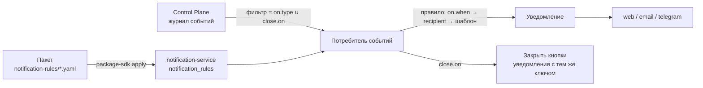

# Правила уведомлений

Какие события Control Plane становятся уведомлениями людям — кому, с каким
текстом, ссылками и кнопками решения — описывают **правила уведомлений**: вид
каталога `NotificationRule`. Их хранит, проверяет и исполняет
`notification-service`, а в git они живут в пакете, как типы задач и правила
вывода работы. Статья для авторов пакетов и администраторов установки.
Обоснование — TAI-ADR-0053 (п.4) и ADR-0005 сервиса уведомлений.

## Зачем правила

Новый вид уведомления о событии ядра — правка пакета, а не выпуск сервиса.
Каналы, настройки получателя, обязательные правила организации и группы уже
данные сервиса (см. [Уведомления](index.md)); правило добавляет недостающее —
**что** превращается в уведомление.



!!! warning "Без правил сервис событий не читает"
    Встроенной таблицы «событие → уведомление» в сервисе нет. Пока в tenant'е нет
    ни одного включённого правила, потребитель событий не запускается. Прежнее
    поведение — три правила пакета `notify` (ниже): применяйте пакет сразу после
    установки сервиса.

## Пример

```yaml
# yaml-language-server: $schema=https://github.com/taimen-ai/package-sdk/raw/<тег>/schema/v1/object.schema.json
apiVersion: taimen.ai/v1
kind: NotificationRule
key: approval-requested
spec:
  description: >-
    Назначенному решающему — запрос решения с кнопками; исход решения
    закрывает кнопки.
  "on": {type: approval.requested}
  recipient: {kind: assigned}
  notification:
    type: approval.requested
    title: "Нужно решение: {{task.publicId}} {{task.title}}"
    body: |-
      Работа: {{task.publicId}} {{task.title}}
      Запрашивает: {{payload.requestedBy.displayName}}
      Комментарий: {{payload.comment}}
    links:
      - {label: Открыть задачу, url: "${TASK_URL_BASE}/{{task.publicId}}"}
    actions: [approvalDecide]
  dedupKeyTemplate: "control-plane:approval:{{event.entityId}}"
  close:
    "on": [approval.approved, approval.rejected, approval.cancelled]
```

Строку `$schema` пишет `package-sdk init`: адрес схемы того выпуска SDK, с тега которого он поставлен (в рабочей копии без тега — относительный путь к схеме установленного SDK).

!!! warning "Ключ `on` — в кавычках"
    Загрузчики YAML 1.1 (в том числе тот, которым установщик читает пакеты) читают
    голый `on` как `true`, и спецификация теряет обязательное поле. Пишите `"on":`.

## Спецификация

| Поле | Обязательно | Смысл |
|---|---|---|
| `on.type` | да | Тип события каталога ядра (`approval.requested`) или префикс (`approval.*`) |
| `on.when` | нет | Условие грамматики правил ядра над корнями `payload`, `event`, `task`; по умолчанию `true` |
| `recipient` | да | Кому (см. [Адресат](#recipient)) |
| `notification.type` | да | Тип уведомления (`^[a-z][a-z0-9_]*(\.[a-z][a-z0-9_]*)+$`): по нему работают настройки получателя и обязательные правила организации |
| `notification.title` | да | Шаблон заголовка, до 300 символов |
| `notification.body` | нет | Шаблон текста, до 4000 символов |
| `notification.links` | нет | До 5 ссылок `{label, url}`, оба — шаблоны |
| `notification.actions` | нет | `[approvalDecide]` — кнопки «Одобрить» / «Отклонить» решения |
| `dedupKeyTemplate` | нет | Шаблон ключа дедупликации; по умолчанию `rule:<key>:event:{{event.id}}` |
| `close.on` | нет | Типы событий, которые закрывают кнопки уведомления с тем же ключом |
| `close.outcome` | нет | Шаблон исхода вместо кнопок; по умолчанию — последний сегмент типа закрывающего события (`approved`, `rejected`, `cancelled`) |
| `status` | нет | `enabled` (по умолчанию) или `disabled` — правило хранится, но не исполняется |
| `description` | нет | Текст для людей, до 2000 символов |

Неизвестное поле на любом уровне — отказ проверки. Ключ правила —
`^[a-z0-9][a-z0-9._-]*$`, до 128 символов.

### Адресат { #recipient }

| `recipient.kind` | Кто получает |
|---|---|
| `assigned` | Назначенный решающий: principal по пути `ref` (по умолчанию `payload.assignedPrincipalId`); путь пуст — держатели роли `payload.requiredRoleId` в workspace (`workspace`, по умолчанию `payload.workspaceId`, иначе `event.workspaceId`) |
| `role` | Держатели роли, id которой по пути `ref`, в workspace по пути `workspace` (по умолчанию `event.workspaceId`) |
| `taskOwner` | Владелец задачи события (`task.ownerId`) |
| `taskAssignee` | Исполнитель задачи события (`task.assigneeId`) |
| `principal` | Конкретный principal: `ref` — UUID. `${ПЕРЕМЕННАЯ}` установки подставляет установщик пакетов; сервис хранит и принимает только UUID |

`fallback` — `taskOwner`, `taskAssignee` или `none` (по умолчанию): второй
адресат, если первый пуст. Адресата нет и после `fallback` — уведомление не
создаётся, в журнал сервиса пишутся ключ правила и id события. Роль без
держателей — запись в журнале доставки без адресатов. Principal или роль,
неизвестные ядру, — событие для этого правила пропускается.

### Адресат из события процесса { #process-recipients }

События сроков процесса (`process.sla_warning`, `process.sla_breached`,
`process.sla_failed`) сами несут адресатов: `payload.owner` — владелец
процесса, `payload.assignee` — исполнитель шага. Оба в форме
`{principalId, roleId, workspaceId}`, заполнено одно из `principalId` и
`roleId` (см. [Сроки и SLA](../processes/index.md#sla-recipients)). Правилу
не нужен id человека в переменной установки: кому писать, решает `owner`
процесса.

```yaml
# yaml-language-server: $schema=https://github.com/taimen-ai/package-sdk/raw/<тег>/schema/v1/object.schema.json
apiVersion: taimen.ai/v1
kind: NotificationRule
key: process-sla-breached
spec:
  description: Срок шага процесса нарушен — уведомление владельцу процесса.
  "on":
    type: process.sla_breached
    when: {eq: [{var: payload.scope}, step]}
  recipient: {kind: role, ref: payload.owner.roleId, workspace: payload.owner.workspaceId}
  notification:
    type: process.sla_breached
    title: "Нарушен срок: {{payload.definitionKey}} {{payload.instanceKey}}"
    body: |-
      Шаг «{{payload.element}}» (попытка {{payload.attempt}}) не закрыт в срок {{payload.dueAt}}.
      Просрочка, с: {{payload.overdueSeconds}}.
  dedupKeyTemplate: "process-sla:{{payload.instanceId}}:{{payload.scope}}:{{payload.element}}:{{payload.attempt}}"
```

- **Владелец-роль** — `kind: role` с `ref: payload.owner.roleId` и
  `workspace: payload.owner.workspaceId`: уведомление получают держатели
  роли в workspace процесса.
- **Владелец-principal** — отдельное правило с `kind: assigned` и
  `ref: payload.owner.principalId`. У каждого события заполнено одно из
  полей, и правило, чей адресат пуст, уведомления не создаёт — два правила
  рядом не дублируют друг друга.
- **Исполнитель шага** — те же формы по `payload.assignee`.
- **Срок процесса целиком** (`scope: process`) — своё правило: у него
  `element` и `attempt` пусты, и ключ дедупликации с ними был бы пуст —
  такое событие правило пропускает. Ключ срока процесса —
  `process-sla:{{payload.instanceId}}:process`.
- Владелец не разрешился (роль не заведена) — `owner` пуст, адресата нет,
  уведомление не создаётся; событие в журнале ядра остаётся.

На одну попытку шага ядро пишет не больше одного `process.sla_warning` и
одного `process.sla_breached`, поэтому ключ «экземпляр + scope + шаг +
попытка» даёт одно уведомление на нарушение, а повторный вход в шаг — новое.

Уровень эскалации с `action: notify` (событие `process.escalated`) несёт
своих адресатов в `payload.addressees` — по одному на каждый элемент `to`
уровня, в его порядке, в той же форме `{principalId, roleId, workspaceId}`.
Роль ядро ищет сначала в workspace экземпляра, затем на уровне tenant.
Неразрешённый элемент — `null` в `addressees` и запись с причиной в
`payload.unresolved`. Одно правило адресует один индекс; уровню с
несколькими адресатами — правило на каждый индекс:

```yaml
# yaml-language-server: $schema=https://github.com/taimen-ai/package-sdk/raw/<тег>/schema/v1/object.schema.json
apiVersion: taimen.ai/v1
kind: NotificationRule
key: process-escalation-notify
spec:
  description: Уровень эскалации notify — уведомление первому адресату уровня.
  "on":
    type: process.escalated
    when: {eq: [{var: payload.action}, notify]}
  recipient: {kind: role, ref: payload.addressees.0.roleId, workspace: payload.addressees.0.workspaceId}
  notification:
    type: process.escalated
    title: "Эскалация: {{payload.definitionKey}} {{payload.instanceKey}}"
    body: "Шаг «{{payload.element}}» не сделан в срок, уровень {{payload.level}}."
  dedupKeyTemplate: "process-escalated:{{payload.instanceId}}:{{payload.element}}:{{payload.level}}:0:{{event.id}}"
```

- **Адресат-роль** — `kind: role` с `ref: payload.addressees.0.roleId` и
  `workspace: payload.addressees.0.workspaceId`, как выше. Роли нет ни в
  workspace экземпляра, ни на уровне tenant — `addressees[0]` пуст, и
  правило уведомления не создаёт.
- **Адресат-principal** — для `to: [{agent: …}]` или id principal ядро
  заполняет `addressees.<i>.principalId`, а `roleId` пуст. Такому адресату
  нужно отдельное правило с `kind: assigned` и
  `ref: payload.addressees.0.principalId` — как у владельца-principal: у
  адресата заполнено одно из полей, и два правила рядом не дублируют друг
  друга.
- **Ключ** — экземпляр, шаг, уровень, индекс адресата и `event.id`. Номер
  уровня считается в пределах шага, а шаг может входиться повторно (повтор
  блока `retry`, возврат на доработку): ядро пишет одно `process.escalated` на
  вход в шаг и уровень, и каждое такое событие — новое уведомление. Повторная
  доставка того же события `event.id` не меняет — уведомление одно.

### Шаблоны и корни

Шаблон — строка с плейсхолдерами `{{ путь }}`, путь — `корень(.сегмент)*`.
Условий, циклов, вызовов и фильтров в шаблонах нет: разные тексты — разные
правила с разными `on.when`.

| Корень | Что это |
|---|---|
| `payload` | Тело события по схеме каталога событий ядра |
| `event` | Конверт события: `id`, `type`, `entityType`, `entityId`, `workspaceId`, `actorId`, `occurredAt`, … |
| `task` | Проекция задачи ядра (`id`, `publicId`, `title`, `status`, `ownerId`, `assigneeId`, `typeKey`, `customFields`, …): задача сущности события или `payload.taskId`. Читается, только если правило обращается к корню `task` |

Путь, который заканчивается `displayName` после идентификатора principal'а
(`{{payload.requestedBy.displayName}}`, `{{event.actorId.displayName}}`,
`{{task.ownerId.displayName}}`), подставляет имя principal'а из каталога ядра.

Правила подстановки:

- отсутствующее значение — пустая строка; скаляр — его текст; объект и список
  не подставляются;
- в `title` переводы строк сворачиваются в пробел; пустой после подстановки
  заголовок заменяется `notification.type`;
- строка `body`, в которой все плейсхолдеры дали пусто, опускается целиком — так
  необязательные строки («Комментарий: …») исчезают сами;
- ссылка опускается, если хоть один плейсхолдер её `url` дал пусто или результат
  не абсолютный `http(s)` URL. Базу адреса интерфейса пишите переменной установки
  (`${TASK_URL_BASE}`), её подставляет установщик пакетов;
- ключ дедупликации, в котором плейсхолдер дал пусто, или длиннее 200 символов —
  правило для этого события пропускается с записью в журнал: ключ без части
  склеил бы уведомления разных событий;
- секретов шаблон не видит: корни — только поля события и проекции задачи.

`approvalDecide` строит действия `approve` и `reject` с `data = {kind:
approval.decide, approvalId, decision}`, где `approvalId` — `event.entityId`
события `approval.*`. Их исполняет канал с кнопками (см.
[Telegram](telegram.md#decisions)).

## Исполнение

- **Фильтр потребителя** — объединение `on.type` и `close.on` включённых правил;
  префикс `x.*` передаётся ядру как `x.`. Набор правил изменился — потребитель
  перезапускается с тем же курсором на новом фильтре в течение одного цикла
  опроса (`NS_EVENTS_POLL_SECONDS`, по умолчанию 30 с); применение правила через
  API будит потребитель своего процесса сразу.
- **На событие** — все подходящие правила по порядку ключей (`on.type` совпадает,
  `on.when` истинно); каждое даёт не больше одного уведомления. Ошибка одного
  правила пишется в журнал с ключом правила и не мешает остальным.
  Недоступность ядра — отказ обработки события целиком, потребитель повторит его.
- **Закрытие** — событие из `close.on`: сервис рендерит `dedupKeyTemplate` над
  закрывающим событием и закрывает действия уведомления с этим ключом:
  `actionsOutcome = {status, by, channel, at}`. Побеждает первое закрытие. Ключ
  поэтому должен выводиться из того, что общее у открывающего и закрывающего
  событий (для решений — `event.entityId`, id approval).
- **Версия** — событие обрабатывается версиями, действующими на момент обработки.
  Уже созданные уведомления не меняются ни при новой версии, ни при выводе правила
  из оборота.

Уведомление создаёт сам сервис своим service account'ом, как любое другое, —
с каналами, настройками получателя и журналом доставки (см.
[Уведомления](index.md)).

## Версии

Правила хранятся в таблице `notification_rules` по tenant'у: ключ, версия (1, 2,
…), нормализованная спецификация, `specHash` (sha256 канонического JSON), состояние
`active` | `superseded` | `retired`, автор и время.

- Версии неизменяемы. `POST` спецификации с тем же хэшем, что у действующей
  версии, ничего не создаёт (`200`) — повторное применение пакета идемпотентно.
  Другой хэш — новая версия `active`, прежняя `superseded` (`201`).
- `:retire` переводит действующую версию в `retired`; `POST` в выведенный ключ
  заводит следующую версию и снова делает её действующей.
- `status: disabled` — часть спецификации и хэша: версия действует, но не
  исполняется.

## Проверка спецификации

Одна проверка для `POST` и `:validate`, по порядку:

1. **Форма** — JSON Schema спецификации (копия `$defs.notificationRuleSpec` схемы
   пакетов); ошибка — код `invalid_spec`. При ошибках формы остальные шаги не
   выполняются.
2. **Типы событий** — по снимку каталога событий ядра в сервисе: `on.type`
   существует (префикс совпадает хотя бы с одним типом), каждый тип `close.on`
   существует; иначе `unknown_event_type`.
3. **Пути** условий и шаблонов: корень допустим, `payload.<поле>` есть в схеме
   каждого типа, на который правило срабатывает, `event.<поле>` — в конверте,
   `task.<поле>` — в проекции задачи, и корень `task` допустим, только если у
   события есть задача; иначе `unknown_field`.
4. **Условие** — грамматика правил ядра (глубина ≤ 16, узлов ≤ 256, документ ≤ 16
   КиБ); иначе `invalid_condition`.
5. **Согласованность** — `approvalDecide` только для событий сущности `approval`;
   `principal` — `ref` задан и это UUID; `role` — `ref` задан; иначе
   `invalid_rule`.

Отказ — `422 invalid_notification_rule`, в `details.errors` — все найденные
ошибки `{path, code, message}`, `path` — JSON Pointer в спецификации.

```json
{
  "error": {
    "code": "invalid_notification_rule",
    "message": "…",
    "details": {"errors": [
      {"path": "/on/type", "code": "unknown_event_type", "message": "…"}
    ]}
  }
}
```

## API сервиса

Все маршруты — `https://platform.example.com/notify/api/v1/…` за периметром (см.
[Периметр и TLS](../operations/edge-and-tls.md)), только scope
**`notifications:admin`**; отправители с `notifications:send` их не видят.

| Метод и путь | Что делает |
|---|---|
| `GET /notification-rules?key=&includeRetired=&limit=&cursor=` | Действующие версии правил tenant'а: `{items: [{key, version, spec, specHash, state, createdBy, createdAt}], nextCursor}`; по умолчанию 100, не больше 500 |
| `POST /notification-rules` — `{key, spec}` | Применить: `201` — новая версия, `200` — спецификация не изменилась; `422 invalid_notification_rule` |
| `POST /notification-rules:validate` — `{key, spec}` | Та же проверка без записи: `200 {valid: true, specHash, changed}` или `422` |
| `POST /notification-rules/{key}:retire` | Вывести из оборота: `200` (повтор — тот же ответ), `404` — ключа нет |

```bash
curl -sS -X POST https://platform.example.com/notify/api/v1/notification-rules:validate \
  -H "Authorization: Bearer $NOTIFY_TOKEN" -H 'Content-Type: application/json' \
  -d '{"key": "task-verified", "spec": {
        "on": {"type": "task.verified"},
        "recipient": {"kind": "taskOwner", "fallback": "taskAssignee"},
        "notification": {"type": "task.verified",
                         "title": "Принято: {{task.publicId}} {{task.title}}"}}}'
```

```json
{"valid": true, "specHash": "9c1f…", "changed": true}
```

Токен — обмен PAT или client credentials в IAM с `audience:
notification-service` и scope `notifications:admin` (см. [Токены, audiences,
scopes](../iam/tokens.md)).

## Применение пакетом

Правила — объекты пакета в папке `notification-rules/`. Установщик
`package-sdk` применяет их **к сервису уведомлений, а не к ядру** и
последними — после всех видов ядра:

1. `plan` — `:validate` всех правил установки; отказ сервиса останавливает план
   целиком, до записи дело не доходит;
2. в секцию плана `notification-rules` попадают только правила, где `:validate`
   ответил `changed: true`; `apply --plan` делает `POST` ровно их, остальные —
   «без изменений»;
3. `retire.NotificationRule` файла установки — `:retire`; отправленные
   уведомления остаются.

Адрес сервиса — переменная установки **`NOTIFICATION_SERVICE_URL`** (в `.env` или
окружении), например `https://platform.example.com/notify`. Токен — переменная
`NOTIFY_TOKEN` (access token audience `notification-service`, scope
`notifications:admin`) или обмен того же IAM credential, которым установщик ходит
в ядро, на этот audience (PAT должен допускать audience в потолке). Установка с
правилами уведомлений без адреса сервиса и токена не планируется: `plan` отказывает.

```bash
export CP_TOKEN=<access-token audience control-plane>
export NOTIFY_TOKEN=<access-token audience notification-service>
package-sdk plan --install deploy/<окружение>/packages.yaml \
  --server https://platform.example.com --out plan.json
package-sdk apply --plan plan.json --server https://platform.example.com
```

```text
   NotificationRule/approval-requested: v1 без изменений
   NotificationRule/task-verified: опубликована v1 (нет в сервисе)
```

Выгрузка действующей версии в пакет (ядро не нужно):

```bash
package-sdk export --kind NotificationRule --key task-verified \
  --package packages/<пакет>
```

## Правила пакета `notify`

Пакет `notify` несёт три правила — поведение сервиса по умолчанию. Им нужна
переменная установки `TASK_URL_BASE` — база ссылки «Открыть задачу», к которой
приклеивается `/<publicId>`.

| Ключ | Событие и условие | Адресат | Что делает |
|---|---|---|---|
| `approval-requested` | `approval.requested` | `assigned` | Запрос решения с кнопками «Одобрить» / «Отклонить»; `approval.approved`, `approval.rejected`, `approval.cancelled` закрывают кнопки (ключ `control-plane:approval:<approval-id>`) |
| `verification-failed` | `task.verification_failed`, `payload.blocked` ≠ `true` | `taskOwner`, иначе `taskAssignee` | Проверка приёмки не пройдена, задача вернулась в работу |
| `verification-blocked` | `task.verification_failed`, `payload.blocked` = `true` | `taskOwner`, иначе `taskAssignee` | Проверка не пройдена несколько раз подряд, задача ждёт человека |

Два правила на `task.verification_failed` — потому что в шаблонах нет условий:
разные тексты задаются разными правилами с противоположными `on.when`. Ключи
дедупликации совпадают с прежними ключами сервиса, поэтому переход на правила не
дублирует уже созданные уведомления.

Своё уведомление добавляется новым файлом в своём пакете (например, «задача
принята» на `task.verified` владельцу) и `apply` — без выпуска сервиса.

## Типичные проблемы

| Симптом | Причина | Что делать |
|---|---|---|
| Уведомлений о событиях нет совсем | В tenant'е нет включённых правил — потребитель не запущен | Применить пакет `notify` (`NOTIFICATION_SERVICE_URL` и токен заданы) |
| План не строится: «в установке есть правила уведомлений — нужен сервис уведомлений» | Нет `NOTIFICATION_SERVICE_URL` или токена | Задать переменную и `NOTIFY_TOKEN` (или PAT с audience `notification-service`) |
| `422 invalid_notification_rule`, `unknown_event_type` | Тип события не из каталога ядра, известного сервису | Проверить тип; новый тип события появляется у сервиса с его обновлением |
| `invalid_spec` на `/on` | `on` без кавычек превратился в `true` | Писать `"on":` |
| `unknown_field` на пути `task.…` | У события нет задачи или поле не из проекции задачи | Убрать корень `task` или сменить событие |
| Ссылки «Открыть задачу» нет | `TASK_URL_BASE` пуст или результат не абсолютный URL | Задать переменную установки и применить пакет |
| Кнопки не закрылись после решения | `dedupKeyTemplate` открывающего и закрывающего событий дают разные ключи | Строить ключ из `event.entityId` |
| `403` на `/notification-rules` | Токен без scope `notifications:admin` | Выпустить токен с этим scope |

## См. также

- [Уведомления](index.md) — каналы, адресаты, журнал доставки, потребитель событий.
- [Telegram](telegram.md) — решения кнопками.
- [Пакеты каталога](../control-plane/catalog-packages.md) — вид `NotificationRule`.
- [События](../control-plane/events.md) — каталог событий ядра.
- [Процессы](../processes/index.md#sla) — сроки SLA и события `process.sla_*`.
- [Цели, приёмка и evidence](../control-plane/goals-and-evidence.md#verification-stage) — `task.verification_failed`.
- [Approvals](../control-plane/approvals.md)
