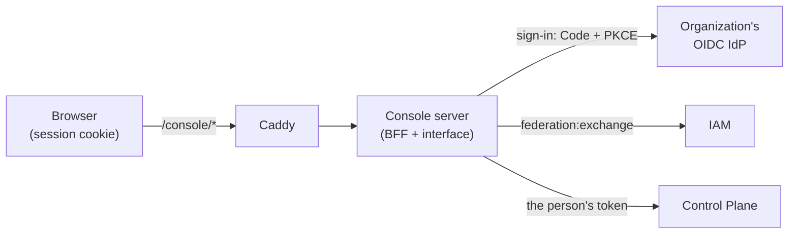
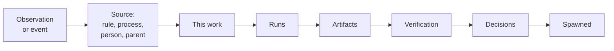
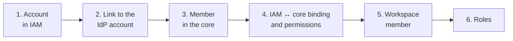
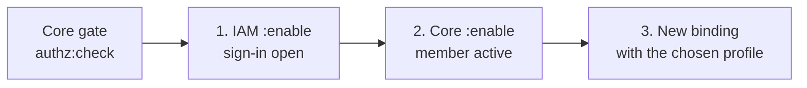

# Console

The console is the platform's web application that shows what the organization is
doing right now, where each unit of work came from, and how it ended. It is also where
control actions are performed without ssh or the MCP plugin: decide an approval, suspend
a process, disable a rule, apply a package plan, add or disable a person. This page is for
the platform owner and administrator. The rationale for the decisions is TAI-ADR-0058.

## What it is and what the console does not have

The console is a projection of core objects. It has no database of its own: work, runs,
processes, and rules live in Control Plane, identity lives in IAM, knowledge lives in
memory behind the core. Screens are built around core objects (process, rule, work,
agent, package) rather than a subject domain, so the console shows a software delivery
package and an invoice payment package the same way.

What the console deliberately does not have:

- **A task tracker.** There are no boards, personal lists, or task editor. A person does
  the work in the [MCP plugin](mcp-plugin.md), through the CLI, or with their own agent.
- **A configuration editor.** Task types, rules, processes, and agents are declared by
  [packages](../control-plane/catalog-packages.md) in git. The console shows what is
  declared and how it differs from what is installed, but does not edit declarations.
- **Billing, plans, organizations and teams, invitations.** There is one organization
  model: the IAM tenant and principals plus the core's workspaces and roles.

## Sign-in

The console signs in through the organization's OIDC IdP. A person signs in once and
works without entering the password again while the IdP session is alive.

1. Any address under `/console/` without a session leads to sign-in and returns to the
   same address afterwards. That is why a link to a work item or a run from a
   notification opens exactly that object.
2. The console server performs Authorization Code + PKCE as a confidential client
   (`runtime-console`) and receives the IdP id token.
3. The id token is exchanged in IAM (`federation:exchange`) for short-lived tokens of the
   `control-plane` and `iam` audiences.
   From then on, every request to the core is made on behalf of the signed-in person, and
   every action lands in the core or IAM log with that person as the author.

Tokens never reach the browser: it holds only a cookie with a signed random session id
(HttpOnly, SameSite=Lax, `Path=/console`; `Secure` when the public address uses
https). The IdP and IAM tokens are kept in the console server's memory and refresh
themselves. A session lives 12 hours (`RUNTIME_CONSOLE_SESSION_TTL_HOURS`). Restarting
the console server loses sessions: the person goes through a silent re-sign-in via the IdP.

The "Sign out" button closes the console session, revokes the refresh token at the IdP
(if the IdP supports it), and leads to the IdP sign-out.

!!! note "Which IdP fits"
    The console works with any OIDC IdP registered in IAM as an identity provider. The
    console itself knows only the issuer, client id, and secret. How to register an IdP in
    IAM is described in [Identity federation](../iam/federation.md); the variables are in
    the [reference](../reference/environment.md).

## Sections

Every object has a permanent address: you can save it, send it to a colleague, or put
it into a notification.

| Address | Section | What it shows |
|---|---|---|
| `/console/` | Pulse | What is happening now and what needs attention |
| `/console/work`, `/console/work/<number>` | Work | Work search; a card with the provenance chain |
| `/console/runs/<id>` | Run | The trace of an agent run |
| `/console/artifacts/<id>` | Artifact | Viewing a result |
| `/console/processes`, `/console/processes/<id>` | Processes | Process instances, steps, timers, decision log |
| `/console/rules`, `/console/rules/<id>` | Rules | Work derivation rules and their evaluations |
| `/console/agents`, `/console/agents/<key>` | Agents and nodes | The agent registry, revisions, placement on nodes |
| `/console/approvals` | Decisions | Approvals waiting for a decision, and decided ones |
| `/console/packages` | Packages | What is installed and a package apply plan |
| `/console/knowledge` | Knowledge | Entities of the company knowledge base |
| `/console/org` | People and roles | Workspace tree, members, roles, delegations |
| `/console/journal` | Journal | Core events |

The interface is in Russian and English; the theme is light, dark, or follows the
system; the choice is remembered in the browser. The layout is readable on a phone.

### Pulse { #pulse }

The first screen answers the question "what is the organization doing right now". At the
top is the "Needs attention" block, starting with what blocks work:

- a failed run and a run without progress;
- a failed process instance;
- an approval waiting for a decision;
- blocked work;
- an agent that should be running but fails at startup or waits for a node;
- a node that is offline.

Below are live process instances with the open step and the time spent on it, running
runs, nodes and agents, and rule evaluations over the last 24 hours. Every row opens in
depth. If there are no problems, the screen says so: "All normal".

The pulse updates without a page reload: the console holds the core event stream and
re-reads the pulse on an event, but no more than once per second. If the stream is
unavailable, the caption says "live stream unavailable", and the pulse is re-read every
30 seconds. Node health produces no events, so the pulse is also re-read every 30
seconds while the stream is live.

If some source did not respond, the corresponding section shows an error, and instead of
"All normal" the pulse says "Could not check everything" and lists the silent sources.

### Journal

The last 50 core events; new ones are added at the top from the live stream. Filters
are by event type prefixes and by workspace. The "From the start of the journal" mode
pages forward through the journal with the "Load more" button. The core does not return
earlier history back from the tail: the journal cursor moves only forward.

### Work and the provenance chain

Work search has filters by status category, type, and executor; the filters live in the
address. A work number opens directly. Text is searched only in the number and title on
the loaded page: the core has no full-text search over work.

A work card starts with the chain "why this work exists and how it ended":

- Work spawned by a rule shows the rule, its evaluation
  (`GET /api/v1/rule-evaluations/{evaluation_id}`), the input data, and the evaluation result.
- Work that is a process step shows the process instance and that process's log.
- Work that passed verification shows the criteria, attempts, and the decision.

A link the core has no data about is not hidden: it is marked "not in the data" with a
reason: the core does not know the link, there is no permission to read it, the source did
not respond, or the link does not apply to this work. Below the chain are the card, runs,
artifacts, decisions, relations, and external links. The chain is assembled on the fly at
every opening and is not stored anywhere.

### Run and artifact

A run trace is the executor's transcript (schema `agent-transcript/1`), tool actions,
and checkpoints (see [Run trace](../runner/trace.md)). While a run is in progress, the
screen refreshes every 5 seconds. If the executor did not publish the transcript or
withheld it, the screen says so and shows only the actions and checkpoints.

An artifact opens in a viewer: Markdown, JSON, CSV, PDF, images, DOCX, XLSX. For other
formats and files that are too large, the console offers a download. Content is served
with execution in the browser forbidden; HTML from Markdown and DOCX is cleaned of
scripts, styles, forms, and remote images.

### Processes, rules, agents, decisions, knowledge

- **Processes**: instances with filters by status and process. An instance shows the
  stages, open steps, timers (calendar-aware), case data, spawned work, and the engine's
  decision log on a timeline (see [Processes](../processes/index.md)).
- **Rules**: work derivation rules with status, trigger, and action. A rule shows the
  condition, authority, and evaluations: input, decision, and spawned work
  (see [Work derivation rules](../control-plane/work-rules.md)).
- **Agents and nodes**: the agent registry, desired state and phase, revisions and
  description, placement on nodes, the agent's latest runs (see [Agents and runner](../runner/index.md)).
- **Decisions**: approvals with a status filter; you can decide right from the list.
- **Knowledge**: entities of the company knowledge base: you choose a space and entity
  kinds and conditions on attributes (equality or a prefix by segments). The text filter
  narrows only the loaded page: the core has no full-text search over entities.

## Control actions

Actions sit on the object's screen. Each one asks for confirmation: what will happen and
to what, and the fields (reason, comment) are filled in the same dialog.

| Action | Where | Core call | Core permission |
|---|---|---|---|
| Approve or reject an approval | "Decisions" | `POST /api/v1/approvals/{approval_id}:approve`, `:reject` | `approvals.decide` |
| Suspend, resume, cancel a process instance | process instance | `POST /api/v1/process-instances/{instance_id}:suspend`, `:resume`, `:cancel` | `processes.operate` |
| Ask the executor to stop a run | run | `POST /api/v1/runs/{run_id}:request-cancel` | `tasks.write` or `claims.manage` |
| Cancel a run | run | `POST /api/v1/runs/{run_id}:cancel` | own run: `tasks.claim`; someone else's: `claims.manage` |
| Enable or disable a rule | rule | `POST /api/v1/rules/{rule_id}:enable`, `POST /api/v1/rules/{rule_id}:disable` | `rules.write` |
| Start or stop an agent, change the replica count | agent | `PATCH /api/v1/agents/{key}/state` | `agents.manage` |
| Build and apply a package plan | "Packages" | `POST /api/v1/packages:plan`, `POST /api/v1/packages:apply` | `packages.plan`; applying also needs permissions on the changed kinds |
| Add, disable, or enable a person | "People and roles" | see [below](#people) | see [below](#people) |

### How permissions hide actions

The console takes permissions from the core: these are the permissions of the signed-in
person's binding (the same response as `whoami` in the CLI and the MCP plugin; the
`admin` permission includes the others). If a permission is missing, there is no button:
instead, the screen says which action is unavailable and which permission is missing. No
request is sent, and no 403 error appears after a click.

There are other reasons an action may be unavailable, and they are explained in text
too:

- the approval is addressed to another person, or you are excluded from the deciders
  (separation of duties);
- the run belongs to another executor, and you do not have `claims.manage`.

The console only hides what is unavailable; the core still decides with the person's
token. If the core does refuse (for example, the role for deciding an approval is checked
only on the server), the screen shows the reason for the refusal. A `409` response means
the state has already changed: the screen re-reads the object.

!!! warning "Workspace-level permissions"
    The console sees the flat list of the binding's permissions. When the core decides
    access with an external policy that takes the resource into account, permissions
    granted on a specific workspace are not in that list. The console may then hide an
    action the core would allow, and a core refusal arrives with a reason.

Retrying an action after a network failure uses the same `Idempotency-Key`: the core
will not execute it twice. After the core responds, the screen re-reads the affected
objects: the new state comes from the core rather than being drawn in advance. Every
action is recorded in the core log with the signed-in person as the author.

## Packages

The section shows what is installed, grouped by declaration kind (task types,
processes, rules, agents, calendars). The core does not store which package installed an
object, so the grouping is by kind, not by package.

Plan and apply:

1. **Choose the package directory** on your disk (or drag it onto the page). The console
   reads the files in the browser and sends them to the core; `package.yaml` must be at
   the directory root. Package declarations live in git; the console does not edit them.
2. **Fill in the installation variables** if the package requires them, and specify the
   processes workspace if needed.
3. **Build the plan.** The core shows what will be added, changed, renamed, or retired,
   the "before → after" fields, how the new process version behaves on past instances,
   the fate of open instances, regulation coverage, and the check findings.
4. **Apply the plan.** The core verifies the hash and applies exactly the plan shown. If
   the directory on the installation changed after the plan was built, the response is
   "Plan is stale", and the plan is built again.

A plan cannot be applied if it has errors, open instances need a migration, or there are
no changes. Fields that a person edited after the previous apply are kept by default;
overwriting them is a separate checkbox, and it is part of the plan hash (see
[Package tests](../processes/package-tests.md)).

!!! note "What the core plans"
    The core plans and applies calendars and processes. The other package declarations
    (task types, rules, agents, and other kinds) are not part of the console plan, and the
    console lists them. They are installed by the package installer `package-sdk`;
    see [Catalog packages](../control-plane/catalog-packages.md).

Permissions: building a plan requires `packages.plan`; applying also requires
`processes.write` for processes and `calendars.write` for calendars. Without
`packages.plan`, the section shows only what is installed and explains which permission is
missing.

## People and roles { #people }

The section shows the organization in the platform model: the workspace tree with their
types, the members of the selected workspace (people and agents can be shown
separately), roles, and delegations. Delegations are visible only with the
`delegations.manage` permission. The workspace structure is declared by packages; the
console does not change it.

There are three control actions: add, disable, and enable a person.

### Who can manage people { #people-admin }

Both conditions are required:

- **in IAM**: the `iam:people` scope. Federation grants it only to a member of the IAM
  group `people-admins` and only on an explicit request from the console; a PAT never
  carries it;
- **in the core**: the `principals.write`, `workspaces.manage`, and `org.manage` permissions.

If something is missing, there is no "Add person" button, and the section says exactly
what is missing. Groups and the owner's membership are created by bootstrap (see
[Bootstrap](../getting-started/bootstrap.md)).

### Add a person

The "Add person" form:

| Field | What to enter |
|---|---|
| Name | Display name |
| Sign-in e-mail | The address the person uses to sign in to the IdP |
| External IdP identifier | **Required.** The value of the claim IAM uses to match the sign-in (usually `sub` from the IdP id token; in the IdP admin console this is typically the user ID) |
| Workspace | Where to add the person as a member |
| Roles | Core roles in this workspace: access to work |
| Core permissions | Binding profile: `member` (read, work, claim, decisions) or `administrator` |

The console does not create the account in the IdP itself: the person must already exist
in the organization's IdP.
The IdP identifier is not derived from the e-mail: signing in by an e-mail that the
provider has not verified would allow taking over someone else's account.

Roles grant access to work; the API permissions are set by the profile. The
"administrator" profile is chosen only explicitly, and only an administrator can grant it:
you cannot grant more than your own permissions (the core responds `permission_escalation`).

The flow runs in steps, each on behalf of the signed-in administrator:

The flow is idempotent. If it stopped halfway (a service did not respond), the screen
shows the completed steps and the step that failed; repeating the same form completes the
flow. Steps 1–4 are not executed again on repeat: the console finds what has already been
created and marks it "already there". Steps 5 and 6 (workspace member and roles) are
called again; the core executes them idempotently, and no duplicate appears. Incomplete
additions are visible in the "Not completed" block with a "Complete" button. The flow has
no storage of its own: this list is assembled from IAM and the core.

The result is a **first sign-in link**. It is sent to the person: they sign in through the
organization's IdP and immediately work with the assigned permissions.

The flow stops with an explanation if:

- the IdP account is already linked to another person or disabled in IAM;
- the IdP account from the form does not match the one already linked to this person;
- the person with this e-mail is disabled;
- IAM does not allow reading the IdP links: the flow does not proceed, so as not to
  create a duplicate;
- the console could not check all core members (`lookup_incomplete`): the core does not
  filter members by e-mail, the console pages through their list and, if the list is too
  long, refuses rather than risk creating a duplicate.

!!! note "A disabled person is not added again"
    Adding a disabled person again by e-mail or IdP account stops with a refusal. Such a
    person is brought back with the "Enable" button in the member list (see
    [Enable a person](#people-enable)): this keeps their history.

### Disable a person { #people-disable }

The "Disable" and "Enable" buttons are in the member list next to people other than
yourself, if you have the `iam:people` scope (see [Who can manage people](#people-admin)).
An active person has "Disable"; a disabled one has "Enable". Whether to show the button is
decided by the core: the console asks the gate `POST /api/v1/authz:check` about the
`disable` or `enable` action on this principal. The gate checks the same things as the core
call itself but writes nothing. If the core refuses, the reason is written instead of the
button.

Disabling closes everything the person held:

- sign-in is closed, and the person's tokens and PATs are revoked in IAM;
- bindings with the core and delegations are revoked;
- their sessions and sessions on their behalf are closed;
- work they claimed is released and returned to the queue;
- runs in progress on that work end with a failure.

The "Enable" button brings the person back, but not what disabling closed (see
[Enable a person](#people-enable)).

The flow runs in three steps:

1. **The core gate** (`authz:check`, action `disable`). Its checks run in order:
    - the `principals.write` permission (otherwise `permission_denied`);
    - the target kind: the console does not disable a service account
      (`principal_kind_not_disableable`);
    - you cannot disable yourself (`cannot_disable_self`);
    - only an administrator disables an administrator (`permission_escalation`,
      `missing: [admin]`). The core sees `admin` both in the target's bindings and in its
      unrevoked API keys, which the console does not see;
    - a registry agent is not disabled; it is retired in the "Agents" section (`use_agent_retire`).

    If the gate refused, IAM is not called: otherwise the person's sign-in would be
    closed, and the core would refuse afterwards.

2. **IAM**: `:disable` of the IAM principal closes sign-in and revokes tokens and PATs.

3. **The core**: `POST /api/v1/principals/{principal_id}:disable` (CP-ADR-0077): bindings,
   delegations, sessions, claims, and runs.

If the core refused after IAM, the person cannot sign in, and the screen offers a retry:
the retry completes the disabling. IAM refuses on its own if the person is a member of the
`people-admins` group (`people_admin_protected`): such a person is disabled only by the IAM
bootstrap, and the caller's membership in that group does not count. The refusal codes are
in the reference [Error codes](../reference/errors.md#principal-disable-enable).

### Enable a person { #people-enable }

"Enable" brings back a disabled person (CP-ADR-0077, the "Enabling" amendment). The core
member stays the same, so their history is kept: tasks, the log, and decisions refer to the
same principal.

The confirmation dialog has two fields:

| Field | What to enter |
|---|---|
| Permissions of the new binding | Binding profile: `member` (default) or `administrator`. The "administrator" option is available only if you are an administrator yourself |
| Reason | Optional; goes only to the core log |

The flow runs in three steps:

1. **IAM**: `:enable` of the IAM principal reopens sign-in.
2. **The core**: `POST /api/v1/principals/{principal_id}:enable` returns the member to the
   `active` status.
3. **A new** IAM ↔ core **binding** with the permissions of the chosen profile.

**Bindings are not restored automatically.** The core returns only the status. Bindings,
delegations, sessions, released work, and interrupted runs stay closed. Previous tokens
and PATs are not returned either: the person signs in again. The operator chooses the
permissions of the new binding anew, and the console does not read the previous
permissions. Otherwise enabling would return permissions the enabling person might not
know about.

The person's live (not revoked and not expired) API keys work again together with the
status: disabling does not revoke them.

Before IAM, the console checks two conditions:

- **the core gate** (`authz:check`, action `enable`). Its checks run in order: the
  `principals.write` permission (`permission_denied`); repeating on an already active
  member is allowed; the target kind (`principal_kind_not_enableable`); escalation; a
  registry agent (`use_agent_publish`: an agent is brought back by publishing in the
  "Agents" section). Escalation means the enabling person cannot return more than they
  have. The permissions of the target's live API keys and unrevoked bindings must be
  theirs, otherwise the response is `permission_escalation` with a `missing` list. A special
  case: if `admin` is in a live key or an unrevoked binding of the target, only an
  administrator can enable it;
- **profile permissions**: you cannot grant a binding with permissions you do not have
  (`permission_escalation` with a `missing` list). That is why only an administrator grants
  the "administrator" profile.

The console puts the new binding only on an IAM account from this person's previous
bindings. If there are none, the person has never signed in through a binding, and there is
nothing to enable (`iam_principal_unknown`).

IAM can refuse on its own too:

- the person was disabled by HR sync (SCIM, `principal_provisioned`): only that sync
  enables them;
- the person is paused in IAM by another process (`principal_paused`): "Enable" does not
  lift that;
- the person belongs to an IAM privilege group (for example, `people-admins`) that you are
  not a member of (`people_admin_protected`): a member of the same group or the IAM
  bootstrap enables them.

The `admin` permission in the core does not help against these refusals: IAM decides them.

**Partial disabling.** It happens that IAM sign-in is already closed while the core member
is still active: the core refused after IAM. The core is then not called, and only an
administrator reopens IAM sign-in. Everyone else gets `iam_login_closed` from the console:
the core gate lets an active member through without the escalation check, and otherwise a
non-administrator could reopen sign-in, for example, for an administrator. If sign-in was
closed by HR sync or the person is paused in IAM, the administrator gets
`principal_provisioned` or `principal_paused`.

A retry after a failure completes the enabling and does not execute what was done twice:
the steps use idempotency keys derived from the confirmation. If IAM has already reopened
sign-in and the core refused, the screen says so. If the member is enabled but the binding
was not granted, the person cannot sign in until enabling is repeated. The refusal codes
are in the reference [Error codes](../reference/errors.md#console-people).

Limitations:

- you cannot disable or enable yourself;
- only an administrator can disable an administrator (`admin` in a binding or an unrevoked
  API key); the same holds for enabling if `admin` is in the target's live API key or in
  its unrevoked binding;
- a member of the `people-admins` group is disabled only by the IAM bootstrap and enabled
  by a member of the same group or the IAM bootstrap;
- the console does not disable or enable an agent: agents are retired and brought back in
  the "Agents" section;
- the console does not disable or enable service accounts.

## Assistant

The header has an "Assistant" button (shortcut ⌘J / Ctrl+J) that opens a panel next to
the screen. The assistant sees the screen context, so you can ask about what is on the
screen without naming the object; it performs actions only with confirmation in the panel.
Details: [Assistant](assistant.md).

## If a service is unavailable

- **The core does not respond**: the screen says "Core unavailable" and shows the time
  of the last data; the previous data stays on the screen.
- **No permission for a section**: "No access" with the reason from the core or IAM,
  rather than an empty page.
- **A service rejected the console's access**: signing in again will not fix it: it is an
  audience setting in IAM, and an administrator changes it.
- **The session expired**: the console leads to sign-in by itself and returns to the same
  address.

## Limitations of the current version

- Text in work and knowledge search is matched only against the loaded page.
- The pulse detects a run without progress from the last 200 checkpoints of the journal;
  an earlier signal outside this window is not visible.
- Rule evaluations on the pulse are counted within the last 200 journal events; if all of
  them fall into the 24-hour window, the summary is marked as incomplete.
- Pulse sections show no more than 50 rows.
- The journal does not page backwards from the latest events.
- Decisions on the pulse are not filtered by workspace.

## Installation { #install }

The console is the compose service `console` of the `core` profile (image
`web/console/Dockerfile`, uid 10001, memory limit 128 MB). It publishes no ports: the edge
serves it at `/console/*` (see [Edge and TLS](../operations/edge-and-tls.md)). To run it,
you need:

1. **An OIDC client** `runtime-console` in the organization's IdP: confidential,
   Authorization Code + PKCE S256, redirect `<public address>/console/_auth/callback`.
2. **Two secrets** in `secrets/`: `runtime-console-oidc-secret` (the client secret, the
   same as in the IdP) and `runtime-console-cookie-secret` (at least 32 bytes). Both are
   created by `make secrets`; permissions `0600`, owned by uid 10001 on Linux. The files
   must exist before the first `up` of the `core` profile, otherwise compose will not
   create the console container (see [Secrets and rotation](../operations/secrets.md)).
3. **IAM**: an identity provider for the organization's IdP, the `control-plane` and `iam`
   audiences for federation, and the `people-admins` group; `deploy/bootstrap.py` creates
   them.
   `IAM_TENANT_ID` in `.env`: without it, the console server
   does not start.
4. **Variables** `RUNTIME_CONSOLE_*` are in the [reference](../reference/environment.md).
   The product name and logo text are set by `RUNTIME_CONSOLE_PRODUCT_NAME` and
   `RUNTIME_CONSOLE_LOGO_TEXT`: the console code contains no product name.

The liveness check is `GET /console/healthz` (public, no session).

!!! danger "Rollout order"
    The IAM version must grant `iam:people` only to members of the `people-admins` group.
    IAM is updated first, and only then
    bootstrap is run, which adds these scopes to the audiences. Otherwise
    federation would grant privileged scopes to every signed-in person.

## Common problems

| Symptom | Cause | What to do |
|---|---|---|
| The `console` container is not created | The `secrets/runtime-console-*-secret` files are missing | `make secrets`, `chown 10001:10001`, then `docker compose up -d console` |
| The `console` container keeps restarting | An empty `IAM_TENANT_ID` or a cookie secret shorter than 32 bytes | Fill in `.env`, recreate the secret |
| After IdP sign-in, an error at `/console/_auth/callback` | The client's redirect URI does not match the public address, or the secret in the IdP is different | Rerun the client script with the correct address; compare the secret |
| Sign-in works, but screens say "A service rejected the console's access" | Federation did not grant the audience, or the IdP is not registered in IAM | Check `RUNTIME_CONSOLE_IDENTITY_PROVIDER` and the audiences, run bootstrap |
| No "Add person" button | The person is not in the `people-admins` group or lacks core permissions | The section says what is missing; add to the group or grant the permissions |
| An added person cannot sign in | The IdP identifier was entered incorrectly | Check `sub` in the IdP; an IAM administrator fixes a wrong link |
| An enabled person cannot sign in | The core binding was not granted: the flow stopped after the core `:enable` | Repeat "Enable": what was done is not repeated, and the binding is granted |
| "Enable" responds `iam_login_closed` | The core member is active, but IAM sign-in is closed (partial disabling) | Ask an administrator to repeat "Enable" |

## See also

- [Assistant](assistant.md)
- [Operator guide](index.md)
- [Identity federation](../iam/federation.md)
- [Catalog packages](../control-plane/catalog-packages.md)
- [Authorization and permissions](../control-plane/authorization.md)
- [Edge and TLS](../operations/edge-and-tls.md)
