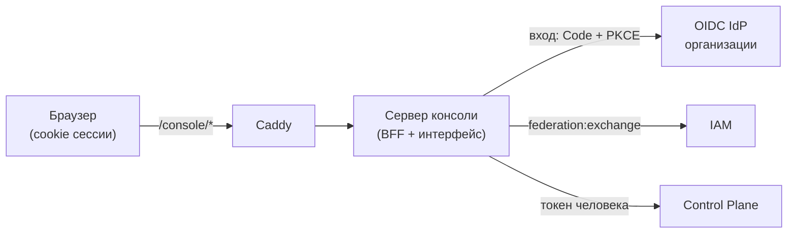
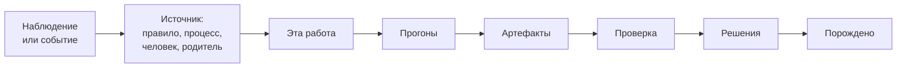
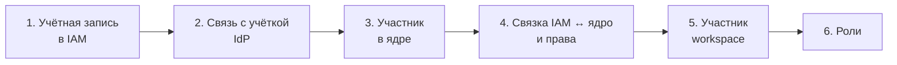
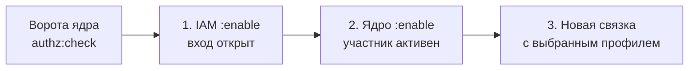

# Консоль

Консоль — веб-приложение платформы, в котором видно, что организация делает прямо
сейчас, откуда взялась каждая единица работы и чем она кончилась. Из неё же выполняются
управляющие действия без ssh и MCP-плагина: решить approval, приостановить процесс,
выключить правило, применить план пакета, добавить или отключить человека. Страница для
владельца и администратора платформы. Обоснование решений — TAI-ADR-0058.

## Что это и чего в консоли нет

Консоль — проекция объектов ядра. Своей базы у неё нет: работа, прогоны, процессы и
правила живут в Control Plane, identity — в IAM, знания — в памяти за ядром.
Экраны строятся по объектам ядра (процесс, правило, работа, агент, пакет), а не
по предметной области, поэтому консоль одинаково показывает пакет разработки и пакет
оплаты счетов.

Чего в консоли нет намеренно:

- **Трекера задач.** Досок, личных списков и редактора задач нет. Работу человек делает
  в [MCP-плагине](mcp-plugin.md), через CLI или своим агентом.
- **Редактора конфигурации.** Типы задач, правила, процессы и агенты объявляются
  [пакетами](../control-plane/catalog-packages.md) в git. Консоль показывает объявленное
  и разницу с установленным, но объявления не правит.
- **Биллинга, тарифов, организаций и команд, инвайтов.** Модель организации одна:
  tenant и principals IAM плюс workspaces и роли ядра.

## Вход

Консоль входит через OIDC IdP организации. Человек входит один раз и работает без
повторного ввода пароля, пока жива сессия IdP.

1. Любой адрес под `/console/` без сессии уводит на вход и после него возвращает на тот
   же адрес. Поэтому ссылка на работу или прогон из уведомления открывает именно этот
   объект.
2. Сервер консоли проводит Authorization Code + PKCE как confidential client
   (`runtime-console`) и получает id token IdP.
3. id token обменивается в IAM (`federation:exchange`) на короткие токены audiences
   `control-plane` и `iam`.
   Дальше каждый запрос в ядро идёт от имени вошедшего человека, и каждое действие
   попадает в журнал ядра или IAM с ним как автором.

Токены не попадают в браузер: в нём лежит только cookie с подписанным случайным id
сессии (HttpOnly, SameSite=Lax, `Path=/console`; `Secure` — при публичном адресе по
https). Токены IdP и IAM хранятся в памяти сервера консоли и обновляются сами. Сессия
живёт 12 часов (`RUNTIME_CONSOLE_SESSION_TTL_HOURS`). Перезапуск сервера консоли
теряет сессии: человек проходит тихий перевход через IdP.

Кнопка «Выйти» закрывает сессию консоли, отзывает refresh token у IdP (если IdP это
умеет) и ведёт на выход из IdP.

!!! note "Какой IdP подходит"
    Консоли нужен любой OIDC IdP, заведённый в IAM как identity provider. Сама она знает
    только issuer, client id и секрет. Как завести IdP в IAM — в статье
    [Федерация identity](../iam/federation.md), переменные — в
    [справочнике](../reference/environment.md).

## Разделы

У каждого объекта постоянный адрес: его можно сохранить, отправить коллеге или
вставить в уведомление.

| Адрес | Раздел | Что показывает |
|---|---|---|
| `/console/` | Пульс | Что происходит сейчас и что требует внимания |
| `/console/work`, `/console/work/<номер>` | Работа | Поиск работы; карточка с цепочкой происхождения |
| `/console/runs/<id>` | Прогон | Трассировка прогона агента |
| `/console/artifacts/<id>` | Артефакт | Просмотр результата |
| `/console/processes`, `/console/processes/<id>` | Процессы | Экземпляры процессов, шаги, таймеры, журнал решений |
| `/console/rules`, `/console/rules/<id>` | Правила | Правила вывода работы и их срабатывания |
| `/console/agents`, `/console/agents/<ключ>` | Агенты и узлы | Реестр агентов, ревизии, размещение на узлах |
| `/console/approvals` | Решения | Approvals, которые ждут решения, и решённые |
| `/console/packages` | Пакеты | Установленное и план применения пакета |
| `/console/knowledge` | Знания | Сущности базы знаний компании |
| `/console/org` | Люди и роли | Дерево workspaces, участники, роли, делегирования |
| `/console/journal` | Журнал | События ядра |

Интерфейс на русском и английском, тема светлая, тёмная или как в системе; выбор
запоминается в браузере. Вёрстка читается с телефона.

### Пульс { #pulse }

Первый экран отвечает на вопрос «что сейчас делает организация». Сверху — блок
«Требует внимания», сначала то, что блокирует работу:

- упавший прогон и прогон без прогресса;
- упавший экземпляр процесса;
- approval, который ждёт решения;
- заблокированная работа;
- агент, который должен работать, но падает при запуске или ждёт узла;
- узел не на связи.

Ниже — живые экземпляры процессов с открытым шагом и временем на нём, идущие прогоны,
узлы и агенты, срабатывания правил за последние 24 часа. Каждая строка открывается
вглубь. Если проблем нет, экран так и говорит: «Всё штатно».

Пульс обновляется без перезагрузки: консоль держит поток событий ядра и перечитывает
пульс по событию, но не чаще раза в секунду. Если поток недоступен, в подписи видно
«живой поток недоступен», и пульс перечитывается раз в 30 секунд. Здоровье узлов
событий не даёт, поэтому пульс перечитывается раз в 30 секунд и при живом потоке.

Если какой-то источник не ответил, соответствующая секция показывает ошибку, а пульс
вместо «Всё штатно» пишет «Не удалось проверить всё» и перечисляет молчащие
источники.

### Журнал

Последние 50 событий ядра, новые дописываются сверху по живому потоку. Фильтры — по
префиксам типов событий и по workspace. Режим «С начала журнала» листает журнал вперёд
кнопкой «Загрузить ещё». Более раннюю историю от хвоста ядро не отдаёт: курсор журнала
идёт только вперёд.

### Работа и цепочка происхождения

Поиск работы — фильтры по категории статуса, типу и исполнителю; фильтры живут в
адресе. Номер работы открывается напрямую. Текст ищется только в номере и заголовке на
загруженной странице: полнотекстового поиска по работе у ядра нет.

Карточка работы начинается с цепочки «почему эта работа существует и чем она
кончилась»:

- Работа, порождённая правилом, показывает правило, его срабатывание
  (`GET /api/v1/rule-evaluations/{evaluation_id}`), входные данные и результат оценки.
- Работа — шаг процесса — показывает экземпляр процесса и журнал этого процесса.
- Прошедшая проверку работа показывает критерии, попытки и решение.

Звено, о котором у ядра нет данных, не прячется: оно отмечено «нет в данных» с
причиной — ядро не знает звена, нет прав на чтение, источник не ответил или звено к
этой работе не относится. Ниже цепочки — карточка, прогоны, артефакты, решения, связи и
внешние ссылки. Цепочка собирается на лету при каждом открытии и нигде не хранится.

### Прогон и артефакт

Трассировка прогона — транскрипт исполнителя (схема `agent-transcript/1`), действия
с инструментами и checkpoints (см. [Трасса прогонов](../runner/trace.md)). Пока прогон
идёт, экран обновляется каждые 5 секунд. Если исполнитель не опубликовал транскрипт или
скрыл его, экран так и говорит и показывает только действия и checkpoints.

Артефакт открывается в просмотрщике: Markdown, JSON, CSV, PDF, картинки, DOCX, XLSX.
Остальные форматы и слишком большие файлы консоль предлагает скачать. Содержимое
отдаётся с запретом исполнения в браузере, HTML из Markdown и DOCX очищается от
скриптов, стилей, форм и удалённых картинок.

### Процессы, правила, агенты, решения, знания

- **Процессы** — экземпляры с фильтрами по статусу и процессу. Экземпляр показывает
  стадии, открытые шаги, таймеры (с учётом календаря), данные дела, порождённую работу
  и журнал решений движка на шкале времени (см. [Процессы](../processes/index.md)).
- **Правила** — правила вывода работы со статусом, триггером и действием. Правило
  показывает условие, полномочия и срабатывания: вход, решение и порождённую работу
  (см. [Правила вывода работы](../control-plane/work-rules.md)).
- **Агенты и узлы** — реестр агентов, желаемое состояние и фаза, ревизии и описание,
  размещение на узлах, последние прогоны агента (см. [Агенты и runner](../runner/index.md)).
- **Решения** — approvals с фильтром по статусу; решить можно прямо из списка.
- **Знания** — сущности базы знаний компании: выбираются пространство и виды
  сущностей, условия на атрибуты (равно или префикс по сегментам). Текстовый фильтр
  сужает только загруженную страницу: полнотекстового поиска по сущностям у ядра нет.

## Управляющие действия

Действия расположены на экране объекта. Каждое спрашивает подтверждение: что
произойдёт и с чем, а поля (причина, комментарий) заполняются в том же окне.

| Действие | Где | Вызов ядра | Право в ядре |
|---|---|---|---|
| Согласовать или отклонить approval | «Решения» | `POST /api/v1/approvals/{approval_id}:approve`, `:reject` | `approvals.decide` |
| Приостановить, возобновить, отменить экземпляр процесса | экземпляр процесса | `POST /api/v1/process-instances/{instance_id}:suspend`, `:resume`, `:cancel` | `processes.operate` |
| Попросить исполнителя остановить прогон | прогон | `POST /api/v1/runs/{run_id}:request-cancel` | `tasks.write` или `claims.manage` |
| Отменить прогон | прогон | `POST /api/v1/runs/{run_id}:cancel` | свой прогон — `tasks.claim`, чужой — `claims.manage` |
| Включить или выключить правило | правило | `POST /api/v1/rules/{rule_id}:enable`, `POST /api/v1/rules/{rule_id}:disable` | `rules.write` |
| Запустить или остановить агента, изменить число реплик | агент | `PATCH /api/v1/agents/{key}/state` | `agents.manage` |
| Построить и применить план пакета | «Пакеты» | `POST /api/v1/packages:plan`, `POST /api/v1/packages:apply` | `packages.plan`; применение — ещё права на изменяемые виды |
| Добавить, отключить или включить человека | «Люди и роли» | см. [ниже](#people) | см. [ниже](#people) |

### Как права скрывают действия

Права консоль берёт из ядра — это права связки вошедшего человека (тот же ответ, что у
`whoami` в CLI и MCP-плагине; право `admin` включает остальные). Если права нет, кнопки
нет: вместо неё написано, какое действие недоступно и какого права не хватает. Запрос
при этом не уходит, и ошибка 403 после нажатия не появляется.

Есть и другие причины, по которым действие недоступно, — они тоже объясняются
текстом:

- approval адресован другому человеку или вы исключены из решающих (разделение
  обязанностей);
- прогон принадлежит другому исполнителю, а права `claims.manage` нет.

Консоль только скрывает недоступное, решает по-прежнему ядро токеном человека. Если
ядро всё же отказало (например, роль для решения approval проверяется только на
сервере), экран показывает причину отказа. Ответ `409` означает, что состояние уже
другое: экран перечитывает объект.

!!! warning "Права на уровне workspace"
    Консоль видит плоский список прав связки. Когда ядро решает доступ внешней политикой
    с учётом ресурса, права, выданные на отдельный workspace, в этот список не попадают.
    Тогда консоль может скрыть действие, которое ядро разрешило бы, а отказ ядра придёт
    с причиной.

Повтор действия после сбоя сети идёт с тем же `Idempotency-Key`: ядро не выполнит
его дважды. После ответа ядра экран перечитывает затронутые объекты — новое состояние
приходит из ядра, а не рисуется заранее. Каждое действие записано в журнале ядра с
вошедшим человеком как автором.

## Пакеты

Раздел показывает установленное, сгруппированное по виду объявления (типы задач,
процессы, правила, агенты, календари). Ядро не хранит, каким пакетом поставлен объект,
поэтому группировка — по виду, а не по пакету.

План и применение:

1. **Выбрать каталог пакета** со своего диска (или перетащить его на страницу). Консоль
   читает файлы в браузере и отправляет их ядру; в корне каталога должен быть
   `package.yaml`. Объявления пакета живут в git, консоль их не правит.
2. **Заполнить переменные установки**, если пакет их требует, и при необходимости
   указать workspace процессов.
3. **Построить план.** Ядро показывает, что добавится, изменится, переименуется или
   выведется, поля «было → станет», поведение новой версии процесса на прошлых
   экземплярах, судьбу открытых экземпляров, покрытие регламентов и находки проверки.
4. **Применить план.** Ядро сверяет хэш и применяет ровно показанный план. Если каталог
   на стенде изменился после построения, ответ — «План устарел», план строится заново.

Применить нельзя, если в плане есть ошибки, открытым экземплярам нужна миграция или
изменений нет. Поля, которые человек правил после прошлого применения, по умолчанию
сохраняются; перезаписать их — отдельный флажок, и он входит в хэш плана (см.
[Тесты пакета](../processes/package-tests.md)).

!!! note "Что планирует ядро"
    Ядро планирует и применяет календари и процессы. Остальные объявления пакета
    (типы задач, правила, агенты и другие виды) в план консоли не входят, и консоль
    их перечисляет. Их ставит установщик пакетов `package-sdk` — см.
    [Пакеты каталога](../control-plane/catalog-packages.md).

Права: построить план — `packages.plan`; применить — ещё `processes.write` для
процессов и `calendars.write` для календарей. Без `packages.plan` раздел показывает
только установленное и объясняет, какого права нет.

## Люди и роли { #people }

Раздел показывает организацию в модели платформы: дерево workspaces с их типами,
участников выбранного workspace (людей и агентов можно показать отдельно), роли и
делегирования. Делегирования видны только с правом `delegations.manage`. Структуру
workspaces объявляют пакеты, консоль её не меняет.

Управляющих действий три: добавить, отключить и включить человека.

### Кто может управлять людьми { #people-admin }

Нужны оба условия:

- **в IAM** — scope `iam:people`. Federation выдаёт его только члену группы IAM
  `people-admins` и только по явному запросу консоли; PAT его не приносит никогда;
- **в ядре** — права `principals.write`, `workspaces.manage` и `org.manage`.

Если чего-то не хватает, кнопки «Добавить человека» нет, а раздел пишет, чего именно
не хватает. Группы и членство владельца заводит bootstrap (см.
[Bootstrap](../getting-started/bootstrap.md)).

### Добавить человека

Форма «Добавить человека»:

| Поле | Что вводить |
|---|---|
| Имя | Отображаемое имя |
| E-mail для входа | Адрес, с которым человек входит в IdP |
| Идентификатор во внешнем IdP | **Обязательно.** Значение claim, по которому IAM сверяет вход (обычно `sub` из id token IdP; в консоли администратора IdP это, как правило, ID пользователя) |
| Workspace | Куда добавить участником |
| Роли | Роли ядра в этом workspace — допуск к работе |
| Права в ядре | Профиль связки: `участник` (чтение, работа, claim, решения) или `администратор` |

Учётку в самом IdP консоль не создаёт: человек должен уже существовать в IdP
организации.
Идентификатор IdP не подставляется из e-mail: вход по e-mail без проверки
адреса провайдером открывал бы захват чужой учётки.

Роли дают допуск к работе, права API задаёт профиль. Профиль «администратор»
выбирается только явно, и выдать его может только администратор: больше своих прав
выдать нельзя (ядро отвечает `permission_escalation`).

Поток идёт шагами, каждый — от имени вошедшего администратора:

Поток идемпотентен. Если он прервался на середине (сервис не ответил), экран показывает
пройденные шаги и шаг с отказом; повтор той же формы доводит поток. Шаги 1–4 при повторе
не выполняются заново: консоль находит уже созданное и помечает его «уже было». Шаги 5
и 6 (участник workspace и роли) вызываются снова — ядро выполняет их идемпотентно,
дубля не появляется. Недоведённые добавления видны в блоке «Не доведены» с кнопкой
«Довести». Своего хранилища у потока нет: этот список собирается из IAM и ядра.

На выходе — **ссылка первого входа**. Её отправляют человеку: он входит через IdP
организации и сразу работает с назначенными правами.

Поток останавливается с объяснением, если:

- учётка IdP уже связана с другим человеком или отключена в IAM;
- учётка IdP из формы не совпадает с той, что уже связана с этим человеком;
- человек с этим e-mail отключён;
- IAM не даёт прочитать связи с IdP — поток не идёт, чтобы не завести дубль;
- консоль не смогла проверить всех участников ядра (`lookup_incomplete`): ядро не
  фильтрует участников по e-mail, консоль листает их список постранично и при слишком
  длинном списке отказывает, а не рискует завести дубль.

!!! note "Отключённого человека не добавляют заново"
    Повторное добавление по e-mail или учётке IdP отключённого человека останавливается
    с отказом. Такого человека возвращают кнопкой «Включить» в списке участников (см.
    [Включить человека](#people-enable)): так сохраняется его история.

### Отключить человека { #people-disable }

Кнопки «Отключить» и «Включить» стоят в списке участников у людей, кроме вас самих, если
у вас есть scope `iam:people` (см. [Кто может управлять людьми](#people-admin)). У
активного человека — «Отключить», у отключённого — «Включить». Показывать ли кнопку,
решает ядро: консоль спрашивает ворота `POST /api/v1/authz:check` о действии `disable`
или `enable` над этим principal'ом. Ворота проверяют то же, что сам вызов ядра, но
ничего не записывают. Если ядро отказывает, вместо кнопки написана причина.

Отключение закрывает всё, что человек держал:

- вход закрывается, токены и PAT человека отзываются в IAM;
- связки с ядром и делегирования отзываются;
- его сессии и сессии от его имени закрываются;
- взятая им работа освобождается и возвращается в очередь;
- идущие прогоны на этой работе завершаются с отказом.

Кнопка «Включить» возвращает человека, но не то, что отключение закрыло (см.
[Включить человека](#people-enable)).

Поток идёт в три шага:

1. **Ворота ядра** (`authz:check`, действие `disable`). Их проверки идут по порядку:
    - право `principals.write` (иначе `permission_denied`);
    - вид цели: сервисную учётку консоль не отключает
      (`principal_kind_not_disableable`);
    - себя отключить нельзя (`cannot_disable_self`);
    - администратора отключает только администратор (`permission_escalation`,
      `missing: [admin]`). Ядро видит `admin` и в связках цели, и в её неотозванных
      API-ключах, которых консоль не видит;
    - агента реестра не отключают, его выводят в разделе «Агенты» (`use_agent_retire`).

    Если ворота отказали, IAM не вызывается: иначе вход человека закрылся бы, а ядро
    потом отказало бы.

2. **IAM** — `:disable` principal'а IAM закрывает вход и отзывает токены и PAT.

3. **Ядро** — `POST /api/v1/principals/{principal_id}:disable` (CP-ADR-0077): связки,
   делегирования, сессии, claims и прогоны.

Если ядро отказало уже после IAM, человек не войдёт, а экран предлагает повторить:
повтор доводит отключение. IAM отказывает сам, если человек — член группы `people-admins`
(`people_admin_protected`): такого человека отключает только bootstrap IAM, членство
вызывающего в этой группе не учитывается. Коды отказов — в справочнике
[Коды ошибок](../reference/errors.md#principal-disable-enable).

### Включить человека { #people-enable }

«Включить» возвращает отключённого человека (CP-ADR-0077, амендмент «Включение»).
Участник ядра остаётся прежним, поэтому его история сохраняется: задачи, журнал и
решения ссылаются на того же principal'а.

В окне подтверждения два поля:

| Поле | Что вводить |
|---|---|
| Права новой связки | Профиль связки: `участник` (по умолчанию) или `администратор`. Вариант «администратор» есть, только если вы сами администратор |
| Причина | Необязательно; попадает только в журнал ядра |

Поток идёт в три шага:

1. **IAM** — `:enable` principal'а IAM снова открывает вход.
2. **Ядро** — `POST /api/v1/principals/{principal_id}:enable` возвращает участнику
   статус `active`.
3. **Новая связка** IAM ↔ ядро с правами выбранного профиля.

**Связки сами не восстанавливаются.** Ядро возвращает только статус. Связки,
делегирования, сессии, освобождённая работа и прерванные прогоны остаются закрытыми.
Прежние токены и PAT тоже не возвращаются: человек входит заново. Права новой связки
оператор выбирает заново, а прежние права консоль не читает. Иначе включение вернуло
бы права, о которых включающий мог не знать.

Живые (не отозванные и не истёкшие) API-ключи человека снова входят вместе со статусом:
отключение их не отзывает.

До IAM консоль проверяет два условия:

- **ворота ядра** (`authz:check`, действие `enable`). Их проверки идут по порядку:
  право `principals.write` (`permission_denied`); повтор по уже активному участнику
  разрешён; вид цели (`principal_kind_not_enableable`); эскалация; агент реестра
  (`use_agent_publish`: агента возвращают публикацией в разделе «Агенты»). Эскалация
  значит: включающий не может вернуть больше, чем имеет сам. Права живых API-ключей
  цели и её неотозванных связок должны быть у него, иначе ответ `permission_escalation`
  со списком `missing`. Частный случай: если `admin` есть в живом ключе или неотозванной
  связке цели, включить её может только администратор;
- **права профиля**: выдать связку с правами, которых у вас нет, нельзя
  (`permission_escalation` со списком `missing`). Поэтому профиль «администратор» выдаёт
  только администратор.

Новую связку консоль ставит только на учётку IAM из прежних связок этого человека. Если
таких нет, человек ни разу не входил через связку, и включать нечего
(`iam_principal_unknown`).

IAM может отказать и сам:

- человека отключила синхронизация кадров (SCIM, `principal_provisioned`) — включает его
  она же;
- человек приостановлен в IAM другим процессом (`principal_paused`) — «Включить» такое
  не снимает;
- человек входит в группу привилегий IAM (например, `people-admins`), а вы в ней не
  состоите (`people_admin_protected`) — включает член той же группы или bootstrap IAM.

Право `admin` в ядре от этих отказов не спасает: их решает IAM.

**Частичное отключение.** Бывает, что вход в IAM уже закрыт, а участник ядра ещё активен:
ядро отказало после IAM. Тогда ядро не вызывается, а вход в IAM открывает только
администратор. Остальным консоль отвечает `iam_login_closed`: ворота ядра пропускают
активного участника без проверки эскалации, и иначе не-администратор открыл бы вход,
например, администратору. Если вход закрыла синхронизация кадров или человек
приостановлен в IAM, администратор получит `principal_provisioned` или
`principal_paused`.

Повтор после сбоя доводит включение и не выполняет сделанное дважды: шаги идут с ключами
идемпотентности от подтверждения. Если IAM уже открыл вход, а ядро отказало, экран
говорит об этом. Если участник включён, а связка не выдана, человек не войдёт, пока
включение не повторят. Коды отказов — в справочнике
[Коды ошибок](../reference/errors.md#console-people).

Ограничения:

- себя отключить или включить нельзя;
- отключить администратора (`admin` в связке или неотозванном API-ключе) может только
  администратор; включить — тоже, если `admin` есть в живом API-ключе цели или в её
  неотозванной связке;
- члена группы `people-admins` отключает только bootstrap IAM, а включает член той же
  группы или bootstrap IAM;
- агента консоль не отключает и не включает — его выводят и возвращают в разделе
  «Агенты»;
- сервисные учётки консоль не отключает и не включает.

## Ассистент

В шапке есть кнопка «Ассистент» (сочетание ⌘J / Ctrl+J), которая открывает панель
рядом с экраном. Ассистент видит контекст экрана, поэтому о том, что на экране, можно
спрашивать, не называя объект; действия он выполняет только с подтверждением в панели.
Подробно — [Ассистент](assistant.md).

## Если сервис недоступен

- **Ядро не отвечает** — экран говорит «Ядро недоступно» и показывает время последних
  данных; прежние данные остаются на экране.
- **Нет прав на раздел** — «Нет доступа» с причиной от ядра или IAM, а не пустая
  страница.
- **Сервис отклонил доступ консоли** — повторный вход этого не исправит: это настройка
  audience в IAM, её правит администратор.
- **Истекла сессия** — консоль сама уводит на вход и возвращает на тот же адрес.

## Ограничения текущей версии

- Текст в поиске работы и знаний ищется только по загруженной странице.
- Прогон без прогресса пульс замечает по последним 200 checkpoint'ам журнала; более
  ранний сигнал вне этого окна не виден.
- Срабатывания правил на пульсе считаются внутри последних 200 событий журнала; если
  все они попали в окно 24 часов, сводка помечена как неполная.
- Секции пульса показывают не больше 50 строк.
- Журнал не листается назад от последних событий.
- Решения на пульсе не фильтруются по workspace.

## Установка { #install }

Консоль — сервис compose `console` профиля `core` (образ `web/console/Dockerfile`, uid
10001, лимит памяти 128 МБ). Портов наружу нет: периметр отдаёт её по `/console/*` (см.
[Периметр и TLS](../operations/edge-and-tls.md)). Для запуска нужны:

1. **OIDC-клиент** `runtime-console` в IdP организации: confidential, Authorization
   Code + PKCE S256, redirect `<публичный адрес>/console/_auth/callback`.
2. **Два секрета** в `secrets/`: `runtime-console-oidc-secret` (секрет клиента, тот же,
   что в IdP) и `runtime-console-cookie-secret` (не короче 32 байт). Оба создаёт
   `make secrets`; права `0600`, на Linux владелец — uid 10001. Файлы должны
   существовать до первого `up` профиля `core`, иначе compose не создаст контейнер
   консоли (см. [Секреты и ротация](../operations/secrets.md)).
3. **IAM**: identity provider для IdP организации, audiences `control-plane` и `iam`
   для federation и группа `people-admins` — их заводит `deploy/bootstrap.py`.
   `IAM_TENANT_ID` в `.env`: без него сервер
   консоли не стартует.
4. **Переменные** `RUNTIME_CONSOLE_*` — в [справочнике](../reference/environment.md).
   Имя продукта и текст логотипа задаются `RUNTIME_CONSOLE_PRODUCT_NAME` и
   `RUNTIME_CONSOLE_LOGO_TEXT`: в коде консоли имени продукта нет.

Проверка живости — `GET /console/healthz` (публичный, без сессии).

!!! danger "Порядок выкатки"
    Версия IAM должна выдавать `iam:people` только членам группы `people-admins`.
    Сначала обновляется IAM, и только потом
    запускается bootstrap, который дописывает эти scope в audiences. Иначе
    federation выдаст привилегированные scope каждому вошедшему человеку.

## Типичные проблемы

| Симптом | Причина | Что делать |
|---|---|---|
| Контейнер `console` не создаётся | Нет файлов `secrets/runtime-console-*-secret` | `make secrets`, `chown 10001:10001`, затем `docker compose up -d console` |
| Контейнер `console` перезапускается | Пустой `IAM_TENANT_ID` или секрет cookie короче 32 байт | Заполнить `.env`, пересоздать секрет |
| После входа IdP — ошибка на `/console/_auth/callback` | Redirect URI клиента не совпадает с публичным адресом или секрет в IdP другой | Перезапустить скрипт клиента с верным адресом; сверить секрет |
| Вход проходит, но экраны пишут «Сервис отклонил доступ консоли» | Audience не выдан federation или IdP не заведён в IAM | Проверить `RUNTIME_CONSOLE_IDENTITY_PROVIDER` и audiences, запустить bootstrap |
| Нет кнопки «Добавить человека» | Человек не в группе `people-admins` или в ядре не хватает прав | Раздел пишет, чего не хватает; добавить в группу или выдать права |
| Добавленный человек не может войти | Идентификатор IdP введён неверно | Сверить `sub` в IdP; неверную связь исправляет администратор IAM |
| Включённый человек не может войти | Связка с ядром не выдана: поток прервался после `:enable` ядра | Повторить «Включить»: сделанное не повторится, связка будет выдана |
| «Включить» отвечает `iam_login_closed` | Участник ядра активен, а вход в IAM закрыт (частичное отключение) | Попросить администратора повторить «Включить» |

## См. также

- [Ассистент](assistant.md)
- [Работа оператора](index.md)
- [Федерация identity](../iam/federation.md)
- [Пакеты каталога](../control-plane/catalog-packages.md)
- [Авторизация и права](../control-plane/authorization.md)
- [Периметр и TLS](../operations/edge-and-tls.md)
