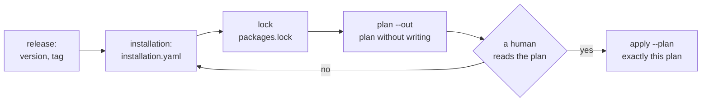

# Installation and release

How a package gets onto a deployment and how its version is released: the
installation file and sources (installation directory, path, git by tag), pinning
with `packages.lock`, a single plan with `plan --out` and applying exactly that
plan with `apply --plan`, console edits, upgrading with live instances,
retirement, and releasing a version with a tag. The page is for package authors
and installation administrators. Rationale: TAI-ADR-0062 (items 6–7),
CP-ADR-0074.



## Installation file { #installation }

An installation is a separate file in the git repository of the **installation**,
not of the package: which packages are installed on a particular deployment and
from where, which ontologies are enabled for workspaces, and what is retired.

```yaml
apiVersion: taimen.ai/v1
kind: Installation
key: production
spec:
  packages:
    - notifications                                             # installation directory
    - {key: claims, path: ../claims}                            # path relative to the installation file
    - {key: helpdesk, git: https://git.example.com/example/helpdesk.git, ref: v0.3.1}
    - {key: billing, git: git@git.example.com:example/packs.git, ref: v1.2.0, path: billing}
  knowledge:
    - {workspace: "${CLAIMS_WORKSPACE_ID}", packs: ["default@1", "claims@1"]}
  retire:
    TaskType: [legacy-claim-review]
```

| Source | Form | When to use it |
|---|---|---|
| installation directory | the package key | the package lives in the same git repository as the installation: `packages/<key>` next to the file, or `spec.packagesDir` |
| path | `{key, path}` | a neighboring checkout during development; `key` is checked against the manifest |
| git | `{key, git, ref, path?}` | a released version of the package from its repository |

Rules for a git source:

- the address is `https://host/path` without credentials in the address, or
  `git@host:path`; other git protocols (`file`, `ext`, `git`) are not accepted.
  Access to a private repository comes from the git credential helper, not from
  the installation file;
- `ref` is **a tag only** (`refs/tags/<ref>`): branches and commits are not
  accepted;
- `path` is the package subdirectory in the repository;
- only regular files are allowed in a package from git: a symbolic link, or two
  paths that differ only in case, means a refusal.

The `requires` of packages are pulled into the installation automatically: it is
enough to name the package you install. An empty `packages: []` is a valid
installation; only the system task type `task` remains on the deployment.

## Installation variables { #variables }

Everything that depends on the deployment, a package moves into `${NAME}`
variables and declares in the manifest (see [Package anatomy](anatomy.md#variables)).
The installation sets the values:

```bash
package-sdk describe ../claims --env-example > claims.env   # file scaffold
```

- The `--env` file (`.env` in the current directory by default) and the process
  environment; the environment takes precedence over the file.
- `plan` checks that every required variable is set, that the value matches its
  kind, and that the UUID of a workspace, project, principal, or role exists on the
  deployment.
- Values are not written into the plan, only their hash `variablesHash`. Apply
  rejects values that changed after the plan.
- There are no secrets among the variables: an executor secret is a name in the
  agent's `placement.secrets`, and the value lives on the node (see [Package
  agents](agents.md)).

## `packages.lock`: pinning sources { #lock }

```bash
package-sdk lock --install installation.yaml
```

```text
   claims 0.1.0: ../claims sha256:…
   helpdesk 0.3.1: https://git.example.com/example/helpdesk.git 4f2a9c1b3d5e sha256:…
записан packages.lock
```

`lock` writes `packages.lock` next to the installation file (format
`package-sdk.lock/v1`, schema `schema/v1/lock.schema.json`): for each package, the
source, the version, the tag commit (for git), and `contentHash`, the hash of the
package's canonical set of files. `packages.lock` is committed to the
installation's git repository.

`plan` is built only from the pinned contents:

| Refusal | When | What to do |
|---|---|---|
| `lock_required` | the package is from git, and there is no lock entry | `package-sdk lock` |
| `source_ref_moved` | the tag in the source was moved after pinning | find out who moved the tag; to accept the new commit, run `lock` again |
| `content_mismatch` | the contents diverged from `contentHash`: an edited cache, or a package by path changed | commit the edit and run `lock` again |
| `lock_stale` | the lock does not match the installation: a missing package, a different source or version | `package-sdk lock` |

For packages from the installation directory and by path, a lock is optional:
they are in the installation's git repository anyway. But if a lock exists, it
covers all packages of the installation and is checked.

### Git source cache

Git sources are cached in `$PACKAGE_SDK_CACHE`, otherwise in
`$XDG_CACHE_HOME/package-sdk`, otherwise in `~/.cache/package-sdk`: a repository
mirror and commit exports. If a source is unavailable while the plan is built, the
commit is taken from the cache, but only if its hash matches the lock.

```bash
package-sdk cache prune          # exports not referenced by any packages.lock under the current directory
package-sdk cache prune --lock deploy/prod/packages.lock --lock deploy/test/packages.lock
package-sdk cache prune --all    # the whole cache
```

Without a single lock under the current directory, `prune` deletes nothing and
asks you to name lock files or pass `--all`.

## Plan { #plan }

```bash
export CP_TOKEN=<access token audience control-plane>
package-sdk plan --install installation.yaml \
    --server https://platform.example.com --env claims.env --out plan.json
```

`plan` writes nothing to the deployment. It checks the packages (`check`),
compares the deployment's core version from its `openapi.json` with the `engines`
of each package, checks the variables, and builds **one** plan for all kinds,
`package-sdk.plan/v1` (schema `schema/v1/plan.schema.json`):

| Section | What it contains |
|---|---|
| `catalog` | the kinds that the installer installs as core resources: roles, skills, artifact types, capabilities, project templates, workspace types; for a package without processes and calendars, also task types, agents, and work rules |
| `core` | for each package with processes or calendars, a core plan (`POST /api/v1/packages:plan`): the core itself plans and installs such a package's task types, agents, calendars, processes, and work rules; replay of processes and the fate of open instances |
| `knowledge` | registration of package ontologies and the resulting ontology sets of workspaces next to the current ones |
| `notification-rules` | the notification rules that the notification service accepted on `:validate` |
| `retire` | retirement; for processes and calendars, how many live instances will run to completion |

The plan document records the deployment address, the core version, the source
pinning hash `lockHash`, the variable values hash `variablesHash`, the
`overwriteConsole` flag, and `planHash` of the whole document.

| `plan` flag | What it does |
|---|---|
| `--install <file>` | the installation file (required) |
| `--server <address>` | the deployment (required) |
| `--out <file>` | where to save the plan (required) |
| `--env <file>` | variable values, `.env` by default |
| `--workspace <id>` | the workspace of the package's processes for the core plan |
| `--replay-limit <N>` | how many recent instances of each process to replay (0–200, 50 by default) |
| `--overwrite-console` | overwrite the fields that people edited in the console (below) |
| `--json` | the plan as a document on stdout |

For a human, the plan is printed by section in the order of application, and at
the end comes `итого изменений: N` (total changes: N) or `изменений нет` (no
changes). The structural diff of the core plan: `+` will be added, `~` will
change, `→` rename; lines with `-` in the `retire` section are retirement.

### Console edits and `--overwrite-console` { #overwrite-console }

A core object field that a person edited on the deployment after the previous
package apply (in the console or through the API) is owned by `console`, not by
the package. By default the plan **keeps** such fields: the published version
takes the value from the deployment, and the plan reports this in a separate
block:

```text
правки консоли: сохраняются (перезаписать — plan --overwrite-console)
  останутся как в консоли:
  = Process/claim (claims): /spec/decisions
```

To overwrite them with the value from the package, build the plan with the flag:

```bash
package-sdk plan --install installation.yaml --server https://platform.example.com \
    --out plan.json --overwrite-console
```

```text
правки консоли: перезаписываются (overwriteConsole)
  будут перезаписаны:
  ! Process/claim (claims): /spec/decisions
```

The flag is stored in the plan and is part of its hash: a plan without the flag
cannot be applied "with overwrite", and vice versa. If a console edit should be
kept permanently, move it into the package: `package-sdk export` exports the
object from the deployment into a package file (for processes and calendars, with
`--workspace`, to take console fields into account).

## Apply { #apply }

```bash
package-sdk apply --plan plan.json --server https://platform.example.com --env claims.env
```

`apply` applies **exactly the saved plan**:

1. the document's `planHash` matches: an edited plan file is rejected;
2. `--server` matches the deployment the plan was built for;
3. the sources (`lockHash`), the variable values (`variablesHash`), and the core
   version are the same as when the plan was built;
4. the plan is shown, and a human answered `y` in the terminal. Without a
   terminal, apply is cancelled: `нужен ответ человека в терминале` (a human
   answer in the terminal is required);
5. before the first write, each section is rebuilt and compared with the plan,
   and the core plan of each package is requested again and compared by its
   `planHash`. Any divergence gives `plan_stale`, and nothing is written.

Sections are applied in the order `catalog` → `core` → `knowledge` →
`notification-rules` → `retire`. They are not atomic with respect to each other:
each write is idempotent, and if apply was interrupted, a repeated `plan` shows
the remainder, and `apply` of the new plan delivers it.

### Credential

| Where | Token | Permissions |
|---|---|---|
| core | `CP_TOKEN` (an access token for the `control-plane` audience) or the operator's IAM credential that the core client finds | `packages.plan`; write permissions for the kinds being installed: `task_types.manage`, `artifact_types.manage`, `project_templates.manage`, `workspaces.manage`, `org.manage` (roles, capabilities, skills), `agents.manage`, `rules.write`, `processes.write`, `calendars.write`; all permissions that the package grants to its agents |
| notification service (if the installation has a `NotificationRule`) | `NOTIFY_TOKEN`, or an exchange of the same credential for the `notification-service` audience with the `notifications:admin` scope; the address is the `NOTIFICATION_SERVICE_URL` variable | — |

The token is taken before each request to the core and the notification
service: an access token from an IAM credential is exchanged again before it
expires, and after `401 invalid_credentials` once more, with the request
repeated. So a long `apply` does not fail with 401 halfway through the plan.
`CP_TOKEN` and `NOTIFY_TOKEN` are an explicit human choice: they are not
renewed, and their lifetime must cover the whole run.

The permissions that an agent description grants to the agent must be held by
whoever applies: otherwise `403 permission_escalation`.

## Upgrading with live instances { #upgrade }

A new package version is installed the same way: a new source (tag), `lock`,
`plan`, `apply`. For objects with immutable versions, an upgrade is a new version
next to the old one:

| Kind | What happens to what already exists |
|---|---|
| `TaskType`, `ProjectTemplate` | a new version is published, the previous active ones → `deprecated`; tasks and projects stay on their version |
| `Process` | `spec.version: N+1`; open instances run to completion on their version (`pin`) or move according to the `migrations` map (`migrate`). A removed element with open instances and no map is a `migration_required` plan error |
| `Skill` | a contract change with the same version is an error: raise `spec.version` |
| `Agent` | a new revision if the description changed; the executor restarts on it by itself |
| `KnowledgePack` | different contents with the same `version` is an error; an edit is a new version |

The core plan for a package with processes shows a replay of the new version over
the logs of recent instances: how many instances would have decided differently.
Details are in [Processes in a package](processes.md#versions) and
[Scenarios and the core plan](../processes/package-tests.md#plan).

## Retirement { #retire }

No kind supports deletion. An object that is no longer needed is retired by the
`retire` list of the installation file: this is the history of the environment,
not of the package.

| Kind in `retire` | What happens |
|---|---|
| `TaskType`, `ProjectTemplate` | all active versions → `deprecated`; the created tasks and projects live on |
| `WorkRule` | the rule is archived; the work it created remains |
| `Agent` | the executor stops, the credential is revoked, the run history remains; the key is not reused (`409 agent_retired`) |
| `NotificationRule` | the rule is retired in the notification service; sent notifications remain |
| `Process` | new instances do not start, live ones run to completion; the plan shows how many |
| `Calendar` | only if no active process refers to it (`calendar_in_use`) |

- `ArtifactType` is not retired.
- The system task type `task` cannot be retired.
- A key cannot be both declared in a package and retired by the same
  installation.
- A task type removed from a package is not retired by itself: add it to
  `retire` once its open tasks are closed.
- A rename is neither a retirement nor a creation: use `renames` in the manifest
  for it (see [Package anatomy](anatomy.md#renames)).

## Releasing a version { #release }

A package is released in its own repository with a tag. Installations take it
from git by that tag.

1. **Version.** `spec.version` of the manifest is the package's SemVer:
    - **major**: an object is removed or renamed, fields or permissions are
      narrowed, a process behaves differently on the same inputs, a new required
      variable;
    - **minor**: new objects, optional fields, variables with a `default`;
    - **patch**: a fix that does not change behavior.

    The process version (the process's `spec.version`, an integer) is separate:
    new process behavior is always `N+1`.
2. **Compatibility.** `engines` is the range of core versions the package was
   tested against (`init` writes the core minor that ships with the tool);
   `requires` lists packages with ranges. `package-sdk describe .` shows what an
   installation needs.
3. **License and authors.** `license` is an SPDX identifier
   (`package-sdk init --license Apache-2.0`), plus `authors` and `homepage`.
   `describe` and a README section show them.
4. **Documentation.** `package-sdk docs . --write` updates the generated README
   section; the package changelog records what was added, changed, removed, and
   what to do when upgrading.
5. **Testing.** `package-sdk test .`: a green pyramid (see [Package
   tests](testing.md)).
6. **Tag.** `git tag v<version>` on the release commit, and publish the tag. Tags
   are not moved: installations with a lock refuse with `source_ref_moved`. A fix
   is a new patch version and a new tag.
7. **Installation.** In the installation file, `{key, git, ref: v<version>}`,
   then `lock`, `plan`, `apply`.

!!! warning "Everyone who installs the package sees the tag"
    Publishing a tag is a decision, just like applying a plan. The author plugin
    in Claude Code asks for separate consent to the tag and separate consent to
    the apply (see [Package author in Claude Code](author-plugin.md#consent)).

## Deployment initialization

`make bootstrap` installs the default installation by itself, at step 5b, through
the same single plan as `plan` and `apply`: all kinds, and the plan is saved in the
initialization state directory. There is no separate confirmation: starting the
initialization is already the operator's decision, and the log marks it. A repeated
run builds the plan again and applies nothing if it is empty. For a running
deployment there is one path: `plan --out`, a human reviews the plan, then
`apply --plan`.

## Common problems

| Symptom | Cause | What to do |
|---|---|---|
| `plan`: `версия ядра не прочитана … план не строится` (the core version was not read … the plan is not built) | the deployment is unreachable at `--server` | check the address and the network |
| `plan`: the core version is outside `engines` | the package is not designed for this core version | upgrade the package or the core; adjust `engines` if the package has been tested |
| `lock_required`, `lock_stale`, `content_mismatch`, `source_ref_moved` | the lock does not match the sources | see [the table above](#lock) |
| git source: `нужен https://хост/путь без учётных данных` (https://host/path without credentials is required) | a token in the address or an unsupported protocol | move the credentials into the git credential helper |
| `ref`: `нужно имя тега` (a tag name is required) | a branch or a commit instead of a tag | release a tag |
| `plan_stale` | after the plan, the deployment, instances, sources, or variables changed | build the plan again and show it again |
| `план построен для …, а применяется к …` (the plan was built for …, but is applied to …) | a different `--server` for `apply` | apply to the deployment the plan was built for |
| `apply`: `нужен ответ человека в терминале, применение отменено` (a human answer in the terminal is required, apply cancelled) | no terminal | run it in a terminal |
| `migration_required` | a removed process element with open instances and no map | a `migrations` map or the `pin` policy |
| `403 permission_escalation` | the token lacks the permissions that the package grants to agents | apply with a token that has these permissions |
| `apply` breaks off with `401 invalid_credentials` | `CP_TOKEN` or `NOTIFY_TOKEN` expired: a token set by a variable is not renewed | apply with an IAM credential (its token is renewed automatically) or set a fresh token; a new `plan` shows the remainder |
| `plan`: `в установке есть правила уведомлений — нужен сервис уведомлений` (the installation has notification rules: the notification service is needed) | no `NOTIFICATION_SERVICE_URL` or no token | set the variable and `NOTIFY_TOKEN` |

## See also

- [Package anatomy](anatomy.md): manifest, variables, versions, renames
- [Package tests](testing.md)
- [Processes in a package](processes.md#versions): versions and live instances
- [Catalog packages](../control-plane/catalog-packages.md): reference of kinds and how they are applied
- [Package author in Claude Code](author-plugin.md): `pkg_plan` and `pkg_apply`
- [Package readiness checklist](checklist.md)
