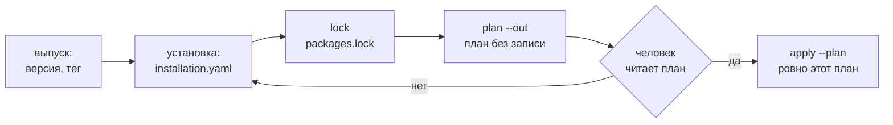

# Установка и выпуск

Как пакет попадает на стенд и как выпускается его версия: файл установки и
источники (каталог, путь, git по тегу), фиксация `packages.lock`, единый план
`plan --out` и применение ровно этого плана `apply --plan`, правки консоли,
обновление при живых делах, вывод из оборота, выпуск версии тегом. Страница для
автора пакета и администратора установки. Обоснование — TAI-ADR-0062 (п.6–7),
CP-ADR-0074.



## Файл установки { #installation }

Установка — отдельный файл в git **установки**, а не пакета: какие пакеты и
откуда ставятся на конкретный стенд, какие онтологии включены пространствам
работы и что выводится из оборота.

```yaml
apiVersion: taimen.ai/v1
kind: Installation
key: production
spec:
  packages:
    - notifications                                             # каталог установки
    - {key: claims, path: ../claims}                            # путь от файла установки
    - {key: helpdesk, git: https://git.example.com/example/helpdesk.git, ref: v0.3.1}
    - {key: billing, git: git@git.example.com:example/packs.git, ref: v1.2.0, path: billing}
  knowledge:
    - {workspace: "${CLAIMS_WORKSPACE_ID}", packs: ["default@1", "claims@1"]}
  retire:
    TaskType: [legacy-claim-review]
```

| Источник | Форма | Когда брать |
|---|---|---|
| каталог установки | ключ пакета | пакет живёт в том же git, что установка: `packages/<ключ>` рядом с файлом или `spec.packagesDir` |
| путь | `{key, path}` | соседний checkout при разработке; `key` сверяется с манифестом |
| git | `{key, git, ref, path?}` | выпущенная версия пакета из его репозитория |

Правила источника git:

- адрес — `https://хост/путь` без учётных данных в адресе или `git@хост:путь`;
  другие протоколы git (`file`, `ext`, `git`) не принимаются. Доступ к
  приватному репозиторию даёт credential helper git, а не файл установки;
- `ref` — **только тег** (`refs/tags/<ref>`): ветки и коммиты не принимаются;
- `path` — подкаталог пакета в репозитории;
- в пакете из git допустимы только обычные файлы: символическая ссылка или два
  пути, различающиеся только регистром, — отказ.

`requires` пакетов подтягиваются в установку сами: достаточно назвать пакет,
который вы ставите. Пустой `packages: []` — законная установка, на стенде
остаётся только системный тип задачи `task`.

## Переменные установки { #variables }

Всё, что зависит от стенда, пакет выносит в переменные `${ИМЯ}` и объявляет в
манифесте (см. [Анатомию](anatomy.md#variables)). Значения задаёт установка:

```bash
package-sdk describe ../claims --env-example > claims.env   # заготовка файла
```

- Файл `--env` (по умолчанию `.env` в текущем каталоге) и окружение процесса;
  окружение сильнее файла.
- `plan` проверяет, что каждая обязательная переменная задана, значение
  подходит виду, а UUID пространства работы, проекта, principal'а и роли
  существует на стенде.
- В план значения не пишутся — только их хэш `variablesHash`. Значения,
  изменившиеся после плана, применение отвергает.
- Секретов среди переменных нет: секрет исполнителя — имя в
  `placement.secrets` агента, значение лежит на узле (см. [Агенты
  пакета](agents.md)).

## `packages.lock` — фиксация источников { #lock }

```bash
package-sdk lock --install installation.yaml
```

```text
   claims 0.1.0: ../claims sha256:…
   helpdesk 0.3.1: https://git.example.com/example/helpdesk.git 4f2a9c1b3d5e sha256:…
записан packages.lock
```

`lock` пишет рядом с файлом установки `packages.lock` (формат
`package-sdk.lock/v1`, схема `schema/v1/lock.schema.json`): у каждого пакета —
источник, версия, коммит тега (у git) и `contentHash` — хэш канонического
набора файлов пакета. `packages.lock` коммитится в git установки.

`plan` строится только по зафиксированному содержимому:

| Отказ | Когда | Что делать |
|---|---|---|
| `lock_required` | пакет из git, а записи в lock нет | `package-sdk lock` |
| `source_ref_moved` | тег в источнике переставили после фиксации | выяснить, кто переставил тег; принять новый коммит — заново `lock` |
| `content_mismatch` | содержимое разошлось с `contentHash`: правленый кэш или пакет по пути изменился | закоммитить правку и заново `lock` |
| `lock_stale` | lock не соответствует установке: нет пакета, другой источник или версия | `package-sdk lock` |

Для пакетов из каталога установки и по пути lock необязателен — они и так в
git установки. Но если lock есть, он покрывает все пакеты установки и
сверяется.

### Кэш источников git

Источники git кэшируются в `$PACKAGE_SDK_CACHE`, иначе
`$XDG_CACHE_HOME/package-sdk`, иначе `~/.cache/package-sdk`: зеркало репозитория
и выгрузки коммитов. Если источник недоступен при построении плана, берётся
коммит из кэша — только когда его хэш сходится с lock.

```bash
package-sdk cache prune          # выгрузки, на которые не ссылается ни один packages.lock под текущим каталогом
package-sdk cache prune --lock deploy/prod/packages.lock --lock deploy/test/packages.lock
package-sdk cache prune --all    # весь кэш
```

Без единого lock под текущим каталогом `prune` ничего не удаляет и просит
назвать lock-файлы или `--all`.

## План { #plan }

```bash
export CP_TOKEN=<access token audience control-plane>
package-sdk plan --install installation.yaml \
    --server https://platform.example.com --env claims.env --out plan.json
```

`plan` ничего не пишет на стенд. Он проверяет пакеты (`check`), сверяет
версию ядра стенда из его `openapi.json` с `engines` каждого пакета, проверяет
переменные и строит **один** план на все виды — `package-sdk.plan/v1` (схема
`schema/v1/plan.schema.json`):

| Секция | Что в ней |
|---|---|
| `catalog` | виды, которые установщик ставит ресурсами ядра: роли, скиллы, типы артефактов, capabilities, шаблоны проектов, типы workspace; у пакета без процессов и календарей — ещё типы задач, агенты и правила вывода работы |
| `core` | по каждому пакету с процессами или календарями — план ядра (`POST /api/v1/packages:plan`): ядро само планирует и ставит у такого пакета типы задач, агентов, календари, процессы и правила вывода работы; replay процессов и судьба открытых дел |
| `knowledge` | регистрация онтологий пакетов и итоговые наборы онтологий пространств работы рядом с текущими |
| `notification-rules` | правила уведомлений, которые сервис уведомлений принял на `:validate` |
| `retire` | вывод из оборота, у процессов и календарей — сколько живых дел доживёт |

В документе плана записаны адрес стенда, версия ядра, хэш фиксации
источников `lockHash`, хэш значений переменных `variablesHash`, флаг
`overwriteConsole` и `planHash` всего документа.

| Флаг `plan` | Что делает |
|---|---|
| `--install <файл>` | файл установки (обязательно) |
| `--server <адрес>` | стенд (обязательно) |
| `--out <файл>` | куда сохранить план (обязательно) |
| `--env <файл>` | значения переменных, по умолчанию `.env` |
| `--workspace <id>` | workspace процессов пакета для плана ядра |
| `--replay-limit <N>` | сколько недавних дел каждого процесса прогнать replay (0–200, по умолчанию 50) |
| `--overwrite-console` | перезаписать поля, которые люди правили в консоли (ниже) |
| `--json` | план документом в stdout |

Человеку план печатается по секциям в порядке применения, а в конце —
`итого изменений: N` или `изменений нет`. Структурный diff плана ядра —
`+` добавится, `~` изменится, `→` переименование; строки с `-` в секции
`retire` — вывод из оборота.

### Правки консоли и `--overwrite-console` { #overwrite-console }

Поле объекта ядра, которое человек правил на стенде после прошлого применения
пакета (в консоли или через API), принадлежит `console`, а не пакету. По
умолчанию план такие поля **сохраняет**: публикуемая версия берёт значение
со стенда, и план говорит об этом отдельным блоком:

```text
правки консоли: сохраняются (перезаписать — plan --overwrite-console)
  останутся как в консоли:
  = Process/claim (claims): /spec/decisions
```

Перезаписать их значением из пакета — построить план с флагом:

```bash
package-sdk plan --install installation.yaml --server https://platform.example.com \
    --out plan.json --overwrite-console
```

```text
правки консоли: перезаписываются (overwriteConsole)
  будут перезаписаны:
  ! Process/claim (claims): /spec/decisions
```

Флаг хранится в плане и входит в его хэш: план без флага нельзя применить
«с перезаписью», и наоборот. Если правку консоли стоит сохранить навсегда,
перенесите её в пакет: `package-sdk export` выгружает объект со стенда в файл
пакета (для процессов и календарей — с `--workspace`, чтобы учесть поля
консоли).

## Применение { #apply }

```bash
package-sdk apply --plan plan.json --server https://platform.example.com --env claims.env
```

`apply` применяет **ровно сохранённый план**:

1. `planHash` документа сходится — правленый файл плана отвергается;
2. `--server` совпадает со стендом, для которого план построен;
3. источники (`lockHash`), значения переменных (`variablesHash`) и версия ядра
   те же, что при построении;
4. план показан, и человек ответил `y` в терминале. Без терминала применение
   отменяется: «нужен ответ человека в терминале»;
5. до первой записи каждая секция строится заново и сверяется с планом, а план
   ядра каждого пакета запрашивается заново и сверяется по его `planHash`.
   Любое расхождение — `plan_stale`, ничего не записано.

Секции применяются по порядку `catalog` → `core` → `knowledge` →
`notification-rules` → `retire`. Между собой они не атомарны: каждая запись
идемпотентна, и если применение оборвалось, повторный `plan` покажет остаток,
а `apply` нового плана его доставит.

### Credential

| Куда | Токен | Права |
|---|---|---|
| ядро | `CP_TOKEN` (access token audience `control-plane`) или IAM credential оператора, который находит клиент ядра | `packages.plan`; права записи ставимых видов: `task_types.manage`, `artifact_types.manage`, `project_templates.manage`, `workspaces.manage`, `org.manage` (роли, capabilities, скиллы), `agents.manage`, `rules.write`, `processes.write`, `calendars.write`; все права, которые пакет выдаёт своим агентам |
| сервис уведомлений (если в установке есть `NotificationRule`) | `NOTIFY_TOKEN` или обмен того же credential на audience `notification-service` со scope `notifications:admin`; адрес — переменная `NOTIFICATION_SERVICE_URL` | — |

Токен берётся перед каждым запросом к ядру и сервису уведомлений: access token
по IAM credential обменивается заново до истечения, а после
`401 invalid_credentials` — ещё раз с повтором запроса. Поэтому долгий `apply`
не падает на 401 посреди плана. `CP_TOKEN` и `NOTIFY_TOKEN` — явный выбор
человека: они не обновляются, и их срока должно хватить на весь прогон.

Права, которые описание агента выдаёт агенту, должны быть у применяющего:
иначе `403 permission_escalation`.

## Обновление при живых делах { #upgrade }

Новая версия пакета ставится тем же путём: новый источник (тег), `lock`,
`plan`, `apply`. У объектов с неизменяемыми версиями обновление — это новая
версия рядом со старой:

| Вид | Что происходит с уже созданным |
|---|---|
| `TaskType`, `ProjectTemplate` | публикуется новая версия, прежние активные → `deprecated`; задачи и проекты остаются на своей версии |
| `Process` | `spec.version: N+1`; открытые дела дорабатывают по своей версии (`pin`) или переходят по карте `migrations` (`migrate`). Удалённый элемент с открытыми делами без карты — ошибка плана `migration_required` |
| `Skill` | изменение контракта при той же версии — ошибка «поднимите `spec.version`» |
| `Agent` | новая ревизия, если изменилось описание; исполнитель поднимается на ней сам |
| `KnowledgePack` | другое содержимое при той же `version` — ошибка; правка — новая версия |

План ядра для пакета с процессами показывает replay новой версии по журналам
недавних дел: сколько дел решили бы иначе. Подробно — в
[Процессах в пакете](processes.md#versions) и
[Сценариях и плане ядра](../processes/package-tests.md#plan).

## Вывод из оборота { #retire }

Удаления нет ни у одного вида. Объект, который больше не нужен, выводится
списком `retire` файла установки: это история окружения, а не пакета.

| Вид в `retire` | Что происходит |
|---|---|
| `TaskType`, `ProjectTemplate` | все активные версии → `deprecated`; созданные задачи и проекты живут |
| `WorkRule` | правило архивируется, заведённая им работа остаётся |
| `Agent` | исполнитель останавливается, credential отзывается, история прогонов остаётся; ключ заново не используется (`409 agent_retired`) |
| `NotificationRule` | правило выводится в сервисе уведомлений, отправленные уведомления остаются |
| `Process` | новые дела не стартуют, живые дорабатывают; план показывает, сколько их |
| `Calendar` | только если на него не ссылается активный процесс (`calendar_in_use`) |

- `ArtifactType` из оборота не выводится.
- Системный тип задачи `task` вывести нельзя.
- Ключ не может одновременно быть объявлен в пакете и выводиться той же
  установкой.
- Тип задачи, убранный из пакета, сам из оборота не выходит: добавьте его в
  `retire`, когда закрыты его открытые задачи.
- Переименование — не вывод и не создание: для этого `renames` в манифесте
  (см. [Анатомию](anatomy.md#renames)).

## Выпуск версии { #release }

Пакет выпускается в своём репозитории тегом. Установки берут его из git по
этому тегу.

1. **Версия.** `spec.version` манифеста — SemVer пакета:
    - **major** — удалён или переименован объект, сужены поля или права, процесс
      ведёт себя иначе на тех же входах, новая обязательная переменная;
    - **minor** — новые объекты, необязательные поля, переменные с `default`;
    - **patch** — исправление без изменения поведения.

    Версия процесса (`spec.version` процесса, целое) живёт отдельно: новое
    поведение процесса — всегда `N+1`.
2. **Совместимость.** `engines` — диапазон версий ядра, против которых пакет
   проверен (`init` пишет minor ядра рядом с инструментом); `requires` — пакеты
   с диапазонами. `package-sdk describe .` показывает, что нужно установке.
3. **Лицензия и авторы.** `license` — идентификатор SPDX
   (`package-sdk init --license Apache-2.0`), `authors`, `homepage`. Их
   показывает `describe` и раздел README.
4. **Документация.** `package-sdk docs . --write` обновляет сгенерированный
   раздел README; журнал изменений пакета — что добавлено, изменено, удалено и
   что сделать при обновлении.
5. **Проверка.** `package-sdk test .` — зелёная пирамида (см. [Тесты
   пакета](testing.md)).
6. **Тег.** `git tag v<версия>` на коммит выпуска и публикация тега. Тег не
   переставляют: установки с lock откажут `source_ref_moved`. Исправление —
   новая patch-версия и новый тег.
7. **Установка.** В файле установки — `{key, git, ref: v<версия>}`, затем
   `lock`, `plan`, `apply`.

!!! warning "Тег видят все, кто ставит пакет"
    Публикация тега — решение, как и применение плана. Плагин автора в Claude
    Code спрашивает отдельное согласие на тег и отдельное — на применение (см.
    [Автор пакетов в Claude Code](author-plugin.md#consent)).

## Инициализация стенда

`make bootstrap` ставит установку по умолчанию сам, на шаге 5b, тем же единым
планом, что `plan` и `apply`: все виды, план сохраняется в каталоге состояния
инициализации. Отдельного подтверждения нет: запуск инициализации — уже решение
оператора, и журнал это помечает. Повторный запуск строит план заново и, если он
пуст, ничего не применяет. Для работающего стенда путь один — `plan --out`,
просмотр плана человеком и `apply --plan`.

## Типичные проблемы

| Симптом | Причина | Что делать |
|---|---|---|
| `plan`: «версия ядра не прочитана … план не строится» | стенд недоступен по `--server` | проверить адрес и сеть |
| `plan`: версия ядра вне `engines` | пакет не рассчитан на эту версию ядра | обновить пакет или ядро; поправить `engines`, если пакет проверен |
| `lock_required`, `lock_stale`, `content_mismatch`, `source_ref_moved` | lock не соответствует источникам | см. [таблицу выше](#lock) |
| источник git: «нужен https://хост/путь без учётных данных» | в адресе токен или неподдерживаемый протокол | убрать учётные данные в credential helper git |
| `ref`: «нужно имя тега» | ветка или коммит вместо тега | выпустить тег |
| `plan_stale` | после плана изменились стенд, дела, источники или переменные | построить план заново и показать его снова |
| «план построен для …, а применяется к …» | другой `--server` у `apply` | применять к тому стенду, для которого построен план |
| `apply`: «нужен ответ человека в терминале, применение отменено» | нет терминала | запустить в терминале |
| `migration_required` | удалённый элемент процесса с открытыми делами без карты | карта `migrations` или политика `pin` |
| `403 permission_escalation` | у токена нет прав, которые пакет выдаёт агентам | применять токеном с этими правами |
| `apply` обрывается на `401 invalid_credentials` | истёк `CP_TOKEN` или `NOTIFY_TOKEN`: заданный переменной токен не обновляется | применять с IAM credential (токен обновляется сам) или задать свежий токен; новый `plan` покажет остаток |
| `plan`: «в установке есть правила уведомлений — нужен сервис уведомлений» | нет `NOTIFICATION_SERVICE_URL` или токена | задать переменную и `NOTIFY_TOKEN` |

## См. также

- [Анатомия пакета](anatomy.md) — манифест, переменные, версии, переименования
- [Тесты пакета](testing.md)
- [Процессы в пакете](processes.md#versions) — версии и живые дела
- [Пакеты каталога](../control-plane/catalog-packages.md) — справочник видов и их применения
- [Автор пакетов в Claude Code](author-plugin.md) — `pkg_plan` и `pkg_apply`
- [Чек-лист готовности пакета](checklist.md)
