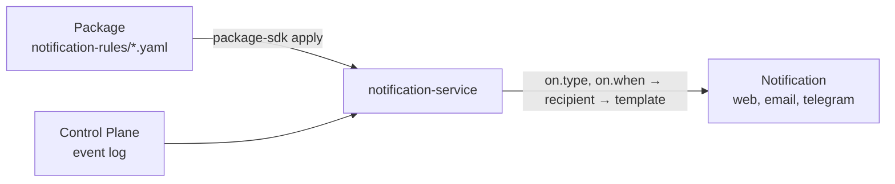

# Package notifications

The work that a package derives has to reach people: a task is assigned, an
approval is waiting for a decision, a case is closed. Which Control Plane event
becomes a notification, to whom, with what text, links, and buttons, a package
describes with **notification rules**: objects of the `NotificationRule` kind in
the `notification-rules/` folder. The article is for package authors: how to write
a rule, choose the recipient, add decision buttons, and ship rules with the
package. Rationale: TAI-ADR-0053 (item 4).

The full rule specification, the validation order, and the service API are in the
article [Notification rules](../notifications/notification-rules.md).

## Where a rule lives

A rule is a package object just like a task type, but it is applied **to the
notification service**, not to the core: the service stores rule versions, reads
core events, and creates notifications with its own account, with channels,
recipient preferences, and a delivery log.



- A new kind of notification is a package edit and `apply`, without a service
  release.
- The service has no built-in "event → notification" table: as long as the tenant
  has no enabled rule, the service does not read events.

## A package rule

```yaml
# notification-rules/claim-resolved.yaml
apiVersion: taimen.ai/v1
kind: NotificationRule
key: claim-resolved
spec:
  description: Владельцу задачи — обращение закрыто и принято.
  "on":
    type: task.verified
    when: {eq: [{var: task.typeKey}, claim-resolution]}
  recipient: {kind: taskOwner, fallback: taskAssignee}
  notification:
    type: claims.claim_resolved
    title: "Обращение закрыто: {{task.publicId}} {{task.title}}"
    body: |-
      Исполнитель: {{task.assigneeId.displayName}}
    links:
      - {label: Открыть задачу, url: "${TASK_URL_BASE}/{{task.publicId}}"}
```

`package-sdk add NotificationRule <key>` writes a scaffold on `task.created` to
the task assignee.

| Field | What it sets |
|---|---|
| `on.type` | an event type from the core catalog (`task.verified`) or a prefix (`approval.*`) |
| `on.when` | a condition in the core rule grammar: `true`, `false`, or an object with one operator (`and`, `or`, `not`, `eq`, `ne`, `lt`, `le`, `gt`, `ge`, `in`, `exists`) over `{var: <path>}` with the roots `payload`, `event`, `task`; `true` by default |
| `recipient` | to whom (below) |
| `notification.type` | the notification type `^[a-z][a-z0-9_]*(\.[a-z][a-z0-9_]*)+$`; recipient preferences work by it; name it after the package domain |
| `notification.title`, `body` | templates for the title (up to 300 characters) and the text (up to 4000) with `{{ path }}` placeholders |
| `notification.links` | up to 5 links `{label, url}` |
| `notification.actions` | `[approvalDecide]`: the "Approve" and "Reject" buttons |
| `dedupKeyTemplate` | the deduplication key; `rule:<key>:event:{{event.id}}` by default |
| `close.on`, `close.outcome` | which events close the buttons of a notification with the same key, and with which outcome |
| `status` | `enabled` (default) or `disabled` |

!!! warning "Quote the `on` key"
    A YAML 1.1 loader reads a bare `on` as `true`, and the rule loses a required
    field. Write `"on":`.

Templates have no conditions or loops: different texts are different rules with
different `on.when`. A missing value gives an empty string; a `body` line in which
all placeholders are empty is omitted entirely; a link with an empty placeholder or
a non-absolute URL is omitted. A path that ends in `displayName` after a principal
identifier substitutes the name from the core catalog.

## Recipient

| `recipient.kind` | Who receives it | When to choose it |
|---|---|---|
| `taskOwner` | the owner of the event's task | the result of work goes to whoever is waiting for it |
| `taskAssignee` | the assignee of the event's task | work has come to the assignee |
| `assigned` | the assigned decider of the approval event; without one, the holders of the required role | decision requests |
| `role` | the holders of the role whose id is at the `ref` path, in the event's workspace | group work |
| `principal` | a specific principal, `ref` is a UUID | a service recipient of the installation |

`fallback` is `taskOwner`, `taskAssignee`, or `none`: the second recipient if the
first is empty.

A package does not know the people of an installation. Derive the recipient from
the event: the owner, the assignee, a role. If you need a specific principal, write
it as an installation variable of the `principal` kind:

```yaml
# package.yaml
spec:
  variables:
    CLAIMS_ESCALATION_PRINCIPAL:
      kind: principal
      description: Кому уходят обращения без исполнителя
    TASK_URL_BASE:
      kind: url
      description: База ссылки «Открыть задачу» интерфейса установки
```

```yaml
recipient: {kind: principal, ref: "${CLAIMS_ESCALATION_PRINCIPAL}"}
```

The package installer substitutes `${NAME}`; the service stores and accepts only
UUIDs.

## Decision buttons

A decision request with buttons, and closing them with the outcome:

```yaml
# notification-rules/claim-approval-requested.yaml
apiVersion: taimen.ai/v1
kind: NotificationRule
key: claim-approval-requested
spec:
  "on":
    type: approval.requested
    when: {eq: [{var: task.typeKey}, claim-reply]}
  recipient: {kind: assigned}
  notification:
    type: claims.reply_approval_requested
    title: "Ответ на обращение ждёт решения: {{task.publicId}}"
    body: |-
      Комментарий: {{payload.comment}}
    actions: [approvalDecide]
  dedupKeyTemplate: "claims:approval:{{event.entityId}}"
  close:
    "on": [approval.approved, approval.rejected, approval.cancelled]
```

- `approvalDecide` is allowed only for events of the `approval` entity: the service
  builds the `approve` and `reject` actions from `event.entityId`, the approval id.
  A channel with buttons executes them.
- Closing finds the notification by the key rendered over the closing event.
  Therefore the key is built from what the opening and closing events have in
  common; for decisions, this is `event.entityId`.
- A decision by button is a human decision on the approval, as in the interface; an
  external write after it goes as the approval outcome (see [Package
  skills](skills.md#external-write)).

## Validation and apply

`check` without the service validates the schema (`$defs.notificationRuleSpec`),
the rule key, and the `on.when` grammar. Event types, the `payload.…`, `event.…`,
`task.…` paths, and the consistency of the rule are known only to the service:
`:validate` checks them during `plan`.

```bash
export CP_TOKEN=<access token audience control-plane>
export NOTIFICATION_SERVICE_URL=https://platform.example.com/notify
export NOTIFY_TOKEN=<access token audience notification-service, scope notifications:admin>
package-sdk plan --install packages.yaml --server https://platform.example.com --out plan.json
package-sdk apply --plan plan.json --server https://platform.example.com
```

1. `plan` calls `POST /api/v1/notification-rules:validate` for all rules of the
   installation. A rule that the service would not accept stops the whole plan. An
   installation with notification rules is not planned without the service address
   and a token.
2. The `notification-rules` plan section includes only the rules for which
   `:validate` answered `changed: true`; the service computes the version from the
   specification hash.
3. `apply --plan` applies the sections in order: catalog, core, ontologies,
   notification rules, retirement. By the time the rules are written, the core has
   already been brought up to date.

The token is `NOTIFY_TOKEN`, or an exchange of the same IAM credential that the
installer uses for the core for the `notification-service` audience with the
`notifications:admin` scope (the PAT ceiling must allow this). The exchanged token
is taken before each request and renewed before it expires; `NOTIFY_TOKEN` is not
renewed.

Retirement is a key in `retire.NotificationRule` of the installation file: the
service moves the current version to `retired`; notifications already sent remain.
Exporting the current version into a package is `package-sdk export --kind
NotificationRule --key <key> --package <directory>`; it does not need the core.

## Common problems

| Symptom | Cause and fix |
|---|---|
| no notifications about events at all | the tenant has no enabled rules: apply a package with rules |
| the plan is not built: `в установке есть правила уведомлений — нужен сервис уведомлений` (the installation has notification rules: the notification service is needed) | no `NOTIFICATION_SERVICE_URL` or no token for the `notification-service` audience |
| `422 invalid_notification_rule`, `unknown_event_type` | the event type is not from the core catalog known to the service |
| `invalid_spec` at `/on` | an unquoted `on` turned into `true` |
| `unknown_field` on a `task.…` path | the event has no task, or the field is not in the task projection |
| no "Open task" link | the link base variable is empty or the result is not an absolute URL |
| the buttons did not close after the decision | the deduplication keys of the opening and closing events differ: build them from `event.entityId` |

## See also

- [Notification rules](../notifications/notification-rules.md): specification and API
- [Notifications](../notifications/index.md): channels, recipient preferences, log
- [Telegram](../notifications/telegram.md): decisions by buttons
- [Events](../control-plane/events.md): the core event catalog
- [Approvals](../control-plane/approvals.md)
- [Catalog packages](../control-plane/catalog-packages.md#notification-rule)
