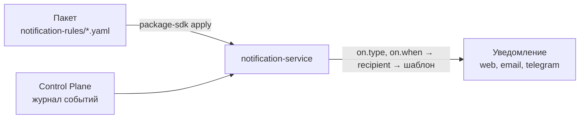

# Уведомления пакета

Работа, которую выводит пакет, должна доходить до людей: задача назначена,
согласование ждёт решения, дело закрыто. Какое событие Control Plane становится
уведомлением, кому, с каким текстом, ссылками и кнопками, пакет описывает
**правилами уведомлений** — объектами вида `NotificationRule` в папке
`notification-rules/`. Статья для автора пакета: как написать правило, выбрать
адресата, дать кнопки решения и поставить правила вместе с пакетом. Обоснование —
TAI-ADR-0053 (п.4).

Полная спецификация правила, порядок проверки и API сервиса — в статье [Правила
уведомлений](../notifications/notification-rules.md).

## Где живёт правило

Правило — такой же объект пакета, как тип задачи, но применяется **к сервису
уведомлений**, а не к ядру: сервис хранит версии правил, читает события ядра и
создаёт уведомления своей учётной записью — с каналами, настройками получателя и
журналом доставки.



- Новый вид уведомления — правка пакета и `apply`, без выпуска сервиса.
- Встроенной таблицы «событие → уведомление» в сервисе нет: пока в tenant'е нет ни
  одного включённого правила, сервис событий не читает.

## Правило пакета

```yaml
# notification-rules/claim-resolved.yaml
apiVersion: taimen.ai/v1
kind: NotificationRule
key: claim-resolved
spec:
  description: Владельцу задачи — обращение закрыто и принято.
  "on":
    type: task.verified
    when: {eq: [{var: task.typeKey}, claim-resolution]}
  recipient: {kind: taskOwner, fallback: taskAssignee}
  notification:
    type: claims.claim_resolved
    title: "Обращение закрыто: {{task.publicId}} {{task.title}}"
    body: |-
      Исполнитель: {{task.assigneeId.displayName}}
    links:
      - {label: Открыть задачу, url: "${TASK_URL_BASE}/{{task.publicId}}"}
```

`package-sdk add NotificationRule <ключ>` пишет заготовку на `task.created`
исполнителю задачи.

| Поле | Что задаёт |
|---|---|
| `on.type` | тип события каталога ядра (`task.verified`) или префикс (`approval.*`) |
| `on.when` | условие грамматики правил ядра — `true`, `false` или объект с одним оператором (`and`, `or`, `not`, `eq`, `ne`, `lt`, `le`, `gt`, `ge`, `in`, `exists`) над `{var: <путь>}` с корнями `payload`, `event`, `task`; по умолчанию `true` |
| `recipient` | кому (ниже) |
| `notification.type` | тип уведомления `^[a-z][a-z0-9_]*(\.[a-z][a-z0-9_]*)+$` — по нему работают настройки получателя; называйте его по домену пакета |
| `notification.title`, `body` | шаблоны заголовка (до 300 символов) и текста (до 4000) с плейсхолдерами `{{ путь }}` |
| `notification.links` | до 5 ссылок `{label, url}` |
| `notification.actions` | `[approvalDecide]` — кнопки «Одобрить» и «Отклонить» |
| `dedupKeyTemplate` | ключ дедупликации; по умолчанию `rule:<key>:event:{{event.id}}` |
| `close.on`, `close.outcome` | какие события закрывают кнопки уведомления с тем же ключом и каким исходом |
| `status` | `enabled` (по умолчанию) или `disabled` |

!!! warning "Ключ `on` — в кавычках"
    Загрузчик YAML 1.1 читает голый `on` как `true`, и правило теряет обязательное
    поле. Пишите `"on":`.

В шаблонах нет условий и циклов: разные тексты — разные правила с разными
`on.when`. Отсутствующее значение даёт пустую строку, строка `body`, где все
плейсхолдеры пусты, опускается целиком, а ссылка с пустым плейсхолдером или не
абсолютным URL — опускается. Путь, который заканчивается `displayName` после
идентификатора principal'а, подставляет имя из каталога ядра.

## Адресат

| `recipient.kind` | Кто получает | Когда выбирать |
|---|---|---|
| `taskOwner` | владелец задачи события | результат работы — тому, кто её ждёт |
| `taskAssignee` | исполнитель задачи события | работа пришла к исполнителю |
| `assigned` | назначенный решающий события согласования; без него — держатели требуемой роли | запросы решения |
| `role` | держатели роли, id которой по пути `ref`, в workspace события | работа группы |
| `principal` | конкретный principal, `ref` — UUID | служебный адресат установки |

`fallback` — `taskOwner`, `taskAssignee` или `none`: второй адресат, если первый пуст.

Пакет не знает людей установки. Адресата выводите из события — владельца,
исполнителя, роли. Если нужен конкретный principal, пишите его переменной установки
вида `principal`:

```yaml
# package.yaml
spec:
  variables:
    CLAIMS_ESCALATION_PRINCIPAL:
      kind: principal
      description: Кому уходят обращения без исполнителя
    TASK_URL_BASE:
      kind: url
      description: База ссылки «Открыть задачу» интерфейса установки
```

```yaml
recipient: {kind: principal, ref: "${CLAIMS_ESCALATION_PRINCIPAL}"}
```

`${ИМЯ}` подставляет установщик пакетов; сервис хранит и принимает только UUID.

## Кнопки решения

Запрос решения с кнопками и их закрытие исходом:

```yaml
# notification-rules/claim-approval-requested.yaml
apiVersion: taimen.ai/v1
kind: NotificationRule
key: claim-approval-requested
spec:
  "on":
    type: approval.requested
    when: {eq: [{var: task.typeKey}, claim-reply]}
  recipient: {kind: assigned}
  notification:
    type: claims.reply_approval_requested
    title: "Ответ на обращение ждёт решения: {{task.publicId}}"
    body: |-
      Комментарий: {{payload.comment}}
    actions: [approvalDecide]
  dedupKeyTemplate: "claims:approval:{{event.entityId}}"
  close:
    "on": [approval.approved, approval.rejected, approval.cancelled]
```

- `approvalDecide` допустимо только для событий сущности `approval`: сервис строит
  действия `approve` и `reject` по `event.entityId` — id согласования. Их исполняет
  канал с кнопками.
- Закрытие ищет уведомление по ключу, отрендеренному над закрывающим событием.
  Поэтому ключ строят из того, что общее у открывающего и закрывающего событий, —
  для решений это `event.entityId`.
- Решение кнопкой — решение человека по согласованию, как в интерфейсе; внешняя
  запись после него идёт исходом согласования (см. [Скиллы
  пакета](skills.md#external-write)).

## Проверка и применение

`check` без сервиса проверяет схему (`$defs.notificationRuleSpec`), ключ правила и
грамматику `on.when`. Типы событий, пути `payload.…`, `event.…`, `task.…` и
согласованность правила знает только сервис: их проверяет `:validate` при `plan`.

```bash
export CP_TOKEN=<access token audience control-plane>
export NOTIFICATION_SERVICE_URL=https://platform.example.com/notify
export NOTIFY_TOKEN=<access token audience notification-service, scope notifications:admin>
package-sdk plan --install packages.yaml --server https://platform.example.com --out plan.json
package-sdk apply --plan plan.json --server https://platform.example.com
```

1. `plan` вызывает `POST /api/v1/notification-rules:validate` для всех правил
   установки. Правило, которое сервис не примет, останавливает план целиком. Установка
   с правилами уведомлений без адреса сервиса и токена не планируется.
2. В секцию плана `notification-rules` попадают только правила, у которых
   `:validate` ответил `changed: true`; версию считает сервис по хэшу спецификации.
3. `apply --plan` применяет секции по порядку: каталог, ядро, онтологии, правила
   уведомлений, вывод из оборота. К моменту записи правил ядро уже приведено.

Токен — `NOTIFY_TOKEN` или обмен того же IAM credential, которым установщик ходит в
ядро, на audience `notification-service` со scope `notifications:admin` (потолок
PAT должен это допускать). Обменянный токен берётся перед каждым запросом и
обновляется до истечения; `NOTIFY_TOKEN` не обновляется.

Вывод из оборота — ключ в `retire.NotificationRule` файла установки: сервис
переводит действующую версию в `retired`, уже отправленные уведомления остаются.
Выгрузка действующей версии в пакет — `package-sdk export --kind NotificationRule
--key <ключ> --package <каталог>`, ядро для неё не нужно.

## Типичные проблемы

| Симптом | Причина и решение |
|---|---|
| уведомлений о событиях нет совсем | в tenant'е нет включённых правил — применить пакет с правилами |
| план не строится: «в установке есть правила уведомлений — нужен сервис уведомлений» | нет `NOTIFICATION_SERVICE_URL` или токена audience `notification-service` |
| `422 invalid_notification_rule`, `unknown_event_type` | тип события не из каталога ядра, известного сервису |
| `invalid_spec` на `/on` | `on` без кавычек превратился в `true` |
| `unknown_field` на пути `task.…` | у события нет задачи или поле не из проекции задачи |
| нет ссылки «Открыть задачу» | переменная базы ссылки пуста или результат не абсолютный URL |
| кнопки не закрылись после решения | ключи дедупликации открывающего и закрывающего событий расходятся — строить из `event.entityId` |

## См. также

- [Правила уведомлений](../notifications/notification-rules.md) — спецификация и API
- [Уведомления](../notifications/index.md) — каналы, настройки получателя, журнал
- [Telegram](../notifications/telegram.md) — решения кнопками
- [События](../control-plane/events.md) — каталог событий ядра
- [Approvals](../control-plane/approvals.md)
- [Пакеты каталога](../control-plane/catalog-packages.md#notification-rule)
