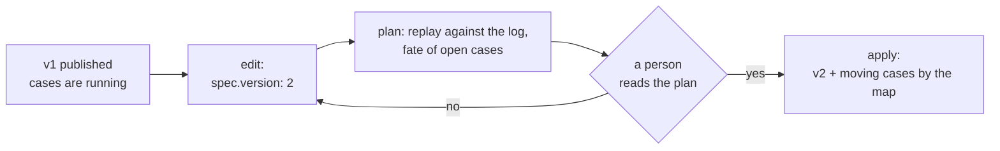

# Processes in a package

A process (`Process`, folder `processes/`) is a case with stages, steps of
people and skills, deadlines, approvals, and an outcome, written as data; the
core process engine executes it. This page is a short entry point for package
authors: what lies in the package next to a process, how to check and test
it, and how to release new versions while cases are live. The process
language itself is described in the [Processes](../processes/index.md)
section.

## Where to find details

| Topic | Article |
|---|---|
| the language: stages, the steps `human`, `approve`, `call`, `listen`, `fork`, `try`, data, start and correlation, timers, decision tables, compensations | [Processes](../processes/index.md) |
| CEL expressions: variables, calendar and time functions, limits | [Expressions](../processes/expressions.md) |
| the process test format, mocks, replay, dry run, the core plan | [Scenarios and the core plan](../processes/package-tests.md) |
| memory: case projection, `recall`, `remember`, regulations, lessons | [Processes and the knowledge base](../processes/knowledge.md) |
| all fields of the process, calendar, and test schema | [Package schema](../reference/package-schema.md#process) |

## A process as part of a package

A process rarely lives alone. Next to it, the package holds everything it
references:

```text
access-requests/
├── package.yaml
├── processes/access-requests.yaml    # kind: Process
├── agents/access-requests-process.yaml  # process identity
├── roles/access-requests-owner.yaml  # process owner and step address
├── task-types/access-review.yaml     # task type of the human step
├── skills/access.grant.yaml          # skill of the call step
├── calendars/<key>.yaml              # own calendar, if needed
├── schemas/<name>.yaml               # data schema: data: {$ref: ../schemas/<name>.yaml}
└── tests/access-requests.test.yaml   # case scenarios
```

| Process field | What it references | If the reference is not closed |
|---|---|---|
| `identity: {agent: <key>}` | an identity agent of kind `service` or `agent`: the case creates tasks, approvals, and skill invocations on its behalf | `unknown_agent`; without `identity`, `process_identity_required` |
| `owner` | an assignment chain: to whom tasks about the process itself go | without an owner, a `process_owner_missing` warning |
| `human.taskType` | the step's task type | `unknown_task_type` |
| `call.skill` | the skill `name@version` | `unknown_skill`; an incomplete input gives `skill_input_missing` |
| `calendar`, `cal.*` | a calendar | `unknown_calendar` |
| `assign` of steps | roles | in a test, `intent_failed unknown_role` if the role is not declared and has no holders in `given.principals` |
| `workspaceId` | the process workspace | set only as an installation variable `${NAME}` |

Core code checks the references in `package-sdk check`: the object must be in
the package, in its `requires`, or, when checking with `--server`, in the
deployment's catalog.

`package-sdk add process <key>` creates a scaffold process together with the
agent `<key>-process`, the role `<key>-owner`, and a test, if they do not
exist yet. That is why a process key is at most 55 characters: the agent key
next to it is up to 63.

The identity's permissions are exactly what the process steps carry out:
`tasks.read`, `tasks.write` (step tasks), `approvals.manage` (approvals),
`skills.invoke` (skills), `observations.write` (writing to memory),
`events.read` (event correlation). The agent's permissions are not broader
than those of whoever applies the package.

## Deadlines (SLA) { #sla }

The deadline of a step or of the whole case is the `due` field: on the
`human`, `approve`, `call`, `recall`, and `listen` steps and on the process as a
whole (`spec.due`). It is an ISO 8601 duration, a moment from the data
(`{at: …}`), or working days and hours by a calendar (`{workdays: …}`,
`{workhours: …}`), with a `warnBefore` warning threshold. The calendar's
`workingHours` field declares the working hours.

```yaml
spec:
  calendar: ru
  due: {workdays: 5, warnBefore: {workdays: 1}}   # the deadline of the whole case
  stages:
    - id: review
      steps:
        - id: review
          human:
            taskType: invoice-review
            due: {workhours: 8, warnBefore: {workhours: 2}}
```

- `package-sdk check` checks deadlines without a deployment: working units
  without a calendar (the deadline's `calendar` or `spec.calendar`) are an
  error, `workhours` by a package calendar without `workingHours` is an error,
  and a deadline calendar that is neither in the package nor in `requires` is
  a warning.
- In process scenarios, `expect.sla` checks the deadline state: a step id or
  `process` → `ok`, `warning`, `breached`, `paused`; `advance` moves the time
  (see [Deadlines in tests](../processes/package-tests.md#sla)).
- If a new process version sets, moves, or removes deadlines of open cases,
  `plan` shows it in the `deadlines` section: under the process, a
  `сроки: экземпляров N` ("deadlines: N instances") line and one line per
  case, before → after, marked `уже просрочен` ("already breached") where
  applicable (see [Plan and apply](../processes/package-tests.md#plan)).

Deadline forms, the `process.sla_*` events, and their recipients are in
[Deadlines and SLA](../processes/index.md#sla); working hours are in [Calendar
working hours](../processes/index.md#working-hours).

## Check and tests

- `package-sdk check` without a deployment checks the process's schema and
  package references: task types, skills, calendars, the `identity` and
  `owner` agents, and the steps named by `complete.step` and `approve.step`
  of scenarios.
- **The process language** (the types of all expressions, unknown data
  fields, step inputs and outputs, reachability of steps and stages, dead
  ends, overlaps and gaps in decision tables) is checked by the core as the
  first part of the scenarios stage of `package-sdk test` (and by
  `check --server` if the deployment's core supports it). A finding is
  printed with the file, the line, and a hint. So after editing a process,
  run `test`, not only `check`.
- `check` also does not verify what shows up only at execution: the
  `observation` of a scenario's `emit` steps (a scenario with an old
  observation kind passes `check` and fails in `test`), roles in the
  `fields.assignee` of rules (`role:<slug>` of an unknown role is the
  evaluation `failed: unknown_role` in a scenario), and the `skills.invoke`
  of agents.
- `package-sdk test` runs the process scenarios with the core engine in
  memory: virtual time, tasks and approvals in memory, and skills, agents,
  and memory as mocks from `mocks`, checked against schemas. Process
  scenarios need no database. The report shows the coverage of elements,
  transitions, decision table rows, and handlers.
- **A process scenario completes a step's task directly.** `complete: {step}`
  closes a `human` task past its type's gate: the `approvalSchema` outcomes
  (the external write, `completeTask` in `onSuccess`) are not run in a
  process scenario. If the step's task is completed on a deployment only by
  an approved gate, cover the gate with separate `subject: taskType`
  scenarios (see [Work](work.md#tests)).
- `package-sdk test --server <url>` sends the same scenarios to the
  deployment's core (`POST /api/v1/packages:test`, the `packages.test`
  permission): the deployment's catalog is visible to the process, and
  nothing is written.

A sample scenario is in the [quickstart](quickstart.md#process); the format
is in [Scenarios and the core plan](../processes/package-tests.md).

## External write from a process { #external-write }

A `call` step can invoke an external-write skill
(`sideEffects: external_write`): the process instance itself provides the
grounds for such an invocation. A published process version names the skill
version (`call.skill` is always `name@version`), just as a task type names
its `execution`; the invocation comes from the process identity with its
`skills.invoke` permission. Only the engine provides these grounds: a direct
invocation of the skill by the same identity without a human decision is
`403 skill_side_effect_not_authorized` (rationale: CP-ADR-0056, amendment to
§4; CP-ADR-0074, item `И3`).

The grounds live while the **step** is open, not the instance. The core
checks them when an executor picks up the invocation: if the step is already
closed (by `timeout`, a `retry`, `catch`, or the instance failing), the
pending invocation is cancelled with the reason `process_step_closed`; if the
instance is cancelled, `process_cancelled`; if it is suspended, the
invocation waits for resumption (`process_suspended`). But an invocation that
an executor has already picked up is not revoked. That is why a `try` with
`retry` or a short `timeout` around `external_write` is a deliberate choice
of the author: if the first invocation was handed out before the timeout and
the step was repeated, the repeat has its own idempotency key, and a second
record may appear in the external system.

Recommendation: put the external write **after a human decision**, as a
`call` step right after `approve` or as an approval outcome of a task type
gate (see [Package skills](skills.md#external-write)), and give the step a
timeout with room for the external system's response. Process scenarios do
not check the grounds for an invocation: a skill in them is a mock, so tests
will not remind you of this rule.

## Editing a process file

A process is ordinary YAML, and you can edit it by hand. For small edits
there is `package-sdk edit`: it changes only what was asked and preserves
comments, key order, and the file's style; an invalid edit is not written.

| Operation | What it does |
|---|---|
| `add-step --file P --in <stage or step> --step '<yaml>'` | add a step |
| `add-stage --file P --stage '<yaml>'` | add a stage |
| `add-decision-row --file P --table ID --row '<yaml>'` | add a decision table row |
| `add-form-field --file P --step ID --name F --schema '<yaml>'` | add a step form field |
| `rename --file P --from OLD --to NEW` | rename an element: the id, references, tests, and the migration map |
| `rename --package DIR --kind Process --from OLD --to NEW` | rename an object: the file, the key, and `renames` in the manifest |
| `set --file P --path '<path>' --value '<yaml>'` | set a value at a path |

`--dry-run` prints a diff and writes nothing; `--json` gives the result for
programs.

## Versions and live cases { #versions }

A process on a deployment has open cases, so releasing a new version is not
just replacing a file.



- **A version is immutable.** `spec.version` is an integer; editing a process
  means `version: N+1`. The same number with different content gives
  `409 process_version_conflict`.
- **A case is pinned to its version.** Without a migration map, open cases
  run to completion on their version, and new ones use the new version.
- **A migration map** moves open cases explicitly:

  ```yaml
  spec:
    version: 2
    migrations:
      - from: 1
        to: 2
        policy: migrate            # pin keeps cases on version 1
        map: {review-request: review-access}   # old id → new id
  ```

- **A removed element with open cases and no map** is a
  `migration_required` plan error: applying is refused until a policy is
  chosen.
- **Renaming a whole process** is done with `renames` in the manifest (see
  [Anatomy](anatomy.md#renames)): the plan moves the process with its version
  history, and the old key does not start new cases.

The core plan for a package with processes shows a structural diff, a
**replay** of the new version against the logs of recent cases (how many
would be decided differently), and the fate of open cases by version (`pin`,
`migrate`). The number of cases to replay is set by `plan --replay-limit`
(0–200, 50 by default). A field that was edited in the console on the
deployment is not overwritten by the package without an explicit decision.
See [Plan and apply](../processes/package-tests.md#plan) for details.

## Retirement

A process and a calendar are retired with the `retire` list of the
installation file:

```yaml
spec:
  retire:
    Process: [access-intake]
```

- A process: new cases do not start, live ones run to completion. The plan
  shows how many live cases will run to completion.
- A calendar is retired only if no active process references it
  (`calendar_in_use`).

## Process and rules

A process starts on its own from an observation or an event (`start.on`) and
gathers subsequent events into the case on its own (`correlate`, `listen`):
no rule is needed for that. When to choose a process and when a rule is
covered in [Rules in a package](rules.md#rule-or-process).

## Common problems

| Symptom | Cause | What to do |
|---|---|---|
| `process_identity_required` | the process has no `identity` | add an identity agent and `identity: {agent: …}` |
| `unknown_agent`, `unknown_task_type`, `unknown_skill` | the reference is not closed within the package and its `requires` | declare the object or add the package to `requires` |
| `409 process_version_conflict` in the plan | the file was changed without increasing `spec.version` | increase the version |
| `migration_required` | a removed element has open cases | add a `migrations` map or the `pin` policy |
| `plan_stale` when applying | the deployment, the cases, or the files changed after the plan | build the plan again |
| the start key `on` was read as `true` | the file was read by a YAML 1.1 tool | quote the key: `"on":` |

## See also

- [Processes](../processes/index.md): the full language
- [Scenarios and the core plan](../processes/package-tests.md)
- [Expressions](../processes/expressions.md)
- [Processes and the knowledge base](../processes/knowledge.md)
- [Package anatomy](anatomy.md): versions, renames, installation
- [Rules in a package](rules.md)
