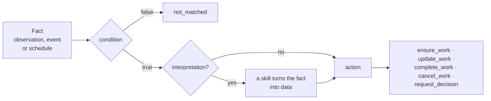

# Rules in a package

A work rule (`WorkRule`, folder `rules/`) says "when such a fact appears in
the log, create, update, close, or cancel such work". This page is for
package authors: how a rule is built, on whose behalf it acts, why a repeated
fact does not duplicate work, how rules close their own work, how to test
them, and when a process is needed instead of a rule. The full language of
conditions, templates, and actions is in
[Work rules](../control-plane/work-rules.md).

## Fact → condition → interpretation → action



```yaml
apiVersion: taimen.ai/v1
kind: WorkRule
key: access-reopened
spec:
  description: A reopened access request is classified and filed for a new review
  identity: {agent: access-rules}
  trigger: {kind: observation, type: access.reopened}
  condition:
    and:
      - {exists: payload.data.requestId}
      - {ne: [{var: payload.data.channel}, internal]}
  interpretation:
    skill: access.classify@1
    inputs: {text: "{{payload.content}}"}
  action:
    kind: ensure_work
    taskType: access-review
    dedupKeyTemplate: "access-reopened:{{payload.data.requestId}}"
    fields:
      title: "Review reopened access request {{payload.data.requestId}}"
      customFields:
        requestId: "{{payload.data.requestId}}"
        risk: "{{skill.output.risk}}"
```

| Part | What it sets |
|---|---|
| `trigger` | what wakes the rule: `observation` (an observation kind), `event` (a core log event type), or `schedule` (an interval) |
| `condition` | an expression over the fact: `and`, `or`, `not`, `eq`, `ne`, `lt`, `le`, `gt`, `ge`, `in`, `exists`; `true` by default |
| `interpretation` | an optional skill invocation `{skill: name@version, inputs}`: it turns the fact into data for the action; the result is in the `skill` root |
| `action` | what to do with the work: the action kind, the task type, the deduplication key, the fields |
| `identity` | on whose behalf the rule acts |
| `workspaceId` | the rule's workspace, only as an installation variable `${NAME}`; without it, the rule is tenant-level |
| `status` | `enabled` (default) or `disabled` |

- Templates `{{…}}` and conditions can use the roots `trigger`, `payload`,
  `task`, `goal`, and the action can also use `skill` (the interpretation
  result) and `item` (a `forEach` element).
- **The type of a template's value.** A string that consists of exactly one
  `{{…}}` gives the raw value: `amount: "{{payload.data.amount}}"` stays a
  number and passes a skill input with the `number` schema, and
  `"{{skill.output.available}}"` stays a boolean. Any other string is text:
  `"PR-{{payload.data.id}}"` is always a string. The full rule is in [The
  language of conditions and templates](../control-plane/work-rules.md#language).
- **Whom the work goes to.** `fields.assignee` is a principal UUID,
  `agent:<key>` of a package agent, or `role:<slug>` of a role: a task of the
  role without an assignee, which any holder of the role in the work's
  workspace or above can take. An unknown role is a `failed` evaluation with
  the code `unknown_role`; `check` does not catch it, a scenario does:

  ```yaml
  action:
    kind: ensure_work
    taskType: access-review
    dedupKeyTemplate: "access-reopened:{{payload.data.requestId}}"
    fields:
      title: "Review reopened access request {{payload.data.requestId}}"
      assignee: "role:access-approver"
  ```
- An interpretation cannot invoke a skill with an external write
  (`422 rule_skill_side_effects`): a rule only derives work, it does not act
  in the outside world.
- A scheduled rule that creates work must have an interpretation.
- A rule sees only facts written after it was enabled and does not react to
  consequences of rules: events of the rules themselves, events with a rule's
  correlation, and skill invocations enqueued by a rule.

## Rule identity { #identity }

Without `identity`, a rule acts with the authority of whoever applied the
package. In a package this is almost never what you want: the rule's work is
indistinguishable from a person's work in the log, and the rule's permissions
equal those of whoever applied it. That is why package rules are given an
identity: an agent description of kind `service` without placement:

```yaml
apiVersion: taimen.ai/v1
kind: Agent
key: access-rules
spec:
  displayName: Access rules
  identity:
    kind: service
    permissions: [events.read, skills.invoke, tasks.read, tasks.write, claims.manage]
  placement: none
```

| Permission | When it is needed |
|---|---|
| `events.read` | reading the fact |
| `tasks.read`, `tasks.write` | finding and creating work, relations |
| `skills.invoke` | interpretation |
| `approvals.manage` | `request_decision` |
| `claims.manage` | `complete_work` and `cancel_work` of work that an executor has already claimed |
| `goals.read` | a rule with a goal |

- The author of the created work is the agent's principal: `createdBy` of
  tasks, `actorId` of the `work.derived` and `work.reconciled` events.
- The agent's permissions are not broader than those of whoever applies the
  package: otherwise `403 permission_escalation`.
- An agent without an active identity: the evaluation is
  `failed: credential_inactive`.

See [Rule identity](../control-plane/work-rules.md#identity) for details.

## Idempotency

A fact can arrive twice, an observer can restart, a rule can be re-evaluated.
Work is not duplicated because of this:

- **the deduplication key** `dedupKeyTemplate` links the work to the rule:
  `ensure_work` finds an open task with the same key and does not create a
  second one;
- **one evaluation per "rule, fact" pair**: a repeated delivery of the same
  fact is an empty evaluation;
- `ensure_work` is exactly "ensure", not upsert: the found task does not get
  new `customFields`, criteria, or relations. Updating the title,
  description, or priority is a separate action, `update_work`.

Build the key from the identifier of the item in the external system, not
from time or random values: `access-reopened:{{payload.data.requestId}}`, not
`{{trigger.at}}`. The key is up to 200 characters and **shared across the
tenant**: prefix it with your package or rule so that the keys of different
packages do not collide.

## Closing rules

A rule can not only create work but also close it when a fact says the work
is no longer needed or is already done. A closing rule finds the work by the
same deduplication key, which is shared across the tenant, so it can be a
different rule of the same package:

```yaml
apiVersion: taimen.ai/v1
kind: WorkRule
key: access-granted-elsewhere
spec:
  description: Access granted directly in the directory closes the review
  identity: {agent: access-rules}
  trigger: {kind: observation, type: access.granted}
  action:
    kind: complete_work
    dedupKeyTemplate: "access-reopened:{{payload.data.requestId}}"
```

| Action | What it does with the open task with the key |
|---|---|
| `complete_work` | appends the fact's evidence and completes the task through the verification stage: with the type's criteria if the type has `acceptance`, otherwise with one implicit `external_state` check |
| `cancel_work` | moves it to the first reachable status of the `terminal_cancelled` category |
| `update_work` | changes `title`, `description`, `priority`; does not touch a task under a live claim (`skipped: task_claimed`) |

If an executor has already claimed the task, `complete_work` and
`cancel_work` ask to stop its run and apply the decision once, when the claim
is released (see
[Closing work with rules](../control-plane/goals-and-evidence.md#verification-stage)).

## Rule tests { #tests }

A test with `subject: rule` feeds a fact to the rule and checks its decision
with the same core code as on the deployment, in a transaction that is rolled
back. Interpretation skills are replaced with responses from `mocks`.

```yaml
# tests/access-reopened.test.yaml
subject: rule
rule: access-reopened
name: a reopened request is classified and filed for review
given:
  observation:
    kind: access.reopened
    content: I still cannot open the billing reports
    data: {requestId: A-2, channel: web}
mocks:
  skills:
    access.classify@1:
      - output: {risk: high}
steps:
  - expect:
      result: matched
      invokeSkill:
        - {skill: access.classify@1, inputs: {text: I still cannot open the billing reports}}
      ensureWork:
        - type: access-review
          customFields: {requestId: A-2, risk: high}
```

```yaml
# tests/access-reopened-internal.test.yaml
subject: rule
rule: access-reopened
name: an internal request is not classified
given:
  observation:
    kind: access.reopened
    data: {requestId: A-5, channel: internal}
steps:
  - expect:
      result: not_matched
      invokeSkill: []
      ensureWork: []
```

| Field | What it sets |
|---|---|
| `given.observation` | an observation: `kind`, `data`, `content`, `source`, `externalRef` |
| `given.event` | instead of an observation, a log event: `type`, `payload` |
| `given.clock`, `given.variables` | the evaluation time; installation variable values |
| `mocks.skills` | `name@version` → responses in invocation order; the output is checked against the skill contract |
| `expect.result` | the evaluation result: `matched`, `not_matched`, `failed`, `skipped` |
| `expect.ensureWork` | the expected work: the given fields are compared, fields not given are not checked; `[]` means no work |
| `expect.invokeSkill` | the expected skill invocations: the name and a subset of the input; `[]` means no invocations |

A rule scenario sets only the fact: the scenario checks the rule's decision,
invocations, and the work created. The scenario does not model closing an
existing task (`complete_work`, `cancel_work`): that is checked on the
deployment.

Rule scenarios need an empty PostgreSQL database for the sandbox
(`--database-url` or `PACKAGE_SDK_SANDBOX_DATABASE_URL`), see
[A package in 10 minutes](quickstart.md#test). The report shows coverage:
the condition branches and the evaluation outcomes, including an
interpretation failure.

```text
покрытие правила access-reopened (тестов 2): branches 5/6, outcomes 3/4
   не пройдены (branches): /condition/and/0:false
   не пройдены (outcomes): interpretation:failed
```

The tool prints the report in Russian: `покрытие правила … (тестов 2)` means
"rule coverage … (2 tests)", and `не пройдены` means "not passed".

The `interpretation:failed` outcome is covered by a scenario in which the
skill mock answers with an error: the evaluation is `failed`, and there is no
work.

```yaml
# tests/access-reopened-classifier-down.test.yaml
subject: rule
rule: access-reopened
name: when the classifier fails the rule files nothing
given:
  observation:
    kind: access.reopened
    content: I still cannot open the billing reports
    data: {requestId: A-6, channel: web}
mocks:
  skills:
    access.classify@1:
      - error: {type: model_unavailable, detail: the model did not answer}
steps:
  - expect:
      result: failed
      ensureWork: []
```

## Rule or process { #rule-or-process }

| You need to | Express it with |
|---|---|
| create one piece of work on a fact, update it, or close it | a rule |
| reconcile external state on a schedule and create work for discrepancies | a rule with `schedule` and an interpretation |
| run a case: stages, case data, several steps of people and skills in order | a process |
| deadlines, reminders, escalations, a business calendar | a process (timers) |
| approvals with separation of duties, decision tables | a process |
| gather several events from different sources into one case | a process (correlation) |
| roll back what was done on cancellation | a process (compensations) |

The sign of a rule: there is no state between facts other than the work key,
and each evaluation decides on its own. The sign of a process: the case has a
history that affects the next step. A process does not need a rule to start:
it starts on its own from an observation (`start.on`). A rule next to a
process is appropriate for one-off work outside the case, for example when a
repeated request arrives for an already closed case, as in the
[quickstart](quickstart.md#rule).

## Common problems

| Symptom | Cause | What to do |
|---|---|---|
| `422 unknown_task_type` during the check | the action's task type is not declared in the package and its `requires` | add the `TaskType` or the package to `requires` |
| `422 rule_skill_side_effects` | the interpretation invokes a skill with `external_write` | move the external write into a task type decision outcome or into a process |
| a repeated fact created a second task | the deduplication key depends on time or a random value, or the first task is already closed | build the key from the item identifier |
| evaluation `failed: credential_inactive` | the identity agent has no active credential | check the agent and its binding on the deployment |
| rule test `SKIP`, `sandbox_database_required` | there is no sandbox database | set `PACKAGE_SDK_SANDBOX_DATABASE_URL` |

## See also

- [Work rules](../control-plane/work-rules.md): the full language and API
- [Work: task types and roles](work.md)
- [Processes in a package](processes.md)
- [A package in 10 minutes](quickstart.md)
- [Events](../control-plane/events.md)
