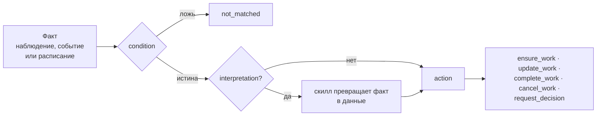

# Правила в пакете

Правило вывода работы (`WorkRule`, папка `rules/`) — «когда в журнале
появляется такой факт, заведи, обнови, закрой или отмени такую работу».
Страница для автора пакета: как правило устроено, от чьего имени оно
действует, почему повтор факта не дублирует работу, как правила закрывают
свою работу, как их тестировать и когда вместо правила нужен процесс. Полный
язык условий, шаблонов и действий — в
[Правилах вывода работы](../control-plane/work-rules.md).

## Факт → условие → интерпретация → действие



```yaml
apiVersion: taimen.ai/v1
kind: WorkRule
key: access-reopened
spec:
  description: A reopened access request is classified and filed for a new review
  identity: {agent: access-rules}
  trigger: {kind: observation, type: access.reopened}
  condition:
    and:
      - {exists: payload.data.requestId}
      - {ne: [{var: payload.data.channel}, internal]}
  interpretation:
    skill: access.classify@1
    inputs: {text: "{{payload.content}}"}
  action:
    kind: ensure_work
    taskType: access-review
    dedupKeyTemplate: "access-reopened:{{payload.data.requestId}}"
    fields:
      title: "Review reopened access request {{payload.data.requestId}}"
      customFields:
        requestId: "{{payload.data.requestId}}"
        risk: "{{skill.output.risk}}"
```

| Часть | Что задаёт |
|---|---|
| `trigger` | что будит правило: `observation` (вид наблюдения), `event` (тип события журнала ядра) или `schedule` (интервал) |
| `condition` | выражение над фактом: `and`, `or`, `not`, `eq`, `ne`, `lt`, `le`, `gt`, `ge`, `in`, `exists`; по умолчанию `true` |
| `interpretation` | необязательный вызов скилла `{skill: имя@версия, inputs}`: превращает факт в данные для действия, результат — в корне `skill` |
| `action` | что сделать с работой: вид действия, тип задачи, ключ дедупликации, поля |
| `identity` | от чьего имени правило действует |
| `workspaceId` | пространство работы правила — только переменной установки `${NAME}`; без него — правило уровня tenant'а |
| `status` | `enabled` (по умолчанию) или `disabled` |

- В шаблонах `{{…}}` и условиях доступны корни `trigger`, `payload`, `task`,
  `goal`, а в действии ещё `skill` (результат интерпретации) и `item`
  (элемент `forEach`).
- **Тип значения шаблона.** Строка, целиком состоящая из одного `{{…}}`, даёт
  сырое значение: `amount: "{{payload.data.amount}}"` остаётся числом и проходит
  вход скилла со схемой `number`, `"{{skill.output.available}}"` — булевым.
  Любая другая строка — текст: `"PR-{{payload.data.id}}"` всегда строка. Правило
  целиком — в [Языке условий и шаблонов](../control-plane/work-rules.md#language).
- **Кому работа.** `fields.assignee` — UUID principal'а, `agent:<ключ>` агента
  пакета или `role:<slug>` роли: задача роли без исполнителя, её берёт любой
  держатель роли в workspace работы или выше. Неизвестная роль — оценка
  `failed` с кодом `unknown_role`; `check` её не ловит, ловит сценарий:

  ```yaml
  action:
    kind: ensure_work
    taskType: access-review
    dedupKeyTemplate: "access-reopened:{{payload.data.requestId}}"
    fields:
      title: "Review reopened access request {{payload.data.requestId}}"
      assignee: "role:access-approver"
  ```
- Интерпретация не может вызвать скилл с внешней записью
  (`422 rule_skill_side_effects`): правило только выводит работу, а не
  действует во внешнем мире.
- Правило по расписанию, которое заводит работу, обязано иметь
  интерпретацию.
- Правило видит только факты, записанные после его включения, и не реагирует
  на следствия правил: события самих правил, события с корреляцией правила и
  вызовы скиллов, поставленные правилом.

## Личность правила { #identity }

Без `identity` правило действует полномочиями того, кто применил пакет. В
пакете это почти всегда не то, что нужно: работа правила в журнале
неотличима от работы человека, а права правила равны правам применившего.
Поэтому правилам пакета дают личность — описание агента вида `service` без
размещения:

```yaml
apiVersion: taimen.ai/v1
kind: Agent
key: access-rules
spec:
  displayName: Access rules
  identity:
    kind: service
    permissions: [events.read, skills.invoke, tasks.read, tasks.write, claims.manage]
  placement: none
```

| Право | Когда нужно |
|---|---|
| `events.read` | чтение факта |
| `tasks.read`, `tasks.write` | поиск и заведение работы, связи |
| `skills.invoke` | интерпретация |
| `approvals.manage` | `request_decision` |
| `claims.manage` | `complete_work` и `cancel_work` работы, которую уже взял исполнитель |
| `goals.read` | правило с целью |

- Автор заведённой работы — principal агента: `createdBy` задач, `actorId`
  событий `work.derived` и `work.reconciled`.
- Права агента не шире прав того, кто применяет пакет: иначе
  `403 permission_escalation`.
- Агент без действующей личности — оценка `failed: credential_inactive`.

Подробно — в [Личности правила](../control-plane/work-rules.md#identity).

## Идемпотентность

Факт может прийти дважды, наблюдатель — перезапуститься, правило —
переоцениться. Работа от этого не дублируется:

- **ключ дедупликации** `dedupKeyTemplate` связывает работу с правилом:
  `ensure_work` находит открытую задачу с тем же ключом и не заводит вторую;
- **одна оценка на пару «правило, факт»**: повторная доставка того же факта
  — пустая оценка;
- `ensure_work` — именно «ensure», а не upsert: найденная задача не получает
  новых `customFields`, критериев и связей. Обновить заголовок, описание или
  приоритет — отдельное действие `update_work`.

Стройте ключ из идентификатора предмета во внешней системе, а не из времени
или случайных значений: `access-reopened:{{payload.data.requestId}}`, а не
`{{trigger.at}}`. Ключ до 200 символов и **общий для tenant'а** — давайте ему
префикс своего пакета или правила, чтобы ключи разных пакетов не совпали.

## Закрывающие правила

Правило может не только завести работу, но и закрыть её, когда факт говорит,
что работа больше не нужна или уже сделана. Закрывающее правило находит
работу по тому же ключу дедупликации — общему для tenant'а, поэтому это может
быть другое правило того же пакета:

```yaml
apiVersion: taimen.ai/v1
kind: WorkRule
key: access-granted-elsewhere
spec:
  description: Access granted directly in the directory closes the review
  identity: {agent: access-rules}
  trigger: {kind: observation, type: access.granted}
  action:
    kind: complete_work
    dedupKeyTemplate: "access-reopened:{{payload.data.requestId}}"
```

| Действие | Что делает с открытой задачей по ключу |
|---|---|
| `complete_work` | дописывает evidence факта и завершает задачу через стадию проверки: у типа с `acceptance` — его критериями, без них — одной неявной проверкой `external_state` |
| `cancel_work` | переводит в первый достижимый статус категории `terminal_cancelled` |
| `update_work` | меняет `title`, `description`, `priority`; задачу под живым claim не трогает (`skipped: task_claimed`) |

Если задачу уже взял исполнитель, `complete_work` и `cancel_work` просят
остановить его run и применяют решение один раз, когда claim освобождён
(см. [Закрытие работы правилами](../control-plane/goals-and-evidence.md#verification-stage)).

## Тесты правил { #tests }

Тест с `subject: rule` подаёт правилу факт и проверяет его решение тем же
кодом ядра, что на стенде, в транзакции, которая откатывается. Скиллы
интерпретации подменяются ответами из `mocks`.

```yaml
# tests/access-reopened.test.yaml
subject: rule
rule: access-reopened
name: a reopened request is classified and filed for review
given:
  observation:
    kind: access.reopened
    content: I still cannot open the billing reports
    data: {requestId: A-2, channel: web}
mocks:
  skills:
    access.classify@1:
      - output: {risk: high}
steps:
  - expect:
      result: matched
      invokeSkill:
        - {skill: access.classify@1, inputs: {text: I still cannot open the billing reports}}
      ensureWork:
        - type: access-review
          customFields: {requestId: A-2, risk: high}
```

```yaml
# tests/access-reopened-internal.test.yaml
subject: rule
rule: access-reopened
name: an internal request is not classified
given:
  observation:
    kind: access.reopened
    data: {requestId: A-5, channel: internal}
steps:
  - expect:
      result: not_matched
      invokeSkill: []
      ensureWork: []
```

| Поле | Что задаёт |
|---|---|
| `given.observation` | наблюдение: `kind`, `data`, `content`, `source`, `externalRef` |
| `given.event` | вместо наблюдения — событие журнала: `type`, `payload` |
| `given.clock`, `given.variables` | время оценки; значения переменных установки |
| `mocks.skills` | `имя@версия` → ответы по порядку вызовов; выход проверяется по контракту скилла |
| `expect.result` | итог оценки: `matched`, `not_matched`, `failed`, `skipped` |
| `expect.ensureWork` | ожидаемая работа: заданные поля сравниваются, незаданные не проверяются; `[]` — работы нет |
| `expect.invokeSkill` | ожидаемые вызовы скиллов: имя и подмножество входа; `[]` — вызовов нет |

В сценарии правила задан только факт: сценарий проверяет решение правила,
вызовы и заводимую работу. Закрытие уже существующей задачи
(`complete_work`, `cancel_work`) сценарий не моделирует — его проверяют на
стенде.

Сценариям правил нужна пустая база PostgreSQL для песочницы
(`--database-url` или `PACKAGE_SDK_SANDBOX_DATABASE_URL`), см.
[Пакет за 10 минут](quickstart.md#test). Отчёт показывает покрытие: ветки
условия и исходы оценки, в том числе провал интерпретации.

```text
покрытие правила access-reopened (тестов 2): branches 5/6, outcomes 3/4
   не пройдены (branches): /condition/and/0:false
   не пройдены (outcomes): interpretation:failed
```

Исход `interpretation:failed` покрывает сценарий, в котором заглушка скилла
отвечает ошибкой: оценка — `failed`, работы нет.

```yaml
# tests/access-reopened-classifier-down.test.yaml
subject: rule
rule: access-reopened
name: when the classifier fails the rule files nothing
given:
  observation:
    kind: access.reopened
    content: I still cannot open the billing reports
    data: {requestId: A-6, channel: web}
mocks:
  skills:
    access.classify@1:
      - error: {type: model_unavailable, detail: the model did not answer}
steps:
  - expect:
      result: failed
      ensureWork: []
```

## Правило или процесс { #rule-or-process }

| Нужно | Чем выразить |
|---|---|
| на факт завести одну работу, обновить или закрыть её | правило |
| сверять внешнее состояние по расписанию и заводить работу на расхождения | правило с `schedule` и интерпретацией |
| вести дело: стадии, данные дела, несколько шагов людей и скиллов по порядку | процесс |
| сроки, напоминания, эскалации, рабочий календарь | процесс (таймеры) |
| согласования с разделением обязанностей, таблицы решений | процесс |
| собрать к одному делу несколько событий из разных источников | процесс (корреляция) |
| откатить сделанное при отмене | процесс (компенсации) |

Признак правила — между фактами нет состояния, кроме ключа работы: каждая
оценка решает сама за себя. Признак процесса — у дела есть история, которая
влияет на следующий шаг. Процессу правило для запуска не нужно: он стартует
сам по наблюдению (`start.on`). Правило рядом с процессом уместно для
разовой работы вне дела — например, когда по уже закрытому делу пришло
повторное обращение, как в [быстром старте](quickstart.md#rule).

## Типичные проблемы

| Симптом | Причина | Что делать |
|---|---|---|
| `422 unknown_task_type` при проверке | тип задачи действия не объявлен в пакете и его `requires` | добавить `TaskType` или пакет в `requires` |
| `422 rule_skill_side_effects` | интерпретация вызывает скилл с `external_write` | вынести внешнюю запись в исход решения типа задачи или в процесс |
| повторный факт завёл вторую задачу | ключ дедупликации зависит от времени или случайного значения, либо первая задача уже закрыта | строить ключ из идентификатора предмета |
| оценка `failed: credential_inactive` | у агента-личности нет действующей учётки | проверить агента и его связку на стенде |
| тест правила `SKIP`, `sandbox_database_required` | нет базы песочницы | задать `PACKAGE_SDK_SANDBOX_DATABASE_URL` |

## См. также

- [Правила вывода работы](../control-plane/work-rules.md) — язык и API целиком
- [Работа: типы задач и роли](work.md)
- [Процессы в пакете](processes.md)
- [Пакет за 10 минут](quickstart.md)
- [События](../control-plane/events.md)
