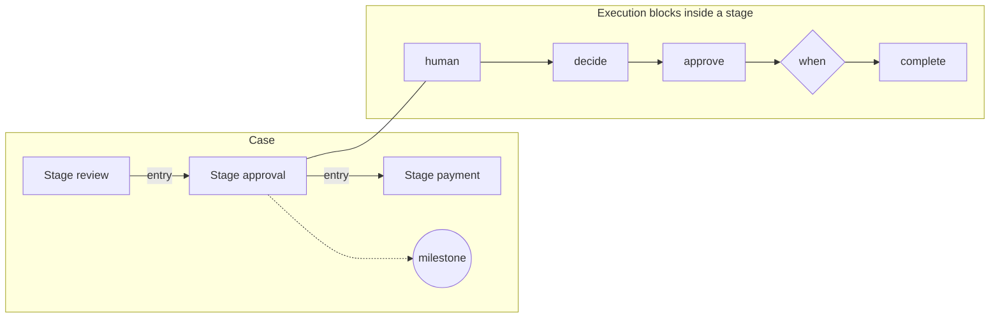

# Processes

A process describes how an organization carries a case through to a result:
which stages the case goes through, who does the work and by when, who
approves, what happens on external events, and how completed work is rolled
back on cancellation. A process is written as data (a catalog package YAML
file of kind `Process`), and the Control Plane core itself executes it. This
article is for package authors and architects: the complete process
language, with short examples. Rationale: TAI-ADR-0054, CP-ADR-0074; the
fields are in the [schema reference](../reference/process-schema.md).

## Key points

- **The core executes the process.** There is no separate engine: an
  instance's tasks and approvals are regular Control Plane tasks and
  approvals. The workspace (the "Attention" list), the MCP plugin, and
  executors see them without any extra work.
- **A process instance is a case.** It has data following a schema, current
  stages, timers, a decision log, and an outcome. One key, one instance.
- **The engine is deterministic.** A decision is a pure function "state +
  input → decisions + intents". Time, skill responses, and memory responses
  reach the engine only as log inputs. So a package test, a replay against
  the log, and a live run make the same decisions.
- **Every decision leaves a trace.** A transition, a timer firing, a vote, a
  compensation, a migration are recorded in the instance log with a reason
  and an author.
- **Expressions use one language.** Conditions, keys, deadlines,
  assignments, and computed fields are written in CEL (see
  [Expressions](expressions.md)).
- **Verification without a deployment.** A package is checked, tested, and
  compared with live instances before it is applied (see
  [Package tests](package-tests.md)).

## Where a process lives

A process is the file `processes/<key>.yaml` in a catalog package. Next to
it are the task types of its steps, roles, the identity agent description,
skills, and tests:

```text
packages/<package>/
├── package.yaml               # manifest; renames are explicit object renames
├── processes/<key>.yaml       # kind: Process
├── calendars/<key>.yaml       # kind: Calendar, if the package carries its own calendar
├── schemas/<name>.yaml        # instance data schema: data: {$ref: ../schemas/<name>.yaml}
├── task-types/                # task types of human steps
├── roles/                     # roles that steps are assigned to
├── agents/<identity>.yaml     # on whose behalf the process acts
├── tests/<name>.test.yaml     # scenario tests
└── .layout/<key>.json         # diagram layout for the visual editor; the core does not read it
```

Process skeleton:

```yaml
# yaml-language-server: $schema=../../schema/v1/object.schema.json
apiVersion: taimen.ai/v1
kind: Process
key: supplier-invoice
spec:
  version: 1
  displayName: Supplier invoice payment
  workspaceId: ${WORKSPACE_ID}            # installation variable
  identity: {agent: invoice-process}       # process identity
  owner: [{role: finance-director}]        # process owner
  calendar: ru                             # default calendar for cal.*
  data: {…}                                # JSON Schema of instance data
  start: {…}                               # start event and instance key
  correlate: […]                           # which other events reach the instance
  memory: {…}                              # case projection into the knowledge base
  decisions: […]                           # decision tables
  stages: […]                              # case stages
  onEvent: […]                             # reactions to events across stages
  timers: […]                              # process timers
  migrations: […]                          # moving open instances to a new version
```

!!! note "YAML 1.2"
    The package language is YAML 1.2: booleans are only `true`/`false`, and
    the keys `on`, `off`, `yes`, `no` are strings. Platform tools read files
    exactly this way. If a YAML 1.1 tool (for example, PyYAML) also reads the
    file, quote the `on` key: `"on": {observation: …}`.

## Two levels of the language

A process is described at two levels.



- **Case** (inspired by CMMN): stages, milestones, entry and exit guards,
  discretionary work, boundary timers. This is where tasks for people and
  agents live.
- **Execution blocks** (inspired by the Open Workflow DSL): a sequence of
  steps, parallelism, waiting for an event, retry with a delay, an attempt
  with error handling, compensation. This is where automated work between
  tasks lives.

Transitions are structural only: there is no `goto`, and a step cannot
"jump" to an arbitrary other step. Every element (stage, step, milestone,
timer, branch, table) has a stable `id` (`^[a-z][a-z0-9-]{0,62}$`). The log,
migration maps, the diagram layout, and the memory graph reference it. Ids
are unique within a process.

### Stages and milestones

```yaml
stages:
  - id: review
    displayName: Invoice review
    steps: [ … ]
  - id: approval
    displayName: Payment approval
    entry: stage.review.completed && data.review == 'ok'
    milestones:
      - {id: routed, when: "has(data.approverRole)"}
    steps: [ … ]
```

| Stage field | What it does |
|---|---|
| `entry` | the entry guard. A stage without `entry` opens when the instance starts; with `entry`, when the guard is true |
| `exit` | the exit guard. A stage with `exit` closes when it is true and cancels its open work (tasks, approvals, timers). Without `exit`, the stage closes when its steps are finished |
| `repeatable` | a stage with `entry` opens again on the next input after it exits |
| `milestones` | milestones: `{id, when}`. A milestone is reached when its guard is true and is lost when the guard stops being true while the stage is active (`process.milestone_reached`, `process.milestone_lost`) |
| `timers` | the stage's boundary timers: they fire while the stage is open |
| `discretionary` | discretionary work: steps a person adds at their discretion |
| `governedBy` | regulations the stage is subject to (see [Processes and the knowledge base](knowledge.md#regulations)) |

Guards can use the instance data (`data`), the state of stages
(`stage.<id>.completed`, `stage.<id>.active`), and milestones
(`milestone.<id>`).

An instance ends with a `complete` step with an outcome, or on its own with
the outcome `completed` when all stages are closed and no flows are running.

!!! tip "A guard that never becomes true"
    The package check finds guards that read only fields that are never
    written, or that are always false: for `entry` this is an unreachable
    stage (`unreachable_stage`), for `exit` a dead end (`dead_end`), and for
    a milestone an `unreachable_milestone` warning.

## Steps

A step is an element of a block. A step has an `id`, exactly one **kind**,
and common fields:

| Common field | What it does |
|---|---|
| `when` | a guard: the step runs only if the expression is true; otherwise it is skipped |
| `input.from` | the step input (an expression); for a human step, it goes into the task description |
| `output.as` | writes the step result (`step.result`) into data: data path → expression |
| `export.as` | the same as `output.as`, for exporting the result |
| `onCompensate` | a block that compensates the completed step (see [Compensations](#compensation)) |
| `governedBy` | regulations the step is subject to |
| `displayName` | the step name for people |

You can write only to fields declared in the process data schema: writing to
an unknown field is an `unknown_data_field` check error.

### Kinds of steps

| Kind | What it does | Example |
|---|---|---|
| `human` | a task for a person or an agent: task type, form, assignment, deadline, escalations, context profile | [below](#human) |
| `approve` | approval: several approvers, quorum, order, separation of duties | [below](#approve) |
| `call` | calls a skill (`skill: name@version`), an agent (`agent: <key>`), or a nested process (`process: <key>`) | `call: {skill: notify.send@1, input: {…}, timeout: PT1H}` |
| `decide` | a decision table over data | `decide: {table: approval-route}` |
| `recall` | a knowledge base query through the core | see [Processes and the knowledge base](knowledge.md#recall) |
| `remember` | writes a fact or an entity to the knowledge base | see [Processes and the knowledge base](knowledge.md#remember) |
| `listen` | waits for the first of several events, with a timeout | [below](#listen) |
| `wait` | a pause: a duration or a moment | `wait: P1D` or `wait: {at: "data.startDate"}` |
| `set` | computes and writes data fields | `set: {total: "data.amount * 1.2"}` |
| `raise` | raises an error | `raise: {type: not-ready, detail: "'not ready'"}` |
| `compensate` | runs the compensations of completed steps | `compensate: all` |
| `fork` | parallel branches: `all` waits for all, `compete` for the first | [below](#fork) |
| `try` | an attempt with retry and error handlers | [below](#try) |
| `do` | a nested sequence of steps | `do: [ … ]` |
| `suspend` / `resume` | suspends or resumes the instance | [below](#suspend) |
| `complete` | closes the instance with an outcome | `complete: {outcome: paid}` |

### A task for a person: `human` { #human }

```yaml
- id: check-invoice
  human:
    taskType: invoice-review
    title: "'Review invoice ' + data.number + ': ' + data.supplier"
    assign: [{role: accounting}]
    due: P2D
    escalations:
      - {after: due, action: remind}
      - {after: P1D, action: notify, to: [{role: finance-director}]}
    form:
      schema:
        type: object
        required: [verdict]
        properties:
          verdict: {type: string, enum: [ok, mismatch], title: Review result}
          note: {type: string, title: Comment}
  output:
    as:
      review: step.result.verdict
      reviewNote: step.result.?note.orValue('')
```

- **The task** is a regular core task in the instance's workspace, with the
  type `taskType` and an external reference to the process element. The
  result is the task fields (`customFields`) at completion, validated
  against the step form; they get into data through `output.as`.
- **The form** is a JSON Schema of the data plus a JSON Forms `uischema` for
  presentation. Without `form.schema`, the result is validated against the
  task type's `fieldSchema`.
- **The assignment** `assign` is a chain of candidates in order; the first
  resolvable one is taken: `{principal: <uuid or ${VARIABLE}>}`,
  `{role: <slug>}`, `{agent: <key>}`, or `{expr: <CEL>}`. The expression
  yields a principal id, `agent:<key>`, or `role:<slug>`. A role means a
  task for the role without a specific executor: anyone who holds the role
  can take it.
- **The deadline** `due` is a duration from task creation (`P2D`) or a
  moment: `{at: <CEL>}`, for example from a date in the data using the
  calendar.
- **Escalations**: up to five levels. `after: due` fires at the deadline; a
  duration fires that long after the deadline. Actions: `remind` (remind the
  executor), `reassign` (reassign to `to`), `notify` (notify `to`), `raise`
  (raise the `error`). Each level publishes a `process.escalated` event;
  the notification service delivers it according to its own rules (see
  [Notification rules](../notifications/notification-rules.md)).
- **The context** `context` defines which context from the knowledge base
  the executor receives (see
  [Processes and the knowledge base](knowledge.md#step-context)).

An agent step is the same `human` with the assignment `{agent: <key>}`, or
`call: {agent: <key>}`: it is a task for a registry agent, and the executor
receives it like any task (see
[Catalog packages](../control-plane/catalog-packages.md#agent)).

### Approval: `approve` { #approve }

```yaml
- id: approve-payment
  approve:
    approvers: [{expr: "'role:' + data.approverRole"}]
    mode: parallel
    quorum: any
    separationOfDuties: "[data.uploadedBy]"
    due: P2D
    onDue: escalate
    escalations:
      - {after: due, action: notify, to: [{role: finance-director}]}
  output:
    as:
      approval: step.result.outcome
      approvedBy: step.result.approvedBy
      rejectedBy: step.result.rejectedBy
```

The step creates one core approval for each approver from `approvers`.

| Field | Values | Meaning |
|---|---|---|
| `mode` | `parallel` (default), `sequential` | all at once or one at a time: in `sequential`, one approval is open, for the first approver in order who has not voted yet |
| `quorum` | `all`, `any`, `{atLeast: n}`, `{percent: p}` | how many approvals are needed: all remaining, one, `n`, or ⌈p·N/100⌉ (at least one) of the remaining approvers |
| `earlyDecision` | `true` (default) | decide as soon as the quorum is reached or becomes unreachable; `false` waits for the votes of all remaining approvers |
| `separationOfDuties` | CEL → a list of principals | who is not allowed to vote |
| `due`, `onDue` | a deadline; `approve`, `reject`, `escalate` | what to do if there is no decision by the deadline |
| `escalations` | levels, as in `human` | deadline escalations |

**A "two out of three" quorum** is `quorum: {atLeast: 2}`: two approvals
mean the decision is made, and the remaining approval is closed; two
rejections mean the decision is rejected immediately, without waiting for
the third. If an approver has left (their approval was cancelled), the
quorum is recalculated from the remaining ones: `all` stops waiting for
them, `percent` takes the share of the smaller number, an unreachable
`atLeast` means rejection (`quorum_unreachable`); if everyone has left, it
is a rejection (`no_approvers`).

**The core enforces separation of duties, not the engine.** The list from
`separationOfDuties` becomes the `excludedPrincipals` field of each
approval. A vote by an excluded principal is rejected with `403
separation_of_duties_violation` on any path (from the workspace, a channel,
MCP, or the API), even if they hold the approver role. Such an approval is
not shown to them in the "Attention" list.

Step result: `step.result.outcome` (`approved` or `rejected`),
`approvedBy`, `rejectedBy`.

### Waiting for an event: `listen` { #listen }

```yaml
- id: await-answer
  listen:
    any:
      - "on": {observation: supplier.answered, where: "event.payload.data.ok == true"}
        do:
          - {id: store-answer, set: {answer: "string(event.payload.data.text)"}}
      - "on": {observation: supplier.declined}
        do:
          - {id: declined, complete: {outcome: declined}}
    timeout: P5D
    onTimeout:
      - {id: no-answer, set: {answer: "''"}}
```

`listen` waits for the first matching event from `any` (a deferred choice)
and runs its `do` block; `step.result` is `{option, event}`. The timeout is
a duration or a moment `{at: …}`; without `onTimeout` the flow simply moves
on.

!!! warning "The event must reach the instance"
    `listen` and `onEvent` hear only events that reached the instance by key
    through `correlate` (see [Start and correlation](#start)). The instance
    does not hear an event of a kind not declared in `correlate`.

### Parallelism: `fork` { #fork }

```yaml
- id: prepare
  fork:
    mode: all
    branches:
      - id: documents-branch
        do: [ {id: prepare-documents, human: {…}} ]
      - id: guarantee-branch
        do: [ {id: provide-guarantee, human: {…}} ]
```

`all` waits for all branches; `compete` finishes with the first branch to
complete and closes the others.

### Attempt, retry, errors: `try` and `raise` { #try }

```yaml
- id: price-round
  try:
    retry: {limit: 2, "on": [price-rejected]}
    do:
      - id: calculate-price
        human: {…}
      - id: approve-price
        approve: {…}
      - id: price-rejected
        when: data.priceApproval.outcome != 'approved'
        raise: {type: price-rejected, detail: "'price not approved'"}
    catch:
      - errors: {type: price-rejected}
        do: [{id: price-not-approved, complete: {outcome: price-not-approved}}]
```

- Errors follow RFC 7807: `type`, `status`, `detail`. They are raised by the
  process's `raise`, a skill, a call timeout (`timeout`), or a refusal of a
  task or a core command.
- `retry` repeats the `do` block up to `limit` times with a `delay` pause;
  `backoff: exponential` doubles the pause up to `maxDelay`; `on` lists the
  error types to retry (all by default). Then `catch` applies.
- `catch[]` catches errors by `errors.type` and `errors.status`; `as` gives
  the error a name in the handler's expressions.
- An unhandled error propagates up to the nearest `try` (including through
  a `fork`), and if there is none, the instance moves to `failed` with a
  `process.failed` event.

Retrying a `try` block is the only way to "go back": the language has no
"while" loop.

### Engine errors

| `type` | When |
|---|---|
| `expression_error` | an expression failed during evaluation: `null`, a missing field, no calendar |
| `expression_cost_exceeded` | an expression exceeded the cost limit |
| `decision_no_match`, `decision_ambiguous` | a `first` table with no match; a `unique` table without exactly one match |
| `form_invalid` | the task result does not pass the step form |
| `task_cancelled` | the step's task was cancelled |
| `timeout` | a `call` did not respond within `timeout` |
| `intent_failed` | the core refused a process command (for example, the identity lacks a permission); `detail` is the refusal code |
| `child_failed` | a nested process ended with an error |
| `step_limit_exceeded` | more than 10,000 engine actions for one input |

## Instance data and schema

`data` is the JSON Schema of the instance data. You can move it to a package
file: `data: {$ref: ../schemas/case.yaml}` (a path relative to the process
file, without leaving the package).

```yaml
data:
  type: object
  required: [number, supplier, amount, currency, uploadedBy]
  properties:
    number: {type: string}
    supplier: {type: string}
    amount: {type: number}
    currency: {type: string}
    uploadedBy: {type: string, description: "Principal who uploaded the invoice"}
    dueDate: {type: string, format: date-time}
    review: {type: string, enum: [ok, mismatch]}
```

The schema sets the expression types: `data.amount` is `double`,
`data.dueDate` is `timestamp`, and accessing an undeclared field is a check
error at publication, not on a live event. See
[Expressions](expressions.md#types) for details.

Steps write to data through `set`, `output.as`, `export.as`, and start and
correlation through `start.set` and `correlate[].set`. The write path uses
dots: `decision.value`, `price.amount`.

## Start and correlation { #start }

```yaml
start:
  "on": {observation: invoice.received}
  key: "'invoice:' + string(event.payload.data.invoice)"
  set:
    number: string(event.payload.data.invoice)
    amount: double(event.payload.data.amount)
correlate:
  - "on": {observation: invoice.corrected}
    key: "'invoice:' + string(event.payload.data.invoice)"
    set: {amount: double(event.payload.data.amount)}
```

- **The source** `on` is a core log event (`event: task.completed`) or an
  observation (`observation: invoice.received`, with `source` if needed).
  `where` is a CEL filter over `event`.
- **The instance key** `key` is an expression over the event. The core keeps
  exactly one instance per key: a start event with the key of an existing
  instance becomes an input of that instance (`process.correlated`), not a
  second instance.
- **Correlation** `correlate` defines which other events reach the instance
  and by which key. Its `set` changes data, and `do` is a block that runs on
  such an event. Only events that reached the instance are heard by
  `onEvent` and `listen`.
- **An explicit start** without an event is
  `POST /api/v1/process-instances` with the `processes.operate` permission:

  ```bash
  curl -sS -X POST https://platform.example.com/api/v1/process-instances \
    -H "Authorization: Bearer $TOKEN" -H "Content-Type: application/json" \
    -d '{"process": "invoices-on-time", "key": "invoices-on-time", "workspaceId": "<workspace-id>"}'
  ```

  The request's `data` is validated against the data schema
  (`422 invalid_process_data`), and `start.set` is not executed. A repeat
  with the same key gives `409 process_instance_exists` with
  `details.instanceId`.

An instance runs on the latest version published at the moment it starts
and stays on it until it ends or is migrated. An instance's tasks and
approvals are created in the process workspace.

### Reactions across stages: `onEvent`

```yaml
onEvent:
  - "on": {observation: invoice.withdrawn}
    do:
      - {id: hold, suspend: {reason: "'invoice withdrawn: compensating'"}}
      - {id: undo, compensate: all}
      - {id: withdrawn, complete: {outcome: withdrawn}}
```

`onEvent` runs on an event that reached the instance, whatever stage the
instance is in, including when the instance is suspended.

## Timers, deadlines, and the calendar

Time in a process is set in three ways:

| Form | Example | When it fires |
|---|---|---|
| an ISO 8601 duration | `P3D`, `PT4H` | this long after the step starts or the stage opens |
| a moment from data | `{at: "data.submissionEnd"}` | at that moment |
| a calendar offset | `{at: "cal.addWorkdays(data.submissionEnd, -3)"}` | three workdays before the date |

Boundary timers belong to a stage (`stages[].timers`) and to the process
(`timers`): they fire while the stage (process) is open and run their `do`
block. With `interrupting: true` the timer first interrupts the work of the
stage (process); by default (`false`) the block runs in parallel with it.

```yaml
timers:
  - id: submission-deadline
    at: {at: data.submissionEnd}
    interrupting: true
    do: [{id: missed-deadline, complete: {outcome: missed-deadline}}]
```

- **Recalculation.** The core knows which data fields a deadline expression
  reads. When a step changes those fields (for example, a correlation moved
  the date), timers that have not fired are recalculated, with a
  `process.timer_rescheduled` event carrying the old and new time. A timer
  that has already fired is not rolled back.
- **Suspension** freezes timers: the remainder is stored. After resumption,
  the deadline is the resumption time plus the remainder. A timer based on a
  date in the data stores no remainder and is computed from the data.
- **No current time.** Expressions have no `now()`: time enters only as
  `instance.clock` (the time of the current input) and `event.time`.

### Business calendar

A calendar is a separate catalog kind, `Calendar`: a time zone, weekend days
of the week, and by year: holidays, moved workdays, shortened days, and a
"provisional" flag. It is updated separately from processes.

```yaml
apiVersion: taimen.ai/v1
kind: Calendar
key: ru
spec:
  displayName: Russian Federation business calendar
  timezone: Europe/Moscow
  weekend: [6, 7]
  years:
    - year: 2026
      source: government decree on moving days off
      holidays: ["2026-01-01", "2026-01-02", …]
      workdays: []
      shortDays: ["2026-02-20"]
    - year: 2027
      provisional: true
      holidays: ["2027-01-01", …]
```

- The functions `cal.addWorkdays`, `cal.isWorkday`, `cal.workdaysBetween`
  compute using the process calendar (`spec.calendar`) or a named key (see
  [Expressions](expressions.md#calendar)).
- If an evaluation touched a year with `provisional: true` or a year that is
  not in the calendar (then only the weekend days of the week are known),
  the deadline is marked **"provisional"**: the timer and the instance show
  `provisional: true`.
- A new calendar version recalculates the unfired timers of the instances
  that use it (`cause: calendar_changed`), so an approved year removes the
  mark.
- Every evaluation records the calendar version in the log; replay uses that
  version, not the current one.
- Any authenticated call can read calendars (`GET /api/v1/calendars`);
  publishing requires the `calendars.write` permission. The delivery ships
  no ready-made calendars: a calendar is published by a package (kind
  `Calendar`).

## Decision tables

```yaml
decisions:
  - id: approval-route
    displayName: Who approves the payment
    hitPolicy: first
    inputs:
      - {id: amount, expr: data.amount, type: number}
      - {id: currency, expr: data.currency, type: string}
    outputs: [{id: approver, type: string}]
    rules:
      - when: {currency: RUB, amount: "[0..100000)"}
        then: {approver: accounting}
        note: Accounting approves amounts up to 100,000 RUB
      - when: {currency: "-", amount: "-"}
        then: {approver: finance-director}
```

- **Policy**: `first` is the first matching row; `unique` is exactly one
  (otherwise an error); `collect` is all matching rows (`step.result.items`).
- **A condition cell**: `-` (any), a literal, a list `a,b`, a range `[a..b)`
  (an open end is empty: `[10..)`), or a comparison `<`, `<=`, `>`, `>=`.
  Ranges apply to `number`, `date`, `timestamp`.
- **The check** finds overlapping rows in `unique` (an error), `first` rows
  that cover previous ones (a warning), and gaps, with an example input on
  which no row fires.
- A table reads **only instance data**. Knowledge from the knowledge base
  gets into it through a preceding `recall` step and `output.as`.
- The call is the step `decide: {table: <id>}`; the result is the row's
  outputs in `step.result`.

## Approvals and roles

Assigning approvers uses the same chain as tasks. A role from a decision
table is substituted with an expression:

```yaml
- id: route
  decide: {table: approval-route}
  output: {as: {approverRole: step.result.approver}}
- id: approve-payment
  approve:
    approvers: [{expr: "'role:' + data.approverRole"}]
    quorum: any
    separationOfDuties: "[data.uploadedBy]"
```

Roles (`role: <slug>`) are catalog objects of kind `Role` from the same
package or the tenant; a role is looked up first in the instance's
workspace, then in the tenant.

## Compensations { #compensation }

A completed step can have an `onCompensate` block that describes how to roll
back what was done. The step `compensate: all` (or a list of step ids) runs
the compensations of completed steps **in reverse order**.

```yaml
- id: reserve
  call: {skill: slot.reserve@1, input: {number: data.number}}
  output: {as: {slot: step.result.slot}}
  onCompensate:
    - id: release
      call: {skill: slot.release@1, input: {slot: compensated.result.slot}}
      output: {as: {released: step.result.released}}
```

- Inside `onCompensate`, `step` means the same as in any block: the result
  of the current step. The step being compensated is available as
  `compensated` (`id`, `status`, `result`).
- A compensation can also be a task for a person: for example, "release the
  guarantee" after a deal is cancelled.
- **A compensation error** does not close the instance as cancelled: it
  moves to `failed` with the mark `attention: compensation_failed` and
  requires a person's attention.
- Cancelling an instance by an operator (`:cancel`) runs the compensations
  of completed steps unless `compensate: false` is passed.

## Suspension { #suspend }

An instance is suspended by a `suspend` step or an operator command and
resumed by a `resume` step or a command:

```yaml
onEvent:
  - "on": {observation: case.suspended}
    do: [{id: pause, suspend: {reason: "'suspended: ' + string(event.payload.data.reason)"}}]
  - "on": {observation: case.resumed}
    do: [{id: unpause, resume: {reason: "'resumed'"}}]
```

While suspended, timers stop, and responses to stage work are deferred and
fed in order after resumption. Events (`correlate`, `onEvent`) are
executed, which is why `resume` from `onEvent` works.

Operator commands require the `processes.operate` permission on the
instance's workspace:

| Route | What it does |
|---|---|
| `POST /api/v1/process-instances/{id}:suspend` | `{reason}`; only a `running` instance can be suspended |
| `POST /api/v1/process-instances/{id}:resume` | `{reason?}`; only a `suspended` instance can be resumed |
| `POST /api/v1/process-instances/{id}:cancel` | `{reason, compensate=true}`; open work is closed, compensations run in reverse order |

A command in an unsuitable status gives `409 invalid_process_instance_state`.

## Outcomes and statuses

The instance status is `running`, `suspended`, `completed`, `failed`, or
`cancelled`. The outcome (`outcome`) is set by the step
`complete: {outcome: <name>}` (`^[a-z][a-z0-9-]*$`): `paid`, `rejected`,
`declined`, `contract-signed`. The outcome is visible in the instance, in
the `process.completed` event, and in the knowledge base.

An instance and its log are read with the `processes.read` permission:

```bash
curl -sS "https://platform.example.com/api/v1/process-instances?definitionKey=supplier-invoice&status=running" \
  -H "Authorization: Bearer $TOKEN"
curl -sS "https://platform.example.com/api/v1/process-instances/<instance-id>/journal" \
  -H "Authorization: Bearer $TOKEN"
```

`GET /process-instances/{id}` returns the data, stages, open elements (with
the task and pending approvals), and pending and frozen timers. The log
consists of per-step records: the input (what arrived, `actorId`,
`eventId`), each decision with a `reason`, and each intent.

### Process events

| Event | When |
|---|---|
| `process.definition_published` | a new process version was published |
| `process.started`, `process.correlated` | an instance started; an event reached an existing instance |
| `process.data_changed` | data changed |
| `process.stage_entered`, `process.stage_exited` | a stage was entered or exited |
| `process.milestone_reached`, `process.milestone_lost` | a milestone was reached; a milestone stopped holding |
| `process.timer_fired`, `process.timer_rescheduled` | a timer fired; a deadline moved (`cause`: `data_changed`, `calendar_changed`, `resumed`) |
| `process.escalated` | an escalation level |
| `process.suspended`, `process.resumed` | suspension and resumption |
| `process.compensated` | compensations completed |
| `process.recall_completed`, `process.recall_timed_out` | a knowledge base response or its absence |
| `process.migrated` | an instance was moved to a new version |
| `process.completed`, `process.cancelled`, `process.failed` | an outcome, cancellation by an operator, an error without a handler |
| `calendar.published` | a new calendar version |

The author of an instance's events (`actorId`) is the process identity; you
can subscribe to these events like to any core events (see
[Events](../control-plane/events.md)).

## Versions and migrations { #versions }

- **A version is immutable.** The pair `(key, version)` is published once.
  Repeating the same version with the same content writes nothing; the same
  number with different content, or a version not greater than the latest,
  gives `409 process_version_conflict`. Editing a process means
  `spec.version: N+1`.
- **An instance is pinned to its version.** Without a migration map, open
  instances run to completion on their version, and new ones use the new
  version.
- **A migration map** moves open instances explicitly:

  ```yaml
  version: 2
  migrations:
    - from: 1
      to: 2
      policy: migrate          # pin keeps them on version 1
      map: {check-invoice: review-invoice}   # old id → new id
  ```

  The state is moved according to the map: elements that are not named keep
  their ids, and the flow position is "after the same element". Each moved
  instance gets a log record and a `process.migrated` event.
- **A removed element with open instances and no map** is a
  `migration_required` plan error: applying is refused until a policy is
  chosen.
- **An id does not change kind**: a `human` step cannot become `approve`
  under the same id (`element_kind_changed`).
- **Renaming a whole object** is done with `renames` in `package.yaml`:
  `[{kind: Process, from: old-key, to: new-key}]`. The plan moves the object
  rather than deleting and creating it; the old key is retired and does not
  start new instances (`409 process_retired`).

It is more convenient to rename an element with the command
`tools/pkg.py rename --file <process> --from <id> --to <id>`: it changes the
id, the references, and the tests and adds the `migrations` map itself (see
[Catalog packages](../control-plane/catalog-packages.md#pkg)). How the plan
shows the fate of instances is covered in
[Package tests](package-tests.md#plan).

## Process owner and identity

- **The identity** `identity: {agent: <key>}` is an agent description of
  kind `service` or `agent` (see
  [Catalog packages](../control-plane/catalog-packages.md#agent)). Instances
  create tasks and approvals, call skills, and write observations and
  `process.*` events on behalf of its principal, not on behalf of whoever
  applied the package. A process without an identity is not published
  (`process_identity_required`); an unknown or retired agent gives
  `unknown_agent`; agent permissions broader than the publisher's give
  `403 permission_escalation`.
- The identity's permissions are exactly what the process's intents carry
  out. A typical set: `tasks.read`, `tasks.write` (step tasks),
  `approvals.manage` (approvals), `skills.invoke` (skills),
  `observations.write` (writing to the knowledge base), `events.read`
  (event correlation).
- **The owner** `owner` is an assignment chain, as in `human.assign`. Tasks
  about the process itself are addressed to the owner: a discrepancy with a
  regulation, instance errors. The field is optional, but without it the
  check gives a `process_owner_missing` warning.
- **The process author and the case operator are different roles**: the
  permission to describe a process (`processes.write`) does not grant the
  permission to stop or cancel someone else's case (`processes.operate`).

| Permission | Where | What it grants |
|---|---|---|
| `processes.read` | the process workspace (without one, the tenant) | definitions, instances, log |
| `processes.write` | the process workspace | publishing a process version |
| `processes.operate` | the process workspace | explicit start, `:suspend`, `:resume`, `:cancel` |
| `packages.test` | tenant | package check and tests, replay |
| `packages.plan` | tenant | package plan and apply (plus the permissions of the kinds) |
| `calendars.write` | tenant | publishing a calendar |

## Goals as processes { #goals }

A desired state is described by a process, not by a separate entity
(TAI-ADR-0055):

| What you need | Form |
|---|---|
| a case goal ("pay this invoice", "win this bid") | a process instance and its outcome `complete: {outcome: …}` |
| a standing goal ("all invoices are paid on time") | **a reconciliation process without `complete`**: one instance, `onEvent` and `listen` on observations, "achieved / violated" milestones, recovery tasks |
| an aggregate goal over cases ("10 bids per quarter") | a process that listens to `process.completed` of other processes and computes the total in its data |
| a goal made of subgoals | nested processes `call: {process: …}` and case relations in the knowledge base |

A fragment of a reconciliation process:

```yaml
spec:
  version: 1
  displayName: Invoices are paid on time
  identity: {agent: finance-process}
  owner: [{role: finance-director}]
  data:
    type: object
    properties:
      overdue: {type: array, items: {type: string}}
  start:
    "on": {event: process.completed, where: "event.payload.definitionKey == 'supplier-invoice'"}
    key: "'invoices-on-time'"
  stages:
    - id: watch
      milestones:
        - {id: on-track, when: "size(data.overdue) == 0"}
        - {id: breached, when: "size(data.overdue) > 0"}
      steps: [ … ]
```

- A person or the package installation creates the standing goal instance
  with an explicit start (`POST /process-instances`); the key is set once.
- A milestone follows its guard: it is lost when the state is violated and
  reached again later (`process.milestone_lost`,
  `process.milestone_reached`).
- A reconciliation process has no `complete`, and the check may report
  `dead_end`: for such a process this is expected.
- A goal process is a knowledge base node like any process: the question
  "which cases worked toward this goal and how did they end" is a graph
  traversal.

!!! warning "Do not use `goalId` in new descriptions"
    The Goal entity is being retired from the core (TAI-ADR-0055). Instance
    tasks do not get a `goalId`; do not reference it in new rules and
    processes. Work origin, acceptance, and evidence remain (see
    [Goals, acceptance, and evidence](../control-plane/goals-and-evidence.md)).

## Core neutrality

The engine, the expression profile, and the `Process` kind schema contain no
domain concepts; a core guard test verifies this. The domain arrives only
through a package: data, tables, roles, task types, and skills. Processes of
different domains are written in one language, and domain packages are not
part of the delivery.

## Common problems

| Symptom | Cause | What to do |
|---|---|---|
| `422 invalid_process` at publication | check findings: an unknown field, an expression type error, an unreachable step | run `cp_packages check --server` and fix using `file`, `line`, `hint` |
| `process_identity_required` | no `identity` | describe the identity agent and reference it |
| the instance does not hear an event in `listen` | the event is not declared in `correlate` | add a `correlate` with the same key |
| a second instance for the same case did not appear | by design: the key matched, and the event went to the existing instance (`process.correlated`) | — |
| the step's task did not appear, the instance is `failed` with `intent_failed` | the core refused a command from the process identity (permissions, unknown role) | grant the identity the needed permission; check the assignment roles |
| a deadline is marked "provisional" | the evaluation touched a calendar year with `provisional: true` or a year outside the calendar | publish the approved calendar year; the timers are recalculated automatically |
| `409 process_version_conflict` | the version was already published with different content | increase `spec.version` |
| `422 migration_required` when applying | open instances are on a removed element | add `migrations` with `pin` or `migrate` and a map |

## See also

- [Processes and the knowledge base](knowledge.md)
- [Expressions](expressions.md)
- [Package tests](package-tests.md)
- [Process language schema](../reference/process-schema.md)
- [Catalog packages](../control-plane/catalog-packages.md#processes)
- [Approvals](../control-plane/approvals.md)
