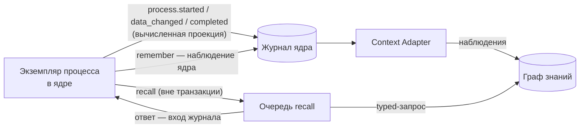

# Процессы и база знаний

Процессы и база знаний платформы работают как одно целое: каждое дело
попадает в граф знаний со своими данными, связями и исходом, шаги процесса
спрашивают базу знаний и пишут в неё, исполнитель шага получает контекст
из неё, регламенты привязаны к элементам процесса, а уроки закрытых дел
всплывают в похожих делах. Статья для авторов процессов и администраторов
базы знаний. Обоснование — TAI-ADR-0054 п.9, CP-ADR-0076.

## Главное правило: память — только через ядро

Процесс, пакет, коннектор и агент **не обращаются к сервису памяти
напрямую**. Все чтения и записи идут через Control Plane:

- **namespace и scope выбирает ядро** — корень дерева workspace процесса;
  клиент их не задаёт;
- **граф хранит проекцию, а не состояние.** Состояние дела живёт в ядре
  (экземпляр и его журнал). Граф можно целиком восстановить из журнала ядра,
  и движок не читает граф ни для одного решения, кроме записанного ответа
  `recall`;
- **недоступная память не останавливает процессы.** Проекция доставляется
  асинхронно и не менее одного раза: память не отвечает — процесс идёт
  дальше, доставка догонит;
- **в граф идут только объявленные поля.** Данные дела, которые проекция не
  называет, память не видит. Персональные данные — по правилам памяти.



Почему так: движок детерминирован. Если бы он читал граф напрямую, replay
зависел бы от сегодняшнего состояния графа, а синхронная запись в память в
транзакции движка останавливала бы процессы при её недоступности.

## Проекция дела — `memory`

Процесс объявляет, как дело отражается в графе:

```yaml
memory:
  case:
    kind: case                                   # вид узла дела, по умолчанию case
    key: "'invoice:' + data.number"              # естественный ключ дела
    title: "'Счёт ' + data.number + ': ' + data.supplier"
  facts:                                         # имя факта → значение
    amount: data.amount
    currency: data.currency
    approval: data.?approval.orValue('')
  entities:                                      # сущности по естественным ключам
    - {kind: legal_entity, key: data.supplierInn, name: data.supplier, rel: supplier}
  documents: {artifacts: [invoice-review]}       # типы артефактов → документы дела
```

| Поле | Что попадает в граф |
|---|---|
| `case` | узел дела `<kind>:<key>` с заголовком `title` и связью `instance_of` к процессу |
| `facts` | факты дела: новое значение закрывает прежнее сроком действия — история фактов видна |
| `entities[]` | узел сущности по естественному ключу (`kind`, `key`, `name`) и связь дела с ней (`rel`, по умолчанию `involves`); `when` — условие, `many: true` — `key` даёт список, по сущности на элемент |
| `documents.artifacts` | артефакты этих типов на задачах экземпляра становятся документами базы знаний со связью `has_document` от дела |

- **Вычисляет ядро.** При событиях `process.started`, `process.data_changed`,
  `process.completed` движок вычисляет выражения проекции и кладёт
  результат в поле `memory` события. Доставщику не нужно определение
  процесса, а в журнал не попадают поля вне проекции.
- **Идемпотентно.** Узлы и связи адресуются естественными ключами:
  повторная доставка граф не меняет, а сущность, которой ещё нет, заводится
  один раз — следующее дело с тем же заказчиком найдёт тот же узел.
- **Ошибка вычисления проекции процесс не останавливает**: поле проекции
  остаётся пустым, в журнале — решение `projection_incomplete`.
- Процесс без `memory` в базу знаний ничего не пишет.

## Процесс в графе

Опубликованная версия процесса тоже попадает в граф: узел процесса
`process:<ключ>`, стадии `process:<ключ>/<id>` со связью `stage_of`, шаги,
вехи и таблицы решений со связью `step_of`, и связи `regulates` от
регламентов (`governedBy`) к элементам. Новая версия закрывает связи
элементов, которых в ней нет.

Так вопрос «какие процессы опираются на этот регламент» или «какие дела
вёл этот процесс» — обход графа.

## Процесс спрашивает — `recall` { #recall }

```yaml
- id: recall-history
  displayName: Прошлые дела контрагента и уроки
  recall:
    anchors: [{kind: legal_entity, key: data.supplierInn}]
    traverse:
      - {relation: supplier, direction: in, depth: 1, limit: 30}
      - {relation: applies_to, direction: in, depth: 1, limit: 20, from: anchors}
    kinds: [case, lesson]
    query: "'счета поставщика ' + data.supplier"
    limit: 50
    timeout: PT2M
    onTimeout: [{id: no-history, set: {history: "[]"}}]
  output: {as: {history: step.result.nodes}}
```

| Поле | Что значит |
|---|---|
| `anchors` | откуда начинать: `{case: true}` — узел дела экземпляра; `{kind, key}` — сущность по естественному ключу (CEL от данных); `via` — взять сущности, которые ссылаются на якорь этой связью |
| `traverse` | шаги обхода: связь, направление `in`/`out`/`both`, глубина 1–3, лимит; `from: anchors` — от якорей, `previous` — от найденного прошлым шагом |
| `kinds` | оставить узлы только этих видов |
| `query` | текст смыслового добора (найденное помечается `inferred: true`) |
| `limit` | не больше стольких узлов |
| `timeout`, `onTimeout` | сколько ждать ответа и что делать без него; по умолчанию ждать 10 минут |

Ответ — `{nodes, edges, truncated}`: сначала найденное по явным связям,
затем добор по смыслу с пометкой `inferred`; внутри каждой части — свежее
первым. Узел — `{kind, key, title, attributes, anchor, inferred, validFrom}`.

**Как это исполняется.** Шаг ставит намерение в очередь в той же
транзакции, а воркер ядра зовёт память **после** неё. Ответ записывается
входом журнала экземпляра (с хэшем), и только затем движок делает шаг
(`process.recall_completed`; сами узлы в событие не копируются). Память
недоступна — повтор до таймаута шага; отказ по существу — сразу таймаут;
ответ, пришедший после таймаута, записывается как опоздавший и не
читается.

Поэтому:

- **replay** берёт ответ из журнала и память не зовёт вовсе: экземпляр с
  `recall` при недоступной памяти даёт ноль расхождений;
- **тест пакета** берёт ответ из заглушки `mocks.recall`
  (см. [Тесты пакета](package-tests.md#mocks));
- **таблица решений** видит знание только через данные: сначала `recall` с
  `output.as`, затем `decide`.

```yaml
decisions:
  - id: history-advice
    hitPolicy: first
    inputs:
      - {id: lessons, expr: "double(size(data.history.filter(n, n.kind == 'lesson')))", type: number}
    outputs: [{id: level, type: string}]
    rules:
      - when: {lessons: "[1..)"}
        then: {level: lessons}
      - when: {lessons: "-"}
        then: {level: none}
```

## Процесс помнит — `remember` { #remember }

```yaml
- id: remember-payment
  remember:
    facts:
      paidOn: data.paidOn
      paymentReference: data.paymentReference
- id: remember-counterparty
  remember:
    entity:
      kind: legal_entity
      key: data.winner.inn
      name: data.winner.name
      text: "'Победитель по цене ' + string(data.winner.price)"
      links: [{rel: won, kind: case, key: "'purchase:' + data.number"}]
```

- `facts` — факты дела; `entity` — узел сущности со связями `links`.
- Запись — **наблюдение ядра** от личности процесса (вид
  `process.remembered`) в workspace процесса. Оно попадает в память обычной
  доставкой, поэтому `remember` не требует доступной памяти. Повтор шага
  второго наблюдения не пишет.
- Личности процесса нужно право `observations.write`. Отказ команды
  записывается в журнал как невыполненное намерение и процесс не
  останавливает.

## Контекст шага { #step-context }

У шагов `human`, `approve` и `call` есть `context` — какой контекст из базы
знаний получит исполнитель задачи:

```yaml
human:
  taskType: invoice-review
  assign: [{role: accounting}]
  context:
    anchors:
      - {case: true}
      - {kind: legal_entity, key: data.supplierInn}
    traverse:
      - {relation: supplier, direction: in, depth: 1, limit: 20}
      - {relation: applies_to, direction: in, depth: 1, limit: 20, from: anchors}
    semantic: true
    budgetTokens: 6000
```

- Якоря вычисляются при создании задачи и записываются в задачу как профиль
  контекста — он заменяет профиль её типа.
- Пакет контекста собирается при claim тем же механизмом, что у любой
  задачи (см. [Контекст задачи и память](../control-plane/context.md)):
  **сначала явные связи дела**, затем — если `semantic` не `false` — добор по
  смыслу с пометкой «найдено по сходству» (`evidence: inferred`). Бюджет
  режет добор первым.
- Агентский шаг — задача на агента, поэтому исполнитель-агент получает тот
  же раздел «Контекст задачи».

## Регламенты — `governedBy` { #regulations }

Процесс, стадия, шаг, таблица решений и её строка могут ссылаться на
регламенты базы знаний — по естественному ключу документа и, при
необходимости, пункту:

```yaml
governedBy: [{document: "regulation:purchasing"}]
stages:
  - id: pricing
    governedBy: [{document: "regulation:purchasing", section: "4"}]
decisions:
  - id: approval-thresholds
    governedBy: [{document: "regulation:purchasing", section: "4.2"}]
```

- **Проверка пакета** в ядре разрешает ссылки через память: документа нет —
  предупреждение `governed_by_unknown_document`; память не настроена или не
  ответила — одно предупреждение `governed_by_unchecked`. Публикации это не
  мешает.
- **План применения** считает покрытие регламента: какие разделы документа
  исполняют какие элементы процесса и какие разделы **не покрыты**
  (`regulationCoverage`). Разделы документа — узлы вида `regulation_section`
  онтологии процессов, связанные с документом связью `section_of` (ключ пункта
  — `<документ>#<пункт>`, имя — `attributes.section`); раздел, которого у
  документа нет, — предупреждение `governed_by_unknown_section`. Если документ
  загружен без пунктов, покрытие пусто.
- **Поиск процессов по регламенту**:
  `GET /api/v1/process-definitions?governedBy=<ключ документа>` — процессы,
  чья последняя версия ссылается на документ, с workspace и владельцем.

### Регламент изменился — сверка { #regulation-drift }

Когда документ базы знаний меняется, ядро узнаёт об этом при сверке снимка
знаний и пишет событие **`knowledge.changed`** со списком изменённых ключей
(`changes: [{kind, key, change: opened | changed | closed}]`). Пустая сверка и
повтор того же снимка события не дают.

Событие `knowledge.changed` — триггер для [правила вывода
работы](../control-plane/work-rules.md): правило передаёт изменённые ключи
скиллу сверки, скилл находит процессы, чья версия ссылается на документ
(`GET /process-definitions?governedBy=…`), и сравнивает пункты регламента с
элементами процесса, а правило заводит владельцу процесса задачу на каждое
расхождение. Такое правило и скилл сверки поставляются доменным пакетом и в
поставку не входят. **Решение о правке процесса принимает человек**: процесс
сам не меняется.

## Уроки закрытых дел — `retrospective` { #lessons }

```yaml
retrospective:
  taskType: lessons-review
  assign: [{role: accounting}]
  appliesTo: [legal_entity]
  when: data.approval == 'approved'
```

1. После `process.completed` движок вызывает скилл разбора (по умолчанию
   `process.retrospective@1`) с журналом решений, данными, исходом и
   сущностями проекции дела.
2. Скилл предлагает уроки `{key, text, appliesTo, evidence}` со ссылками на
   записи журнала.
3. Человеку приходит задача `taskType` (например, `lessons-review`): по
   каждому уроку — подтвердить, поправить или отклонить.
4. Подтверждённые и поправленные уроки процесс пишет узлами `lesson` со
   связями `learned_from` (дело) и `applies_to` (сущности). **Отклонённый и
   нерешённый урок в граф не попадает.**
5. Урок находится в похожих делах: `recall` или контекст шага следующего дела
   с якорем на ту же сущность и обходом `applies_to` внутрь. Свежий урок —
   первым.

`appliesTo` процесса — виды сущностей, к которым привязываются уроки.
Процесс без ключа дела (`memory.case`) разбор не заводит.

## Онтология процессов

Виды и связи памяти для процессов нейтральны к предметной области и
приходят **пакетом онтологии** процессов, зарегистрированным в памяти через
ядро:

| Вид | Ключ | Что это |
|---|---|---|
| `process` | `process:<ключ>` | опубликованный процесс |
| `process_stage` | `process:<процесс>/<id>` | стадия |
| `process_step` | `process:<процесс>/<id>` | шаг, веха или таблица решений |
| `case` | `memory.case.key` | дело — экземпляр процесса |
| `lesson` | `lesson:<дело>/<id>` | подтверждённый урок |
| `regulation` | ключ документа | регламент |

Связи: `instance_of` (дело → процесс), `stage_of`, `step_of`, `regulates`
(регламент → элемент), `involves` (дело → сущность по умолчанию),
`learned_from` (урок → дело), `applies_to` (урок → сущность), `has_document`.

Доменные виды — закупка, заказчик, счёт — приходят пакетами предметных
областей. Ядро имён видов не знает и не проверяет: они приходят проекцией,
шагами и пакетами онтологии.

**Регистрация и включение** пакетов онтологии — только через ядро,
администратором платформы. Включение заменяет набор пакетов namespace
целиком — перечисляйте все нужные.

!!! note "Скиллы сверки и разбора"
    `process.regulation_check@1` и `process.retrospective@1` исполняет хостинг
    local-скиллов инсталляции с правом `processes.read`, чтением памяти
    workspace и LLM инсталляции (см. [skill-sdk](../sdk/skill-sdk.md)).

## Типичные проблемы

| Симптом | Причина | Что делать |
|---|---|---|
| дела нет в графе | у процесса нет `memory`, или доставка ещё не догнала | объявить проекцию; проверить Context Adapter |
| `recall` всегда уходит в `onTimeout` | у личности процесса нет права `events.read` или ключа; память отказывает | выдать права личности; проверить память |
| урок не всплывает в следующем деле | урок не подтверждён или у следующего дела другой якорь | подтвердить урок; якорь `recall` — та же сущность, обход `applies_to` внутрь |
| `governed_by_unknown_document` | документа с этим ключом нет в базе знаний дерева workspace | загрузить регламент с тем же естественным ключом |
| покрытие регламента пусто | память недоступна или у документа нет разделов `section_of` | проверить память; загрузить документ с разделами |

## См. также

- [Процессы](index.md)
- [Контекст задачи и память](../control-plane/context.md)
- [Модель знаний](../memory/knowledge-model.md)
- [Загрузка знаний](../memory/ingestion.md)
- [Правила вывода работы](../control-plane/work-rules.md)
