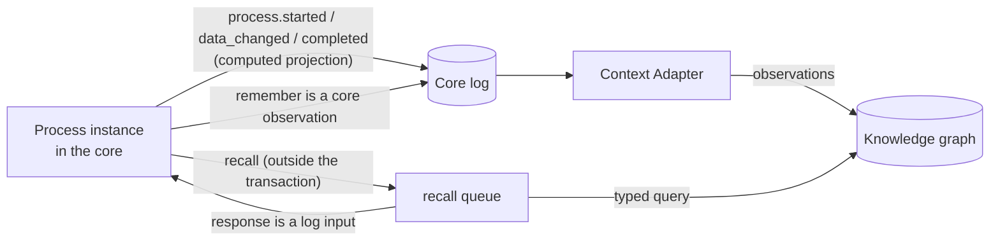

# Processes and the knowledge base

Processes and the platform's knowledge base work as one whole: every case
enters the knowledge graph with its data, relations, and outcome; process
steps query the knowledge base and write to it; a step's executor receives
context from it; regulations are bound to process elements; and lessons
from closed cases surface in similar cases. This article is for process
authors and knowledge base administrators. Rationale: TAI-ADR-0054 item 9,
CP-ADR-0076.

## The main rule: memory only through the core

A process, package, connector, or agent **does not call the memory service
directly**. All reads and writes go through Control Plane:

- **the core chooses the namespace and scope**: the root of the process's
  workspace tree; the client does not set them;
- **the graph stores a projection, not state.** The state of a case lives
  in the core (the instance and its log). The graph can be fully rebuilt
  from the core's log, and the engine does not read the graph for any
  decision except a recorded `recall` response;
- **unavailable memory does not stop processes.** The projection is
  delivered asynchronously and at least once: if memory does not respond,
  the process moves on, and delivery catches up;
- **only declared fields go into the graph.** Memory does not see case data
  that the projection does not name. Personal data follows memory's rules.



Why this way: the engine is deterministic. If it read the graph directly,
replay would depend on the graph's current state, and a synchronous write
to memory inside the engine transaction would stop processes whenever
memory was unavailable.

## Case projection: `memory`

A process declares how a case is reflected in the graph:

```yaml
memory:
  case:
    kind: case                                   # case node kind, case by default
    key: "'invoice:' + data.number"              # natural key of the case
    title: "'Invoice ' + data.number + ': ' + data.supplier"
  facts:                                         # fact name → value
    amount: data.amount
    currency: data.currency
    approval: data.?approval.orValue('')
  entities:                                      # entities by natural keys
    - {kind: legal_entity, key: data.supplierInn, name: data.supplier, rel: supplier}
  documents: {artifacts: [invoice-review]}       # artifact types → case documents
```

| Field | What goes into the graph |
|---|---|
| `case` | the case node `<kind>:<key>` with the `title` heading and an `instance_of` relation to the process |
| `facts` | case facts: a new value closes the previous one with a validity period, so fact history is visible |
| `entities[]` | an entity node by natural key (`kind`, `key`, `name`) and the case's relation to it (`rel`, `involves` by default); `when` is a condition, `many: true` means `key` yields a list, one entity per element |
| `documents.artifacts` | artifacts of these types on the instance's tasks become knowledge base documents with a `has_document` relation from the case |

- **The core computes it.** On the `process.started`,
  `process.data_changed`, and `process.completed` events, the engine
  evaluates the projection expressions and puts the result into the event's
  `memory` field. The deliverer does not need the process definition, and
  fields outside the projection never reach the log.
- **Idempotent.** Nodes and relations are addressed by natural keys:
  repeated delivery does not change the graph, and an entity that does not
  exist yet is created once, so the next case with the same customer finds
  the same node.
- **A projection evaluation error does not stop the process**: the
  projection field stays empty, and the log gets a `projection_incomplete`
  decision.
- A process without `memory` writes nothing to the knowledge base.

## The process in the graph

A published process version also enters the graph: the process node
`process:<key>`, stages `process:<key>/<id>` with a `stage_of` relation,
steps, milestones, and decision tables with a `step_of` relation, and
`regulates` relations from regulations (`governedBy`) to elements. A new
version closes the relations of elements it no longer has.

So questions such as "which processes rely on this regulation" or "which
cases did this process handle" become graph traversals.

## The process asks: `recall` { #recall }

```yaml
- id: recall-history
  displayName: Counterparty's past cases and lessons
  recall:
    anchors: [{kind: legal_entity, key: data.supplierInn}]
    traverse:
      - {relation: supplier, direction: in, depth: 1, limit: 30}
      - {relation: applies_to, direction: in, depth: 1, limit: 20, from: anchors}
    kinds: [case, lesson]
    query: "'supplier invoices ' + data.supplier"
    limit: 50
    timeout: PT2M
    onTimeout: [{id: no-history, set: {history: "[]"}}]
  output: {as: {history: step.result.nodes}}
```

| Field | Meaning |
|---|---|
| `anchors` | where to start: `{case: true}` is the instance's case node; `{kind, key}` is an entity by natural key (CEL over data); `via` takes the entities that reference the anchor through this relation |
| `traverse` | traversal steps: relation, direction `in`/`out`/`both`, depth 1–3, limit; `from: anchors` starts from the anchors, `previous` from what the previous step found |
| `kinds` | keep only nodes of these kinds |
| `query` | text for semantic enrichment (results found this way are marked `inferred: true`) |
| `limit` | at most this many nodes |
| `timeout`, `onTimeout` | how long to wait for a response and what to do without it; by default, wait 10 minutes |

The response is `{nodes, edges, truncated}`: first what was found through
explicit relations, then semantic enrichment marked `inferred`; within each
part, the most recent comes first. A node is
`{kind, key, title, attributes, anchor, inferred, validFrom}`.

**How it is executed.** The step queues an intent in the same transaction,
and a core worker calls memory **after** it. The response is recorded as an
input of the instance log (with a hash), and only then does the engine take
the step (`process.recall_completed`; the nodes themselves are not copied
into the event). If memory is unavailable, it retries until the step
timeout; a substantive refusal leads to an immediate timeout; a response
that arrives after the timeout is recorded as late and is not read.

Therefore:

- **replay** takes the response from the log and does not call memory at
  all: an instance with `recall` produces zero discrepancies when memory is
  unavailable;
- **a package test** takes the response from the `mocks.recall` stub
  (see [Package tests](package-tests.md#mocks));
- **a decision table** sees knowledge only through data: first `recall`
  with `output.as`, then `decide`.

```yaml
decisions:
  - id: history-advice
    hitPolicy: first
    inputs:
      - {id: lessons, expr: "double(size(data.history.filter(n, n.kind == 'lesson')))", type: number}
    outputs: [{id: level, type: string}]
    rules:
      - when: {lessons: "[1..)"}
        then: {level: lessons}
      - when: {lessons: "-"}
        then: {level: none}
```

## The process remembers: `remember` { #remember }

```yaml
- id: remember-payment
  remember:
    facts:
      paidOn: data.paidOn
      paymentReference: data.paymentReference
- id: remember-counterparty
  remember:
    entity:
      kind: legal_entity
      key: data.winner.inn
      name: data.winner.name
      text: "'Winner on price ' + string(data.winner.price)"
      links: [{rel: won, kind: case, key: "'purchase:' + data.number"}]
```

- `facts` are case facts; `entity` is an entity node with `links` relations.
- The write is a **core observation** from the process identity (kind
  `process.remembered`) in the process's workspace. It reaches memory through
  regular delivery, so `remember` does not require memory to be available. A
  repeated step does not write a second observation.
- The process identity needs the `observations.write` permission. A refused
  command is recorded in the log as an unfulfilled intent and does not stop
  the process.

## Step context { #step-context }

`human`, `approve`, and `call` steps have `context`: which context from the
knowledge base the task's executor receives:

```yaml
human:
  taskType: invoice-review
  assign: [{role: accounting}]
  context:
    anchors:
      - {case: true}
      - {kind: legal_entity, key: data.supplierInn}
    traverse:
      - {relation: supplier, direction: in, depth: 1, limit: 20}
      - {relation: applies_to, direction: in, depth: 1, limit: 20, from: anchors}
    semantic: true
    budgetTokens: 6000
```

- The anchors are evaluated when the task is created and are written into
  the task as a context profile, which replaces the profile of its type.
- The context package is assembled at claim time by the same mechanism as
  for any task (see [Task context and memory](../control-plane/context.md)):
  **the case's explicit relations first**, then, unless `semantic` is
  `false`, semantic enrichment marked "found by similarity"
  (`evidence: inferred`). The budget cuts the enrichment first.
- An agent step is a task for an agent, so an agent executor receives the
  same "Task context" section.

## Regulations: `governedBy` { #regulations }

A process, stage, step, decision table, and a table row can reference
knowledge base regulations, by the document's natural key and, if needed, a
section:

```yaml
governedBy: [{document: "regulation:purchasing"}]
stages:
  - id: pricing
    governedBy: [{document: "regulation:purchasing", section: "4"}]
decisions:
  - id: approval-thresholds
    governedBy: [{document: "regulation:purchasing", section: "4.2"}]
```

- **The package check** in the core resolves references through memory: if
  the document does not exist, you get a `governed_by_unknown_document`
  warning; if memory is not configured or did not respond, a single
  `governed_by_unchecked` warning. This does not block publication.
- **The apply plan** computes regulation coverage: which sections of the
  document are carried out by which process elements and which sections are
  **not covered** (`regulationCoverage`). Document sections are nodes of kind
  `regulation_section` of the process ontology, linked to the document by a
  `section_of` relation (the section key is `<document>#<section>`, the name
  is `attributes.section`); a section the document does not have produces a
  `governed_by_unknown_section` warning. If the document was loaded without
  sections, the coverage is empty.
- **Finding processes by regulation**:
  `GET /api/v1/process-definitions?governedBy=<document key>` returns the
  processes whose latest version references the document, with workspace and
  owner.

### The regulation changed: reconciliation { #regulation-drift }

When a knowledge base document changes, the core learns about it during
knowledge snapshot reconciliation and writes a **`knowledge.changed`** event
with the list of changed keys
(`changes: [{kind, key, change: opened | changed | closed}]`). An empty
reconciliation or a repeat of the same snapshot produces no event.

The `knowledge.changed` event is a trigger for a
[work rule](../control-plane/work-rules.md): the rule passes the changed
keys to a reconciliation skill, the skill finds the processes whose version
references the document (`GET /process-definitions?governedBy=…`) and
compares the regulation's sections with the process elements, and the rule
creates a task for the process owner for each discrepancy. Such a rule and
reconciliation skill are shipped by a domain package and are not part of
the delivery. **A person decides whether to change the process**: the
process does not change itself.

## Lessons from closed cases: `retrospective` { #lessons }

```yaml
retrospective:
  taskType: lessons-review
  assign: [{role: accounting}]
  appliesTo: [legal_entity]
  when: data.approval == 'approved'
```

1. After `process.completed`, the engine calls a review skill
   (`process.retrospective@1` by default) with the decision log, the data,
   the outcome, and the entities of the case projection.
2. The skill proposes lessons `{key, text, appliesTo, evidence}` with
   references to log entries.
3. A person receives a `taskType` task (for example, `lessons-review`): for
   each lesson, confirm, correct, or reject it.
4. The process writes confirmed and corrected lessons as `lesson` nodes with
   `learned_from` (case) and `applies_to` (entities) relations. **A rejected
   or undecided lesson does not enter the graph.**
5. A lesson is found in similar cases: through `recall` or the step context
   of the next case anchored on the same entity with an inward `applies_to`
   traversal. The most recent lesson comes first.

The process's `appliesTo` lists the entity kinds that lessons are attached
to. A process without a case key (`memory.case`) does not create a review.

## The process ontology

Memory kinds and relations for processes are domain-neutral and arrive as
the processes **ontology package**, registered in memory through the core:

| Kind | Key | What it is |
|---|---|---|
| `process` | `process:<key>` | a published process |
| `process_stage` | `process:<process>/<id>` | a stage |
| `process_step` | `process:<process>/<id>` | a step, milestone, or decision table |
| `case` | `memory.case.key` | a case, a process instance |
| `lesson` | `lesson:<case>/<id>` | a confirmed lesson |
| `regulation` | document key | a regulation |

Relations: `instance_of` (case → process), `stage_of`, `step_of`,
`regulates` (regulation → element), `involves` (case → entity, by default),
`learned_from` (lesson → case), `applies_to` (lesson → entity),
`has_document`.

Domain kinds (a purchase, a customer, an invoice) arrive with domain
packages. The core does not know or check kind names: they arrive through
the projection, steps, and ontology packages.

**Registration and enabling** of ontology packages happen only through the
core, by a platform administrator. Enabling replaces the namespace's whole
set of packages, so list all the ones you need.

!!! note "Reconciliation and review skills"
    `process.regulation_check@1` and `process.retrospective@1` are executed
    by the installation's local skill hosting with the `processes.read`
    permission, read access to the workspace's memory, and the
    installation's LLM (see [skill-sdk](../sdk/skill-sdk.md)).

## Common problems

| Symptom | Cause | What to do |
|---|---|---|
| the case is not in the graph | the process has no `memory`, or delivery has not caught up yet | declare the projection; check the Context Adapter |
| `recall` always ends in `onTimeout` | the process identity lacks the `events.read` permission or a key; memory refuses | grant permissions to the identity; check memory |
| a lesson does not surface in the next case | the lesson is not confirmed, or the next case has a different anchor | confirm the lesson; the `recall` anchor must be the same entity, with an inward `applies_to` traversal |
| `governed_by_unknown_document` | there is no document with this key in the knowledge base of the workspace tree | load the regulation with the same natural key |
| regulation coverage is empty | memory is unavailable, or the document has no `section_of` sections | check memory; load the document with sections |

## See also

- [Processes](index.md)
- [Task context and memory](../control-plane/context.md)
- [Knowledge model](../memory/knowledge-model.md)
- [Knowledge ingestion](../memory/ingestion.md)
- [Work rules](../control-plane/work-rules.md)
