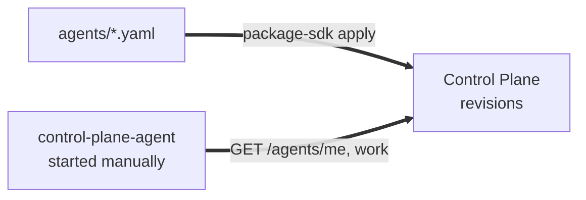
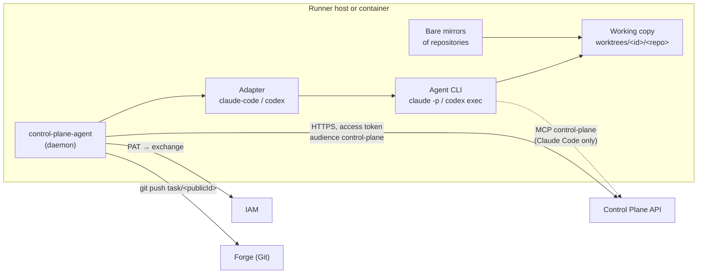
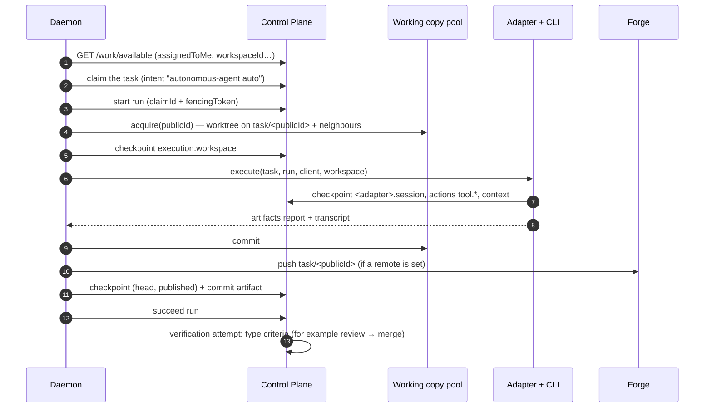

# Agents and runner

This section describes autonomous executors: the `control-plane-agent` daemon, which
claims tasks from Control Plane on its own and executes them with a coding agent (Claude
Code, Codex) or with skills in an isolated working copy. You start the daemon manually on a
machine with access to Control Plane and configure it with environment variables or with an
agent description revision. The section is for engineers who run executors and for
operators who assign tasks to agents and accept the results.

## Agent by description

An agent is one YAML object in a catalog package (kind `Agent`): identity and permissions,
which work to take, the executor kind with its model and instructions, the working copy,
skills. Control Plane stores immutable revisions of the description and derives the agent's
principal and binding from them. A daemon started under the agent's principal takes its
configuration from its revision (`GET /agents/me`); a principal without a description is
configured through the environment (see [Configuration](configuration.md)).

Editing the description creates a new revision: the executor finishes the current run,
exits with code 75, and comes back up on the new revision if a process supervisor restarts
it.

## What a runner is

A runner is a **client** of Control Plane, not part of the core. It goes through the same
harness protocol cycle as a human in Claude Code: session → finding work → claim → run →
artifacts → completion. There is no special server path for agents: the same endpoints, the
same `control_plane_client` SDK, the same checks of permissions, leases, and fencing tokens.

There is one difference: a human operator makes decisions personally (claim, completion,
approval), while the runner daemon acts according to its configuration — it claims
automatically and decides the run outcome from the adapter result.

## Process roles

| Process | What it does | What it does not do |
|---|---|---|
| `control-plane-agent` daemon | opens a session, finds work, claims, starts the run, prepares the working copy, commits and publishes the branch, writes artifacts, completes the run, creates the review | does not write code |
| Adapter (`claude-code`, `codex`) | builds the prompt, starts the agent CLI, writes the session checkpoint, publishes the summary and the transcript | does not decide the run outcome, does not hold the claim |
| Coding agent inside the run | changes files in the working copy, can read context and leave checkpoints through MCP | does not claim, does not complete, does not push, does not open a PR |

The boundary is fundamental: the run outcome is decided by whoever holds the claim and its
fencing token, that is, the daemon. The agent inside is not even offered the authoritative
MCP tools (see [Adapters](adapters.md#mcp-inside)).

## Lifecycle of one task

If anything goes wrong at any step, the run ends with an honest `fail` and a reason
(`lease_lost`, `ownership_lost`, `workspace_busy`, exception text with host paths stripped),
and the working copy is kept for the next attempt.

## What a runner takes

The `work` section of the agent description defines which work to take:

- `onlyAssigned` (default `true`) — only tasks assigned to this agent's principal
  (`assigneeId`): "I can take it" and "it is meant for me" are different questions;
- `workspace` — only tasks of this Workspace (together with its subtree);
- `project` (+ `includeSubprojects`) — only tasks of the project;
- `taskTypes` — only tasks of these types.

Tasks whose type declares skill execution (`execution = {skill, version}`) go not to the
coding adapter but to the skill executor of the same daemon — and only if it can run that
skill. Without the `task_types.read` permission the daemon does not touch such tasks at all
(fail-closed).

!!! warning "No queue narrowing"
    An agent with `onlyAssigned: false` and no `workspace` takes any available task of the
    tenant, including epics and tasks of other repositories. Release an executor into the
    shared queue only deliberately. The same applies to a daemon started manually without a
    description: its `CONTROL_PLANE_AGENT_ONLY_ASSIGNED` filter is off by default.

## Deployment

You start the daemon manually: as a systemd unit, a compose service, or a container. The
executor's perimeter is an unprivileged user or a container that holds only working copies,
mirrors, and the required secrets. The machine can be a dedicated server, a VM, or a
developer machine — any machine with outbound HTTPS to Control Plane and IAM. Variables are
in [Configuration](configuration.md), the credential is in [Agent identity](agent-identity.md).

## Sections

| Article | About |
|---|---|
| [Agent identity](agent-identity.md) | a separate `agent` principal, a binding without admin, the PAT and its storage |
| [Executor adapters](adapters.md) | Claude Code, Codex, OpenCode: CLI launch, tokens, permission modes, prompt |
| [Working copies](execution-workspace.md) | the `worktrees/<id>/<repo>` container, neighbours, branches, evidence, publishing |
| [Run trace](trace.md) | the `transcript` artifact, `tool.*` actions, publishing flags |
| [Configuration](configuration.md) | what comes from the revision, host variables, and env mode |

## See also

- [Catalog packages](../control-plane/catalog-packages.md#agent)

- [Execution — claims and runs](../control-plane/execution.md)
- [Harness protocol](../control-plane/harness-protocol.md)
- [Operator work](../operator/index.md)
- [Troubleshooting: execution and runner](../troubleshooting/runner.md)
