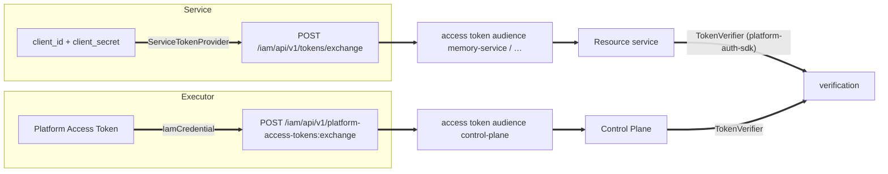

# SDK and integrations

This section is for developers who write code on top of the platform: their own resource
service, an executor (agent), a skill, a connector, or a vertical package. It describes the
platform's canonical libraries and the rules for connecting them. All libraries are
Python 3.12+.

## Libraries

| Library | Python package | Purpose | Dependencies |
|---|---|---|---|
| [platform-auth-sdk](platform-auth-sdk.md) | `platform_auth` | IAM token verification and a Policy Enforcement Point in a resource service: identity → revocation → entitlement → policy → service gates | `pyjwt[crypto]`, `httpx` |
| [control-plane-client](clients.md#control-plane-client) | `control_plane_client` | Control Plane REST API client, credential resolution, PAT-to-access-token exchange | `httpx` |
| [platform-memory-client](clients.md#memory-client) | `platform_memory_client` | memory-service client (`/api/brain/*`, `/api/memory/*`) | `httpx`, `pydantic` |
| [skill-sdk](skill-sdk.md) | `skill_sdk` | write a skill in code, host it over `local`/`http`/`mcp`, and export YAML for a catalog package | `pydantic`, `jsonschema`, `pyyaml`; optionally `platform-auth-sdk`, `platform-llm` |
| [platform-llm](platform-llm.md) | `platform_llm` | a single LLM client with structured output, retries, and model rotation | `httpx`, `pydantic` |

A vertical package is assembled from all of these parts — see
[Vertical packages](vertical-packages.md).

## The canonical clients rule

For logic that already has a canonical implementation in the platform, you **do not write**
your own code (Rationale: TAI-ADR-0030):

| Task | Canonical implementation | What not to do |
|---|---|---|
| Verify an IAM token in your service | `platform_auth.TokenVerifier` + `JwksCache` | parse the JWT by hand, accept an audience "by substring" |
| Exchange a PAT or client credentials for an access token | `control_plane_client.IamCredential`, `platform_auth.ServiceTokenProvider` | keep an access token longer than its TTL, send a PAT as a Bearer to a service |
| Call Control Plane | `control_plane_client.ControlPlaneClient` | write your own HTTP client from memory of the contract |
| Read or write memory | `platform_memory_client` | access the memory database directly |
| Call an LLM | `platform_llm.OpenAICompatibleClient` | copy retries and JSON parsing into every service |

The clients live next to the server in its repository (`control-plane/client`,
`memory-service/client`) and are versioned together with the server contract.

## Connecting {#connect}

Libraries are connected as **path dependencies in neighbouring folders**. The superproject
layout is flat: components sit next to each other at the root, and a consumer refers to
`../platform-auth-sdk`, `../control-plane/client`, and so on.

=== "uv (`tool.uv.sources`)"

    ```toml
    [project]
    dependencies = [
        "platform-auth-sdk>=0.1.0",
        "control-plane-client",
        "platform-memory-client",
    ]

    [tool.uv.sources]
    platform-auth-sdk = { path = "../platform-auth-sdk", editable = true }
    control-plane-client = { path = "../control-plane/client", editable = true }
    platform-memory-client = { path = "../memory-service/client", editable = true }
    ```

=== "PEP 508 with `{root:uri}` (hatch)"

    ```toml
    [project]
    dependencies = [
        "platform-auth-sdk @ {root:uri}/../platform-auth-sdk",
        "control-plane-client @ {root:uri}/../control-plane/client",
        "platform-llm @ {root:uri}/../platform-llm",
    ]
    ```

!!! warning "The image build context is the superproject root"
    Because of path dependencies, a service image cannot be built from its own directory:

    the neighbours are not there. Platform services that depend on the SDK (control-plane,
    package services)
    are built with the context `.` (the root) and `dockerfile: <component>/Dockerfile`; the
    `.dockerignore` at the root cuts off everything extra. Do the same for your service:

    ```yaml
    my-service:
      build:
        context: .
        dockerfile: my-service/Dockerfile
    ```

    The runner host that executes agents in working copies materializes the neighbours
    under the same names — that is why the layout must not change.

## Tokens: who presents what





| Who | Credential | How it gets an access token | Library |
|---|---|---|---|
| Agent, harness, CLI | PAT (from a local store, a file, or a variable) | PAT exchange → a token for one audience | `control_plane_client.IamCredential` |
| Platform service | service account client credentials | client credentials exchange → a token for an audience | `platform_auth.ServiceTokenProvider` |
| Human in a browser | login to an external OIDC IdP | `federation:exchange` in IAM (web client) | — (see [Identity federation](../iam/federation.md)) |

The rule is **"one token — one audience"**: a resource service accepts only a token issued
exactly for it. If a process needs two services, it performs two exchanges of the same PAT
(see [Tokens, audiences, scopes](../iam/tokens.md)).

## Checks and tests

| Library | Check |
|---|---|
| platform-auth-sdk | `uv run pytest`, `uv run ruff check .`, `uv run mypy` |
| skill-sdk | `uv run pytest -q` |
| platform-llm | `uv run pytest -q`, `uv run ruff check . && uv run ruff format --check .` |
| clients | client tests run together with the service tests |

`platform_auth.testing` provides a key generator, token issuance with arbitrary claims, and a
controllable clock — use it in your service's tests instead of hand-written fixtures.

## See also

- [platform-auth-sdk](platform-auth-sdk.md)
- [Service clients](clients.md)
- [skill-sdk](skill-sdk.md)
- [platform-llm](platform-llm.md)
- [Vertical packages](vertical-packages.md)
- [Tokens, audiences, scopes](../iam/tokens.md)
