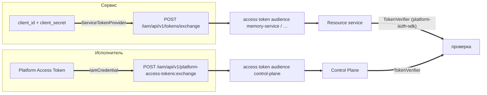

# SDK и интеграции

Раздел для разработчиков, которые пишут код поверх платформы: собственный
resource service, исполнителя (агента), скилл, коннектор или вертикальный
пакет. Здесь описаны канонические библиотеки платформы и правила их
подключения. Все библиотеки — Python 3.12+.

## Библиотеки

| Библиотека | Пакет Python | Для чего | Зависимости |
|---|---|---|---|
| [platform-auth-sdk](platform-auth-sdk.md) | `platform_auth` | проверка токенов IAM и Policy Enforcement Point в resource service: identity → revocation → entitlement → policy → гейты сервиса | `pyjwt[crypto]`, `httpx` |
| [control-plane-client](clients.md#control-plane-client) | `control_plane_client` | клиент REST API Control Plane, разрешение credential, обмен PAT на access token | `httpx` |
| [platform-memory-client](clients.md#memory-client) | `platform_memory_client` | клиент memory-service (`/api/brain/*`, `/api/memory/*`) | `httpx`, `pydantic` |
| [skill-sdk](skill-sdk.md) | `skill_sdk` | написать скилл кодом, хостить его по `local`/`http`/`mcp` и выгрузить YAML для пакета каталога | `pydantic`, `jsonschema`, `pyyaml`; опционально `platform-auth-sdk`, `platform-llm` |
| [platform-llm](platform-llm.md) | `platform_llm` | единый LLM-клиент со structured output, ретраями и ротацией моделей | `httpx`, `pydantic` |

Вертикальный пакет собирается из всех перечисленных частей — см.
[Вертикальные пакеты](vertical-packages.md).

## Правило канонических клиентов

Для логики, у которой в платформе уже есть канон, свой код **не пишется**
(обоснование — TAI-ADR-0030):

| Задача | Канон | Чего не делать |
|---|---|---|
| Проверить токен IAM в своём сервисе | `platform_auth.TokenVerifier` + `JwksCache` | разбирать JWT вручную, принимать audience «по вхождению» |
| Обменять PAT или client credentials на access token | `control_plane_client.IamCredential`, `platform_auth.ServiceTokenProvider` | хранить access token дольше его TTL, слать PAT как Bearer в сервис |
| Вызвать Control Plane | `control_plane_client.ControlPlaneClient` | писать свой HTTP-клиент по памяти о контракте |
| Прочитать или записать память | `platform_memory_client` | ходить в базу памяти напрямую |
| Вызвать LLM | `platform_llm.OpenAICompatibleClient` | копировать ретраи и разбор JSON в каждый сервис |

Клиенты лежат рядом с сервером в его репозитории (`control-plane/client`,
`memory-service/client`) и версионируются вместе с серверным контрактом.

## Подключение {#connect}

Библиотеки подключаются **path-зависимостями соседними папками**. Раскладка
суперпроекта плоская: компоненты лежат в корне рядом друг с другом, и
потребитель ссылается на `../platform-auth-sdk`, `../control-plane/client` и
т. п.

=== "uv (`tool.uv.sources`)"

    ```toml
    [project]
    dependencies = [
        "platform-auth-sdk>=0.1.0",
        "control-plane-client",
        "platform-memory-client",
    ]

    [tool.uv.sources]
    platform-auth-sdk = { path = "../platform-auth-sdk", editable = true }
    control-plane-client = { path = "../control-plane/client", editable = true }
    platform-memory-client = { path = "../memory-service/client", editable = true }
    ```

=== "PEP 508 с `{root:uri}` (hatch)"

    ```toml
    [project]
    dependencies = [
        "platform-auth-sdk @ {root:uri}/../platform-auth-sdk",
        "control-plane-client @ {root:uri}/../control-plane/client",
        "platform-llm @ {root:uri}/../platform-llm",
    ]
    ```

!!! warning "Контекст сборки образа — корень суперпроекта"
    Из-за path-зависимостей образ сервиса нельзя собрать из его каталога:

    соседей там нет. Сервисы платформы, зависящие от SDK (control-plane,
    сервисы пакетов),
    собираются с контекстом `.` (корень) и `dockerfile: <компонент>/Dockerfile`; лишнее отсекает
    `.dockerignore` в корне. Делайте так же для своего сервиса:

    ```yaml
    my-service:
      build:
        context: .
        dockerfile: my-service/Dockerfile
    ```

    Runner-хост, который исполняет агентов в рабочих копиях, материализует
    соседей под теми же именами — поэтому раскладку нельзя менять.

## Токены: кто что предъявляет





| Кто | Credential | Как получает access token | Библиотека |
|---|---|---|---|
| Агент, харнесс, CLI | PAT (из локального хранилища, файла или переменной) | обмен PAT → токен одного audience | `control_plane_client.IamCredential` |
| Сервис платформы | client credentials service account'а | обмен client credentials → токен audience | `platform_auth.ServiceTokenProvider` |
| Человек в браузере | вход во внешний OIDC IdP | `federation:exchange` в IAM (веб-клиент) | — (см. [Федерация identity](../iam/federation.md)) |

Правило **«один токен — один audience»**: resource service принимает только
токен, выпущенный ровно для него. Если процессу нужны два сервиса, он делает
два обмена одного и того же PAT (см. [Токены, audiences, scopes](../iam/tokens.md)).

## Проверка и тесты

| Библиотека | Проверка |
|---|---|
| platform-auth-sdk | `uv run pytest`, `uv run ruff check .`, `uv run mypy` |
| skill-sdk | `uv run pytest -q` |
| platform-llm | `uv run pytest -q`, `uv run ruff check . && uv run ruff format --check .` |
| клиенты | тесты клиента запускаются вместе с тестами сервиса |

`platform_auth.testing` даёт генератор ключей, выпуск токенов с
произвольными claims и управляемые часы — используйте его в тестах своего
сервиса вместо самописных фикстур.

## См. также

- [platform-auth-sdk](platform-auth-sdk.md)
- [Клиенты сервисов](clients.md)
- [skill-sdk](skill-sdk.md)
- [platform-llm](platform-llm.md)
- [Вертикальные пакеты](vertical-packages.md)
- [Токены, audiences, scopes](../iam/tokens.md)
