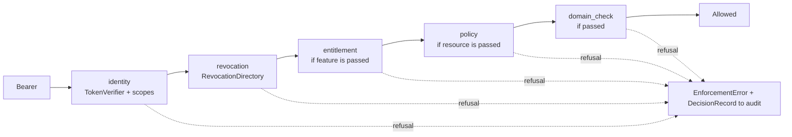

# platform-auth-sdk


`platform-auth-sdk` (package `platform_auth`) is the single Policy Enforcement Point for the
platform's resource services. It is used by Control Plane, memory-service,
skill-sdk, and vertical package services. The article
covers IAM token verification, the JWKS cache, revocation, the entitlement and policy
stages, the refusal contract, and FastAPI integration. For service developers.

## What it does and what it does not do


| Does | Does not |
|---|---|
| verifies the RS256 signature against JWKS with rotation, exact `iss` and `aud`, time claims, required fields | issue credentials |
| builds a `TrustedAuthContext` only from verified claims | know domain permissions, Workspace, Task, or namespace |
| closes the window between credential revocation and token expiry (revocation) | read other services' databases |
| asks an external licensing service and PDP, if connected, with a bounded cache | compute organizational policy itself |
| returns a single refusal code to the client and the exact reason to audit | transactional gates are the service's concern (`domain_check`) |

Dependencies are only `pyjwt[crypto]` and `httpx`. License: Apache-2.0.

## Order of checks

```text
identity → revocation → entitlement → policy → transactional gates (domain_check)
```

The order is fixed and not configurable: each next stage is more expensive than the previous
one and makes sense only after it.



## Token verification

### `TokenVerifier` and `VerifierConfig`

```python
from platform_auth import JwksCache, TokenVerifier, VerifierConfig

keys = JwksCache("http://iam-service:8010/.well-known/jwks.json")
verifier = TokenVerifier(
    keys,
    VerifierConfig(issuer="https://platform.example.com/iam", audience="acme-pack"),
)
ctx = await verifier.verify(token, correlation_id=request_id)
```

| `VerifierConfig` parameter | Default | Meaning |
|---|---|---|
| `issuer` | required | exact match of `iss` |
| `audience` | required | exact match of `aud`; **a list in `aud` is rejected** (`audience_not_exact`) |
| `leeway_seconds` | `5.0` | clock tolerance for `exp`, `nbf`, `iat` |
| `algorithms` | `RS256`, `RS384`, `RS512` | symmetric algorithms and `none` are cut off before the key is accessed |
| `required_claims` | `iss sub aud tenant_id iat nbf exp jti` | a missing one means refusal |
| `extra_required_claims` | `()` | additional claims the service requires (for example `acr`) |

An empty `issuer` or `audience` raises `VerificationUnavailable("verifier_not_configured")`
at construction: a misconfigured service does not start rather than accepting everything.

The issuer of IAM tokens is the public IAM address (`${TAIMEN_PUBLIC_URL}/iam`), while JWKS
is best fetched from the internal network address — signature verification must not depend
on an external proxy.

### Key cache `JwksCache`

| `JwksPolicy` parameter | Default | Meaning |
|---|---|---|
| `refresh_after_seconds` | `300` | soft term: after it an unknown `kid` triggers a re-read |
| `min_refresh_interval_seconds` | `10` | no more than one re-read per interval — protects the IAM JWKS from a flood of tokens with a foreign `kid` |
| `stale_after_seconds` | `3600` | hard limit: the cache does not live longer than this without a successful refresh |
| `request_timeout_seconds` | `3` | JWKS request timeout |

Behavior:

- unknown `kid` → forced re-read (subject to `min_refresh_interval`) → still unknown →
  `InvalidToken("unknown_key_id")`;
- IAM unavailable, cache younger than `stale_after` — the service works from the cache;
- cache older than `stale_after` — `VerificationUnavailable("jwks_stale")`, that is, `503`:
  an unavailable IAM closes access rather than opening it.

`StaticKeySet(public_key_pem, key_id="")` is a single key known in advance for isolated
environments without JWKS access; key rotation is then the deployment's responsibility.

### `TrustedAuthContext`

| Field | Source |
|---|---|
| `tenant_id` | `tenant_id` |
| `principal_id` | `sub` |
| `principal_type` | `principal_type` (`human`, `agent`, `service`) |
| `credential_id` | `credential_id` or `jti` |
| `scopes` | `scope` (a space-separated string or a list) |
| `scope_ceiling` | `scope_ceiling` (PAT ceiling); `None` — no ceiling |
| `session_id`, `auth_time`, `acr` | claims of the same name, if present |
| `expires_at`, `issued_at`, `token_id`, `issuer`, `audience` | time and service claims |

A tenant, subject, or scope from the request body, query, or headers is **never considered
authoritative**.

A scope is in effect only if it is present **both** in `scope` **and** in `scope_ceiling`
(when a ceiling is declared). A declared empty ceiling lets nothing through — this is not the
same as having no ceiling.

```python
ctx.has_scope("acme-pack:write")         # bool
ctx.require_scope("acme-pack:read", "acme-pack:write")  # any of them → otherwise InsufficientScope
ctx.effective_scopes()                   # scopes ∩ ceiling
ctx.audit_subject()                      # a log-safe snapshot of identifiers
```

## Revocation

A short access token TTL limits damage, but a window remains between credential revocation in
IAM and the expiry of an already issued token. The resource service itself closes it through
the `RevocationDirectory` port:

```python
class RevocationDirectory(Protocol):
    async def check(self, ctx: TrustedAuthContext) -> CredentialStatus: ...
```

The common rule for every implementation: **unknown means refusal.**

### `TokenLifetimeWindow` (default)

There is no separate revocation source; the guarantee is limited by the token lifetime. So
that this mode cannot be enabled silently, it rejects tokens that live longer than
`max_ttl_seconds` (900 s by default) with the reason `token_ttl_exceeds_revocation_window`.

### `CachingRevocationDirectory`

A cache over the service's own source (its own projection of principals, a subscription to
the IAM outbox, and so on):

```python
from platform_auth import CachingRevocationDirectory, CredentialStatus

async def source(ctx) -> CredentialStatus:
    row = await bindings.find(ctx.issuer, ctx.principal_id)
    if row is None:
        return CredentialStatus.revoked("binding_not_found")
    return CredentialStatus.allowed()

revocation = CachingRevocationDirectory(source, ttl_seconds=30, stale_after_seconds=120)
```

The cache key is the pair `(tenant_id, credential_id)`.

| Cached answer | Age | What happens |
|---|---|---|
| active | ≤ `ttl_seconds` | reused |
| active | > `ttl_seconds` | the source is queried again; if it is unavailable — the previous answer, while the age is ≤ `stale_after_seconds` |
| revoked | ≤ `stale_after_seconds` | reused without querying the source |
| any | > `stale_after_seconds` | the entry is discarded; the source must answer, otherwise `VerificationUnavailable("revocation_source_unavailable")` |

!!! note "A negative answer lives no longer than `stale_after_seconds`"
    A refusal is not re-queried on the short TTL — a revoked credential does not come back to
    life. But it is not stored forever either: otherwise a refusal obtained **before** the
    entry appeared in the source (for example, `binding_not_found` before the binding was
    created) would hold until the process restarts. After `stale_after_seconds` the source is
    queried again. The practical conclusion for operations: create the binding before the
    principal's first request, or wait for the staleness window (for Control Plane —
    `CP_IAM_BINDING_STALE_AFTER_SECONDS`, 120 s by default).
    `forget(tenant_id, credential_id)` resets the entry manually.

A revoked credential returns the same `invalid_token` to the client as a broken token: a
separate code would reveal whether the credential existed at all.

## Entitlement stage {#entitlement-stage}

It is turned on by passing `feature` to `enforce`. The client is `EntitlementClient`:


```python
from platform_auth import EntitlementClient, EntitlementPolicy, ServiceCredentials, ServiceTokenProvider

tokens = ServiceTokenProvider(
    "http://iam-service:8010",
    ServiceCredentials(client_id=..., client_secret=...,
                       audience=entitlement_audience,   # audience of the licensing service
                       scopes=("entitlement:check-on-behalf",)),
)
entitlement = EntitlementClient(
    entitlement_url, tokens, product="acme-pack",
    policy=EntitlementPolicy(cache_ttl_seconds=30, degraded_max_age_seconds=300),
)
```

| Situation | Result |
|---|---|
| fresh cache (≤ `cache_ttl_seconds`), the license has not expired, `required_amount` is not greater than the cached one | decision from the cache |
| the service answered 4xx | `EntitlementUnavailable("entitlement_request_rejected")` — the cache is **not** used |
| the service is unavailable or 5xx, the cache is younger than `degraded_max_age_seconds` and "wide" enough | the previous decision with `source="degraded"` |
| otherwise | `EntitlementUnavailable("entitlement_service_unavailable")` → `503` |
| refusal on the merits | `NotEntitled(reason)` → `403 not_entitled` |

Degradation is limited twice — by the age of the entry and by its content: a decision for a
smaller `required_amount` does not apply to a request for a larger amount. Quotas are
`reserve()`, `consume()`, `release()` of the same client.

`NullEntitlementClient` (the PEP default) always answers allow with `source="disabled"`:
licensing is explicitly off, and this is visible in audit.

## Policy stage {#policy-stage}


It is turned on by passing `resource` to `enforce`. The client is `AuthorizationClient` for
an external PDP (Policy Decision Point), if one is connected:

```python
from platform_auth import AuthorizationClient, AuthorizationPolicy, ContextualTuple, ResourceRef

authorization = AuthorizationClient(
    pdp_url,
    pdp_tokens,                            # token for the PDP audience
    policy=AuthorizationPolicy(cache_ttl_seconds=5, request_timeout_seconds=3),
)

allowed = await pep.enforce(
    token,
    action="tasks.write",
    resource=ResourceRef("task", str(task.id)),
    contextual=(ContextualTuple(f"task:{task.id}", "scope", f"workspace:{task.workspace_id}"),),
    policy_consistency="strong",
)
allowed.policy.reason_code, allowed.policy.decision_id
```

| Client method | What it does |
|---|---|
| `check(ctx, action, resource, *, contextual, on_behalf_of, consistency)` | one decision |
| `batch_check(ctx, items, *, consistency)` | up to 100 decisions (`CheckItem`) |
| `list_objects(ctx, action, resource_type, *, on_behalf_of, consistency, cursor, limit)` | `ObjectPage` for filtering lists |
| `list_subjects(...)` | who is allowed the action |
| `invalidate(tenant_id)` | reset the cache (a hook on `binding.*` events) |

The rules are stricter than for entitlement:


- only `check` with `consistency="default"` is cached, for no longer than
  `cache_ttl_seconds`; there is **no** grace window during an outage — no answer and no
  fresh cache means `AuthorizationUnavailable` (`503`);
- `consistency="strong"` is always online; use it for mutations and privileged actions;
- a 4xx from the PDP is a refusal without consulting the cache;
- `resource` is passed but the client is not configured —
  `AuthorizationUnavailable("authorization_not_configured")`;
- `NullAuthorizationClient` answers **deny** with `source="disabled"`: "nothing to check
  with" does not mean "allowed";
- the resource is only a server-resolved `type:id`, client claims about the resource are not
  accepted; a call on behalf of another principal (`on_behalf_of`) requires the
  `policy:check-on-behalf` scope on the service identity.

## Service token: `ServiceTokenProvider`

Exchanges a service account's client credentials for a token of the required audience, with
a cache:

```python
from platform_auth import ServiceCredentials, ServiceTokenProvider

provider = ServiceTokenProvider(
    "http://iam-service:8010",
    ServiceCredentials(client_id=os.environ["MY_IAM_CLIENT_ID"],
                       client_secret=os.environ["MY_IAM_CLIENT_SECRET"],
                       audience="memory-service",
                       scopes=("memory:read",)),
    refresh_margin_seconds=30,
)
token = await provider()        # cached or fresh
provider.forget()               # reset after a 401 from the service
```

The request is `POST {iam}/api/v1/tokens/exchange` with `clientId`, `clientSecret`,
`audience`, `scopes`. An exchange error is `VerificationUnavailable("service_token_exchange_failed")`
without restating the cause (it could contain an echo of the secret). An empty
`client_id`/`client_secret` is an error at construction.

## Refusal contract

Every error has two sides: `client_payload()` — a stable code for the client,
`audit_reason` — the exact reason for audit only.

| Exception | `code` | HTTP | When |
|---|---|---|---|
| `InvalidToken` | `invalid_token` | 401 | any token defect: missing, broken signature, foreign issuer/audience, expired, revoked |
| `InsufficientScope` | `insufficient_scope` | 403 | the scope does not cover the operation |
| `NotEntitled` | `not_entitled` | 403 | no license for the feature |
| `PermissionDenied` | `permission_denied` | 403 | refusal by policy or domain policy |
| `VerificationUnavailable` | `verification_unavailable` | 503 | no keys, JWKS/revocation unavailable longer than the window |
| `EntitlementUnavailable` | `entitlement_unavailable` | 503 | no entitlement decision |
| `AuthorizationUnavailable` | `authorization_unavailable` | 503 | no policy decision |

All token defects collapse into one code: different answers would turn the endpoint into an
oracle for other people's credentials. `error.retriable` is `True` for 5xx (unavailability is
retried, a refusal on the merits is not).

## Audit

Every PEP decision — allow and deny — is written to an `AuditSink`:

```python
class AuditSink(Protocol):
    def record(self, decision: DecisionRecord) -> None: ...
```

`DecisionRecord` contains `outcome` (`allowed`, `denied`, `unavailable`), `stage`
(`identity`, `revocation`, `entitlement`, `policy`, `domain`), `action`, `audience`, `code`,
`reason`, tenant/principal/credential/session identifiers, `feature`, `product`, decision
sources (`entitlement_source`, `policy_source`), `correlation_id`, time, and `details`. The
record holds no tokens or secrets; `redact(payload)` removes everything that looks like a
credential from an arbitrary dictionary — by field name and by value.
`CollectingAuditSink` (default) keeps records in memory — in a production service, pass your
own sink (log, outbox).

## FastAPI integration

The SDK does not depend on a web framework. A typical integration is a FastAPI dependency and
an `EnforcementError` handler:

```python
from fastapi import Depends, FastAPI, Request
from fastapi.responses import JSONResponse
from platform_auth import (
    CachingRevocationDirectory, CredentialStatus, EnforcementError, JwksCache,
    PolicyEnforcementPoint, TokenVerifier, TrustedAuthContext, VerifierConfig,
)

keys = JwksCache("http://iam-service:8010/.well-known/jwks.json")
verifier = TokenVerifier(keys, VerifierConfig(
    issuer="https://platform.example.com/iam", audience="acme-pack"))

async def principal_status(ctx: TrustedAuthContext) -> CredentialStatus:
    return CredentialStatus.allowed()      # the service's own projection of principals

pep = PolicyEnforcementPoint(
    verifier,
    revocation=CachingRevocationDirectory(principal_status),
    audit=MyAuditSink(),
)

app = FastAPI()

@app.exception_handler(EnforcementError)
async def enforcement_denied(request: Request, exc: EnforcementError) -> JSONResponse:
    return JSONResponse(status_code=exc.http_status, content=exc.client_payload())

def require(action: str, *scopes: str):
    async def dependency(request: Request) -> TrustedAuthContext:
        allowed = await pep.enforce_authorization_header(
            request.headers.get("authorization"),
            action=action,
            required_scopes=scopes,
            correlation_id=request.headers.get("x-request-id", ""),
        )
        return allowed.context
    return dependency

Reader = Depends(require("items.read", "acme-pack:read", "acme-pack:write"))
Writer = Depends(require("items.write", "acme-pack:write"))

@app.get("/api/v1/items")
async def list_items(ctx: TrustedAuthContext = Reader):
    return await items.list(tenant_id=ctx.tenant_id)   # tenant comes only from the token

@app.on_event("shutdown")
async def close() -> None:
    await keys.aclose()
```

Recommendations:

- Create `JwksCache`, `TokenVerifier`, and the PEP **once** per application — otherwise the
  caches do not work.
- Do not read the tenant or principal from the request: use only `ctx.tenant_id` and
  `ctx.principal_id`.
- Respond with SDK codes (`client_payload()`), do not reveal `audit_reason`.
- Human tokens (PAT or federated login) come from IAM with the same audience — no separate
  check for humans is needed.

## Testing

`platform_auth.testing`:

```python
from platform_auth import StaticKeySet, TokenVerifier, VerifierConfig
from platform_auth.testing import FrozenClock, SigningKey

key = SigningKey.generate("test-key")
token = key.issue(issuer="https://iam.test", audience="acme-pack",
                  scopes=["acme-pack:read"], ttl_seconds=300)
jwks = key.jwks()                     # JWKS document to seed into the cache
clock = FrozenClock(); clock.advance(600)   # controllable time for caches
```

`issue()` accepts any claims (`scope_ceiling`, `session_id`, `acr`, `principal_type`,
`extra_claims`, `drop_claims`, `algorithm`) — convenient for negative tests.
`JwksCache.seed(document)` seeds JWKS without the network.

## See also

- [SDK and integrations](index.md)
- [Tokens, audiences, scopes](../iam/tokens.md)
- [Service accounts](../iam/service-accounts.md)
- [Security model](../overview/security-model.md)
