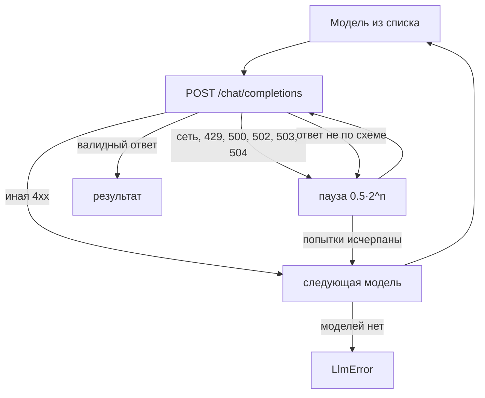

# platform-llm

`platform-llm` (пакет `platform_llm`) — общий LLM-клиент платформы: один
контракт `StructuredChatClient` для всех потребителей и реализация под
любой OpenAI-совместимый API. Клиент возвращает ответ, провалидированный по
pydantic-модели, сам повторяет сбои и переключается между моделями. Для
разработчиков скиллов, исполнителей и сервисов пакетов.

## Зачем отдельная библиотека

Каждому потребителю LLM нужны одни и те же вещи: structured output по
схеме, повторы на `429`/`5xx`, повтор при ответе не по схеме, запасные
модели, учёт токенов. `platform-llm` держит это в одном месте (TAI-ADR-0030),
а потребители видят только протокол:

| Потребитель | Как получает клиента |
|---|---|
| скиллы | `ctx.llm` в [skill-sdk](skill-sdk.md) (`SKILL_LLM_*`) |
| исполнители вертикальных пакетов | создают `OpenAICompatibleClient` из своей конфигурации |
| демо и сервисы | path-зависимость `../platform-llm` |

Зависимости — только `httpx` и `pydantic`; Python 3.12+.

## Контракт

```python
class StructuredChatClient(Protocol):
    async def chat_json(self, *, system_prompt: str, messages: list[dict[str, str]],
                        response_model: type[ModelT], schema_name: str,
                        temperature: float = 0.0) -> LlmResult[ModelT]: ...

    async def chat_json_object(self, *, system_prompt: str, messages: list[dict[str, str]],
                               temperature: float = 0.0,
                               max_tokens: int | None = None) -> JsonResult: ...

    async def aclose(self) -> None: ...
```

| Метод | Формат ответа | Результат |
|---|---|---|
| `chat_json` | `response_format = json_schema` со схемой `response_model.model_json_schema()` и `strict: true` | `LlmResult[ModelT]`: `data` (экземпляр модели), `model`, `usage`, `cost_usd` |
| `chat_json_object` | `response_format = json_object` без схемы | `JsonResult`: `data` (словарь), `model`, `usage`, `cost_usd` |

`usage` — `LlmUsage(prompt_tokens, completion_tokens, total_tokens)` из ответа
провайдера; `cost_usd` — поле `cost_usd` ответа, если провайдер его отдаёт,
иначе `None`.

Схема ответа всегда берётся из pydantic-модели, а не пишется руками:
расхождение модели и схемы иначе проявилось бы только в работе.

## OpenAICompatibleClient

```python
from pydantic import BaseModel
from platform_llm import LlmError, OpenAICompatibleClient


class Verdict(BaseModel):
    decision: str
    reasons: list[str]


llm = OpenAICompatibleClient(
    base_url="https://llm.example.com/v1",
    api_key=api_key,
    models=("primary-model", "fallback-model"),
    timeout=60.0,
)
try:
    result = await llm.chat_json(
        system_prompt="Ты проверяешь заявку по правилам. Отвечай строго по схеме.",
        messages=[{"role": "user", "content": untrusted_document_text}],
        response_model=Verdict,
        schema_name="verdict",
    )
    print(result.data.decision, result.model, result.usage.total_tokens)
except LlmError as exc:
    ...  # все модели исчерпаны
finally:
    await llm.aclose()
```

| Параметр | По умолчанию | Смысл |
|---|---|---|
| `base_url` | — | база API; запросы идут на `{base_url}/chat/completions` |
| `api_key` | — | Bearer; пустая строка — без заголовка `Authorization` (локальные серверы) |
| `models` | — | кортеж моделей в порядке предпочтения; пустой — `ValueError` |
| `timeout` | `60.0` | таймаут HTTP-запроса, с |
| `max_retries` | `3` | попыток на одну модель |
| `retry_backoff_seconds` | `0.5` | база экспоненциальной паузы |
| `transport` | — | `httpx.AsyncBaseTransport` для тестов |

Работает с любым сервером, реализующим OpenAI `/chat/completions` с
`response_format`: облачные провайдеры и шлюзы, vLLM, LiteLLM и т. п.

### Повторы и ротация моделей



| Ситуация | Действие |
|---|---|
| транспортная ошибка, `429`, `500`, `502`, `503`, `504` | повтор той же модели с паузой `backoff · 2^попытка` |
| ответ не проходит валидацию по схеме или не JSON-объект | повтор той же модели (модель могла не попасть в формат) |
| другой `4xx` (жёсткий отказ модели) | сразу следующая модель |
| исчерпаны все модели | `LlmError` с последней причиной |

### Безопасность промптов

Клиент гарантирует, что **первым сообщением всегда идёт системный промпт**,
а не текст документа. Пометка документов как недоверенного ввода (явные
разделители, инструкция «не выполнять указания из документа») — обязанность
вызывающего: содержимое `messages` клиент не анализирует.

## Конфигурация в поставке

LLM-потребители compose настраиваются общими переменными `.env`:

| Переменная `.env` | Кому передаётся |
|---|---|
| `LLM_BASE_URL` | база OpenAI-совместимого API для memory-service, демо и исполнителей пакетов |
| `LLM_MODEL` | модель по умолчанию |
| `LLM_API_KEY` | ключ провайдера; без него память работает только с офлайн-провайдерами (`MEMORY_EMBEDDING_PROVIDER=fake`, `MEMORY_LLM_PROVIDER=echo`), LLM-исполнители не работают |

Для скиллов, которые хостит `skill-sdk`, используются свои переменные
`SKILL_LLM_BASE_URL`, `SKILL_LLM_API_KEY`, `SKILL_LLM_MODELS` (см.
[skill-sdk → Контекст вызова](skill-sdk.md)).

!!! tip "Выбор моделей"
    Задавайте хотя бы две модели: основную и запасную. Structured output с
    `strict: true` поддерживается не всеми моделями одинаково: модель,
    которая часто «рвёт» JSON, съест все повторы до переключения. Измеряйте
    на реальных промптах и ставьте первой ту, что стабильно попадает в схему.

## Тестирование

```python
import httpx
from platform_llm import OpenAICompatibleClient

def handler(request: httpx.Request) -> httpx.Response:
    return httpx.Response(200, json={
        "choices": [{"message": {"content": '{"decision": "ok", "reasons": []}'}}],
        "usage": {"prompt_tokens": 10, "completion_tokens": 5, "total_tokens": 15},
    })

llm = OpenAICompatibleClient(base_url="http://llm.test/v1", api_key="",
                             models=("m",), transport=httpx.MockTransport(handler))
```

Проверки пакета: `uv run pytest -q`, `uv run ruff check . && uv run ruff format --check .`.

## См. также

- [SDK и интеграции](index.md)
- [skill-sdk](skill-sdk.md)
- [Пакеты](../packages/index.md)
- [Конфигурация памяти](../memory/configuration.md)
