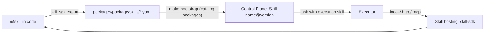

# skill-sdk

`skill-sdk` (package `skill_sdk`) is the platform's skill SDK: you write a skill once as a
Python function, and the SDK derives the v1 contract from the code, provides a call context,
hosts the skill over any of the three executor protocols (`local`, `http`, `mcp`), and
generates YAML for a Control Plane catalog package. For developers who add new actions for
agents and processes to the platform. Rationale: TAI-ADR-0045; the skill contract is
CP-ADR-0056.

!!! note "Status"
    Version `0.1.x`, license Apache-2.0. The package is connected as a path dependency in a
    neighbouring folder, like the other platform libraries
    (see [SDK and integrations](index.md#connect)).

## What a skill is

A skill is a named, versioned action with a formal contract: input and output JSON schemas,
a side-effect class, a risk level, idempotency, a timeout, a retry policy. The core stores
the version contract as immutable; the executor (runner) calls the skill implementation,
checks input and output against the schemas, and publishes the result in the task.



## Writing a skill

```python
from typing import Literal

from pydantic import BaseModel
from skill_sdk import SkillContext, SkillError, skill


class MergeIn(BaseModel):
    repository: str
    branch: str
    commit: str
    target: str


class MergeOut(BaseModel):
    merged: bool
    sha: str | None = None
    reason: Literal["conflict", "branch_moved", "already_merged"] | None = None


@skill(
    "git.merge",
    version="2",
    side_effects="external_write",
    risk="medium",
    idempotency="natural",
    timeout=300,
    retry=(3, 30),
)
def merge(inputs: MergeIn, ctx: SkillContext) -> MergeOut:
    """Merge a published branch into the target branch."""
    ...
    if conflict:
        return MergeOut(merged=False, reason="conflict")   # an expected outcome is an output
    raise SkillError("git_unavailable", "remote unavailable", retryable=True)  # a failure is an error
```

### The contract from code

| Contract part | Where it comes from |
|---|---|
| Input schema | the pydantic model of the first argument (or `inputs_schema=`) |
| Output schema | the pydantic model of the return value (or `outputs_schema=`) |
| Description | the first paragraph of the docstring (or `description=`) |
| Policy | decorator arguments |
| Default implementation | `local` with the entrypoint `module:name` of the function itself |

Schemas are JSON Schema 2020-12. Explicit `inputs_schema`/`outputs_schema` are needed when an
already published version has its own schema that the model does not reproduce.

### `@skill` decorator parameters

| Parameter | Values | Default | Meaning |
|---|---|---|---|
| `name` | string | — | skill key, for example `git.merge` |
| `version` | string | — | contract version; a contract change = a new version |
| `side_effects` | `none`, `external_read`, `external_write` | — | what the skill does in the outside world |
| `risk` | `low`, `medium`, `high` | — | risk level |
| `idempotency` | `required`, `natural`, `none` | `none` | a retry with the same key does not produce a second effect |
| `timeout` | seconds | `60` | call timeout |
| `retry` | `(maxAttempts, backoffSeconds)` | `(1, 0)` | the executor's retry policy |
| `permissions`, `preconditions`, `postconditions`, `cost_model` | — | empty | additional parts of the v1 contract |
| `implementation` | `Local(...)`, `Http(...)`, `Mcp(...)` | `Local()` | how to host (usually set at export) |

At **import** time the SDK rejects what the core would reject: unknown values of
`side_effects`/`risk`/`idempotency`, a function whose signature is not `(inputs)` or
`(inputs, ctx)`, a missing input or output schema, and `external_write` without idempotency
with `maxAttempts > 1` (retrying an external write without idempotency is a second external
effect).

### Outcome versus failure

| Situation | How to express it |
|---|---|
| An outcome anticipated by the contract ("conflict", "not found") | return an output with the corresponding field |
| An environment failure: network, limit, unavailable service | `SkillError(code, message, retryable=True)` |
| A failure a retry will not fix | `SkillError(code, message, retryable=False)` |

The error code is `^[a-z0-9][a-z0-9_.-]{0,99}$`. Any other exception from the implementation
becomes a `SkillError` with the code from the exception's `code` attribute (if valid) or
`skill_error`. A schema violation is `input_contract_violation` or
`output_contract_violation` with the list of errors in `details`.

## Call context `SkillContext`

The function can be synchronous or `async`; the second argument is the context.

| Member | Purpose |
|---|---|
| `ctx.invocation_id`, `ctx.idempotency_key` | call identifier and idempotency key — a retry with the same key must not produce a second external effect |
| `ctx.remaining()` | seconds until the contract timeout (`None` if the hosting does not know it) |
| `ctx.check_deadline()` | raises a retryable `SkillError("timeout")` if the time is up |
| `ctx.log` | a logger with the call id |
| `ctx.config(name, default=None)` | a hosting parameter (from the process environment) |
| `ctx.secret(name)` | a hosting secret; no value — a retryable `config_missing` (another host may have it) |
| `ctx.llm` | a [platform-llm](platform-llm.md) client configured by the installation; tokens are counted into the cost automatically |
| `ctx.add_cost(unit, amount)` | account for your own consumption (API requests, pages, and so on) |
| `ctx.caller` | the verified caller context (`TrustedAuthContext`) for `http`/`mcp-http` |

There is **intentionally no** Control Plane client in the context: a skill does not create or
move tasks — approval outcomes and core rules do that.

The default LLM is an `OpenAICompatibleClient` built from these variables:

| Variable | Meaning |
|---|---|
| `SKILL_LLM_BASE_URL` | base of the OpenAI-compatible API |
| `SKILL_LLM_API_KEY` | key |
| `SKILL_LLM_MODELS` | comma-separated models — the rotation order |

For another provider, use `skill_sdk.configure_llm(factory)`.

## Hosting

| Protocol | How to run | What the executor sees |
|---|---|---|
| `local` | the package is installed next to the executor daemon, `CONTROL_PLANE_SKILLS_LOCAL_PACKAGES=<package>` | the executor finds the skills itself, calls `__skill_invoke__`, and gets `{outputs, cost}` |
| `http` | `skill-sdk serve http <module>` or `skill_sdk.http.create_app(...)` in your own ASGI | `POST /skills/{name}@{version}` |
| `mcp` | `skill-sdk serve mcp-stdio <module>` or `serve mcp-http` | an MCP tool named after the skill |

### HTTP protocol

```bash
skill-sdk serve http my_skills --host 0.0.0.0 --port 8080
```

```http
POST /skills/git.merge@2
Authorization: Bearer <IAM access token for the skill audience>
Content-Type: application/json

{"invocationId": "…", "idempotencyKey": "…", "inputs": {"repository": "…", "branch": "b", "commit": "abc1234", "target": "main"}}
```

| Response | Meaning |
|---|---|
| `200` | the body is the `outputs` themselves, without an envelope; the cost is in the `X-Skill-Cost` header |
| `422` | a non-retryable `SkillError`: `{"error": {"code", "message", "retryable", "details"}}` |
| `503` | a retryable `SkillError` in the same envelope |
| `401` | the token failed verification |
| `404` | no such skill on this hosting |
| `500` | implementation failure |

`GET /skills` lists the skills of the hosting.

### MCP

A skill is a tool of the MCP server; the cost is in `_meta["skill/cost"]`, an error is a
result with `isError` and a single text block `{"error": {…}}` of the same form.

### Hosting authentication

`http` and `mcp-http` verify an IAM token for the skill audience through
[platform-auth-sdk](platform-auth-sdk.md):

| Variable | Meaning |
|---|---|
| `SKILL_SDK_IAM_ISSUER` | IAM issuer (`${TAIMEN_PUBLIC_URL}/iam`) |
| `SKILL_SDK_AUDIENCE` | skill audience (the same as in the implementation contract) |
| `SKILL_SDK_JWKS_URL` | IAM JWKS |

Without these variables the hosting **does not start**. The `--allow-anonymous` flag
(`allow_anonymous=True`) turns verification off — for local development only. An unavailable
JWKS gives `503`, an invalid token gives `401`.

## Catalog package

Skills reach Control Plane through catalog packages (TAI-ADR-0044, see
[Catalog packages](../control-plane/catalog-packages.md)). The skill YAML is generated from
code and never edited by hand:


```bash
# write packages/acme/skills/*.yaml
skill-sdk export --package ../packages/acme acme_skills

# CI: check that code and YAML match
skill-sdk export --package ../packages/acme --check acme_skills

# http hosting: implementation in the contract, address from an installation environment variable
skill-sdk export --package ../packages/acme --protocol http \
    --endpoint '${ACME_SKILLS_URL}' --audience acme-skills acme_skills
```

| `export` parameter | Meaning |
|---|---|
| `--package` | package directory (required) |
| `--protocol` | `local`, `http`, or `mcp`; defaults to the one declared in code |
| `--endpoint` | `http`: service base, accepts `${VAR}`; `mcp`: URL or `stdio:<name>` |
| `--audience` | the IAM audience whose token the executor carries |
| `--check` | do not write, compare with the files instead (for CI) |

A fragment of a generated file:

```yaml
# Generated by skill-sdk from code — edit the code and regenerate (TAI-ADR-0045).
kind: Skill
key: adr.conformance_check
spec:
  version: '1'
  description: Check Accepted ADRs against the code with probes (no LLM)
  sideEffects: none
  riskLevel: low
  contract:
    inputs:
      $schema: https://json-schema.org/draft/2020-12/schema
      type: object
      required: [repository]
      …
```

A version contract in the core is immutable: a change of schemas or policy is a new
`version` in the decorator, a new file, and a new Skill object in the catalog.

## Other CLI commands

| Command | What it does |
|---|---|
| `skill-sdk list <modules…>` | skills in the modules |
| `skill-sdk contract <module:name>` | the v1 contract of one skill (JSON) |
| `skill-sdk invoke <module:name> --input '<json>'` | call locally with contract checks (`--input @file` — from a file) |
| `skill-sdk serve {http,mcp-http,mcp-stdio} <modules…>` | hosting |

Targets are `module:name`, a module, or a package (with all submodules). Two different
declarations of the same `name@version` are an error.

## Skill tests

```python
from skill_sdk.testing import check_contract, invoke


def test_merge_contract():
    check_contract(merge)   # core validators, if control-plane is installed alongside


def test_conflict_is_an_outcome():
    result = invoke(merge, {"repository": "…", "branch": "b", "commit": "abc1234", "target": "main"})
    assert result.outputs["reason"] == "conflict"
```

`ainvoke` is the asynchronous variant. `check_contract` runs the contract through the same
validators the core uses, if the `control-plane` package is available in the environment.

## Installation

```bash
uv add skill-sdk                # contract, local, tests, export
uv add "skill-sdk[http]"        # + ASGI hosting and token verification
uv add "skill-sdk[mcp]"         # + MCP server
uv add "skill-sdk[llm]"         # + ctx.llm
uv add "skill-sdk[all]"         # everything at once
```

`platform-auth-sdk` and `platform-llm` are connected as neighbouring folders.

## See also

- [SDK and integrations](index.md)
- [Catalog packages](../control-plane/catalog-packages.md)
- [Executor adapters](../runner/adapters.md)
- [platform-llm](platform-llm.md)
- [platform-auth-sdk](platform-auth-sdk.md)
