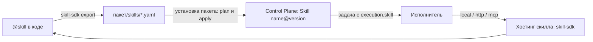

# skill-sdk

`skill-sdk` (пакет `skill_sdk`) — SDK скиллов платформы: скилл пишется один
раз как функция Python, а SDK выводит из кода контракт v1, даёт контекст
вызова, хостит скилл по любому из трёх протоколов исполнителя (`local`,
`http`, `mcp`) и генерирует YAML для пакета каталога Control Plane. Для
разработчиков, которые добавляют в платформу новые действия для агентов и
процессов. Обоснование — TAI-ADR-0045; контракт скилла — CP-ADR-0056.

!!! note "Статус"
    Версия `0.1.x`, лицензия Apache-2.0. Пакет подключается path-зависимостью
    соседней папкой, как остальные библиотеки платформы
    (см. [SDK и интеграции](index.md#connect)). Как скиллы живут в пакете
    каталога — кто их вызывает, где они хостятся, как согласуется внешняя
    запись, — в статье [Скиллы пакета](../packages/skills.md).

## Что такое скилл

Скилл — именованное версионированное действие с формальным контрактом:
JSON-схемы входа и выхода, класс побочных эффектов, уровень риска,
идемпотентность, таймаут, политика повторов. Ядро хранит контракт версии
неизменяемым; исполнитель (runner) вызывает реализацию скилла, проверяет
вход и выход по схемам и публикует результат в задаче.



## Написать скилл

```python
from typing import Literal

from pydantic import BaseModel
from skill_sdk import SkillContext, SkillError, skill


class MergeIn(BaseModel):
    repository: str
    branch: str
    commit: str
    target: str


class MergeOut(BaseModel):
    merged: bool
    sha: str | None = None
    reason: Literal["conflict", "branch_moved", "already_merged"] | None = None


@skill(
    "git.merge",
    version="2",
    side_effects="external_write",
    risk="medium",
    idempotency="natural",
    timeout=300,
    retry=(3, 30),
)
def merge(inputs: MergeIn, ctx: SkillContext) -> MergeOut:
    """Влить опубликованную ветку в целевую."""
    ...
    if conflict:
        return MergeOut(merged=False, reason="conflict")   # предусмотренный исход — это выход
    raise SkillError("git_unavailable", "remote недоступен", retryable=True)  # сбой — ошибка
```

### Контракт из кода

| Часть контракта | Откуда берётся |
|---|---|
| Схема входа | pydantic-модель первого аргумента (или `inputs_schema=`) |
| Схема выхода | pydantic-модель возвращаемого значения (или `outputs_schema=`) |
| Описание | первый абзац docstring (или `description=`) |
| Политика | аргументы декоратора |
| Реализация по умолчанию | `local` с entrypoint `модуль:имя` самой функции |

Схемы — JSON Schema 2020-12. Явные `inputs_schema`/`outputs_schema` нужны,
когда у уже опубликованной версии своя схема, которую модель не
воспроизводит.

### Параметры декоратора `@skill`

| Параметр | Значения | По умолчанию | Смысл |
|---|---|---|---|
| `name` | строка | — | ключ скилла, например `git.merge` |
| `version` | строка | — | версия контракта; изменение контракта = новая версия |
| `side_effects` | `none`, `external_read`, `external_write` | — | что скилл делает во внешнем мире |
| `risk` | `low`, `medium`, `high` | — | уровень риска |
| `idempotency` | `required`, `natural`, `none` | `none` | повтор с тем же ключом не даёт второго эффекта |
| `timeout` | секунды | `60` | таймаут вызова |
| `retry` | `(maxAttempts, backoffSeconds)` | `(1, 0)` | политика повторов исполнителя |
| `permissions`, `preconditions`, `postconditions`, `cost_model` | — | пусто | дополнительные части контракта v1 |
| `implementation` | `Local(...)`, `Http(...)`, `Mcp(...)` | `Local()` | как хостить (обычно задаётся при экспорте) |

SDK отвергает при **импорте** то, что отвергло бы ядро: неизвестные
значения `side_effects`/`risk`/`idempotency`, функцию не с сигнатурой
`(inputs)` или `(inputs, ctx)`, отсутствие схемы входа или выхода и
`external_write` без идемпотентности с `maxAttempts > 1` (повтор внешней
записи без идемпотентности — второй внешний эффект).

### Исход против сбоя { #outcome-vs-failure }

| Ситуация | Как выразить |
|---|---|
| Исход, предусмотренный контрактом («конфликт», «не найдено») | вернуть выход с соответствующим полем |
| Сбой среды: сеть, лимит, недоступный сервис | `SkillError(code, message, retryable=True)` |
| Сбой, который повтор не исправит | `SkillError(code, message, retryable=False)` |

Код ошибки — `^[a-z0-9][a-z0-9_.-]{0,99}$`. Любое другое исключение
реализации превращается в `SkillError` с кодом из атрибута `code`
исключения (если он валиден) или `skill_error`. Нарушение схемы —
`input_contract_violation` или `output_contract_violation` с перечнем ошибок
в `details`.

## Контекст вызова `SkillContext`

Функция может быть синхронной или `async`; второй аргумент — контекст.

| Член | Назначение |
|---|---|
| `ctx.invocation_id`, `ctx.idempotency_key` | идентификатор вызова и ключ идемпотентности — повтор с тем же ключом не должен давать второй внешний эффект |
| `ctx.remaining()` | секунд до таймаута контракта (`None`, если хостинг его не знает) |
| `ctx.check_deadline()` | бросает повторяемый `SkillError("timeout")`, если время вышло |
| `ctx.log` | журнал с id вызова |
| `ctx.config(name, default=None)` | параметр хостинга (из окружения процесса) |
| `ctx.secret(name)` | секрет хостинга: окружение процесса, затем файл секрета узла (см. [ниже](#secrets)); нет ни там, ни там — повторяемый `config_missing` (другой хост может его иметь) |
| `ctx.llm` | LLM-клиент по конфигурации инсталляции (см. [ниже](#llm)); токены учитываются в стоимости сами |
| `ctx.artifacts` | содержимое артефактов через ядро (см. [ниже](#core-access)) |
| `ctx.knowledge` | база знаний через ядро (см. [ниже](#core-access)) |
| `ctx.add_cost(unit, amount)` | учесть своё потребление (запросы к API, страницы и т. п.) |
| `ctx.caller` | проверенный контекст вызывающего (`TrustedAuthContext`) для `http`/`mcp-http` |

Клиента Control Plane в контексте **нет намеренно**: скилл не заводит и не
двигает задачи — это делают исходы approval и правила ядра. Доступ к ядру у
скилла узкий: содержимое артефактов и база знаний.

### Секреты { #secrets }

`ctx.secret(name)` ищет значение в двух местах по порядку:

1. **Переменная окружения** `name` процесса хостинга — так секреты получает
   хостинг вне узла размещения (свой сервис `http` или `mcp`).
2. **Файл секрета узла** `$SKILL_SDK_SECRETS_DIR/<name>` (по умолчанию
   `/run/secrets/<name>`) — так узел передаёт имена из `placement.secrets`
   описания агента. Имя файла равно имени секрета без перевода регистра;
   файл ищется, только если имя подходит под шаблон `[a-z0-9][a-z0-9-]{0,62}`.

Правило чтения файла — одно на все SDK платформы, канон — модуль
`skill_sdk.secrets` (`read_secret`, `read_secret_file`):

- файл пустой или из одних пробельных символов — секрета нет;
- у непустого значения обрезаются только хвостовые `\r` и `\n`; пробелы
  внутри и по краям — часть значения;
- не больше 64 КиБ, UTF-8, только обычный файл (каталог, FIFO — отказ);
- символические ссылки разрешаются только внутри каталога секретов (так
  раскладывает секреты Kubernetes); ссылка наружу или `..` выше каталога —
  отказ; путь, подменённый во время чтения, читается заново, до трёх попыток;
- `agent-pat` зарезервировано: это PAT самого агента, который узел кладёт
  рядом, а не секрет инсталляции.

| Код ошибки | Когда | Повторяемая |
|---|---|---|
| `config_missing` | нет ни переменной, ни файла (или файл пуст); в сообщении оба места поиска, значений нет | да |
| `secret_name_invalid` | имя — путь (`/`, `..`) или зарезервированное `agent-pat` | нет |
| `secret_unreadable` | у пользователя процесса нет прав на файл | да |
| `secret_file_rejected` | файл отвергнут правилом; причина — `details.reason`: `outside_secrets_dir`, `symlink_swapped`, `not_regular_file`, `too_large`, `not_utf8`, `unreadable` | нет |

### LLM { #llm }

Провайдер `ctx.llm` выбирает инсталляция переменной `SKILL_LLM_PROVIDER`:

| Провайдер | Переменные | Что это |
|---|---|---|
| `openai` (по умолчанию) | `SKILL_LLM_BASE_URL`, `SKILL_LLM_API_KEY`, `SKILL_LLM_MODELS` (через запятую — порядок ротации) | `OpenAICompatibleClient` из [platform-llm](platform-llm.md); нужно дополнение `llm` |
| `claude-code` | `SKILL_LLM_MODELS`, `SKILL_LLM_CLAUDE_BINARY` (по умолчанию `claude`), `SKILL_LLM_TIMEOUT_SECONDS` (по умолчанию 300); `CLAUDE_CODE_OAUTH_TOKEN` в окружении исполнителя | Claude по подписке через Claude Code CLI в неинтерактивном режиме: без инструментов и MCP-серверов, промпт через stdin; в стоимость идут только токены |

- Не настроен провайдер или его переменные — повторяемый `llm_not_configured`;
  нет библиотеки или CLI — повторяемый `llm_unavailable`; лимит подписки или
  `429` у `claude-code` — повторяемый `llm_rate_limited`.
- **Страж персональных данных.** `system_prompt` и `messages` проходят его до
  вызова модели: СНИЛС, паспорт (рядом со словом «паспорт» или «серия»),
  телефон, e-mail и ФИО заменяются маркером вида `[ПДн:фио]`; в журнал
  пишется только сколько и чего найдено. ИНН и КПП организаций, суммы и даты
  не трогаются.
- Другой провайдер — `skill_sdk.configure_llm(factory)`.

### Доступ к ядру: `ctx.artifacts` и `ctx.knowledge` { #core-access }

| Вызов | Что делает | Маршрут ядра |
|---|---|---|
| `await ctx.artifacts.read(artifact_id)` | содержимое артефакта: `ArtifactContent` с `data`, `media_type`, `sha256`, `text()` | `GET /api/v1/artifacts/{id}/content` |
| `await ctx.knowledge.preview(snapshot, workspace_id=…)` | что изменит снимок источника в графе и его `stateToken` | `POST /api/v1/knowledge/snapshots:preview` |
| `await ctx.knowledge.apply(snapshot, workspace_id=…, expected_state=…)` | применить снимок; состояние изменилось после предпросмотра — `SnapshotStale` (`snapshot_stale`, не повторяемая: постройте план заново) | `POST /api/v1/knowledge/snapshots` |
| `await ctx.knowledge.document(workspace_id=…, natural_key=…, title=…, chunks=…)` | документ в базе знаний | `POST /api/v1/knowledge/documents` |
| `await ctx.knowledge.recall(**query)` | ответ памяти на запрос | `POST /api/v1/context/recall` |
| `await ctx.knowledge.query(workspace_id=…, kinds=…, where=…)` | все сущности видов с фильтром, по всем страницам; больше `max_items` (по умолчанию 10 000) — ошибка `knowledge_query_too_large`, а не обрезка | `POST /api/v1/knowledge/entities:query` |

- Адрес ядра — `CONTROL_PLANE_URL` или адрес демона-исполнителя
  `CONTROL_PLANE_SERVER`; без них — `config_missing`. Credential — учётная
  запись исполнителя скиллов, её находит клиент ядра.
- Права проверяются у исполнителя скиллов на workspace задачи: например,
  `artifacts.read` для чтения артефакта.
- Память скилл видит только так — через ядро.

## Хостинг

| Протокол | Как запустить | Что видит исполнитель |
|---|---|---|
| `local` | пакет установлен рядом с демоном исполнителя, `CONTROL_PLANE_SKILLS_LOCAL_PACKAGES=<пакет>`; в пакете каталога — агент вида `skills` (см. [Скиллы пакета](../packages/skills.md#hosting)) | исполнитель находит скиллы сам, вызывает `__skill_invoke__` и получает `{outputs, cost}` |
| `http` | `skill-sdk serve http <модуль>` или `skill_sdk.http.create_app(...)` в своём ASGI | `POST /skills/{name}@{version}` |
| `mcp` | `skill-sdk serve mcp-stdio <модуль>` или `serve mcp-http` | инструмент MCP с именем скилла |

### HTTP-протокол

```bash
skill-sdk serve http my_skills --host 0.0.0.0 --port 8080
```

```http
POST /skills/git.merge@2
Authorization: Bearer <access token IAM audience скилла>
Content-Type: application/json

{"invocationId": "…", "idempotencyKey": "…", "inputs": {"repository": "…", "branch": "b", "commit": "abc1234", "target": "main"}}
```

| Ответ | Смысл |
|---|---|
| `200` | тело — сами `outputs` без конверта; стоимость — в заголовке `X-Skill-Cost` |
| `422` | неповторяемый `SkillError`: `{"error": {"code", "message", "retryable", "details"}}` |
| `503` | повторяемый `SkillError` в том же конверте |
| `401` | токен не прошёл проверку |
| `404` | такого скилла на этом хостинге нет |
| `500` | сбой реализации |

`GET /skills` — список скиллов хостинга.

### MCP

Скилл — инструмент MCP-сервера; стоимость — в `_meta["skill/cost"]`,
ошибка — результат с `isError` и единственным текстовым блоком
`{"error": {…}}` того же вида.

### Аутентификация хостинга

`http` и `mcp-http` проверяют токен IAM audience скилла через
[platform-auth-sdk](platform-auth-sdk.md):

| Переменная | Смысл |
|---|---|
| `SKILL_SDK_IAM_ISSUER` | issuer IAM (`${TAIMEN_PUBLIC_URL}/iam`) |
| `SKILL_SDK_AUDIENCE` | audience скилла (тот же, что в контракте реализации) |
| `SKILL_SDK_JWKS_URL` | JWKS IAM |

Без этих переменных хостинг **не стартует**. Флаг `--allow-anonymous`
(`allow_anonymous=True`) отключает проверку — только для локальной
разработки. Недоступный JWKS даёт `503`, неверный токен — `401`.

## Пакет каталога

Скиллы попадают в Control Plane через пакеты каталога (TAI-ADR-0044, см.
[Скиллы пакета](../packages/skills.md)). YAML скиллов генерируется из кода и
руками не правится; `package-sdk test` сверяет его с кодом на ступени
контрактов (см. [Тесты пакета](../packages/testing.md)):


```bash
# записать packages/acme/skills/*.yaml
skill-sdk export --package ../packages/acme acme_skills

# CI: проверить, что код и YAML совпадают
skill-sdk export --package ../packages/acme --check acme_skills

# хостинг по http: реализация в контракте, адрес из переменной окружения инсталляции
skill-sdk export --package ../packages/acme --protocol http \
    --endpoint '${ACME_SKILLS_URL}' --audience acme-skills acme_skills
```

| Параметр `export` | Смысл |
|---|---|
| `--package` | каталог пакета (обязателен) |
| `--protocol` | `local`, `http` или `mcp`; по умолчанию — объявленный в коде |
| `--endpoint` | `http`: база сервиса, допускает `${VAR}`; `mcp`: URL или `stdio:<имя>` |
| `--audience` | IAM audience, токен которого несёт исполнитель |
| `--check` | не писать, а сверить с файлами (для CI) |

Фрагмент сгенерированного файла:

```yaml
# Сгенерировано skill-sdk из кода — правьте код и перегенерируйте (TAI-ADR-0045).
kind: Skill
key: adr.conformance_check
spec:
  version: '1'
  description: Сверить Accepted ADR с кодом по пробам (без LLM)
  sideEffects: none
  riskLevel: low
  contract:
    inputs:
      $schema: https://json-schema.org/draft/2020-12/schema
      type: object
      required: [repository]
      …
```

Контракт версии в ядре неизменяем: изменение схем или политики — новая
`version` в декораторе, новый файл и новый объект Skill в каталоге.

## Прочие команды CLI

| Команда | Что делает |
|---|---|
| `skill-sdk list <модули…>` | скиллы в модулях |
| `skill-sdk contract <модуль:имя>` | контракт v1 одного скилла (JSON) |
| `skill-sdk invoke <модуль:имя> --input '<json>'` | вызвать локально с проверкой контракта (`--input @файл` — из файла) |
| `skill-sdk serve {http,mcp-http,mcp-stdio} <модули…>` | хостинг |

Цели — `модуль:имя`, модуль или пакет (со всеми подмодулями). Два разных
объявления одного `name@version` — ошибка.

## Тесты скилла

```python
from skill_sdk.testing import FakeLlm, check_contract, invoke


def test_merge_contract():
    check_contract(merge)   # валидаторы ядра, если control-plane установлен рядом


def test_conflict_is_an_outcome():
    result = invoke(merge, {"repository": "…", "branch": "b", "commit": "abc1234", "target": "main"},
                    env={"GIT_REMOTE": "…"}, idempotency_key="k-1")
    assert result.outputs["reason"] == "conflict"


def test_summary_uses_the_model():
    llm = FakeLlm([{"summary": "Коротко"}])
    result = invoke(summarize, {"text": "…"}, llm=llm)
    assert result.outputs == {"summary": "Коротко"}
    assert len(llm.calls) == 1
```

| Средство | Что делает |
|---|---|
| `invoke(skill, inputs, *, env=None, idempotency_key=None, llm=None)` | вызов с проверкой входа и выхода по контракту, как у хостинга; `SkillError` пробрасывается; `ainvoke` — асинхронный вариант |
| `check_contract(skill)` | контракт через те же валидаторы, что использует ядро, если пакет `control-plane` доступен в окружении |
| `FakeLlm(answers)` | подделка `ctx.llm`: один ответ, список по порядку вызовов или функция от вызова; ответ `chat_json` проверяется моделью ответа; вызовы — в `llm.calls` уже после стража персональных данных; лишний вызов — `AssertionError` |
| `FakeCore` + `configure_core(lambda ctx: fake)` | ядро в памяти для `ctx.artifacts` (`fake.artifacts.put(id, data)`) и `ctx.knowledge` (снимки со `stateToken` и `SnapshotStale`, ответ `recall_answer`, `query` по применённым снимкам) |

`env` задаёт окружение хостинга на время вызова — параметры `ctx.config` и
секреты `ctx.secret`. Подделка `llm` живёт в переменной контекста: её видят
задачи asyncio этого вызова, а глобальная настройка не меняется.

## Установка

| Зависимость | Что даёт |
|---|---|
| `skill-sdk` | контракт, `local`, тесты, экспорт |
| `skill-sdk[http]` | + ASGI-хостинг и проверка токена |
| `skill-sdk[mcp]` | + MCP-сервер |
| `skill-sdk[llm]` | + `ctx.llm` провайдером `openai` |
| `skill-sdk[all]` | всё сразу |

`skill-sdk`, `platform-auth-sdk` и `platform-llm` подключаются соседними папками
(см. [Подключение](index.md#connect)), а не из публичного индекса пакетов. Код
интеграции пакета получает `skill-sdk` из базового образа исполнителя (см.
[Интеграции](../packages/integrations.md#images)).

## См. также

- [SDK и интеграции](index.md)
- [Скиллы пакета](../packages/skills.md)
- [Тесты пакета](../packages/testing.md)
- [Пакеты каталога](../control-plane/catalog-packages.md)
- [Адаптеры исполнителей](../runner/adapters.md)
- [platform-llm](platform-llm.md)
- [platform-auth-sdk](platform-auth-sdk.md)
