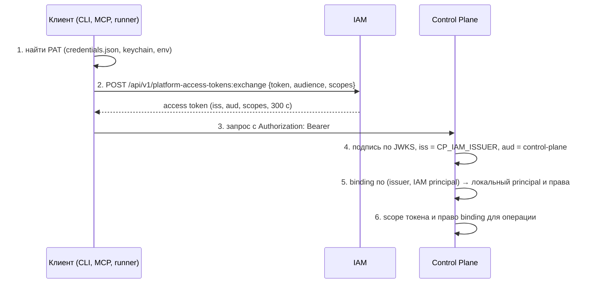

# Аутентификация и доступ

Отказы на пути «credential → access token → запрос к сервису»: ошибки
выпуска и обмена PAT в IAM, отказы Control Plane с кодами `401`/`403`/`503`,
ошибки клиентских credential-файлов. Статья для оператора и инженера
эксплуатации.

## Где может сломаться цепочка



| Шаг | Типичные коды | Раздел ниже |
|---|---|---|
| 1 | `iam_not_authenticated`, `iam_credential_ambiguous`, `iam_environment_mode_required`, `iam_credentials_file_permissions` | Клиент |
| 2 | `401 invalid_token`, `403 audience_not_allowed`, `403 scope_not_allowed` | IAM: обмен |
| 4–5 | `401 invalid_credentials`, `503 verification_unavailable` | Control Plane |
| 6 | `403 insufficient_scope`, `403 permission_denied` | Control Plane |

## Клиент: поиск credential

Ошибки возникают в пакете `control-plane` (CLI, MCP-плагин, демон
исполнителя) ещё до сетевого запроса.

| Код / сообщение | Причина | Решение |
|---|---|---|
| `iam_not_authenticated` — `no Platform Access Token for …` | Для пары «адрес IAM + tenant» нет PAT ни в окружении, ни в keychain (macOS), ни в `~/.config/iam/credentials.json` | Положить PAT в credentials-файл под правильным ключом; проверить `CONTROL_PLANE_IAM_URL` и `CONTROL_PLANE_IAM_TENANT` — ключ записи строится из них |
| `iam_credentials_file_permissions` — `… has mode 644; 600 is expected` | Файл credentials читаем группой или всеми | `chmod 600 ~/.config/iam/credentials.json`. Отказ намеренный: читаемый посторонними файл — инцидент |
| `iam_credentials_file_unreadable` | Файл повреждён (не JSON) или нет прав на чтение | Проверить JSON, владельца |
| `iam_credential_ambiguous` — `several credentials … set IAM_PRINCIPAL` | На машине несколько credentials одного tenant (например, исполнитель и ревьюер), процесс не объявил, кто он | Задать `IAM_PRINCIPAL=<IAM principal id>` в окружении процесса. Выбор наугад означал бы работу под чужой identity |
| `iam_environment_mode_required` | Задан `IAM_PLATFORM_ACCESS_TOKEN` без `IAM_CREDENTIAL_MODE=environment` | Добавить `IAM_CREDENTIAL_MODE=environment` или убрать переменную. Защита от унаследованной переменной, молча подменяющей учётку |
| `control-plane-agent has no credentials for <server>` | У демона исполнителя нет ни PAT, ни ключа | См. [Исполнение и runner](runner.md) |
| На macOS берётся не тот токен | Клиент сначала смотрит в keychain | Удалить устаревшую запись keychain или задать `IAM_NO_KEYCHAIN=1` |
| Scopes не применяются: `control-plane:write` не попал в запрос | Значение с пробелом в env-файле без кавычек; systemd разберёт, `source` в shell — нет | `CONTROL_PLANE_IAM_SCOPES="control-plane:read control-plane:write"` |

## IAM: административные операции

Административные эндпоинты (tenants, principals, audiences, выпуск и отзыв
PAT, service accounts) требуют заголовок `X-IAM-Bootstrap-Token`.

| Статус и `detail` | Причина | Решение |
|---|---|---|
| `401 unauthorized` | Заголовок отсутствует, неверен, или токен передан как `Authorization: Bearer` | Передавать `X-IAM-Bootstrap-Token: $IAM_BOOTSTRAP_TOKEN`; значение — как у запущенного контейнера |
| `400 idempotency_key_required` | Выпуск или ротация PAT без заголовка `Idempotency-Key` | Добавить `Idempotency-Key: <uuid>`; при повторе того же запроса — тот же ключ |
| Ответ `201`, но `token: null` и заголовок `Idempotency-Replayed: true` | Повтор с уже использованным `Idempotency-Key`: секрет показывается ровно один раз | Если секрет потерян — отозвать этот credential и выпустить новый с новым ключом |
| `403 authentication_context_required` | Выпуск PAT человеку без записанного authentication context | Сначала `POST …/principals/{id}/authentication-contexts` |
| `403 authentication_context_expired` | Контекст старше 300 с (`IAM_PAT_MAX_AUTHENTICATION_AGE_SECONDS`) | Записать контекст заново и сразу выпускать |
| `422 principal_kind_not_allowed` | PAT выпускается только principal вида `human` или `agent` | Для сервиса — service account и client credentials (`POST /api/v1/tokens/exchange`) |
| `422 invalid_scope_ceiling` | Потолок PAT шире `allowedScopes` указанных audiences | Сузить `scopeCeiling` или расширить audience (`PATCH …/audiences/{key}`) |
| `422 unknown_audience` | Audience не заведён в tenant | Создать audience (bootstrap делает это для всех audiences платформы) |
| `422 expiry_too_long` | `expiresInSeconds` больше `IAM_PAT_MAX_TTL_SECONDS` (365 дней) | Уменьшить срок |
| `409 credential_not_active` на `:rotate` | Ротируется отозванный или истёкший PAT | Выпустить новый PAT |
| `409 credential_conflict` | Гонка при выпуске | Повторить запрос с тем же `Idempotency-Key` |

## IAM: обмен токенов

| Статус и `detail` | Причина | Решение |
|---|---|---|
| `401 invalid_token` на `:exchange` | PAT отозван, истёк, не существует, либо tenant, membership или principal неактивны. Причина намеренно одна и та же; точная — в audit IAM | Проверить срок и статус: `GET …/platform-access-tokens?principalId=…&includeRevoked=true`. Истёкший PAT не продлевается — только новый выпуск |
| `403 audience_not_allowed` | Запрошенного audience нет в PAT или audience неактивен | Выпустить PAT с нужным audience |
| `403 scope_not_allowed` | Запрошенные scopes не входят в пересечение потолка PAT и `allowedScopes` audience. Частая причина — короткие имена `read`/`write` | Scopes всегда с префиксом audience: `control-plane:read`, `control-plane:write`, `control-plane:admin`, `memory:read` и т. д. |
| `401 invalid_client` на `/api/v1/tokens/exchange` | Неверный или отозванный секрет service account | Перевыпустить service account, см. [Секреты и ротация](../operations/secrets.md) |
| Токен истекает через 5 минут | Штатное поведение: access token живёт `IAM_TOKEN_TTL_SECONDS` (300 с) | Клиенты платформы обменивают PAT заново сами |

## Control Plane

Ошибки Control Plane приходят в конверте
`{"error": {"code", "message", "details", "requestId"}}`.

| Статус и `code` | Причина | Решение |
|---|---|---|
| `401 invalid_credentials` | Токен не прошёл проверку: подпись, срок, `iss` не равен `CP_IAM_ISSUER`, `aud` не `control-plane`; **или** нет активного binding для пары (issuer, IAM principal); **или** binding отключён или отозван; **или** предъявлен legacy-ключ `cp_…` при `CP_LEGACY_API_KEYS_ENABLED=false` | По логам `control-plane-api` (по `requestId`) найти причину; проверить binding: `GET /api/v1/principals/{id}/iam-bindings` |
| `401 invalid_credentials` сразу после смены публичного адреса | Bindings привязаны к старому issuer | Перенести bindings на новый issuer, см. [Аварийные процедуры](../operations/emergency.md) |
| `401` сохраняется после того, как binding создали SQL в базе | Отказ закэширован процессом API до `CP_IAM_BINDING_STALE_AFTER_SECONDS` (120 с) | Подождать 2 минуты или перезапустить `control-plane-api`. Bindings, созданные через API, действуют сразу: API сбрасывает кэш |
| `403 insufficient_scope` | В access token нет нужного scope (например, запрошен только `control-plane:read` для записи) | Запрашивать нужные scopes при обмене; проверить потолок PAT |
| `403 permission_denied` | У binding нет нужного права (`tasks.write`, `operations.manage`, `approvals.decide` и т. д.) | Дополнить права binding повторным `POST /api/v1/principals/{id}/iam-bindings`. Агентам `admin` и `approvals.decide` не выдаются намеренно |
| `503 verification_unavailable` | JWKS IAM недоступен, а кэш устарел сверх `CP_IAM_JWKS_STALE_AFTER_SECONDS` | Восстановить `iam-service`; проверить `CP_IAM_JWKS_URL` (внутренний адрес `http://iam-service:8010/.well-known/jwks.json`) |
| `409 stale_claim` | Процесс пишет по claim, который уже не живой (истёк, перехвачен) | Штатно для зомби-процесса: остановить запись, перечитать контекст |
| `409 task_claimed` | `PATCH` задачи, у которой есть активный claim, без `claimId` и `fencingToken` | Передавать `claimId` и `fencingToken` владельца claim или дождаться освобождения |
| `409 already_bootstrapped` | Повторный `POST /api/v1/bootstrap` | Bootstrap выполняется один раз; восстановить `deploy/state/<env>.json` |
| `403 bootstrap_disabled` | Не задан `CP_BOOTSTRAP_TOKEN` | Задать в `.env` (в корневом compose он обязателен) |

!!! tip "Проверить токен вручную"
    ```bash
    TOKEN=$(curl -s -X POST http://127.0.0.1:18010/api/v1/platform-access-tokens:exchange \
      -H 'Content-Type: application/json' \
      -d "{\"token\": \"$(cat secrets/harness-pat)\", \"audience\": \"control-plane\",
           \"scopes\": [\"control-plane:read\"]}" | python3 -c 'import json,sys; print(json.load(sys.stdin)["accessToken"])')
    curl -s http://127.0.0.1:18000/api/v1/harness/context -H "Authorization: Bearer $TOKEN" | head -c 400
    ```
    Полезная нагрузка токена (без проверки подписи) —
    `echo "$TOKEN" | cut -d. -f2 | base64 -d 2>/dev/null`: сверьте `iss`,
    `aud`, `scope`, `exp`.

## Порядок заведения нового principal

Большинство отказов нового агента или сервиса — нарушение порядка. Правильно:

1. IAM principal (`human`/`agent`) или service account.
2. Локальный principal Control Plane и **binding** через
   `POST /api/v1/principals/{id}/iam-bindings` — до первого запроса.
3. PAT (для `human`/`agent`) с нужными audiences и потолком scope.
4. Установка credential клиенту, первый запрос.

`deploy/bootstrap.py` делает это в правильном порядке для оператора, агентов
из реестра и service accounts платформы.

## См. также

- [Credentials и PAT](../iam/credentials.md)
- [Токены, audiences, scopes](../iam/tokens.md)
- [Авторизация и права](../control-plane/authorization.md)
- [Секреты и ротация](../operations/secrets.md)
- [Права и scopes](../reference/permissions.md)
