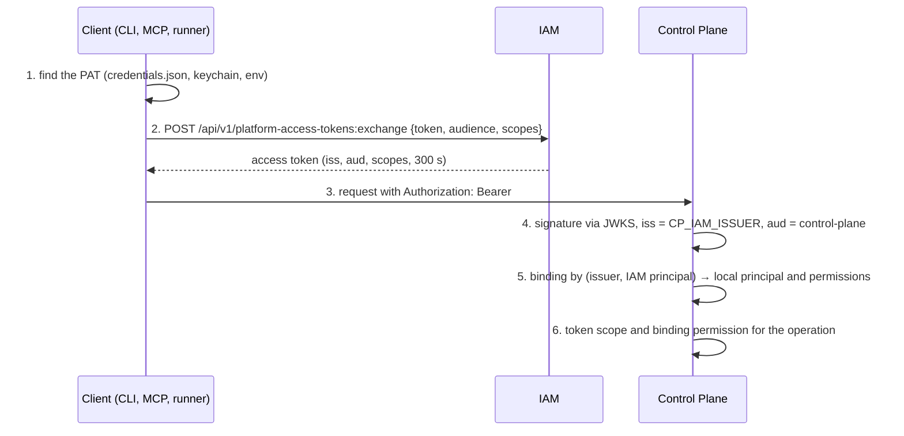

# Authentication and access

Failures along the "credential → access token → service request" path: PAT
issuance and exchange errors in IAM, Control Plane rejections with `401`/`403`/`503`
codes, and client credential file errors. This article is for operators and
operations engineers.

## Where the chain can break



| Step | Typical codes | Section below |
|---|---|---|
| 1 | `iam_not_authenticated`, `iam_credential_ambiguous`, `iam_environment_mode_required`, `iam_credentials_file_permissions` | Client |
| 2 | `401 invalid_token`, `403 audience_not_allowed`, `403 scope_not_allowed` | IAM: exchange |
| 4–5 | `401 invalid_credentials`, `503 verification_unavailable` | Control Plane |
| 6 | `403 insufficient_scope`, `403 permission_denied` | Control Plane |

## Client: credential lookup

These errors occur in the `control-plane` package (CLI, MCP plugin, executor
daemon) before any network request.

| Code / message | Cause | Fix |
|---|---|---|
| `iam_not_authenticated` — `no Platform Access Token for …` | For the "IAM address + tenant" pair there is no PAT in the environment, in the keychain (macOS), or in `~/.config/iam/credentials.json` | Put the PAT into the credentials file under the correct key; check `CONTROL_PLANE_IAM_URL` and `CONTROL_PLANE_IAM_TENANT`, since the entry key is built from them |
| `iam_credentials_file_permissions` — `… has mode 644; 600 is expected` | The credentials file is readable by the group or by everyone | `chmod 600 ~/.config/iam/credentials.json`. The rejection is intentional: a file readable by others is an incident |
| `iam_credentials_file_unreadable` | The file is corrupted (not JSON) or not readable | Check the JSON and the owner |
| `iam_credential_ambiguous` — `several credentials … set IAM_PRINCIPAL` | The machine has several credentials for the same tenant (for example, an executor and a reviewer), and the process did not declare which one it is | Set `IAM_PRINCIPAL=<IAM principal id>` in the process environment. A random choice would mean working under someone else's identity |
| `iam_environment_mode_required` | `IAM_PLATFORM_ACCESS_TOKEN` is set without `IAM_CREDENTIAL_MODE=environment` | Add `IAM_CREDENTIAL_MODE=environment` or remove the variable. This protects against an inherited variable silently replacing the account |
| `control-plane-agent has no credentials for <server>` | The executor daemon has neither a PAT nor a key | See [Execution and runner](runner.md) |
| On macOS the wrong token is used | The client checks the keychain first | Delete the stale keychain entry or set `IAM_NO_KEYCHAIN=1` |
| Scopes are not applied: `control-plane:write` does not reach the request | A value with a space in an env file has no quotes; systemd parses it, but `source` in a shell does not | `CONTROL_PLANE_IAM_SCOPES="control-plane:read control-plane:write"` |

## IAM: administrative operations

Administrative endpoints (tenants, principals, audiences, PAT issuance and
revocation, service accounts) require the `X-IAM-Bootstrap-Token` header.

| Status and `detail` | Cause | Fix |
|---|---|---|
| `401 unauthorized` | The header is missing or wrong, or the token was sent as `Authorization: Bearer` | Send `X-IAM-Bootstrap-Token: $IAM_BOOTSTRAP_TOKEN`; the value must match the running container |
| `400 idempotency_key_required` | PAT issuance or rotation without the `Idempotency-Key` header | Add `Idempotency-Key: <uuid>`; when retrying the same request, use the same key |
| Response `201`, but `token: null` and header `Idempotency-Replayed: true` | A retry with an already used `Idempotency-Key`: the secret is shown exactly once | If the secret is lost, revoke this credential and issue a new one with a new key |
| `403 authentication_context_required` | PAT issuance for a human without a recorded authentication context | First call `POST …/principals/{id}/authentication-contexts` |
| `403 authentication_context_expired` | The context is older than 300 s (`IAM_PAT_MAX_AUTHENTICATION_AGE_SECONDS`) | Record the context again and issue immediately |
| `422 principal_kind_not_allowed` | PATs are issued only to principals of kind `human` or `agent` | For a service, use a service account and client credentials (`POST /api/v1/tokens/exchange`) |
| `422 invalid_scope_ceiling` | The PAT ceiling is wider than the `allowedScopes` of the specified audiences | Narrow `scopeCeiling` or widen the audience (`PATCH …/audiences/{key}`) |
| `422 unknown_audience` | The audience is not registered in the tenant | Create the audience (bootstrap does this for all platform audiences) |
| `422 expiry_too_long` | `expiresInSeconds` exceeds `IAM_PAT_MAX_TTL_SECONDS` (365 days) | Shorten the lifetime |
| `409 credential_not_active` on `:rotate` | Rotating a revoked or expired PAT | Issue a new PAT |
| `409 credential_conflict` | A race during issuance | Retry the request with the same `Idempotency-Key` |

## IAM: token exchange

| Status and `detail` | Cause | Fix |
|---|---|---|
| `401 invalid_token` on `:exchange` | The PAT is revoked, expired, or nonexistent, or the tenant, membership, or principal is inactive. The response is intentionally the same; the exact cause is in the IAM audit | Check expiry and status: `GET …/platform-access-tokens?principalId=…&includeRevoked=true`. An expired PAT cannot be extended; issue a new one |
| `403 audience_not_allowed` | The requested audience is not in the PAT, or the audience is inactive | Issue a PAT with the required audience |
| `403 scope_not_allowed` | The requested scopes are not in the intersection of the PAT ceiling and the audience's `allowedScopes`. A common cause is short names `read`/`write` | Always prefix scopes with the audience: `control-plane:read`, `control-plane:write`, `control-plane:admin`, `memory:read`, and so on |
| `401 invalid_client` on `/api/v1/tokens/exchange` | Wrong or revoked service account secret | Reissue the service account, see [Secrets and rotation](../operations/secrets.md) |
| The token expires after 5 minutes | Expected behavior: an access token lives for `IAM_TOKEN_TTL_SECONDS` (300 s) | Platform clients exchange the PAT again on their own |

## Control Plane

Control Plane errors arrive in the envelope
`{"error": {"code", "message", "details", "requestId"}}`.

| Status and `code` | Cause | Fix |
|---|---|---|
| `401 invalid_credentials` | The token failed verification: signature, expiry, `iss` not equal to `CP_IAM_ISSUER`, `aud` not `control-plane`; **or** there is no active binding for the (issuer, IAM principal) pair; **or** the binding is disabled or revoked; **or** a legacy `cp_…` key was presented with `CP_LEGACY_API_KEYS_ENABLED=false` | Find the cause in the `control-plane-api` logs (by `requestId`); check the binding: `GET /api/v1/principals/{id}/iam-bindings` |
| `401 invalid_credentials` right after the public address changed | Bindings are tied to the old issuer | Move the bindings to the new issuer, see [Emergency procedures](../operations/emergency.md) |
| `401` persists after the binding was created with SQL in the database | The rejection is cached by the API process for up to `CP_IAM_BINDING_STALE_AFTER_SECONDS` (120 s) | Wait 2 minutes or restart `control-plane-api`. Bindings created through the API take effect immediately: the API clears the cache |
| `403 insufficient_scope` | The access token lacks the required scope (for example, only `control-plane:read` was requested for a write) | Request the required scopes during exchange; check the PAT ceiling |
| `403 permission_denied` | The binding lacks the required permission (`tasks.write`, `operations.manage`, `approvals.decide`, and so on) | Extend the binding permissions with another `POST /api/v1/principals/{id}/iam-bindings`. Agents intentionally never get `admin` and `approvals.decide` |
| `503 verification_unavailable` | IAM JWKS is unavailable, and the cache is older than `CP_IAM_JWKS_STALE_AFTER_SECONDS` | Restore `iam-service`; check `CP_IAM_JWKS_URL` (internal address `http://iam-service:8010/.well-known/jwks.json`) |
| `409 stale_claim` | A process writes under a claim that is no longer live (expired, taken over) | Expected for a zombie process: stop writing and reread the context |
| `409 task_claimed` | `PATCH` of a task with an active claim, without `claimId` and `fencingToken` | Pass the claim owner's `claimId` and `fencingToken`, or wait for the claim to be released |
| `409 already_bootstrapped` | A repeated `POST /api/v1/bootstrap` | Bootstrap runs once; restore `deploy/state/<env>.json` |
| `403 bootstrap_disabled` | `CP_BOOTSTRAP_TOKEN` is not set | Set it in `.env` (the root compose requires it) |

!!! tip "Check a token manually"
    ```bash
    TOKEN=$(curl -s -X POST http://127.0.0.1:18010/api/v1/platform-access-tokens:exchange \
      -H 'Content-Type: application/json' \
      -d "{\"token\": \"$(cat secrets/harness-pat)\", \"audience\": \"control-plane\",
           \"scopes\": [\"control-plane:read\"]}" | python3 -c 'import json,sys; print(json.load(sys.stdin)["accessToken"])')
    curl -s http://127.0.0.1:18000/api/v1/harness/context -H "Authorization: Bearer $TOKEN" | head -c 400
    ```
    To see the token payload (without signature verification), run
    `echo "$TOKEN" | cut -d. -f2 | base64 -d 2>/dev/null` and compare `iss`,
    `aud`, `scope`, `exp`.

## Order for setting up a new principal

Most failures of a new agent or service come from doing the steps out of
order. The correct order:

1. IAM principal (`human`/`agent`) or service account.
2. Local Control Plane principal and **binding** via
   `POST /api/v1/principals/{id}/iam-bindings`, before the first request.
3. PAT (for `human`/`agent`) with the required audiences and scope ceiling.
4. Install the credential on the client, then send the first request.

`deploy/bootstrap.py` performs these steps in the correct order for the
operator, the agents from the registry, and the platform service accounts.

## See also

- [Credentials and PAT](../iam/credentials.md)
- [Tokens, audiences, scopes](../iam/tokens.md)
- [Authorization and permissions](../control-plane/authorization.md)
- [Secrets and rotation](../operations/secrets.md)
- [Permissions and scopes](../reference/permissions.md)
